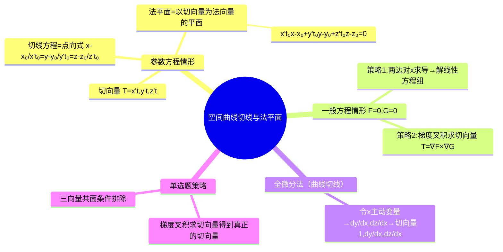

# 高数：空间曲线的切线与法平面

> 📌 重构说明：本笔记是高数下册微分几何的小高潮——用参数方程的求导/梯度叉积求切向量/全微分法（曲线切线）求出空间曲线上任意点的切向量。已按「参数方程情形（切向量 = $(x'(t),y'(t),z'(t))$→切线方程 = 点向式→法平面 = 切向量为法向量）→一般方程 $(\{F=0,G=0\})$ 两种定义法（一边知道了 $y$ 是 $x$ 的函数 + 两种策略：直接求导解线性方程组 / 梯度叉积求切向量 $\nabla F\times\nabla G$）→全微分法（曲线切线）（令 $x$ 主动变量→二元一次方程组 + 克莱姆法则）」的逻辑链重排。完整保留了梯度叉积求切向量的四种交替定义方式及单选题策略。

## 🧠 思维导图

---

## 一、参数方程情形——最标准

曲线：$\begin{cases} x = x(t) \\ y = y(t) \\ z = z(t) \end{cases}$

### 切向量

$$\boxed{\vec{T} = (x'(t_0),\, y'(t_0),\, z'(t_0))}$$

==对参数方程求一次导，三分量直接组成切向量。==

### 切线方程

已知点 $M_0(x_0,y_0,z_0)$ + 切向量 $\vec{T}$：

$$\frac{x-x_0}{x'(t_0)} = \frac{y-y_0}{y'(t_0)} = \frac{z-z_0}{z'(t_0)}$$

### 法平面方程

==切向量 = 法平面的法向量==，直接套点法式：

$$\boxed{x'(t_0)(x-x_0) + y'(t_0)(y-y_0) + z'(t_0)(z-z_0) = 0}$$

---

## 二、一般方程情形 $\{F=0,G=0\}$ ——两种策略

### 策略一：直接求导法

将 $y,z$ 看作 $x$ 的函数。方程组两边对 $x$ 求导：

$$\begin{cases} F_x + F_y \frac{dy}{dx} + F_z \frac{dz}{dx} = 0 \\ G_x + G_y \frac{dy}{dx} + G_z \frac{dz}{dx} = 0 \end{cases}$$

解关于 $\frac{dy}{dx},\frac{dz}{dx}$ 的二元一次方程组 → ==切向量 = $(1,\frac{dy}{dx},\frac{dz}{dx})$==

> [!warning] 考点
> $x$ 分量固定为 $1$——这是因为让 $x$ 做了主动变量。合理的前提是曲线在 $x_0$ 处垂直于 $x$ 轴的切线不存在，前提中隐含 $x'(t_0)\neq 0$。

### 策略二：梯度叉积法

$$\boxed{\vec{T} = \nabla F \times \nabla G}$$

$\nabla F = (F_x, F_y, F_z)$，$\nabla G = (G_x, G_y, G_z)$。

==两个法向量的叉积 = 曲线的切向量。== 几何意义：曲面 $F$ 和 $G$ 各自的法向量都垂直于曲线的切线 → 切向量 = 两法向量叉积。

---

## 三、轨迹线的一般方程定义——四种交替方式

曲线 $\{F=0,G=0\}$ 中，若 $F$ 和 $G$ 不唯一（过该曲线的曲面有无数对），切向量的提取策略：

1. ==一边 $y$ 是 $x$ 的函，一边 $z$ 是 $x$ 的函== → 求导解 $dy/dx, dz/dx$
2. 用 $\nabla F \times \nabla G$（最通用）
3. 全微分法（曲线切线）
4. 梯度叉积求切向量用行列式写

---

## 四、全微分法

方程组两边取全微分：

$$\begin{cases} F_x dx + F_y dy + F_z dz = 0 \\ G_x dx + G_y dy + G_z dz = 0 \end{cases}$$

用克莱姆法则解 $dy = A\,dx$，$dz = B\,dx$ → ==切向量 = $(1, A, B)$==

---

## 五、单选题速解策略 ⚡️

1. 用 $\nabla F \times \nabla G$ 直接算切向量
2. 代入点得到数值切向量
3. 看选项中哪个向量与该切向量平行
4. 可用 $F$ 和 $G$ 在选项上的三向量共面条件验证

---

> 📂 所属分类：高数-空间几何

## 📚 核心词条索引

| 知识点链接 | 类别 | 关键词 |
|------|------|--------|
| [[点法式]] | 平面方程 | $A(x-x_0)+B(y-y_0)+C(z-z_0)=0$ |
| [[法平面]] | 几何对象 | 过切点且与切线垂直的平面 |
| [[克莱姆法则]] | 线性代数 | 用行列式解线性方程组 |
| [[切线方程]] | 核心公式 | 点向式$\frac{x-x_0}{a}=\frac{y-y_0}{b}=\frac{z-z_0}{c}$ |
| [[切向量]] | 核心概念 | 曲线方向向量$(x'(t), y'(t), z'(t))$ |
| [[全微分法（曲线切线）]] | 求解方法 | 利用全微分求切向量 |
| [[三向量共面]] | 判定条件 | 混合积为0 |
| [[梯度叉积求切向量]] | 计算方法 | $\vec{T}=\nabla F\times\nabla G$ |
