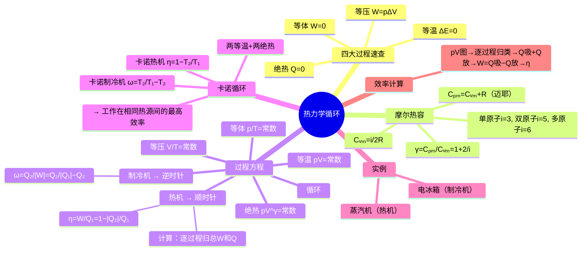

# 大物：热力学循环与效率计算

> 📌 重构说明：本笔记将四大过程串联为热力学循环，引入热机和制冷机的概念。与笔记 16 的不同：16 聚焦单个过程的能量分析，17 聚焦多个过程串联成封闭循环后的综合指标（热机效率 $\eta$、制冷系数 $\omega$、卡诺循环）。已按「四大过程速查→循环的正/逆方向含义→热机效率 $\eta$ 的计算方法（逐过程分析 W 和 Q）→制冷系数 $\omega$→卡诺循环（效率/制冷系数只与两热源温度有关）→蒸汽机/电冰箱的完整工作流程」的逻辑链重排。放弃了与 16 重复的四大过程展开，代之以速查表引用；完整保留了循环效率的数值计算思路和卡诺两张公式的推导。

## 🧠 思维导图

---

## 一、四大过程与摩尔热容速查

> 各过程的详细展开与符号判定三步法见 。本文仅以速查表形式引用，聚焦于循环的分析与效率计算。

| 过程 | 条件 | $W$ | $\Delta E$ | $Q$ | 程公式 |
|------|------|-----|-----------|-----|--------|
| 等体过程 | $V$ 不变 | $0$ | $\nu C_{V,m}\Delta T$ | $=\Delta E$ | $p/T$ = 常数 |
| 等压过程 | $p$ 不变 | $p\Delta V = \nu R\Delta T$ | $\nu C_{V,m}\Delta T$ | $\nu C_{p,m}\Delta T$ | $V/T$ = 常数 |
| 等温过程 | $T$ 不变 | $\nu RT\ln(V_2/V_1)$ | $0$ | $=W$ | $pV$ = 常数 |
| 绝热过程 | $Q=0$ | $-\nu C_{V,m}\Delta T$ | $\nu C_{V,m}\Delta T$ | $0$ | $pV^\gamma$ = 常数 |

**摩尔定体热容**：

| 量 | 公式 | 单原子 $(i=3)$ | 双原子 $(i=5)$ | 多原子 $(i=6)$ |
|------|------|:---:|:---:|:---:|
| $C_{V,m}$ | $\dfrac{i}{2}R$ | $\frac{3}{2}R$ | $\frac{5}{2}R$ | $3R$ |
| $C_{p,m}$ | $\dfrac{i+2}{2}R$ | $\frac{5}{2}R$ | $\frac{7}{2}R$ | $4R$ |
| $\gamma$ | $\dfrac{i+2}{i}$ | $5/3$ | $7/5$ | $4/3$ |

---

## 三、热机（顺时针循环）

### 3.1 工作原理

| 阶段 | 符号 | 含义 |
|------|------|------|
| 从高温热源吸热 | $Q_1$ | 输入能量 |
| 对外做功 | $W$ | 输出功 |
| 向低温热源放热 | $Q_2$（负值 → 写绝对值） | 遗弃能量 |

### 3.2 热机效率

$$\boxed{\eta = \frac{W}{Q_1} = 1 - \frac{|Q_2|}{Q_1}}$$

**含义**：从高温热源吸收的热量中有多少比例转化为有用功。$\eta$ 最大值为 1（全转化，卡诺热机效率为上限），最小值为 0（无转化）。

### 3.3 效率计算步骤（逐过程归总法）

1. 对热力学循环中的**每一个过程**独立分析 $W$、$\Delta E$、$Q$ 的正负号
2. 总功 $W =$ 所有过程 $W$ 的代数和
3. $Q_1 =$ 全部吸热过程（$Q>0$）的 $Q$ 之和
4. $|Q_2| =$ 全部放热过程（$Q<0$）的 $|Q|$ 之和
5. 代回 $\eta = W/Q_1$ 或 $\eta = 1 - |Q_2|/Q_1$（两种求法互验）

> [!warning] 考点
> ⚠️ 计算效率时，$Q_1$ **只包含吸热过程的吸热量**，不包括放热过程。$Q_2$ 取绝对值代入。混淆吸热/放热归总 → 整个 $\eta$ 算错。

---

## 四、制冷机（逆时针循环）

### 4.1 工作原理

| 阶段 | 符号 | 含义 |
|------|------|------|
| 从低温热源吸热 | $Q_2$ | 从冷端「搬运」的热量 |
| 外界对系统做功 | $|W|$ | 输入的代价 |
| 向高温热源放热 | $Q_1$（负值 → 写绝对值） | 搬运+消耗的能量总和 |

### 4.2 制冷系数

$$\boxed{\omega = \frac{Q_2}{|W|} = \frac{Q_2}{|Q_1| - Q_2}}$$

**含义**：消耗单位功可以从低温端「搬运」多少热量。$\omega$ 可以 >> 1。

---

## 五、卡诺循环 高光考点

由**两个等温过程 + 两个绝热过程**构成的理想化热力学循环。

### 5.1 卡诺热机效率

所有工作在 $T_1$（高温）和 $T_2$（低温）两个热源之间的热机中，==卡诺热机效率最高==。

$$\boxed{\eta_{\text{卡诺}} = 1 - \frac{T_2}{T_1}}$$

效率**只与两个热源的温度有关**（都用绝对温标）。

### 5.2 卡诺制冷机

$$\boxed{\omega_{\text{卡诺}} = \frac{T_2}{T_1 - T_2}}$$

在所有工作在 $T_1$、$T_2$ 两热源间的制冷机中，制冷系数最大。

> [!warning] 考点
> ⚠️ 卡诺热机效率 $\eta = 1-T_2/T_1$ 和制冷系数 $\omega = T_2/(T_1-T_2)$ 是可以直接从 $T$ 算的——考试中给出温度求效率时直接用这两式。注意 $T$ 是绝对温度（K），不是摄氏温标。

---

## 六、实际热机工作原理

### 6.1 蒸汽机（热机实例）

1. 常温常压液体 → 锅炉（高温热源）吸热 → 变成高温高压气体
2. 高温高压气体进入气缸 → 推动活塞→**对外做功** → 变成低温低压尾气
3. 低温低压尾气 → 冷凝器放热 → 变成低温低压液体
4. 低温低压液体 → 加压升温 → 回到常温常压液体 → **循环完成**

### 6.2 电冰箱（制冷机实例）

1. 低温低压液体 → 蒸发器（冷藏室，低温端）吸热 → 变成低温低压气体
2. 低温低压气体 → 压缩机（外界做功，急速压缩）→ 变成高温高压气体
3. 高温高压气体 → 冷凝器（背板，高温端）放热 → 变成高温高压液体
4. 高温高压液体 → 节流毛细管 → 降压降温 → 回到低温低压液体 → **循环完成**

---

## 七、循环效率数值计算示例

**已知**：$pv$ 图上一个由等体 + 等压串联而成的循环。

**解题步骤**：
1. 逐过程判断过程类型
2. 用理想气体状态方程（$pV = \nu RT$）将各状态温度用已知参数表达
3. 利用等体 $p \propto T$、等压 $V \propto T$ 的关系简化温度比
4. 计算各过程的 $Q$（带正负号）
5. 归总 $W$、$Q_1$、$|Q_2|$
6. 代入 $\eta$ 公式

---

---

## 🔗 知识网络

### 前置依赖
- [[16_热力学第一定律与四大过程]] — 四大热力学过程的 Q、W、ΔE 计算
- [[理想气体状态方程]] — PV=νRT 的应用
- [[热力学第一定律]] — ΔE = Q - W

### 后续应用
- [[热力学第二定律]] — 循环效率的极限
- [[卡诺定理]] — 可逆机效率最大

### 对比辨析
- 热机 vs 制冷机：热机顺时针循环把热变成功，制冷机逆时针循环把功变成冷
- 卡诺效率 η=1-T₂/T₁ vs 实际效率：卡诺效率是理想可逆机的最高效率，实际效率总是低于卡诺效率
- 制冷系数 ω 与热机效率 η：ω 可能大于 1（甚至可远大于 1），而 η < 1

## 📚 核心词条索引

| 知识点链接 | 类别 | 关键词 |
|------|------|--------|
| [[热力学循环]] | 核心概念 | 系统经历一系列过程后回到初态，$\Delta E=0$ |
| [[热机效率]] | 核心公式 | $\eta=W/Q_1=1-|Q_2|/Q_1$，吸热转化为功的比例 |
| [[制冷系数]] | 核心公式 | $\omega=Q_2/|W|$，单位功搬运的热量 |
| [[卡诺循环]] | 理想循环 | 两等温+两绝热构成的循环，效率最高 |
| [[等体过程]] | 热力学过程 | 体积不变，$W=0$，$Q=\Delta E$ |
| [[等压过程]] | 热力学过程 | 压强不变，$W=p\Delta V$ |
| [[等温过程]] | 热力学过程 | 温度不变，$\Delta E=0$，$Q=W$ |
| [[绝热过程]] | 热力学过程 | $Q=0$，$W=-\Delta E$ |
| [[摩尔定体热容]] | 核心概念 | $C_{V,m}=\frac{i}{2}R$，等体过程每摩尔升温1K吸热 |
| [[卡诺热机效率]] | 核心公式 | $\eta=1-T_2/T_1$，只与两热源温度有关 |
