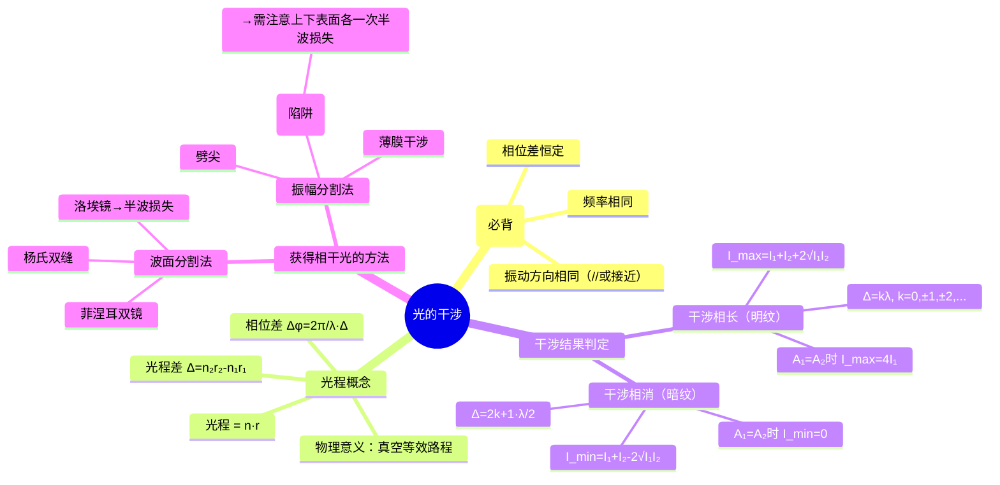

# 大物：光的干涉原理与两类装置

> 📌 重构说明：本笔记以「相干条件→光程概念→干涉相长判定→两类获得相干光的方法」为主线，按知识逻辑重新编排。已删除原录音中的口语化表述和冗余重复，补充了薄膜干涉中半波损失的陷阱提示（衔接笔记19）。

## 🧠 思维导图

---

## 一、光波的本质与相干条件

### 1.1 光波是电磁波

光由变化的电场（$\vec{E}$）和变化的磁场（$\vec{B}$）在空间中交替传播构成。光与物质相互作用时，==只有电场分量起作用==（使电子运动、产生感光效应等），因此 $\vec{E}$ 称为**光矢量**，干涉分析只需考虑光矢量。

### 1.2 三个相干条件

==一列光波要产生稳定光的干涉，必须满足三项条件：==

| 条件 | 含义 | 不满足会怎样？ |
|------|------|---------------|
| **频率相同** | $\nu_1 = \nu_2$ | 相位差随时间漂移 → 干涉条纹不稳定 |
| **振动方向相同** | 光矢量方向平行或接近平行 | 垂直分量不参与干涉，干涉效果减弱 |
| **相位差恒定** | $\Delta\varphi$ 不随时间变化 | 无稳定干涉图样 |

> [!warning] 考点
> ⚠️ 「频率相同、振动方向相同、相位差恒定」是干涉专题的必背条目，选择题和简答题均可直接考查。

> 为什么普通两个灯泡不干涉？——因为两个独立光源发射光的**初相位随机变化**，相位差不恒定，无法形成稳定光的干涉。

### 1.3 干涉现象明显的条件

两光源振幅相等或相近 → 明暗对比最大：
- $A_1 = A_2$ 时，明纹 $I = 4I_1$，暗纹 $I = 0$（完全消光）

---

## 二、光程与光程差

### 2.1 为什么需要光程？

光在不同介质中波长不同：$\lambda_n = \dfrac{\lambda}{n}$。要比较两束光经过不同介质后的相位差，必须统一到同一基准 → 光程。

$$\boxed{\text{光程} = n \cdot r \quad \text{（真空等效传播距离）}}$$

### 2.2 光程差与相位差

$$\Delta = n_2 r_2 - n_1 r_1$$

$$\boxed{\Delta\varphi = \frac{2\pi}{\lambda} \cdot \Delta}$$

> [!warning] 考点
> ⚠️ $\Delta\varphi = \dfrac{2\pi}{\lambda}\Delta$ 是光程差→相位差的桥梁公式，计算题中的高频转换。

---

## 三、干涉相长与干涉相消

### 3.1 判定条件速查

| 干涉结果 | 光程差条件 | 合振幅 | 光强（$A_1=A_2$ 时） |
|----------|-----------|--------|----------------------|
| **干涉相长（明纹/亮纹）** | $\Delta = k\lambda, k = 0,\pm1,\pm2,\cdots$ | $A_1+A_2$ | $4I_1$ |
| **干涉相消（暗纹/暗纹）** | $\Delta = (2k+1)\dfrac{\lambda}{2}$ | $|A_1-A_2|$ | $0$（完全消光） |

### 3.2 条纹特点

明暗交替出现，条纹有一定宽度（中心处光强最强/最弱，向两侧过渡）。

> 📖 补充：$A_1 = A_2$ 且 $\Delta = (2k+1)\lambda/2$ 时，合振幅为 0，这是**完全相消**——与能量守恒并不矛盾，因为能量只是从暗纹「转移」到了明纹区域。

---

## 四、获得相干光的两类方法

### 4.1 波面分割法

从**同一波面**上取两个次级波源，这两个次波源天然满足相干条件：

| 实验装置 | 关键特征 |
|----------|----------|
| 杨氏双缝实验 | 光经单缝S → 双缝 S₁、S₂ 位于同一波面 → 同频同向同相 |
| 菲涅耳双镜 | 两面镜子反射同一光源 → 两个虚像构成双光源 |
| ==洛埃镜== | 光源 + 反射镜 → **发现半波损失** |
| — | 中央原应明纹处出现暗纹 → 证明反射光相位反转 π |

> [!warning] 考点
> ⚠️ 洛埃镜实验的特殊发现——中央暗纹而非明纹，由此首次在实验中确认半波损失的存在。详见 。

### 4.2 振幅分割法

利用**反射和折射**将一束光分裂为两束（反射光 + 折射光 → 下表面反射光），两束光满足相干条件，但振幅不同：

| 实例 | 机制 |
|------|------|
| 薄膜干涉（肥皂膜/油膜） | 上表面反射光 ① + 下表面反射光 ② 相遇 |
| 劈尖干涉 | 劈形薄膜 → 等厚干涉条纹 |
| 牛顿环 | 球面与平面间空气膜 → 同心圆环 |

> [!warning] 考点
> ⚠️ 薄膜干涉中的半波损失陷阱——上表面（光疏→光密反射）可能产生半波损失，下表面也可能有半波损失，两处是否相互抵消取决于膜两侧介质的折射率关系。详见 。

---

## 五、两种方法的对比

| 对比维度 | 波面分割法 | 振幅分割法 |
|----------|-----------|-----------|
| **分裂方式** | 两个空间位置不同的次波源 | 同一位置反射/折射分裂 |
| **频率** | 自然相同 | 自然相同 |
| **振幅** | 通常相等 | 通常不等（反射率<折射率） |
| **典型装置** | 杨氏双缝、菲涅耳双镜、洛埃镜 | 薄膜、劈尖、牛顿环 |
| **数学处理** | 二束光叠加 | 二束光叠加 |
| **半波损失考量** | 洛埃镜有（反射光） | 薄膜上下表面各需判断 |

---

---

## 🔗 知识网络

### 前置依赖
- [[机械波]] — 波的叠加原理和干涉条件
- [[相位差]] — 干涉结果由相位差决定

### 后续应用
- [[19_半波损失的原理与判断]] — 薄膜干涉中的半波损失问题
- [[20_惠更斯-菲涅耳原理与衍射分类]] — 光的衍射（干涉的推广）
- [[21_圆孔衍射与光学仪器分辨本领]] — 干涉与衍射的综合应用

### 对比辨析
- 杨氏双缝 vs 薄膜干涉：前者是分波阵面法，两束光来自同一波前的不同部分；后者是分振幅法，两束光来自同一光束在界面的反射和折射
- 劈尖 vs 牛顿环：劈尖是等间距的直线条纹，牛顿环是内疏外密的圆环条纹；但二者都基于薄膜干涉原理

## 📚 核心词条索引

| 知识点链接 | 类别 | 关键词 |
|------|------|--------|
| [[相干条件]] | 核心条件 | 频率相同、振动方向相同、相位差恒定 |
| [[光程]] | 核心概念 | $n \cdot r$，真空等效路程 |
| [[干涉相长]] | 干涉结果 | $\Delta = k\lambda$，明纹，光强最大 |
| [[薄膜干涉]] | 典型装置 | 薄膜上下表面反射光干涉 |
| [[半波损失]] | 重要现象 | 光疏→光密反射时相位突变$\pi$ |
| [[光矢量]] | 物理本质 | 电场矢量$\vec{E}$，干涉分析对象 |
| [[光的干涉]] | 核心现象 | 两束相干光叠加形成明暗条纹 |
| [[光程差]] | 计算核心 | $\Delta = n_2r_2 - n_1r_1$ |
| [[相位差]] | 计算核心 | $\Delta\varphi = 2\pi\Delta/\lambda$ |
| [[干涉相消]] | 干涉结果 | $\Delta = (2k+1)\lambda/2$，暗纹 |
| [[杨氏双缝实验]] | 波面分割 | 双缝干涉，典型实验装置 |
| [[菲涅耳双镜]] | 波面分割 | 两面镜子反射形成双光源 |
| [[洛埃镜]] | 波面分割 | 平面镜反射，发现半波损失 |
| [[劈尖干涉]] | 振幅分割 | 劈形薄膜等厚干涉条纹 |
| [[牛顿环]] | 振幅分割 | 球面与平面间空气膜干涉 |
| [[波面分割法]] | 获得相干光 | 从同一波面取两个次波源 |
| [[振幅分割法]] | 获得相干光 | 反射折射分裂光束 |
