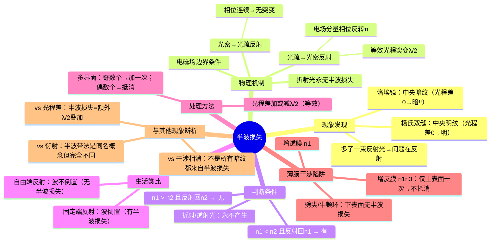

# 大物：半波损失的原理与判断

> 📌 重构说明：原笔记仅罗列定义和简单判断规则，属于 L1 级别。本重构新增：(1) 半波损失的**物理机制**——从电磁场边界条件解释相位为何必须反转 $\pi$；(2) 绳子反射波的**生活类比**——直观理解光疏→光密 vs 光密→光疏的差异；(3) 薄膜干涉中的**三场景易错陷阱对比表**——增透膜/增反膜/劈尖/牛顿环各自是否有半波损失；(4) 洛埃镜实验的完整推导；(5) 与其他光学现象的**横向辨析**。

## 🧠 思维导图



---

## 第一部分：从杨氏双缝到洛埃镜——现象的发现

### 一、两个实验的对比

| | 杨氏双缝实验 | 洛埃镜 |
|------|----------|--------|
| 光源 | 单色光通过双缝 | 单色光 + 平面镜 |
| 光路 | 两束折射光干涉 | 一束直射光 + 一束**反射光**干涉 |
| 光程差 = 0 处 | **明纹** ✓（预期） | **暗纹** ✗（反了！） |

> 洛埃镜的镜面一端与屏接触。在接触点，直射光和反射光走过的几何距离完全相同 → 光程差 = 0。按光的干涉理论，这里应该是明纹——但实际观察到的却是**暗纹**。

这只能说明一件事：**反射光在反射过程中，光程凭空多了半个波长**。

$$ \Delta \longrightarrow \Delta + \frac{\lambda}{2} $$

---

## 第二部分：物理机制——为什么反射会让相位反转？

### 二、从电磁场边界条件说起

半波损失不是「光在路上耽搁了半个波长」——它不是时间延迟，而是**相位突变**。

> 📖 补充物理机制：光是电磁波，电场分量 $\vec{E}$ 在反射时必须满足界面处的边界条件。当光从光疏介质（$n_1$）射向光密介质（$n_2$），在反射点处，反射波的电场分量与入射波的电场分量**方向相反**——这在数学上等价于相位突变 $\pi$，而一个 $\pi$ 的相位差正好对应 $\lambda/2$ 的光程差。当光从光密介质射向光疏介质时，边界条件允许电场保持同向，故无相位突变。

|= 反射类型 | 电场变化 | 相位变化 | 等效光程 | 半波损失？ |
|----------|----------|----------|----------|-----------|
| 光疏到光密反射 | 电场反向 | 突变 $\pi$ | $+\lambda/2$ | **有** |
| 光密到光疏反射 | 电场同向 | 无变化 | 无 | **无** |
| 折射（任一方向） | 穿过去了 | 无变化 | 无 | **永无** |

> [!warning] 考点
> ⚠️ 判断半波损失只需看**反射点**两边的折射率关系，不用管光从哪边射过来。只需问：反射发生在光疏→光密界面上吗？如果是 → 损失；如果不是 → 不损失。折射光永远不产生半波损失。

### 三、绳子类比——物理直觉的落地

这是理解半波损失最直观的方式：

| | 光疏到光密反射 | 光密到光疏反射 |
|------|-------------|-------------|
| **绳子类比** | 绳一端拴在墙上，波传到固定端反射 | 绳一端拴轻环可自由滑动，波传到自由端反射 |
| **反射波形态** | ==倒置==（波峰变波谷） | ==同向==（波峰仍是波峰） |
| **物理原因** | 固定端不能动 → 反射点必须是波节 → 相位突变 $\pi$ | 自由端可动 → 反射点可以是波腹 → 相位不变 |
| **对应半波损失** | **有**（等效 $\lambda/2$ 光程差） | **无** |

> 想象你抖一根绳子，一端拴死在墙上：波传过去弹回来时，波形完全倒过来了——波峰变波谷。这就是半波损失的力学直觉。

---

## 第三部分：判断规则与处理方法

### 四、标准判断流程

```
步骤1：找到反射发生的位置（哪个界面发生反射）
    ↓
步骤2：比较界面两侧折射率
    n(入射侧) < n(折射侧) → 有半波损失
    n(入射侧) > n(折射侧) → 无半波损失
    ↓
步骤3：如果是透射/折射 → 永远无半波损失
    ↓
步骤4：如果是多界面
    数有几个「光疏→光密」反射
    奇数个：加一次 λ/2
    偶数个：抵消，不加
```

### 五、多界面场景——薄膜干涉是重灾区

这是考试最容易设陷阱的地方。同一个薄膜，不同界面组合会产生不同的半波损失结果。

#### 场景 1：增透膜（$n_1 < n_2 < n_3$）

> 例：空气（$n_1=1$）→ MgF₂（$n_2=1.38$）→ 玻璃（$n_3=1.5$）

| 反射位置 | 界面 | 是否为光疏→光密 | 半波损失？ |
|----------|------|-----------------|-----------|
| 上表面 | 空气 → MgF₂ | $n_1 < n_2$ ✓ | **有损失** |
| 下表面 | MgF₂ → 玻璃 | $n_2 < n_3$ ✓ | **有损失** |

==两束反射光各有一次半波损失 → 等效于互相抵消 → 计算光程差时**不考虑**半波损失。==

> [!warning] 考点
> ⚠️ 增透膜的光程差条件：$2n_2d = (2k+1)\frac{\lambda}{2}$（无半波损失项，因为两次抵消了）。如果忘了抵消而多加一个 $\lambda/2$，条件就全写反了。

#### 场景 2：增反膜 / 油膜 / 肥皂泡（$n_1 < n_2 > n_3$）

> 例：空气（$n_1=1$）→ 油膜（$n_2=1.4$）→ 空气（$n_3=1$）——水上的油膜

| 反射位置 | 界面 | 是否为光疏→光密 | 半波损失？ |
|----------|------|-----------------|-----------|
| 上表面 | 空气 → 油膜 | $n_1 < n_2$ ✓ | **有损失** |
| 下表面 | 油膜 → 空气 | $n_2 > n_3$ ✗ | **无损失** |

==只有上表面的一次半波损失 → 计算光程差时必须**额外加** $\lambda/2$。==

> [!warning] 考点
> ⚠️ 这是高频考点。公式：$2n_2d + \frac{\lambda}{2} = k\lambda$（明纹）或 $(2k+1)\frac{\lambda}{2}$（暗纹）。如果漏了 $\lambda/2$ 项，明暗纹条件全部写反。

#### 场景 3：劈尖（空气劈）和牛顿环

| 实验 | 结构 | 上表面反射 | 下表面反射 | 总损失 |
|------|------|-----------|-----------|--------|
| **劈尖干涉**（空气层） | 玻璃 → 空气 → 玻璃 | 玻璃→空气：无（$n_{玻}>n_{空}$） | 空气→玻璃：有（$n_{空}<n_{玻}$） | **一次** $+\lambda/2$ |
| **牛顿环**（空气层） | 玻璃 → 空气 → 玻璃 | 同上：无 | 同上：有 | **一次** $+\lambda/2$ |

==所以劈尖干涉和牛顿环的光程差公式里都有 $+\lambda/2$。==

> [!warning] 考点
> ⚠️ 很多学生记不住劈尖的 $\lambda/2$ 项是加还是不加。核心原因：空气劈的下表面是**空气→玻璃**（光疏→光密），有半波损失。上表面是**玻璃→空气**（光密→光疏），无半波损失。总共一次损失 → 必须加 $\lambda/2$。

---

## 第四部分：易错陷阱全览

### 六、常见错误与正解

| ❌ 常见错误 | ✅ 正解 |
|------------|--------|
| 「折射光也有半波损失」 | 折射/透射光**永不**产生半波损失 |
| 「光密到光疏反射也有半波损失」 | 只有**光疏到光密反射**反射才有 |
| 「只要看到反射光就要加 $\lambda/2$」 | 必须先判断 $n_1 < n_2$ 是否成立 |
| 「多界面每个反射都加一次」 | 奇数个加一次，偶数个抵消 |
| 「暗纹 = 半波损失造成的」 | 暗纹是光程差满足 $(2k+1)\lambda/2$ 的结果，半波损失只是贡献了一个额外的 $\lambda/2$，但暗纹本身仍由总光程差决定 |
| 「增透膜和增反膜的处理一样」 | 增透膜（$n_1\!<\!n_2\!<\!n_3$）两次抵消 → 不加；增反膜（$n_1\!<\!n_2\!>\!n_3$）一次 → 必须加 |
| 「洛埃镜的暗纹说明半波损失是一种损失的」 | 名字叫「损失」但光强没有任何损失——只是相位突变导致干涉相消从明变暗 |

### 七、与相邻概念的横向辨析

| | 半波损失 | 光程差 | 干涉相消 |
|------|----------|--------|----------|
| **来源** | 反射时的相位突变 | 两束光走过的光程差异 | 两束光叠加后光强为零 |
| **结果** | 额外叠加 $\lambda/2$ | $n_2r_2 - n_1r_1$ | 总光程差 = $(2k+1)\lambda/2$ |
| **关系** | 半波损失**贡献**一个 $\lambda/2$ 到光程差里 | 光程差 = 几何差 × 折射率 + 半波损失项 | 总光程差满足半波长奇数倍 → 干涉相消 |

> [!warning] 考点
> ⚠️ 这三个概念经常在同一道题里纠缠。答题时必须分清楚：半波损失是「从哪里来的」→从反射界面条件来的；光程差是「怎么算的」→ $n_2r_2 - n_1r_1 +$（可能的额外 $\lambda/2$）；光的干涉结果是「最后是什么」→明纹还是暗纹。

---

---

## 🔗 知识网络

### 前置依赖
- [[18_光的干涉原理与两类装置]] — 薄膜干涉的基础原理
- [[薄膜干涉]] — 等厚干涉中的光程差计算

### 后续应用
- [[增透膜与增反膜]] — 半波损失在镀膜设计中的应用
- [[劈尖干涉]] — 利用半波损失判断条纹凹凸

### 对比辨析
- 反射光半波损失 vs 无半波损失：当光从光疏介质射向光密介质时，反射光发生半波损失（相位突变π），反之无半波损失
- 增透膜 vs 增反膜：增透膜设计使反射光干涉相消（上下表面各一次半波损失→共两次→抵消），增反膜使反射光干涉加强

## 📚 核心词条索引

| 知识点链接 | 类别 | 关键词 |
|------|------|--------|
| [[半波损失]] | 核心概念 | 光从光疏介质射向光密介质反射时，相位突变π，等效光程增加λ/2 |
| [[薄膜干涉]] | 核心现象 | 薄膜上下表面反射光相遇产生的干涉现象 |
| [[洛埃镜]] | 典型实验 | 单色光经平面镜反射与直射光干涉，中央为暗纹证明半波损失 |
| [[杨氏双缝实验]] | 典型实验 | 双缝干涉装置，中央为明纹 |
| [[光程差]] | 核心概念 | 两束光走过的光程之差 |
| [[光的干涉]] | 核心现象 | 相干光束叠加产生明暗条纹 |
| [[相位突变]] | 核心概念 | 反射时相位突然变化π |
| [[相位差]] | 核心概念 | 两振动相位的差值 |
| [[光疏到光密反射]] | 反射类型 | n₁<n₂时的反射，有半波损失 |
| [[光密到光疏反射]] | 反射类型 | n₁>n₂时的反射，无半波损失 |
| [[增透膜]] | 应用实例 | 减少反射光强的薄膜，上下表面半波损失抵消 |
| [[劈尖干涉]] | 典型实验 | 劈形空气膜产生的等厚干涉条纹 |
| [[牛顿环]] | 典型实验 | 平凸透镜与平板玻璃间空气膜产生的同心圆干涉条纹 |
| [[增反膜]] | 应用实例 | 增强反射光强的薄膜，仅上表面有半波损失 |
| [[干涉相消]] | 干涉结果 | 光程差为半波长奇数倍时，光强为零 |
