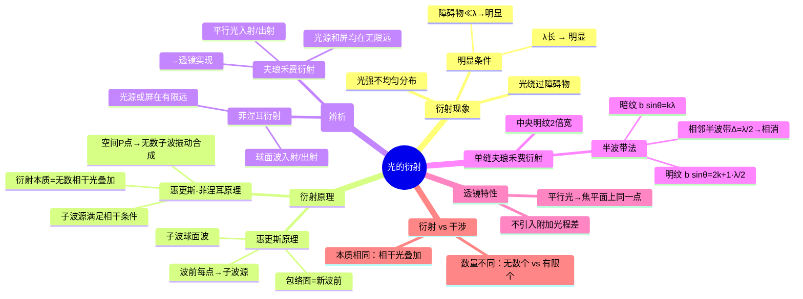

# 大物：惠更斯-菲涅耳原理与衍射分类

> 📌 重构说明：本笔记按「衍射现象→惠更斯-菲涅耳原理（衍射本质）→菲涅耳衍射 vs 夫琅禾费衍射分类→单缝半波带法→对比光的干涉」的知识逻辑重排。补充了光的衍射与光的干涉的本质辨析（无数相干光 vs 有限相干光），并增加了透镜不引入附加光程差的证明思路。

## 🧠 思维导图

---

## 一、衍射现象

### 1.1 什么是衍射？

==光绕过障碍物传播，在障碍物后方出现光强不均匀分布的现象。==

| 实验 | 现象 |
|------|------|
| 圆孔衍射 | 同心圆环，中心为亮斑（艾里斑） |
| 单缝衍射 | 中央明纹最宽最亮，两侧明暗交替 |
| 剃须刀边缘 | 刀刃边缘看起来模糊 → 光绕过了边缘 |

### 1.2 衍射明显的条件

==障碍物尺寸越小、波长越长，衍射现象越明显。==

声波波长约数米 → 日常障碍物远小于波长 → 声波随处衍射（「只闻其声不见其人」）。光波波长约数百纳米 → 需要微米级障碍物才能明显衍射。

> [!warning] 考点
> ⚠️ 障碍物尺寸 ≪ 波长 → 衍射现象明显。选择题/判断题常出现在声波 vs 光波的对比中。

---

## 二、惠更斯原理与惠更斯-菲涅耳原理

### 2.1 惠更斯原理（几何层面）

波面上的每一点都可以看作发射球面波的**子波源**，所有子波球面波的**包络面**构成新的波前。这解释了波的传播、反射和折射——但仅停留在几何层面，无法解释衍射现象的光强分布。

### 2.2 惠更斯-菲涅耳原理（→ 衍射的本质）

菲涅耳对惠更斯原理进行了革命性补充：==这些子波源不仅发射球面波，而且它们之间满足相干条件（频率相同、振动方向相同、相位差恒定）。==

空间任意点 $P$ 的光振动 = 波前上**所有子波源**发出的次波在 $P$ 点引起的**振动叠加**（积分而非简单加法）。

$$\text{光的衍射} = \text{无数个相干光的叠加}$$

$$U(P) = \iint_{\Sigma} \frac{K(\theta)}{r} \, e^{i(kr-\omega t)} \, d\Sigma$$

> [!warning] 考点
> ⚠️ 「光的衍射是无数个相干光的叠加，光的干涉是有限个相干光的叠加」——这句话是干涉/衍射辨析的万能答案。选择题、判断题、简答题均可考查。

---

## 三、衍射的分类

### 3.1 菲涅耳衍射

| 条件 | 光源到障碍物有限远，或障碍物到光屏有限远 |
|------|----------------------------------------|
| 入射/出射光 | 球面波 |
| 计算难度 | 复杂 |
| 实际意义 | 多数实际场景 |

### 3.2 夫琅禾费衍射

| 条件 | 光源到障碍物无限远，且障碍物到光屏无限远 |
|------|----------------------------------------|
| 入射/出射光 | 平行光（平面波） |
| 实现方法 | 透镜配合：点光源置焦点 → 平行光入射，经障碍物 → 透镜 → 焦平面汇聚 |
| 计算难度 | 简单（平行光条件简化积分） |
| 考试比重 | ==绝大多数考题涉及的是夫琅禾费衍射== |

> [!warning] 考点
> ⚠️ 「夫琅禾费衍射 = 平行光入射 + 平行光出射」是必背定义。两者看到任意一方都在提醒你是夫琅禾费。

### 3.3 优劣对比

| 维度 | 菲涅耳衍射 | 夫琅禾费衍射 |
|------|--------|----------|
| 数学处理 | 积分复杂 | 积分简化 |
| 实际场景 | 更真实 | 理想化 |
| 条纹特征 | 形状会随距离变化 | 条纹分布稳定 |

---

## 四、透镜的作用——不引入附加光程差

### 4.1 核心结论

==平行光经透镜汇聚到焦平面上的同一点时，各光线之间的光程差完全由透镜**之前**的光程差异决定——透镜本身不引入附加光程差。==

### 4.2 直观理解

平行光束中，边缘光线比中心光线经过更长的几何路径到达透镜，但在透镜中边缘光线通过更薄的玻璃（因透镜形状），两者效应恰好相互抵消。

> 📖 这一定理是惠更斯-菲涅耳原理的关键推论——透镜不过是改变了光线的传播方向，并未改变其光程关系。证法：平行光束经透镜汇聚到焦点形成干涉相长 → 各光线到达焦点时光程必然相等 → 透镜不引入额外光程差。

---

## 五、单缝夫琅禾费衍射

### 5.1 菲涅耳半波带法

将狭缝沿垂直于缝的宽度方向分成若干宽度为 $\lambda/(2\sin\theta)$ 的窄条（半波带），相邻两半波带到屏幕的距离差恰好为 $\lambda/2$ → 它们在屏幕上相遇时相位差为 $\pi$ → 互相干涉相消。

==用代数加法代替积分，简洁直观——不是精确方法，但物理思路极其清晰。==

**推导暗纹条件**：若狭缝恰能被分成偶数个半波带 → 相邻对消 → 屏上该点暗。

$$b\sin\theta = k\lambda, \quad k = \pm 1, \pm 2, \cdots$$

**推导明纹条件**：若狭缝恰能被分成奇数个半波带 → 奇数减一个完整对消，剩一个 → 亮。

$$b\sin\theta = (2k+1)\frac{\lambda}{2}, \quad k = \pm 1, \pm 2, \cdots$$

> [!warning] 考点
> ⚠️ 半波带法的核心前提：相邻半波带的光程差 = λ/2 → 相位差 = π → 干涉相消。

### 5.2 单缝衍射图样特征

- **中央明纹**：宽度 = 其他明纹宽度的 **2 倍**，光强最大
- **其他明纹**：宽度相同（等于中央明纹宽度的一半），级次越高亮度越低
- **对比双缝干涉**：双缝干涉所有明纹等宽等亮 → 这是区分单缝光的衍射与双缝光的干涉的视觉标志

> [!warning] 考点
> ⚠️ 单缝光的衍射中央明纹宽度 = 其他明纹宽度的 2 倍（高频填空）。双缝光的干涉所有明纹宽度相同。

### 5.3 衍射角

衍射角 $\theta$ = 出射平行光与入射方向的夹角。不同的 $\theta$ → 光汇聚到屏上不同的位置 → 形成衍射图样。

---

## 六、衍射与干涉的深度辨析

| 维度 | 光的干涉 | 光的衍射 |
|------|------|------|
| **本质** | 相干光叠加 | 相干光叠加 |
| **数量** | 有限个（2个、多个） | 无数个（全波前子波源） |
| **典型装置** | 杨氏双缝（2束）、劈尖薄膜（2束） | 单缝（无数）、圆孔（无数） |
| **数学** | 有限项求和 | 积分（无限项求和） |

> 📖 语义辨析：用「光的干涉」或「光的衍射」描述某种现象通常取决于历史习惯——杨氏双缝实验被称为干涉装置，单缝被称为衍射装置——但原理层面，两者本质相同。

---

---

## 🔗 知识网络

### 前置依赖
- [[18_光的干涉原理与两类装置]] — 光的干涉基本概念
- [[机械波]] — 波的叠加原理

### 后续应用
- [[21_圆孔衍射与光学仪器分辨本领]] — 圆孔衍射与瑞利判据
- [[单缝衍射]] — 单缝夫琅禾费衍射的条纹分布

### 对比辨析
- 干涉 vs 衍射：干涉是有限个相干光源的叠加，衍射是连续分布的子波源的叠加；干涉强调离散光源的相互作用，衍射强调波前上各点的相互作用
- 菲涅耳衍射 vs 夫琅禾费衍射：菲涅耳衍射光源或屏在有限远（球面波入射），夫琅禾费衍射光源和屏都在无穷远（平行光入射）

## 📚 核心词条索引

| 知识点链接 | 类别 | 关键词 |
|------|------|--------|
| [[衍射现象]] | 核心概念 | 光绕过障碍物传播，在障碍物后方出现光强不均匀分布 |
| [[惠更斯-菲涅耳原理]] | 核心原理 | 波前上每一点作为相干子波源，空间光振动为所有子波的叠加 |
| [[菲涅耳衍射]] | 衍射类型 | 光源或屏在有限远，球面波入射或出射 |
| [[夫琅禾费衍射]] | 衍射类型 | 光源和屏均在无限远，平行光入射和出射 |
| [[半波带法]] | 计算方法 | 将狭缝分成宽度为λ/(2sinθ)的窄条，相邻半波带干涉相消 |
| [[光的干涉]] | 核心现象 | 有限个相干光束的叠加 |
| [[光的衍射]] | 核心现象 | 无数个相干子波源的叠加 |
| [[透镜]] | 光学元件 | 不引入附加光程差，平行光汇聚到焦平面上同一点 |
| [[惠更斯原理]] | 几何原理 | 波面上每点发射子波，包络面构成新波前 |
| [[相干条件]] | 核心条件 | 频率相同、振动方向相同、相位差恒定 |
| [[光程差]] | 核心概念 | 两束光走过的光程之差，决定干涉结果 |
| [[干涉相长]] | 干涉结果 | 光程差为波长整数倍时，光强增强 |
| [[相位差]] | 核心概念 | 两振动相位的差值，决定干涉强弱 |
| [[干涉相消]] | 干涉结果 | 光程差为半波长奇数倍时，光强为零 |
| [[衍射角]] | 核心概念 | 出射平行光与入射方向的夹角 |
| [[杨氏双缝实验]] | 典型实验 | 双缝干涉装置，证明光的波动性 |
