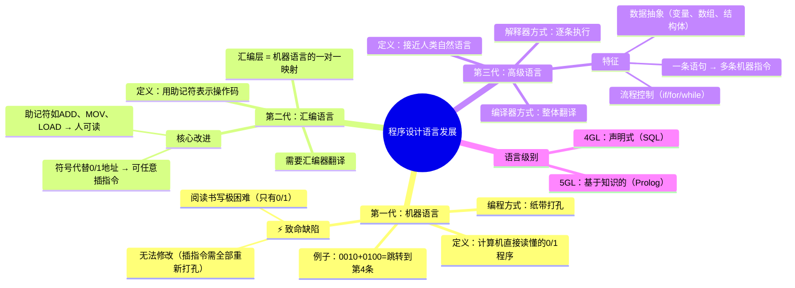
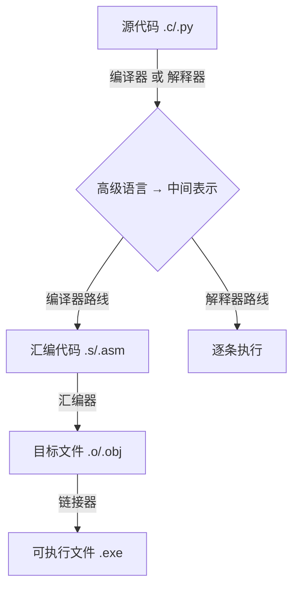

# 程序设计语言发展简史

> 📌 重构说明：本笔记以「机器语言→汇编语言→高级语言」三阶段为主线，深度还原老师课堂中纸带打孔、跳转指令标记等具体案例，按知识树的逻辑逐层展开。

---

## 🧠 思维导图



---

## 第一部分：机器语言——计算机的「母语」

### 一、什么是机器语言？

> 📖 标准定义：计算机能够理解和执行的程序称为机器代码或机器语言程序。它由一条条指令组成，每条指令都是特定格式的 **0/1 序列**。

这是计算机唯一能「读懂」的语言。其他任何语言（汇编、C、Python）最终都必须翻译成机器语言才能执行。

### 二、最早的编程方式：纸带打孔

老师详细描述了最早的计算机程序开发方式：

```
穿孔 = 表示 0
未穿孔 = 表示 1
```

程序员在纸带上打孔，然后把纸带塞进计算机。计算机通过读取纸带的孔位来执行程序——就像老式自动钢琴通过打孔纸卷来演奏。

#### 2.1 一个具体的指令实例

```
地址     指令（二进制）       含义
----     --------------      ----
第0条    01010110           某条指令
第1条    0010 0100          跳转指令
                             0010 = 操作码（跳转）
                             0100 = 目标地址 = 第4条
第2条    ...
第3条    ...
第4条    ...             ←── 跳转到这里
```

**关键解读**：`0010` 是操作码，表示「条件跳转」；`0100` 是操作数，将二进制 `0100` 转换为十进制就是 `4`，表示跳转到第 4 条指令。

> [!warning] 考点
> ⚠️ 理解「跳转地址」的表示方式——二进制地址码 `0100₂ = 4₁₀`，这是指令中**相对/绝对地址**的基本形式。

### 三、机器语言的三大致命缺陷

#### 3.1 书写阅读极困难

> 老师原话：「这样一串 0 和 1，我们人完全不知道它具体含义，但计算机是能够知道的。」

只有 0 和 1，人根本无法直接阅读和编写。出一丁点错就得从头找。

#### 3.2 程序一旦打孔就固定了

> 老师原话：「它一旦打孔，程序就固定了，后面再不能对它进行改变。」

#### 3.3 插入新指令 = 灾难

> 老师原话重点还原：
> 「假设我要在第 4 条指令之前加入几条指令——那第 1 条指令里写的是『跳转到 4』，现在第 4 条往后挪了，变成了第 7 条——它还是跳转到 4，这就错了！所以你要把整张纸带重新打一遍。」

这就是**硬编码地址**的灾难：地址改了一处，所有引用它的地方全部失效。

---

## 第二部分：汇编语言——用符号拯救自己

### 四、第一个重大突破：符号化

| 维度 | 机器语言 | 汇编语言 |
|------|---------|---------|
| **地址表示** | 二进制数 `0100` | 符号标记 `L010` |
| **操作表示** | 二进制 `0010` | 助记符 `JMP` 或 `JE` |
| **可读性** | ❌ 人不可读 | ⚠️ 部分可读 |
| **可修改性** | ❌ 插入指令需重新打孔 | ✅ 只需修改符号引用 |

### 五、助记符（Mnemonics）——让人看懂指令

> 📖 标准定义：汇编语言用**助记符**来表示操作码。助记符通常是英文的缩写，一眼就能看出这条指令要执行哪种操作。

老师列举的关键助记符：

| 助记符 | 全称 | 操作 | 出现频率 |
|--------|------|------|---------|
| `ADD` | Addition | 加法 | 中 |
| `SUB` | Subtract | 减法 | 中 |
| `MOV` | Move | 数据传送 | **极高** |
| `LOAD` | Load | 从内存取数到寄存器 | 高 |
| `STORE` | Store | 从寄存器存到内存 | 高 |
| `JMP` | Jump | 无条件跳转 | 中 |
| `CMP` | Compare | 比较 | 中 |

### 六、标签（Label）——解决地址硬编码问题

```asm
; 机器语言版本（无法修改）
0010 0100          ; 跳转到绝对地址 0100(4)

; 汇编语言版本（灵活修改）
JMP  L010          ; 跳转到标签 L010
...
L010:  MOV AX, BX  ; 标签 L010 指向这里
```

**核心优势**：老师用生动的比较说明——如果要在标签 L010 之前插入新指令，标签会自动跟随移动。汇编器重新翻译时，`JMP L010` 自动指向正确位置。不用像机器语言那样「全部重新打孔」。

### 七、汇编语言与机器语言的对应关系

> [!warning] 考点
> ⚠️ 汇编指令与机器指令是**一对一**或接近一对一的映射关系

```
ADD  AX, BX    ←──→    00000011 11000000  (x86机器码示例)
```

一条汇编指令基本对应一条机器指令。这意味着：
- ✅ 效率高，接近直接操作硬件
- ❌ 但还是太底层，写大程序太困难

### 八、汇编程序的工作

源文件 → 汇编器 → 目标文件 → 链接器 → 可执行文件

汇编器将助记符和标签翻译回 0/1 机器码。

---

## 第三部分：高级语言——从「用机器说话」到「用人说话」

### 九、第三代语言的核心突破

| 特征 | 机器/汇编 | 高级语言 |
|------|----------|---------|
| **抽象级别** | 物理机器层 | 逻辑问题层 |
| **一条语句** | = 一条机器指令 | = 1~n 条机器指令 |
| **数据表示** | 0/1 直接操作 | 变量 `int x = 10` |
| **流程控制** | `JMP` 跳转 | `if` / `for` / `while` |
| **平台依赖** | 强依赖特定 CPU ISA | **平台无关**（一次编写，多处编译） |

> 老师强调：「高级语言一条语句能对应多条机器指令。而且它有数据抽象——变量、数组、结构体——让你不用管底层寄存器怎么分配。」

### 十、两种转换方式：编译 vs 解释

**类比**（老师用这种方式帮助学生理解）：

| | 编译 | 解释 |
|------|------|------|
| **类比** | 整本书翻译成中文，然后全篇阅读 | 同声传译，边读边翻译 |
| **执行方式** | 一次全部翻译 → 得到目标文件 → 直接执行 | 读一行 → 翻译一行 → 执行一行 |
| **效率** | 高（一次翻译，重复运行） | 低（每次运行都要翻译） |
| **代表** | C/C++/Go | Python/JavaScript |

### 十一、C 语言与汇编的比较示例

**C 语言：**
```c
int sum = 0;
for (int i = 1; i <= 10; i++) {
    sum += i;
}
```

**对应的汇编（简化版，x86 风格）：**
```asm
    MOV EAX, 0        ; sum = 0
    MOV ECX, 1        ; i = 1
L1: CMP ECX, 10       ; i <= 10 ?
    JG  L2            ; 不满足就跳出
    ADD EAX, ECX      ; sum += i
    INC ECX           ; i++
    JMP L1            ; 继续循环
L2: ...
```

**对比可见**：C 的 3 行 → 汇编的 7 行，且汇编充满了 `CMP`/`JMP`/`INC` 等低级操作。高级语言极大地减少了程序员的重复劳动。

### 十二、第四代语言（4GL）与第五代语言（5GL）

| 代次 | 代表 | 特征 |
|------|------|------|
| **4GL** | SQL | 声明式：只告诉计算机「要什么」，不关心「怎么做」 |
| **5GL** | Prolog | 基于知识库和推理规则的智能语言 |

### 十三、现代语言谱系：从 C 到全领域

> 老师在课上也稍微提了一嘴：目前的主流语言基本上都是从 C 这个根上长出来的，了解它们之间的血缘关系有助于学习迁移。

```mermaid
graph TD
    ALGOL[ALGOL 60] --> CPL
    CPL --> BCPL
    BCPL --> B
    B --> C["⭐ C (1972)"]
    C --> Cpp[C++ (面向对象)]
    C --> ObjC[Objective-C]
    C --> Csharp[C# (托管运行时)]
    C --> Java[Java (跨平台 JVM)]
    C --> Go[Go (并发原语)]
    C --> Rust[Rust (内存安全)]
    Java --> Kotlin[Kotlin]
    Java --> Scala[Scala]
```

| 语言 | 年份 | 关键创新 | 典型用途 |
|------|------|----------|----------|
| **C** | 1972 | 高级 + 低级混合，指针 | 操作系统、嵌入式 |
| **C++** | 1985 | 面向对象 + 泛型 + STL | 游戏引擎、浏览器 |
| **Java** | 1995 | JVM 虚拟机 "一次编写，到处运行" | 企业应用、Android |
| **Python** | 1991 | 动态类型、简洁语法 | AI、数据科学、脚本 |
| **JavaScript** | 1995 | Web 前端唯一标准 | 全栈（Node.js） |
| **Go** | 2009 | 原生协程、简化并发 | 云原生、微服务 |
| **Rust** | 2015 | 所有权系统、零成本抽象 | 系统编程、WebAssembly |

### 十四、三类语言的对比——具体到一个函数的实现

以「计算 1+2+...+n」为例子，看三类语言如何表示同一个逻辑：

**C 语句（高级语言）：**
```c
int sum(int n) {
    int s = 0;
    for (int i = 1; i <= n; i++) {
        s = s + i;
    }
    return s;
}
```

**对应汇编（机器级语言）：**
```asm
sum:
    push ebp
    mov ebp, esp
    mov ecx, [ebp+8]    ; ecx = n
    xor eax, eax         ; s = 0
    mov edx, 1           ; i = 1
.loop:
    cmp edx, ecx
    jg .done
    add eax, edx         ; s += i
    inc edx
    jmp .loop
.done:
    pop ebp
    ret
```

**对应机器码（最低级）：**
```
55 89 E5 8B 4D 08 31 C0 BA 01 00 00 00 39 CA 7F 06 01 D0 42 EB F5 5D C3
```

> 从 8 行 C 代码 → 14 行汇编 → 23 字节机器码。每一层抽象都帮程序员隐藏了大量底层细节。

### 十五、为什么今天仍然需要学习汇编？

> [!info] 补充定义
> 4GL（第四代语言）是声明式语言，如 SQL：`SELECT * FROM students WHERE score > 90`。用户只需要指定「想要什么」，数据库系统自己决定如何检索。

---

## 第四部分：语言的转换流程全景

### 十三、从源代码到可执行文件



> [!info] 补充定义
> **目标文件**是汇编后的机器代码文件（仍是 0/1），但还不能直接执行，因为其中引用的外部函数（如 `printf`）尚未与库代码连接。需要**链接器**将多个目标文件和库合并为完整的可执行文件。

### 十四、平台无关性的真正含义

高级语言的同一份源代码，可以：
- 在 x86 平台编译 → x86 机器码
- 在 ARM 平台编译 → ARM 机器码
- 在 RISC-V 平台编译 → RISC-V 机器码

但编译出来的结果只能在对应平台上运行。**平台无关的是源代码层面**，不是可执行文件。

---

---

## 🔗 知识网络

### 前置依赖
- [[01_计算机系统概述与硬件组成]] — 计算机硬件的基本组成
- [[03_计算机层次结构与指令集]] — 指令集与编程语言的关系

### 后续应用
- [[编译原理]] — 高级语言→汇编→机器码的编译过程
- [[操作系统]] — 操作系统为高级语言提供运行环境
- [[程序设计]] — 不同语言的设计范式

### 对比辨析
- 机器语言 vs 汇编语言 vs 高级语言：机器语言直接执行（二进制），汇编语言用助记符表示机器指令（一一对应），高级语言抽象程度最高（平台无关）
- 编译型 vs 解释型：编译型语言（C/C++）先生成机器码再执行，解释型语言（Python/JS）边解释边执行

## 📚 核心词条索引

| 词条 | 所属概念 | 文件位置 |
|------|----------|----------|
|  | 基本概念 | 指令 |
| 机器语言 | 第一代语言 | 机器语言 |
| 汇编语言 | 第二代语言 | 汇编语言 |
| 助记符 | 汇编核心 | 助记符 |
| 标签 | 汇编核心 | 标签 |
| 汇编器 | 转换工具 | 汇编器 |
| 高级语言 | 第三代语言 | 高级语言 |
| 编译器 vs 解释器 | 转换方式 | 编译器 vs 解释器 |
| 4GL (SQL) | 第四代语言 | 4GL (SQL) |
| 5GL (Prolog) | 第五代语言 | 5GL (Prolog) |
| 中断处理 | 高级概念 | 中断 |
| 10_程序的编译链接与符号解析 | 后续步骤 | 链接器 |
|  | 相关概念 | ISA |
