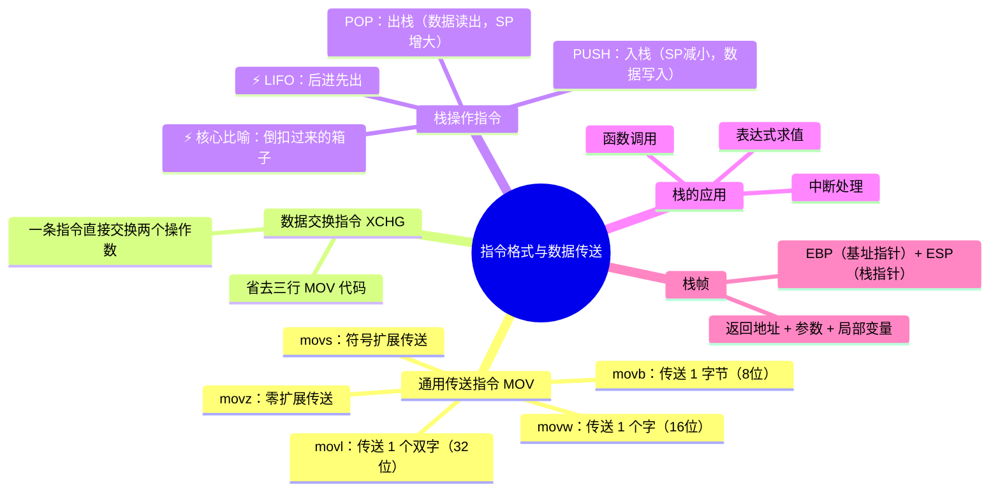
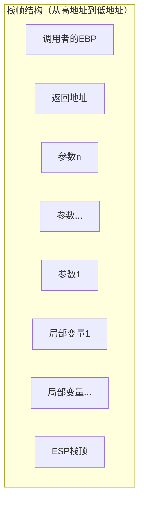

# 指令格式与数据传送

> 📌 重构说明：本笔记从计算机「最常用指令」——数据传送指令（MOV）出发，深入到栈（Stack）的「倒扣箱子」模型中，完整展开 PUSH/POP 的底层机制。老师对栈的比喻是本课的绝对亮点。

---

## 🧠 思维导图



---

## 第一部分：传送指令——最常用的指令

### 一、为什么要学传送指令？

> 老师原话：「在 x86 里面，最常用的指令应该就是传送指令。因为计算机里面很多都是数据，数据之间要传递，都得靠传送指令。」

无论程序做什么——加两个数、打印结果、读写文件——中间都在不停地把数据从一个地方搬到另一个地方。**MOV指令 是程序的「搬运工」**。

### 二、MOV指令 指令的基本格式

```
MOV  目标, 源    ; 将「源」中的数据复制到「目标」中
```

> [!warning] 考点
> ⚠️ 方向记法：x86 AT&T 语法中MOV指令的方向是 **源 → 目标**（source → destination），等于 `dest = src`。

### 三、后缀决定传送宽度

> 老师原话：「在后缀 b、w、l 表示它传送数据的宽度：b 是一个字节 8 位，w 是 16 位一个字，l 是双字 32 位。」

| | 指令 | 后缀含义 | 传送位数 | 传送字节数 | C 语言对应类型 |
|------|------|----------|----------|-----------|---------------|
| | `movb` | Byte | **8 位** | 1 字节 | `char` |
| | `movw` | Word | **16 位** | 2 字节 | `short` |
| | `movl` | Long（双字） | **32 位** | 4 字节 | `int` |
| | `movq` | Quad（四字） | **64 位** | 8 字节 | `long long` |

#### 3.1 宽度匹配的必要性

```asm
movl %eax, %ebx    ✓  32位 → 32位
movb %al, %bl      ✓  8位 → 8位
movl %eax, %bx         不匹配！源=32位，目标=16位（编译错误）
```

> [!warning] 考点
> ⚠️ 传送指令**源和目标必须宽度匹配**，否则汇编器报错。

### 四、MOV 的操作数限制

| 是否允许|源 → 目标|说明|
| ----------|----------|------|
| ✅ 允许|立即数 → 寄存器|`movl $10, %eax`|
| ✅ 允许|寄存器 → 寄存器|`movl %eax, %ebx`|
| ✅ 允许|内存 → 寄存器|`movl (%esp), %eax`|
| ✅ 允许|寄存器 → 内存|`movl %eax, (%esp)`|
| ❌ 禁止|**内存 → 内存**|需要先经过寄存器中转|

**为什么不能内存 → 内存？** 因为 CPU 的总线一次只能读或写一个内存地址，无法同时读一个地址又写另一个。

### 五、扩展传送——从小变大

当把较小的数据传送到较大的寄存器时，高位如何处理？

| 指令|扩展方式|行为|应用|
| ------|----------|------|------|
| `movs`|**符号扩展**|高位补符号位的值|`movsbl %al, %ebx` — 带符号 char → int|
| `movz`|**零扩展**|高位全部补 0|`movzbl %al, %ebx` — 无符号 char → int|

**实例对比：**

```
%al = 10000011  (char 值: -125 或 131)
                         符号扩展 ↓        零扩展 ↓
movsbl 后 %ebx:   11111111 11111111 11111111 10000011  (-125)
movzbl 后 %ebx:   00000000 00000000 00000000 10000011  (131)
```

> [!warning] 考点
> ⚠️ 理解符号扩展和零扩展的区别——选了错误的扩展方式会导致**完全不同**的数值结果。

---

## 第二部分：数据交换——XCHG 指令

### 六、用 XCHG 一条指令完成交换

**传统方法（需要三次 MOV + 一个临时寄存器）：**
```asm
movl %eax, %ecx    ; tmp = a
movl %ebx, %eax    ; a = b
movl %ecx, %ebx    ; b = tmp
```

**XCHG 方法（一条指令搞定）：**
```asm
xchgl %eax, %ebx   ; 交换 eax 和 ebx 的内容
```

> 老师原话：「用数据交换指令，它直接一条指令就可以，比 MOV 指令快得多。」

---

## 第三部分：栈——计算机最核心的数据结构

### 七、倒扣箱子的比喻（本课最形象的讲解）

> 老师原话逐句还原：
> 「我们把栈比喻成一个**倒扣过来的箱子**。不是正着放的——是倒扣过来的。可以往里面装东西，也可以从里面取东西。」

```
┌─────────┐
│         │  ← 箱底（在下面）
│ 装东西  │
│    ↓    │
│ 越装越高│
│         │
│=========│  ← 栈顶（在上面，可以随时打开存取）
│ 箱子口  │     ← 倒扣过来！所以箱子口在底部
└─────────┘
```

**关键点**：箱子是倒扣的！所以：
- 箱子底部在**上面**（只能从底部取/放）
- 箱子口在**下面**（最先放进去的在最下面）

### 八、栈的操作规则：LIFO（后进先出）

| 英文|中文|含义|
| ------|------|------|
| Push|入栈 / 压栈|把数据「塞进」栈里|
| Pop|出栈 / 弹栈|从栈里「取出」数据|
| **LIFO**|**后进先出**|Last In, First Out|

> 老师原话：「先进后出——先放进去的，后面才能放出来。后面放进去的，先出来。」

**LIFO 举例：**
```
初始:    栈空
PUSH A:  [A]
PUSH B:  [A, B]     ← B 是最后进去的
PUSH C:  [A, B, C]  ← C 是最后进去的
POP:     返回 C → 栈变为 [A, B]   ← C 最先出来（后进先出）
POP:     返回 B → 栈变为 [A]
```

### 九、栈指针——怎么知道栈顶在哪？

| | 寄存器 | 名称 | 作用 |
|------|--------|------|------|
| | **ESP** | Extended Stack Pointer | 指向**栈顶**（最后一个数据的地址） |
| | **EBP** | Extended Base Pointer | 指向**栈帧底部**（当前函数的基地址） |

#### 9.1 PUSH 时发生了什么？

```asm
pushl %eax    ; 将 EAX 的值压入栈
```

内部过程：
```
1. ESP = ESP - 4     (栈指针先向下移动 4 字节，腾出空间)
2. [ESP] = %eax      (将 EAX 的值写入新的栈顶位置)
```

> [!warning] 考点
> ⚠️ 栈在内存中是从**高地址向低地址**增长的——PUSH 时 **ESP 减小**，POP 时 **ESP 增大**。这条容易记反！

#### 9.2 POP 时发生了什么？

```asm
popl %ebx     ; 从栈顶弹出一个值到 EBX
```

内部过程：
```
1. %ebx = [ESP]      (从栈顶读取数据)
2. ESP = ESP + 4     (栈指针向上移动 4 字节，释放空间)
```

#### 9.3 PUSH/POP 全过程追踪

```
初始 ESP = 0x1000，栈为空

执行 pushl $5 (立即数 5 入栈)：
  ESP → 0x0FFC, [ESP] = 5

执行 pushl $8：
  ESP → 0x0FF8, [ESP] = 8

执行 popl %eax：
  EAX = 8, ESP → 0x0FFC

执行 popl %ebx：
  EBX = 5, ESP → 0x1000 (回到原位)
```

### 十、栈的用途——为什么需要栈？

#### 10.1 函数调用（最主要的用途）

> 老师原话：「在计算机编程的时候，如果遇到调用函数，它都可能用到我们的栈。」

当你调用一个函数时：
```
1. 调用者的参数压入栈（PUSH）
2. 返回地址压入栈（函数执行完后回到哪里）
3. 跳转到被调用函数
4. 被调用函数在栈上分配局部变量
5. 函数执行完毕，恢复栈指针（POP）
6. 从返回地址继续执行
```

#### 10.2 中断处理

中断发生时，CPU 自动将当前的 PC（程序计数器）和标志寄存器压入栈，处理完中断后再弹出恢复执行。

#### 10.3 表达式求值

中缀表达式 `(3 + 5) × 2` 可以通过栈转换为后缀表达式求值。

---

## 第四部分：栈帧——函数的「私人空间」

### 十一、栈帧的概念



### 十二、函数调用的标准序言和尾声

```asm
; 函数序言（进入函数时执行）
pushl %ebp          ; 保存调用者的 EBP
movl  %esp, %ebp    ; 新的 EBP = 当前 ESP
subl  $16, %esp     ; 为局部变量分配 16 字节空间

; ... 函数体 ...

; 函数尾声（退出函数时执行）
movl  %ebp, %esp    ; 恢复 ESP
popl  %ebp          ; 恢复调用者的 EBP
ret                 ; 返回到调用者
```

---

## 第五部分：寻址方式与地址计算

### 十三、x86 常见寻址方式

| 寻址方式 | 语法 | LEA 计算 | 含义 |
|------|------|-----------|------|
| 立即数寻址 | `$10` | — | 直接使用常数值 |
| 寄存器寻址 | `%eax` | — | 读取寄存器的值 |
| 直接寻址 | `0x8048000` | — | 读取该地址的值 |
| 寄存器间接寻址 | `(%eax)` | EA = R[EAX] | 以寄存器值为地址 |
| 基址+偏移 | `4(%eax)` | EA = R[EAX] + 4 | 寄存器值 + 常数偏移 |
| 基址+变址 | `(%eax,%ebx)` | EA = R[EAX] + R[EBX] | 两寄存器值和 |
| 基址+变址+比例 | `(%eax,%ebx,4)` | EA = R[EAX] + R[EBX]×4 | 变址 × 比例因子 |

---

## 🔗 知识网络

### 前置依赖
- [[03_计算机层次结构与指令集]] — 指令集的基本概念
- [[04_计算机硬件组成与总线]] — CPU通过总线传送数据

### 后续应用
- [[11_程序的编译链接与符号解析]] — 指令的生成与链接
- [[汇编语言]] — 指令的汇编表示

### 对比辨析
- 立即寻址 vs 直接寻址 vs 间接寻址：立即寻址的操作数在指令中（快但值固定），直接寻址的地址在指令中，间接寻址的地址在内存中（慢但灵活）
- RISC vs CISC 的指令格式：RISC 指令定长（32位），CISC 指令变长（1-15字节）——RISC更适合流水线

## 📚 核心词条索引
