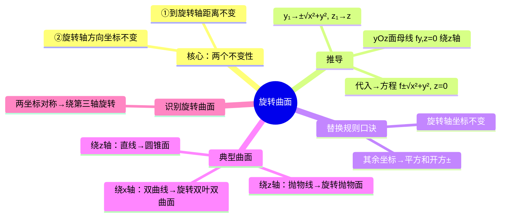

# 高数：旋转曲面方程推导

> 📌 重构说明：本笔记是「给出母线和旋转轴→写出旋转曲面方程」的标准操作手册。已按「核心两个不变性（到轴距离不变 + 轴方向坐标不变）→$yOz$ 面母线绕 $z$ 轴旋转的标准推导→替换规则口诀→绕 $x$/$y$ 轴的对称推广→四个典型例题（直线→圆锥面、抛物线→旋转抛物面、双曲线→旋转双叶双曲面、$x^2+2y^2+z^2=1$→旋转椭球面识别）」的逻辑链重排。完整保留了原笔记的全部例题推导和「识别旋转曲面」的倒推方法。

## 🧠 思维导图

---

## 一、核心：两个不变性

旋转过程中：
1. ==到旋转轴的距离不变==
2. ==旋转轴方向的坐标不变==

> [!info] 几何直觉
> 绕 $z$ 轴旋转时，每个点的「高度」$z$ 不变，它到 $z$ 轴的水平距离也不变——就像捏着一根棍子转圈，棍上某点的高度和到棍轴的距离都不变。

---

## 二、标准推导

**母线**：$yOz$ 面上曲线 $f(y,z)=0$

**旋转轴**：$z$ 轴

**推导**：
1. 母线上任取 $M_1(0, y_1, z_1)$，满足 $f(y_1,z_1)=0$
2. $M_1$ 绕 $z$ 轴旋转到 $M(x,y,z)$
3. 两个不变性 ①：$\sqrt{x^2+y^2} = |y_1|$ → $y_1 = \pm\sqrt{x^2+y^2}$
4. 两个不变性 ②：$z = z_1$
5. ==代入==：$f(\pm\sqrt{x^2+y^2},\,z) = 0$

---

## 三、替换规则口诀

==**旋转轴坐标不变，其余坐标替换为平方和开方**。==

| 母线坐标面 | 旋转轴 | 替换操作 |
|-----------|--------|----------|
| $yOz$ 面 $f(y,z)=0$ | $z$ 轴 | $y \to \pm\sqrt{x^2+y^2}$，$z$ 不变 |
| $yOz$ 面 $f(y,z)=0$ | $y$ 轴 | $z \to \pm\sqrt{x^2+z^2}$，$y$ 不变 |
| $xOy$ 面 $f(x,y)=0$ | $x$ 轴 | $y \to \pm\sqrt{y^2+z^2}$，$x$ 不变 |

---

## 四、四个典型例题

| 母线 | 旋转轴 | 结果 | 曲面类型 |
|------|--------|------|----------|
| $y=z$ | $z$ 轴 | $x^2+y^2=z^2$ | ==圆锥面== |
| $y^2=2pz$ | $z$ 轴 | $x^2+y^2=2pz$ | ==旋转抛物面== |
| $\frac{x^2}{a^2}-\frac{y^2}{b^2}=1$ | $x$ 轴 | $\frac{x^2}{a^2}-\frac{y^2+z^2}{b^2}=1$ | ==旋转双叶双曲面== |
| 椭圆 $2y^2+z^2=1$ | $y$ 轴 | $x^2+z^2+2y^2=1$ | ==旋转椭球面== |

> [!warning] 考点
> ⚠️ 识别旋转曲面：方程中若有某两个坐标以「平方和」形式对称出现，则该曲面由第三个坐标对应的平面上的曲线旋转而成。

---

---

## 🔗 知识网络

### 前置依赖
- [[空间曲线与曲面]] — 空间曲面的基本概念
- [[06-02_空间平面与直线方程]] — 空间几何的代数表示

### 后续应用
- [[06-04_空间曲线与参数方程]] — 空间曲线的参数化表示
- [[07-01_多元函数的概念与极限]] — 曲面是二元函数的几何表示

### 对比辨析
- 旋转曲面 vs 柱面：旋转曲面由母曲线绕轴旋转生成，柱面由母线沿准线平移生成
- 绕 x 轴 vs 绕 y 轴：绕 x 轴旋转将 $y$ 替换为 $\pm\sqrt{y^2+z^2}$，绕 y 轴旋转将 $x$ 替换为 $\pm\sqrt{x^2+z^2}$

## 📚 核心词条索引

| 知识点链接 | 类别 | 关键词 |
|------|------|--------|
| [[两个不变性]] | 核心原理 | 旋转时到轴距离不变、轴向坐标不变 |
| [[替换规则]] | 计算方法 | 旋转轴坐标不变，其余坐标替换为平方和开方 |
| [[旋转抛物面]] | 典型曲面 | 抛物线绕轴旋转所得曲面，$x^2+y^2=2pz$ |
| [[旋转曲面]] | 核心概念 | 平面曲线绕轴旋转所得曲面 |
| [[旋转双叶双曲面]] | 典型曲面 | 双曲线绕轴旋转所得曲面 |
| [[圆锥面]] | 典型曲面 | 直线绕轴旋转所得曲面，$x^2+y^2=z^2$ |
