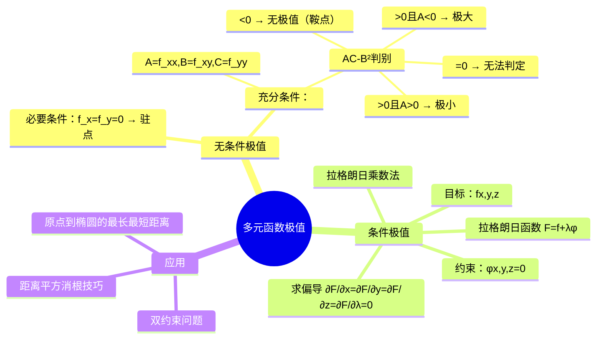

# 高数：多元函数的极值与条件极值

> 📌 重构说明：本笔记是高数下册的应用考点——多元函数极值。已按「无条件极值（驻点条件 $f_x=f_y=0$→充分判别：$A=f_xx,B=f_xy,C=f_yy$→AC-B²判别表的四条结论）→条件极值（拉格朗日乘数法：目标函数+约束×$\lambda$→求偏导→解驻点→判断）→原点到椭圆的最长最短距离的完整推导（$d^2=x^2+y^2+z^2$，约束 $z=x^2+y^2$ 且 $x+y+z=1$，拉格朗日函数中两个乘子 $\lambda_1,\lambda_2$）」的逻辑链重排。合并了「多元函数极值问题探讨」和「求原点到椭圆的最长最短距离」两篇笔记。

## 🧠 思维导图

---

## 一、无条件极值

### 必要条件

$$f_x(x_0,y_0) = 0,\quad f_y(x_0,y_0) = 0$$

满足以上条件的点称为==驻点==。驻点是可疑点，但==不一定是极值点==。

### 充分判别——$AC-B^2$ 规则

令 $A=f_{xx}, B=f_{xy}, C=f_{yy}$（均在驻点处计算）：

| $AC-B^2$ | $A$ | 结论 |
|:---:|:---:|------|
| $>0$ | $<0$ | ==极大值== |
| $>0$ | $>0$ | ==极小值== |
| $<0$ | — | ==无极值==（鞍点） |
| $=0$ | — | ==无法判定== |

> [!info] 直觉解释
> $AC-B^2 > 0$ 表示曲面在该点「弯曲方向一致」→有极值；$AC-B^2 < 0$ 表示「鞍点」→一个方向向上弯，另一个方向向下弯→无极值。

> [!warning] 考点
> ⚠️ $AC-B^2 = 0$ 时无法判定——需要用定义或其它方法继续检查。这是选择题的经典陷阱。

---

## 二、条件极值——拉格朗日乘数法

**问题**：求 $f(x,y,z)$ 在约束 $\varphi(x,y,z)=0$ 下的极值。

**拉格朗日函数**：

$$\boxed{F = f + \lambda\varphi}$$

**解法**：求导 = 0 解驻点：

$$\begin{cases} \frac{\partial F}{\partial x} = 0 \\ \frac{\partial F}{\partial y} = 0 \\ \frac{\partial F}{\partial z} = 0 \\ \frac{\partial F}{\partial \lambda} = \varphi = 0 \end{cases}$$

> [!info] 几何直觉
> 极值处 $f$ 的梯度与 $\varphi$ 的梯度共线——你没法再沿约束面移动让 $f$ 值增加/减少了。$\lambda$ 就是那个共线比例。

---

## 三、典型例题——原点到椭圆曲面的最短距离

### 题目

求原点到曲线 $\begin{cases} z = x^2+y^2 \\ x+y+z = 1 \end{cases}$ 的最长最短距离。

### 解答

目标：$d^2 = x^2+y^2+z^2$（==距离平方消根技巧==）

约束：$\varphi_1 = z-x^2-y^2 = 0$，$\varphi_2 = x+y+z-1 = 0$

==双约束 → 两个乘子 $\lambda_1, \lambda_2$==：

$$F = x^2+y^2+z^2 + \lambda_1(z-x^2-y^2) + \lambda_2(x+y+z-1)$$

求偏导得：

$$\begin{cases} F_x = 2x-2\lambda_1 x+\lambda_2 = 0 \\ F_y = 2y-2\lambda_1 y+\lambda_2 = 0 \\ F_z = 2z+\lambda_1+\lambda_2 = 0 \\ z = x^2+y^2 \\ x+y+z = 1 \end{cases}$$

==找出对称性==：$F_x$ 和 $F_y$ 结构相同 → $x=y$ → 代入后简化求值。

> [!warning] 考点
> ⚠️ 距离极值问题常用 $d^2$ 代替 $d$ 消去根号。拉格朗日函数中再加 $\lambda_2(x+y+z-1)$——双约束问题需要两个乘子。

---

---

## 🔗 知识网络

### 前置依赖
- [[07-02_偏导数与全微分]] — 偏导数的计算
- [[07-04_隐函数求导]] — 隐函数求导和拉格朗日乘数法

### 后续应用
- [[08-01_二重积分的概念与性质]] — 多元函数的最值应用
- [[06-06_曲面的切平面与空间位置关系]] — 曲面上点的极值

### 对比辨析
- 无条件极值 vs 条件极值：无条件极值在定义域内自由找点（$f_x=0,f_y=0$），条件极值在约束曲线上找点（拉格朗日乘数法）
- 极值 vs 最值：极值是局部概念（邻域内最大/最小），最值是全局概念——极值点不一定是最值点

## 📚 核心词条索引

| 知识点链接 | 类别 | 关键词 |
|------|------|--------|
| [[AC-B²判别]] | 判别条件 | $AC-B^2>0$且$A>0$为极小，$A<0$为极大 |
| [[多元函数]] | 核心概念 | $f: R^n \to R$，多变量映射到实数 |
| [[距离平方消根技巧]] | 计算技巧 | 用$d^2$代替$d$消去根号 |
| [[拉格朗日乘数法]] | 条件极值 | 构造$L=f+\lambda\varphi$，求偏导=0 |
| [[双约束]] | 条件极值 | 两个约束条件需两个乘子 |
| [[驻点]] | 核心概念 | 偏导数为0的点 |
