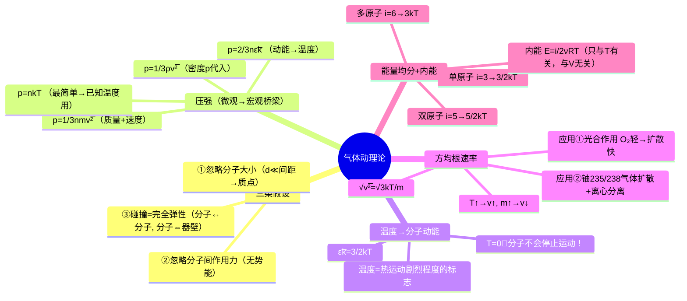

# 大物：气体动理论基础

> 📌 重构说明：本笔记是热学两大支柱之一——气体动理论（基于分子模型和统计方法推导宏观量）。已按「理想气体三假设→四个压强公式（不同形式的选择策略）→分子平均平动动能与温度公式→方均根速率（$T\uparrow \to v\uparrow$、$m\uparrow \to v\downarrow$）→两个工程应用（光合作用氧气扩散更快、铀235/238的分离）→能量均分定理与内能公式」的逻辑链重排。完整保留了四个压强公式的推导结论和选择策略，方均根速率的光合作用与铀分离两个应用实例，以及绝对零度的"分子不会停止运动"的经典考点。

## 🧠 思维导图

---

## 一、理想气体分子的三条假设

| 假设 | 内容 | 推论 |
|------|------|------|
| ① 忽略分子大小 | 分子直径 << 分子间距 → 分子 ==质点== | 可用质点模型 |
| ② 忽略分子间作用力 | 无分子间引力 / 重力 / 势能 | 分子只有动能 |
| ③ 碰撞 = 完全弹性 | 分子⇔分子、分子⇔器壁都属完全弹性碰撞 | 动量守恒、动能守恒 |

> [!warning] 考点
> ⚠️ 理想气体三假设——忽略分子大小（质点模型）、忽略分子间作用力（无势能）、完全弹性碰撞——是理想气体模型的基础。必须能逐条默写。

**出发点**：分子永远在永不停息地做无规则热运动。**方法论**：统计方法（研究对象是大量分子，单个分子行为不可预测）。

---

## 二、四个压强公式及其选用策略

> 四个公式本质相同，只是将 $m\overline{v^2}$ 用不同物理量替代而来——看题目给什么条件，就选对应公式。

| 公式 | 用到的变量 | 何时选用 |
|------|-----------|----------|
| $p = \dfrac{1}{3}nm\overline{v^2}$ | $n$（数密度）、$m$（分子质量） | 已知分子质量与速率 |
| $p = \dfrac{2}{3}n\overline{\varepsilon_k}$ | $n$、$\overline{\varepsilon_k}$ | 桥梁：动能 ↔ 压强 |
| $p = \dfrac{1}{3}\rho\overline{v^2}$ | $\rho$（气体密度） | 已知密度，不需分子数量 |
| ==$p = nkT$== | $n$、$T$ | 已知温度 & 数密度 → 最简单的选择 |

> 📖 推导来源（简记）：压强来自大量分子对器壁的连续碰撞——分子碰撞→动量变化→力→单位面积冲量=压强。统计平均后得到上述四个等价形式。

**例题**：已知压强和温度，求单位体积内的分子数 → 用 $n = p/(kT)$ 一步得出。

---

## 三、温度公式——分子动能与温度的桥梁

### 3.1 分子平均平动动能

$$\overline{\varepsilon_k} = \frac{1}{2}m\overline{v^2} = \frac{3}{2}kT$$

**物理意义**：==温度是分子热运动剧烈程度的标志==——温度高 → 分子动能大 → 分子运动剧烈。两者是一一对应关系。

### 3.2 绝对零度的经典陷阱

> [!warning] 考点
> ⚠️ $T=0\mathrm{K}$ 时分子是否停止运动？**答案：不会！**

==三大原因==：①以上所有公式都只适用于理想气体，$T=0\mathrm{K}$ 时物质不再是理想气体；②分子永不停息做无规则热运动；③组成分子的原子还有振动（零点能）。

---

## 四、方均根速率

$$\boxed{\sqrt{\overline{v^2}} = \sqrt{\frac{3kT}{m}}}$$

| 影响因素 | 关系 | 方向 |
|----------|------|------|
| 温度 $T \uparrow$ | $v$ $\uparrow$ | 更热 → 动得更快 |
| 分子质量 $m \uparrow$ | $v$ $\downarrow$ | 更重 → 更慢 |

### 4.1 应用①：光合作用

氧气 $\mathrm{O_2}$ 分子质量 < 二氧化碳 $\mathrm{CO_2}$ 分子质量 → $\sqrt{\overline{v^2}}$ 氧气 > 二氧化碳 → 氧气扩散快 → 有利于光合作用。

### 4.2 应用②：铀同位素分离

铀-235 和铀-238 分子质量有微小差异 → 方均根速率有微小差异 → **气体扩散法**利用扩散速度差分离。**离心分离法**（更先进）也是基于相同原理。

---

## 五、能量均分定理与理想气体内能

详见 。此处快速回顾：

| 分子类型 | 自由度 $i$ | 分子平均能量 | 每摩尔内能 |
|----------|-----------|-------------|-----------|
| 单原子 | 3 | $\frac{3}{2}kT$ | $\frac{3}{2}RT$ |
| 双原子（刚性） | 5 | $\frac{5}{2}kT$ | $\frac{5}{2}RT$ |
| 多原子（刚性） | 6 | $3kT$ | $3RT$ |

内能公式：$E = \dfrac{i}{2}\nu RT$。==理想气体的内能只与温度有关，与体积无关——是状态的单值函数。== $\Delta E$ 只取决于始末状态的温差，与过程无关。

---

---

## 🔗 知识网络

### 前置依赖
- 热力学系统 — 系统、状态参量的基本概念
- [[温度]] — 温度的微观本质

### 后续应用
- 分子自由度与速率分布 — 分子的速率分布
- 热力学第一定律与四大过程 — 温度与内能的关系
- [[能量均分定理]] — 分子平均动能的分配

### 对比辨析
- 理想气体状态方程 vs 实际气体状态方程：理想气体忽略分子体积和分子间作用力，高温低压下近似成立
- 方均根速率 vs 平均速率 vs 最概然速率：三者数值关系为 $\sqrt{\overline{v^2}} > \overline{v} > v_p$，分别适用于不同统计场景

## 📚 核心词条索引

| 知识点链接 | 类别 | 关键词 |
|------|------|--------|
| [[气体动理论]] | 核心理论 | 基于分子模型和统计方法推导宏观量的理论 |
| [[理想气体三假设]] | 基础假设 | 忽略分子大小、忽略分子间作用力、完全弹性碰撞 |
| [[压强]] | 核心概念 | 大量分子对器壁碰撞产生的单位面积冲量 |
| [[分子平均平动动能]] | 核心概念 | $\overline{\varepsilon_k}=\frac{3}{2}kT$，温度的微观表现 |
| [[温度]] | 核心概念 | 分子热运动剧烈程度的标志 |
| [[方均根速率]] | 特征速率 | $\sqrt{\overline{v^2}}=\sqrt{3kT/m}$，分子速率的统计平均 |
| [[能量均分定理]] | 核心定律 | 平衡态下每个自由度分配$\frac{1}{2}kT$的平均动能 |
| [[内能公式]] | 核心公式 | 理想气体内能$E=\frac{i}{2}\nu RT$ |
| [[绝对零度]] | 特殊温度 | $T=0K$，分子不会停止运动 |
| [[自由度]] | 核心概念 | 确定物体空间位置所需的独立坐标数 |
