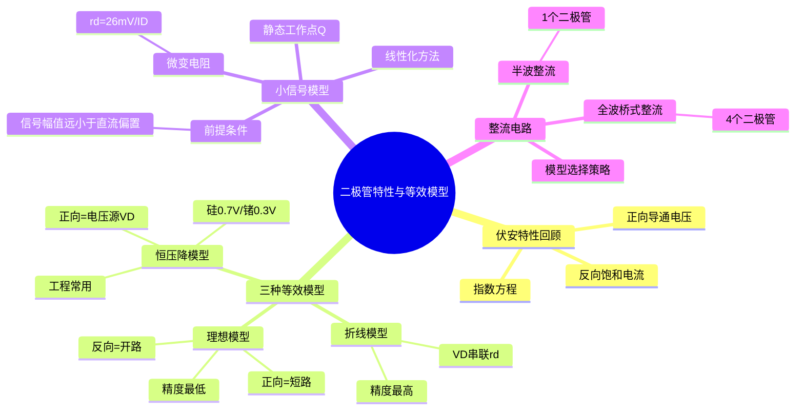

# 电子技术：二极管特性与等效模型

> 📌 重构说明：本笔记将二极管的工程特性、三种等效模型、小信号分析方法和整流应用整合为完整知识模块，按实际特性→抽象模型→工程应用三层逻辑链组织。

## 🧠 思维导图

---

## 一、二极管伏安特性回顾

由 半导体基础与PN结 可知，PN结的伏安特性方程为：

$$I = I_S\left(e^{\frac{V}{V_T}} - 1\right),\quad V_T \approx 26\text{mV}(300\text{K})$$

**核心问题**：这个指数方程在电路分析中难以直接使用——我们需要的不是精确到小数点的理论值，而是能快速判断电路工作状态的工程方法。

这就是等效模型的价值：==用线性元件（电阻、电压源）近似替代非线性器件==。

---

## 二、三种等效模型的递进式构建

### 2.1 二极管理想模型——最粗暴的近似

**前提假设**：忽略导通压降，忽略反向漏电流。

**等效规则**：
| 偏置状态 | 等效元件 | 电路表现 |
|:---:|------|------|
| 正向偏置（$V > 0$） | ==短路（导线）== | $V_D = 0$，$I_D$ 由外电路决定 |
| 反向偏置（$V < 0$） | ==开路== | $I_D = 0$，$V_D$ 由外电路决定 |

**伏安特性近似**：一条折线——$V<0$ 时 $I=0$（横轴），$V>0$ 时 $V=0$（纵轴）。

**适用场景**：粗估电路工作状态、判断二极管导通/截止；误差最大，不用于精确计算。

> 📖 直观理解：二极管理想模型就是把二极管当作一个"单向开关"——正偏时开关闭合，反偏时开关断开。

### 2.2 恒压降模型——工程最常用

**改进点**：承认正向导通时存在一个基本固定的管压降。

**等效规则**：
| 偏置状态 | 等效元件 | 典型值 |
|:---:|------|------|
| $V < V_D$ | ==开路== | — |
| $V \geq V_D$ | ==电压源 $V_D$== | 硅：0.7V / 锗：0.3V |

**恒压降模型的典型应用——静态工作点计算**：

给定电路 $V_{DD}=10\text{V}$，$R=10\text{k}\Omega$，硅二极管：

$$I_D = \frac{V_{DD} - V_D}{R} = \frac{10 - 0.7}{10\text{k}} = 0.93\text{mA}$$

这与二极管理想模型得出的 $1\text{mA}$ 相比引入了约 7% 的修正。

> [!warning] 考点
> ⚠️ 恒压降模型中，"导通"是有门槛的——外加电压必须超过 $V_D$ 二极管才开始导通。在整流电路中，这意味着输入正弦波在 $|v_i| < V_D$ 的区间内输出为零，造成"交越失真"。

### 2.3 二极管折线模型——最精确的线性近似

**在恒压降模型基础上再改进**：导通后电流增大时，管压降并非完全恒定，还存在一个微小的增量电阻 $r_d$。

**等效电路**：正向导通时 = ==电压源 $V_D$ 串联电阻 $r_d$==。

**等效电阻的物理来源**：

$$r_d = \frac{dV}{dI}\bigg|_Q = \frac{V_T}{I_D}$$

其中 $I_D$ 为静态工作点电流。这是伏安特性曲线在Q点处==切线斜率的倒数==。

**折线模型的计算**（需迭代）：

$$I_D = \frac{V_{DD} - V_D}{R + r_d},\quad r_d = \frac{V_T}{I_D}$$

第一次迭代取恒压降结果 $I_D^{(0)} = 0.93\text{mA}$ → $r_d = \frac{26\text{mV}}{0.93\text{mA}} \approx 28\Omega$ → $I_D^{(1)} = \frac{10-0.7}{10\text{k}+28} \approx 0.927\text{mA}$

可见折线模型与恒压降模型在本题中只差约 0.3%——所以一般工程计算用恒压降模型就足够。

### 2.4 三种模型对比与选择策略

| 模型 | 等效电路（正向） | 精度 | 计算复杂度 | 典型应用 |
|------|:---:|:---:|:---:|------|
| 理想 | 短路 | ★☆☆☆☆ | 极低 | 粗判导通/截止、教学演示 |
| 恒压降 | 电压源 $V_D$ | ★★★☆☆ | 低 | ==工程计算首选==、整流输出估算 |
| 折线 | $V_D$ + $r_d$ | ★★★★★ | 中 | 精确分析、小信号前处理 |

> [!warning] 考点
> ⚠️ 期末考试中如未明确指定模型，默认使用恒压降模型（硅管 0.7V）。如题目说"用折线模型"或给定了 $r_d$ 值，则必须使用折线模型。

---

## 三、二极管小信号模型——交流分析的核心工具

### 3.1 核心思想与前提

**问题场景**：电路中同时存在直流电源 $V_{DD}$（确定工作点）和交流小信号 $v_s$（传输信息）。二极管是非线性的，如何分析交流信号？

**解决思路**：==在静态工作点附近将非线性特性线性化==——用Q点的切线替代曲线，将二极管等效为一个电阻 $r_d$。

**前提条件**：==$V_{sm} \ll V_{DD}$==，即交流信号幅值远小于直流偏置电压。这保证二极管始终维持正向导通，不会进入截止区。

### 3.2 操作三步法

**第一步**：确定静态工作点Q——用直流分析（恒压降模型）求出 $I_D$ 和 $V_D$。

**第二步**：计算微变电阻：
$$r_d = \frac{V_T}{I_D} = \frac{26\text{mV}}{I_D}$$

注意：$r_d$ 不是二极管的静态电阻（$V_D/I_D$），而是==动态电阻==（$\Delta V/\Delta I$），它只对交流小信号等效。

**第三步**：在交流通路中用电阻 $r_d$ 替代二极管，进行线性电路分析。

### 3.3 关键区分

| 维度 | 直流分析 | 交流分析（小信号） |
|------|------|------|
| 电源 | 只考虑 $V_{DD}$（交流源置零） | 只考虑 $v_s$（直流源置零=短路） |
| 二极管等效 | 恒压降模型（电压源 $V_D$） | ==电阻 $r_d$== |
| 分析方法 | 代数方程 | 线性电路分析 |
| 最终结果 | 直流偏置 + 交流分量（叠加） |

> [!warning] 考点
> ⚠️ 小信号模型只在信号幅值远小于直流偏置时才成立。如果信号大到使二极管进入截止区，小信号模型失效，需改用大信号分析法（图解法）。

---

## 四、整流电路——二极管最重要的功率应用

### 4.1 半波整流

**电路**：一个二极管串联在交流电源与负载之间。

**理想模型下的分析**：
- 正半周（$v_i > 0$）：二极管正偏导通 → $v_o = v_i$
- 负半周（$v_i < 0$）：二极管反偏截止 → $v_o = 0$

**恒压降模型下的修正**：
- 正半周 $v_i > V_D$ 时：$v_o = v_i - V_D$
- $0 < v_i < V_D$ 时：二极管未导通 → $v_o = 0$
- 负半周：$v_o = 0$

==输出只有半个周期，效率 40.6%（理想模型理论极限）。==

### 4.2 全波桥式整流

**电路**：4 个二极管接成电桥，负载跨接在桥的输出端。

**工作过程**：
| 半周 | 导通管 | 截止管 | 电流路径 |
|:---:|------|------|------|
| 正半周 | D1、D3 | D2、D4 | 电源+ → D1 → 负载 → D3 → 电源- |
| 负半周 | D2、D4 | D1、D3 | 电源- → D2 → 负载 → D4 → 电源+ |

关键：无论输入极性如何，流过负载的电流==方向始终相同==。

**恒压降模型输出**：$v_o = |v_i| - 2V_D$（电流始终流过两个导通管，每个压降 $V_D$）。

### 4.3 模型选择对整流分析的影响

| 分析目的 | 推荐模型 | 原因 |
|------|:---:|------|
| 判断导通/截止 | 理想模型 | 最快 |
| 估算输出电压 | 恒压降模型 | 结果有参考价值 |
| 估算纹波/效率 | 恒压降模型 | 仿真验证前的最佳选择 |
| 精确仿真 | 折线模型 | SPICE等工具实际使用 |

---

---

## � 知识网络

### 前置依赖
- 半导体基础与PN结 — PN结的单向导电性

### 后续应用
- 半导体三极管原理 — 二极管是构成三极管的基础
- 直流电路分析基础 — 含二极管的直流电路分析
- 三极管放大电路——静态分析 — 二极管钳位与保护

### 对比辨析
- 理想模型 vs 恒压降模型 vs 折线模型：精度越高、计算越复杂——工程中按需求选择合适精度
- 稳压管 vs 普通二极管：稳压管工作于反向击穿区，普通二极管工作于正向导通区

## 📚 核心词条索引

| 词条         |  类别  | 关键词                   |
| ---------- | :--: | --------------------- |
| [[理想模型]]   | 等效模型 | 正向短路、反向开路             |
| [[恒压降模型]]  | 等效模型 | 硅0.7V、锗0.3V、工程首选      |
| [[折线模型]]   | 等效模型 | $V_D$+$r_d$、精度最高      |
| [[小信号模型]]  | 交流分析 | 线性化、切线近似              |
| [[静态工作点]]  | 核心概念 | Q点、直流偏置               |
| [[微变电阻]]   | 核心参数 | $r_d=26\text{mV}/I_D$ |
| [[半波整流]]   | 功率应用 | 单管、半周期输出              |
| [[全波桥式整流]] | 功率应用 | 四管、全周期输出              |
| [[整流电路]]   | 功率应用 | AC→DC转换               |
