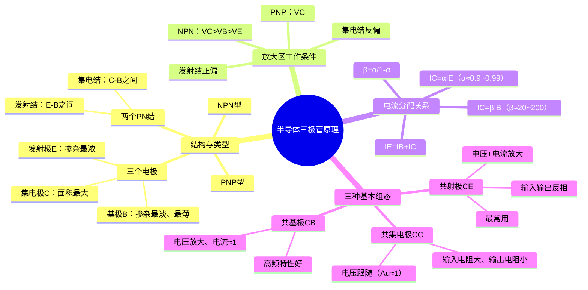

# 电子技术：半导体三极管原理

> 📌 重构说明：本笔记整合了BJT的物理结构、放大工作条件、电流分配关系和三种基本组态，从器件结构→工作原理→电路组态的递进逻辑组织。

## 🧠 思维导图

---

## 一、三极管的物理结构

### 1.1 三个区域的设计逻辑

PN结的制造工艺允许在同一块半导体上制作两个背靠背的PN结——这就是三极管。

三极管 = 发射结 + 集电结，中间共享一个极薄的基区。三个区域的设计参数由其功能决定：

| 区域 | 掺杂浓度 | 尺寸 | 功能 |
|------|:---:|:---:|------|
| ==发射区== (Emitter) | ==最高== | 中等 | 发射大量载流子 |
| ==基区== (Base) | ==最低== | ==极薄== | 让大部分载流子穿过去而不复合 |
| ==集电区== (Collector) | 较低 | ==最大== | 收集穿过的载流子 |

**基区必须极薄的原因**：如果基区厚，从发射区注入的载流子会在基区中大量复合，无法到达集电区——==电流放大效应就消失了==。

### 1.2 NPN型三极管与PNP型三极管

| 特性 | NPN型三极管 | PNP型三极管 |
|------|------|------|
| 结构 | N-P-N 三层 | P-N-P 三层 |
| 符号箭头 | ==发射极箭头向外== | ==发射极箭头向内== |
| 电流方向 | $I_C, I_B$ 流入, $I_E$ 流出 | $I_E$ 流入, $I_C, I_B$ 流出 |
| 多数载流子 | 电子 | 空穴 |
| 速度 | ==较快== | 较慢 |
| 主流地位 | ==绝大多数电路用 NPN== | 互补电路中与 NPN 配对 |

> [!warning] 考点
> ⚠️ 判断三极管类型的最快方法：看符号中发射极箭头方向——箭头向外 = NPN，箭头向内 = PNP。

---

## 二、放大区的工作条件与判断

### 2.1 两个必要偏置条件

三极管要工作在==放大区==（线性放大），必须同时满足：

1. ==**发射结正偏**==：$V_{BE} > 0$（NPN）或 $V_{EB} > 0$（PNP），保证发射区向基区注入载流子
2. ==**集电结反偏**==：$V_{BC} < 0$（NPN）或 $V_{CB} < 0$（PNP），保证集电区能收集载流子

### 2.2 电位关系判断法

给定三个电极的电位，可以直接判断类型和工作状态：

| 电位关系 | 类型 | 工作状态判定 |
|------|:---:|------|
| $V_C > V_B > V_E$ | ==NPN== | 发射结正偏($V_B>V_E$)、集电结反偏($V_C>V_B$) → 放大区 |
| $V_C < V_B < V_E$ | ==PNP== | 同上逻辑 |
| $V_B > V_C > V_E$（NPN） | — | 集电结也正偏 → ==饱和区== |
| $V_B < V_E < V_C$（NPN） | — | 发射结也反偏 → ==截止区== |

### 2.3 三极管的三区工作状态

| 状态 | 发射结 | 集电结 | 特征 |
|------|:---:|:---:|------|
| ==放大区== | 正偏 | 反偏 | $I_C = \beta I_B$，线性放大 |
| ==饱和区== | 正偏 | 正偏 | $V_{CE} \approx 0.2\text{V}$（NPN），开关闭合 |
| ==截止区== | 反偏 | 反偏 | $I_C \approx 0$，开关断开 |

> [!warning] 考点
> ⚠️ 题目常常给你三个电位值，要求你判断三极管类型和状态。解题步骤：①排序列断类型（NPN或PNP）→②检查发射结偏置→③检查集电结偏置→④综合判定。

---

## 三、电流分配关系与放大系数

### 3.1 KCL 约束

三极管作为电路中的一个节点，基尔霍夫电流定律（直流电路分析基础）必然成立：

$$\boxed{I_E = I_B + I_C}$$

注意：这是==数值关系==，不管电流方向如何，等式恒成立。

### 3.2 两个放大系数的定义与推导

**共基极直流电流放大系数 $\alpha$**：

$$\alpha = \frac{I_C}{I_E}$$

物理意义：发射极注入的载流子中，==有多少比例到达了集电极==。设计优良的三极管 $\alpha \approx 0.95 \sim 0.995$。

**共射极直流电流放大系数 $\beta$**：

$$\beta = \frac{I_C}{I_B}$$

物理意义：基极电流对集电极电流的==控制放大倍数==。$\beta$ 通常在 20~200 之间。

**$\alpha$ 与 $\beta$ 的数学关系**（核心推导）：

$$\beta = \frac{I_C}{I_B} = \frac{I_C}{I_E - I_C} = \frac{I_C/I_E}{1 - I_C/I_E} = \frac{\alpha}{1 - \alpha}$$

$$\alpha = \frac{\beta}{1 + \beta}$$

**数值对应**：
| $\alpha$ | $\beta$ | 直观感受 |
|:---:|:---:|------|
| 0.9 | 9 | $\alpha$ 每提升一点，$\beta$ 跳跃巨大 |
| 0.95 | 19 | — |
| 0.98 | 49 | — |
| 0.99 | 99 | 发射极 100 个载流子，99 个到达集电极 |
| 0.995 | 199 | 基区仅复合约 0.5% |

> 📖 深刻理解：$\beta$ 大的根源在于基区极薄+掺杂极低，使得发射区注入的载流子在基区几乎不复合。$\alpha=0.99$ 意味着 1% 的载流子在基区复合形成 $I_B$，而这 1% 的 $I_B$ 控制了 99% 的 $I_C$——所以 $\beta=99$。"小电流控制大电流"的本质，是载流子在基区极少复合的设计结果。

### 3.3 核心关系总结

| 关系 | 公式 | 使用场景 |
|------|------|------|
| 节点电流 | $I_E = I_B + I_C$ | 任何时候 |
| $\beta$ 控制 | $I_C = \beta I_B$ | 放大区计算 |
| $\alpha$ 传输 | $I_C = \alpha I_E$ | 分析载流子传输效率 |
| $I_E$ 与 $I_B$ | $I_E = (1+\beta)I_B$ | 计算发射极电流 |

---

## 四、三种基本组态的直观对比

### 4.1 组态定义

"共X极"的意思是：==X极是输入回路和输出回路的公共端==。判断方法：看交流通路中哪个电极直接接地或接公共参考点。

| 组态 | 输入端 | 输出端 | 公共端 |
|------|------|------|:---:|
| ==共射极 (CE)== | B-E | C-E | E |
| ==共集电极 (CC)== | B-C | E-C | C |
| ==共基极 (CB)== | E-B | C-B | B |

### 4.2 性能对比一览

| 性能 | 共射 (CE) | 共集 (CC) | 共基 (CB) |
|------|:---:|:---:|:---:|
| ==电压增益== | 大（几十~几百） | ≈1（略小于1） | 大（几十~几百） |
| ==电流增益== | 大（= $\beta$） | 大（= $1+\beta$） | ≈1（略小于1） |
| ==功率增益== | ==最大== | 中等 | 中等 |
| ==输入电阻== | 中等 | ==最大== | ==最小== |
| ==输出电阻== | 中等 | ==最小== | ==最大== |
| 输入输出相位 | ==反相（180°）== | ==同相== | ==同相== |
| 高频特性 | 一般 | 一般 | ==最好== |
| 最常用场景 | ==中间放大级== | 输入缓冲/输出驱动 | 高频/宽带放大 |

> 📖 直观类比：共集电极电路就像一个"功率门"——电压信号过门后大小基本不变，但驱动能力大大增强（电流放大 $1+\beta$ 倍）。这解释了它为什么叫"射极跟随器"（Emitter Follower）：发射极电压紧紧跟随基极电压变化。

> [!warning] 考点
> ⚠️ 三种组态的性能对比是考试的高频考点。记忆口诀：共射——"全放大、反相"；共集——"电压跟、电阻好"（输入大、输出小）；共基——"高频王、输入小"。

---

---

## 🔗 知识网络

### 前置依赖
- 半导体基础与PN结 — PN结的特性（放大区的偏置条件基于PN结）
- 二极管特性与等效模型 — PN结的伏安特性

### 后续应用
- 三极管放大电路——静态分析 — 三极管的静态工作点设置
- 三极管放大电路——动态分析与多级放大 — 三极管的动态参数计算
- [[模拟集成电路基础]] — 三极管是模拟集成电路的基本元件

### 对比辨析
- NPN vs PNP：NPN 电流方向为集电极→发射极，PNP 为发射极→集电极；偏置电压极性相反
- 共射 vs 共基 vs 共集：三种基本组态的增益、输入/输出阻抗不同

## 📚 核心词条索引

| 词条 | 类别 | 关键词 |
|------|:---:|------|
| [[三极管]] | 核心器件 | BJT、双极型晶体管 |
| [[NPN型]] | 器件类型 | 电子导电、箭头向外 |
| [[PNP型]] | 器件类型 | 空穴导电、箭头向内 |
| [[发射结]] | 内部结构 | B-E PN结、正偏 |
| [[集电结]] | 内部结构 | B-C PN结、反偏 |
| [[电流放大系数]] | 核心参数 | $\alpha$/$\beta$、$\beta=\alpha/(1-\alpha)$ |
| [[共射极放大电路]] | 电路组态 | CE、电压+电流放大、反相 |
| [[共集电极放大电路]] | 电路组态 | CC、射极跟随器、$A_u \approx 1$ |
| [[共基极放大电路]] | 电路组态 | CB、高频特性好、电流增益≈1 |
| [[放大区]] | 工作状态 | 发射结正偏、集电结反偏 |
| [[饱和区]] | 工作状态 | 两结均正偏、$V_{CE}\approx0.2V$ |
| [[截止区]] | 工作状态 | 两结均反偏、$I_C\approx0$ |
