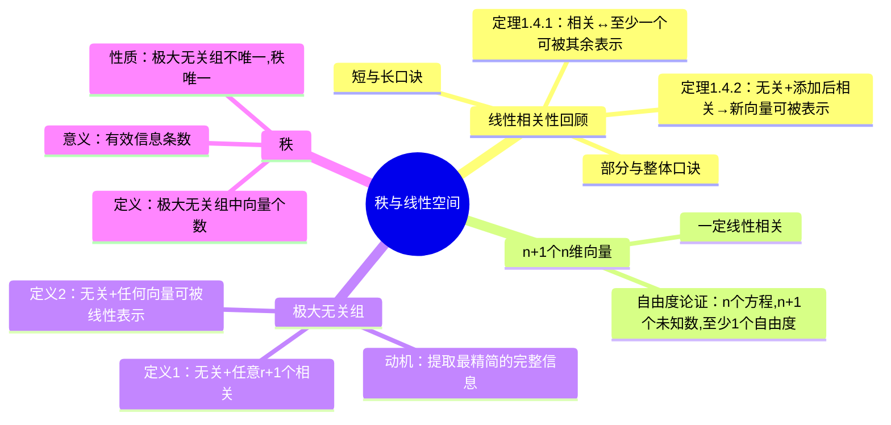

# 向量组的秩与线性空间

> 📌 重构说明：本笔记彻底打破原始录音的时间线，按「定义→直观理解→数学表达→推导证明→例题实战→易错陷阱」的知识树逻辑深度重构。

---

## 🧠 思维导图

---

## 一、线性相关与无关定义核心定理回顾

### 1.1 定理1.4.2 表示与唯一性 —— 线性相关的等价刻画

> 📖 **课本定理1.4.2 表示与唯一性**：向量组 $\alpha_1,\alpha_2,\cdots,\alpha_n$ 线性相关与无关定义的充要条件是：其中至少存在一个向量可被其余向量线性表示。

#### 直观理解（信息论角度理解相关性视角）

老师在课堂上反复强调的核心隐喻：**每个向量 = 一条信息**。

- **线性相关与无关定义** = 信息有重复
  - "有重复的信息"意味着至少有一个向量所携带的信息已被其他向量覆盖
  - 翻译成数学语言：**至少存在一个向量**可以被其余向量线性表示

- **线性相关与无关定义** = 每条信息都独一无二、不可替代
  - 翻译成数学语言：**任意一个向量都不能**被其余向量线性表示

> 📌 ⚠️ 易错警示：线性相关与无关定义是"**至少存在一个**"可以被表示，**不是**"任意一个"！到底是哪一个？定义不告诉你，需要你自己去判断。

#### 逆否命题（线性相关与无关定义的等价刻画）

- 向量组线性相关与无关定义 $\Longleftrightarrow$ **任何一个向量都不能被其余向量线性表示**

---

### 1.2 定理1.4.2 表示与唯一性 —— 向无关组中添加向量

> 📖 **课本定理1.4.2 表示与唯一性**：设 $\alpha_1,\cdots,\alpha_n$ 线性相关与无关定义，而 $\alpha_1,\cdots,\alpha_n,\beta$ 线性相关与无关定义，则 $\beta$ 必可被 $\alpha_1,\cdots,\alpha_n$ 唯一地线性表示。

#### 直观理解

用老师的信息论角度理解相关性语言翻译：

- $\alpha_1,\cdots,\alpha_n$ 无关 → 这 n 个信息，条条有效，互不重复
- 加入 $\beta$ 后变相关 → 出现了重复信息
- **谁的信息是重复的？** 只能是新加进来的 $\beta$！
- 结论：$\beta$ 所携带的信息完全被原来的 $\alpha$ 组覆盖了

#### 两个重要结论

**结论1**：$\beta$ 一定可被 $\alpha_1,\cdots,\alpha_n$ 线性表示。

**结论2（唯一性）**：这个表示是**唯一**的。

$$ \beta = k_1\alpha_1 + k_2\alpha_2 + \cdots + k_n\alpha_n $$

其中 $k_1,k_2,\cdots,k_n$ **唯一确定**。

> 📌 ⚠️ 考点：表示系数唯一的**充要条件**是 $\alpha$ 组线性相关与无关定义。若 $\alpha$ 组相关，则表示系数**不唯一**。

#### 历史真题链接

> 老师原话："上一节课我们有一个空题，这个题也是曾经出现在某一个考试题中的。"
>
> 题型特征：已知 $\alpha$ 组无关，加入 $\beta$ 后相关 → 问 $\beta$ 与 $\alpha$ 的关系 → 答：$\beta$ 可由 $\alpha$ 唯一线性表示。

---

### 1.3 小结论速查表

| 情况 | 结论 |
|------|------|
| 单个零向量 | **线性相关与无关定义** |
| 单个非零向量 | **线性相关与无关定义** |
| 向量组含零向量 | **一定线性相关与无关定义**（令零向量前系数=1，其余=0） |
| 两个非零向量 | 成比例→相关；不成比例→无关 |

---

### 1.4 部分与整体的关系（口诀1）

| 口诀 | 含义 |
|------|------|
| **部分相关则整体相关** | 子集有重复信息 → 全集一定有重复 |
| **整体无关则部分无关** | 全集无重复 → 任意子集也无重复 |

#### 直观理解

越添加向量进来，越容易产生重复信息（相关）。
所以：
- 连**部分**都已经有重复了（线性相关与无关定义），再加更多向量进来，**整体**肯定还是线性相关与无关定义
- 如果**整体**都没有重复信息（线性相关与无关定义），那取它的**子集**更不可能有重复

> 📌 ⚠️ 反向不成立："部分无关"推不出"整体无关"；"整体相关"也推不出"部分相关"！

---

### 1.5 短长关系证明（口诀2）

| 口诀 | 含义 |
|------|------|
| **短无关则长无关** | 低维分量无关 → 添加分量后仍无关 |
| **长相关则短相关** | 高维分量相关 → 截短后仍然相关 |

#### 严格证明（课本13页）

判断 $\alpha_1,\cdots,\alpha_n$ 是否线性相关与无关定义，等价于判断齐次线性方程组解空间：

$$k_1\alpha_1 + k_2\alpha_2 + \cdots + k_n\alpha_n = 0$$

是否**只有零解**。

- **短向量** → 方程个数少（维度低）
- **长向量** → 方程个数多（维度高，在原基础上加了分量）

**核心逻辑**：

"增加方程 = 增加约束 → 解集会变小（不会变大）→ 原本只有零解，缩小后还是零解"

- 短无关（只有零解）→ 变长，加约束，解集只可能更小 → **仍然只有零解** = 长无关
- 长相关（有非零解）→ 截短，减约束，解集只可能更大 → **仍然有非零解** = 短相关

> 🟢 拓展：这个论证本质上用的是**齐次线性方程组解空间的性质**，在第四章会详细展开。现在记住口诀即可。

---

### 1.6 关键定理：n+1 个 n 维向量一定线性相关与无关定义

#### 结论

**任何 n+1 个 n 维向量必定线性相关与无关定义**。

推广：向量个数超过维数 → **一定线性相关与无关定义**，不需要判断！

#### 证明（自由度视角）

老师用了一个非常形象的论证：

考虑线性组合等式：
$$k_1\alpha_1 + k_2\alpha_2 + \cdots + k_{n+1}\alpha_{n+1} = 0$$

- **未知数个数**：$n+1$ 个（$k_1$ 到 $k_{n+1}$）
- **方程个数**：$n$ 个（因每个向量有 n 个分量）

论证步骤：

1. 假设没有任何方程限制 → $n+1$ 个未知数全部自由 → **自由度 = n+1**
2. 每添加一个**有效**方程 → 自由度最多减少 1
3. 现有 n 个方程 → 自由度最多减少 n
4. 剩余自由度：$(n+1) - n = \mathbf{1}$
5. **至少还有 1 个自由度** → 一定有非零解 → 线性相关与无关定义

> 📌 ⚠️ 为什么说"最多减少 1"？因为有些方程可能是**无效的**（与已有方程线性相关与无关定义），不会实际减少自由度。但无论有效与否，最终剩余自由度都 ≥ 1。

#### 推论

n+2 个 n 维向量？**一定也线性相关与无关定义**。越多越容易相关。

---

## 二、极大无关组

### 2.1 问题动机（信息提取）

> 老师课堂原话：
> "宿舍里有 5 条信息——4 个同学各自的体重 + 所有人的总体重。这 5 条信息里有重复的。你能不能只把最精简的、能覆盖全部信息的几条提炼出来给我？"

这本质上就是要解决两个问题：
1. 找出向量组中**不含重复信息**的子集
2. 这个子集必须能**代表（覆盖）**整个向量组的全部信息

### 2.2 定义一（课本标准定义）

设 $T = \{\alpha_1, \alpha_2, \cdots, \alpha_s\}$ 是一个向量组。若存在子集 $\{\alpha_{i_1}, \cdots, \alpha_{i_r}\}$ 满足：

1. **无关性**：$\alpha_{i_1}, \cdots, \alpha_{i_r}$ 线性相关与无关定义
2. **极大性**：任意 $r+1$ 个向量（如果有）都线性相关与无关定义

则称 $\{\alpha_{i_1}, \cdots, \alpha_{i_r}\}$ 为 $T$ 的一个**极大无关组**。

#### 词义拆解

| 关键词 | 数学含义 |
|--------|----------|
| **极大** | 不能再多了——再多加一个就变得线性相关与无关定义了 |
| **无关** | 组内没有重复信息（线性相关与无关定义） |
| **组** | 它本身是一个向量组（子集） |

### 2.3 定义二（等价定义，更直观）

**条件1**（同）：组内线性相关与无关定义。

**条件2**（替换）：对 $T$ 中**任意一个向量** $\alpha$，$\alpha$ 均可被该极大无关组**线性表示**。

#### 等价性理解

- 条件 2 的含义："这个子集的信息已覆盖了整个向量组的所有信息"
- 这正是老师说的"既精简又全面"

> 两种定义可互换使用，用哪个方便取决于具体问题。

---

### 2.4 核心例子（宿舍体重，当堂演示）

#### 问题设定

向量组 T 包含 5 条信息：
- $\alpha_1$ = 甲同学体重
- $\alpha_2$ = 乙同学体重
- $\alpha_3$ = 丙同学体重
- $\alpha_4$ = 丁同学体重
- $\alpha_5$ = 四人总体重 = $\alpha_1 + \alpha_2 + \alpha_3 + \alpha_4$

#### 问题1：秩是多少？

$\alpha_5$ 显然只是前 4 个的重复信息 → **有效信息只有 4 条** → 秩 = 4

#### 问题2：极大无关组是否唯一？

**不唯一！**

两种可能的极大无关组：

**方案A**：$\{\alpha_1, \alpha_2, \alpha_3, \alpha_4\}$（四个单独体重）
**方案B**：$\{\alpha_1, \alpha_2, \alpha_3, \alpha_5\}$（三个体重 + 总体重）

方案B为什么也对？因为知道三个人体重和总体重，第四人体重就能算出来——同样覆盖了全部信息！

> 📌 ⚠️ 考点：**极大无关组不唯一，但极大无关组所含向量个数（即秩）是唯一确定的。**

---

## 三、秩

### 3.1 定义

向量组 $T$ 的**秩**（Rank），记作 $r(T)$ 或 $\text{rank}(T)$，等于其极大无关组所含向量的个数。

$$ r(T) = |\text{极大无关组}| $$

### 3.2 信息论角度理解相关性意义

> 老师原话："秩就是这个向量组中**有效信息的条数**。"

| 衡量维度 | 含义 |
|----------|------|
| 向量总个数 | 可能包含重复信息（冗余） |
| **秩** | 真正的有效信息条数（不可再精简） |

例如：有 100 个向量，但秩只有 10 → 真正有效的信息只有 10 条，其余都是多余的。

### 3.3 核心性质

| 性质 | 说明 |
|------|------|
| 极大无关组不唯一 | 可以有不同的"精简组合" |
| **秩唯一** | 不管选哪个极大无关组，所含向量个数都一样 |
| 秩 ≤ 向量个数 | 有效信息不超过总信息 |
| 秩 ≤ 向量维数 | 不可能超过空间维数 |
| 秩 = 向量个数 ⇔ 向量组线性相关与无关定义 | 每条信息都有用 |

---

### 3.4 如何找极大无关组（已知秩时）

> 老师强调的简便方法：如果已知秩 = r，那么在这个向量组中**随便挑 r 个无关的向量**出来，就一定构成了一个极大无关组。

**原因**：秩就是极大无关组的大小。你挑了 r 个无关的，而任何 r+1 个必然相关（否则秩就大于 r 了）→ 满足极大性。

---

## 四、向量组的线性表示与秩

### 4.1 定义回顾

$\beta_1, \beta_2, \cdots, \beta_t$ 可被 $\alpha_1, \cdots, \alpha_s$ **线性表示**：

每一个 $\beta_i$ 都可以写成 $\alpha_1, \cdots, \alpha_s$ 的线性组合。

### 4.2 信息论意义（关键）

如果 $\beta$ 组可以被 $\alpha$ 组线性表示：

→ $\beta$ 组的信息**全部包含在** $\alpha$ 组的信息中

→ $\alpha$ 组的信息量 ≥ $\beta$ 组的信息量

→ 所以：**$r(\beta\text{组}) \leq r(\alpha\text{组})$**

---

## 五、秩的取值范围

### 对于一般向量组（m 个 n 维向量）

$$ 0 \leq r \leq \min(m, n) $$

| 极端情况 | 含义 |
|----------|------|
| r = 0 | 全为零向量 |
| r = m | 向量组线性无关（每条都有用） |
| r = n | 向量组"充满"了整个 n 维空间 |
| r = m = n | 构成 n 维空间的一组基 |

---

---

## 🔗 知识网络

### 前置依赖
- 线性相关与无关判定 — 向量线性相关/无关的判定
- 线性空间与基底维数 — 基底和维数的概念

### 后续应用
- 初等变换与标准型 — 用初等变换求秩
- 矩阵秩的定义与计算 — 矩阵秩与向量组秩的统一
- 相似矩阵与对角化 — 矩阵对角化与特征向量

### 对比辨析
- 极大无关组 vs 基底：极大无关组是向量组的"基"（张成同样的空间），基底是整个线性空间的"基"——后者范围更大
- 向量组的秩 vs 矩阵的秩：向量组的秩 = 列向量组的秩 = 行向量组的秩 = 矩阵的秩

## 📚 核心词条索引

| 词条 | 类型 | 位置 |
|------|------|------|
|  | 前置概念 | §1.1 |
|  | 前置概念 | §1.1 |
| §1.1 | 核心定理 | §1.1 |
| §1.2 | 核心定理 | §1.2 |
| §1.4 | 记忆口诀 | §1.4 |
| §1.5 | 记忆口诀 | §1.5 |
| §1.6 | 必考推论 | §1.6 |
| §2 | 核心概念 | §2 |
| §3 | 核心概念 | §3 |
| §3.2 | 直观理解 | §3.2 |
| §4 | 核心概念 | §4 |
|  | 后续概念 | §6 |
|  | 后续概念 | §6 |
