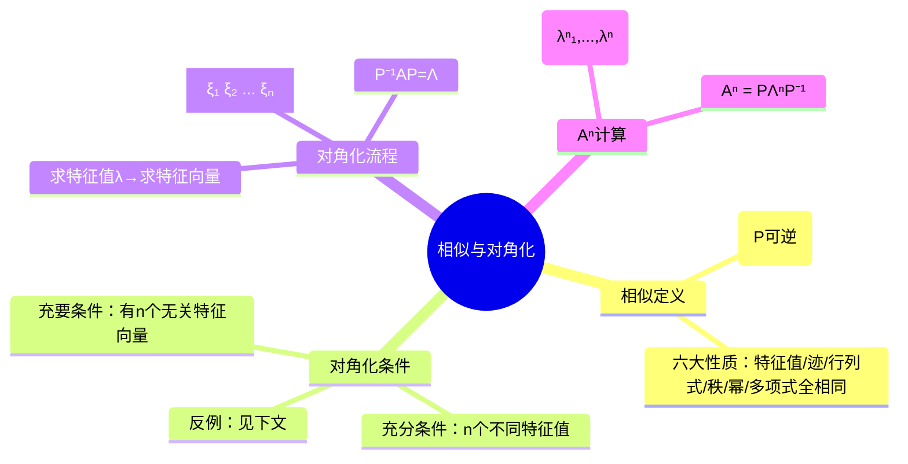

# 矩阵相似与对角化

> 📌 重构说明：本笔记涵盖相似定义与性质、可对角化充要条件、特征向量构造对角化矩阵 $P$ 的完整流程——并为本章最重要笔记。

---

## 🧠 思维导图

---

## 第一部分：相似矩阵——性质回顾

### 一、相似矩阵定义

$$ A \sim B \Longleftrightarrow \exists P \text{ 可逆}: P^{-1}AP = B $$

### 二、相似矩阵的六大性质

||
||
||
||
||
||
||
||

### 三、参数题的解题套路

已知 $A\sim B$ 含未知参数 $x,y$：

1. **第一步**：用**迹相等** $\text{tr}(A) = \text{tr}(B)$ → 得 $x+y$
2. **第二步**：用**行列式相等** $|A| = |B|$ → 得 $xy$
3. **若 1、2 解不出**：用**特征多项式系数对应相等**（三阶是三次多项式，三个系数）

---

## 第二部分：可对角化的充要条件

### 四、定义

$$ A \text{ 可对角化} \Longleftrightarrow \exists P \text{ 可逆}: P^{-1}AP = \Lambda = \begin{pmatrix} \lambda_1 & & \\ & \ddots & \\ & & \lambda_n \end{pmatrix} $$

> 📌 ⚠️ 注意：可对角化 = 相似于对角阵，不是等价于！等价标准型用初等变换就能做到，对角化要求相似。

### 五、充要条件

$$ A \text{ 可对角化} \Longleftrightarrow A \text{ 有 } n \text{ 个线性相关与无关定义的特征值与特征向量} $$

### 六、充分条件

$$ A \text{ 有 } n \text{ 个不同的特征值与特征向量} \Longrightarrow A \text{ 可对角化} $$

**充分非必要！特征值有重复也可能可对角化。**

### 七、反例：不可对角化

$B = \begin{pmatrix} 1 & 1 \\ 0 & 1 \end{pmatrix}$

- 特征值：$\lambda = 1$（二重）
- 齐次方程组 $(I-B)x = 0$：$\begin{pmatrix} 0 & -1 \\ 0 & 0 \end{pmatrix} \to x_2 = 0 \to$ 解空间维数 = 1
- 只能找到 **1 个**无关的特征向量 → 不可对角化

---

## 第三部分：对角化定理的证明

### 八、核心证明（分块矩阵法）

设 $P^{-1}AP = \Lambda$，将 $P$ 按列分块：$P = (\xi_1, \xi_2, \ldots, \xi_n)$

$$ AP = P\Lambda $$

左边：$AP = (A\xi_1, A\xi_2, \ldots, A\xi_n)$

右边：$P\Lambda = (\lambda_1\xi_1, \lambda_2\xi_2, \ldots, \lambda_n\xi_n)$

逐列对比：$A\xi_i = \lambda_i\xi_i$，即**每一列 $\xi_i$ 就是 $\lambda_i$ 的特征向量**！

> 📌 这既证明了定理，也给出了**构造 $P$ 的方法**：求每个特征值的特征向量，顺次排在一起。

### 九、$\Lambda$ 与 $P$ 的对应关系

$$ \Lambda \text{ 中第 } i \text{ 个对角元 } = \lambda_i \Longleftrightarrow \text{第 } i \text{ 列是 } \lambda_i \text{ 的特征向量} $$

**顺序自由**——只要 $\Lambda$ 和 $P$ 的列一一对应即可。

---

## 第四部分：对角化的完整流程

### 十、标准三步

||
||
||
||
||

### 十一、完整例题

$A = \begin{pmatrix} -2 & 1 \\ 1 & -2 \end{pmatrix}$

**Step 1**：求特征值

$|\lambda I - A| = \begin{vmatrix} \lambda+2 & -1 \\ -1 & \lambda+2 \end{vmatrix} = (\lambda+2)^2 - 1 = 0$

$\lambda_1 = -1, \lambda_2 = -3$

**Step 2**：求特征向量

$\lambda_1 = -1$：$(-I - A)x = \begin{pmatrix} 1 & -1 \\ -1 & 1 \end{pmatrix} x = 0 \to x_1 = x_2 \to \xi_1 = \begin{pmatrix} 1 \\ 1 \end{pmatrix}$

$\lambda_2 = -3$：$(-3I - A)x = \begin{pmatrix} -1 & -1 \\ -1 & -1 \end{pmatrix} x = 0 \to x_1 = -x_2 \to \xi_2 = \begin{pmatrix} 1 \\ -1 \end{pmatrix}$

**Step 3**：构造

$$ P = \begin{pmatrix} 1 & 1 \\ 1 & -1 \end{pmatrix}, \quad \Lambda = \begin{pmatrix} -1 & 0 \\ 0 & -3 \end{pmatrix} $$

验证：$\xi_1 \perp \xi_2$ → 线性无关 → 可对角化。

---

## 第五部分：用对角化求 $A^n$

### 十二、原理

$$ P^{-1}AP = \Lambda \Rightarrow A = P\Lambda P^{-1} $$

$$ A^n = (P\Lambda P^{-1})^n = P\Lambda^n P^{-1} $$

$$ \Lambda^n = \begin{pmatrix} \lambda_1^n & & \\ & \ddots & \\ & & \lambda_n^n \end{pmatrix} $$

### 十三、核心优势

比直接乘 $A$ $n$ 次不知高效多少倍！只需：
1. 构造 $P$ 和 $\Lambda$
2. 对角线元 n 次方
3. 做两次矩阵乘法 $P\Lambda^n P^{-1}$

---

## 第六部分：相似判断选择题精析

### 十四、易错辨析

||
||
||
||
||

---

---

## 🔗 知识网络

### 前置依赖
- 特征值与特征向量基础 — 特征值和特征向量的求解
- 特征值性质与判定 — 特征值的代数重数和几何重数

### 后续应用
- 矩阵相似与二次型 — 实对称矩阵的正交对角化
- [[矩阵函数]] — 利用对角化计算矩阵的幂
- [[Jordan标准型]] — 不能对角化时的标准型

### 对比辨析
- 可对角化 vs 不可对角化：n 阶矩阵有 n 个线性无关的特征向量时可对角化——代数重数=几何重数对每个特征值成立
- 相似对角化 vs 正交对角化：相似对角化只需可逆矩阵 P，正交对角化要求 P 为正交矩阵——实对称矩阵保证可以正交对角化

## 📚 核心词条索引

||
||
||
||
||
||
||
||
||
