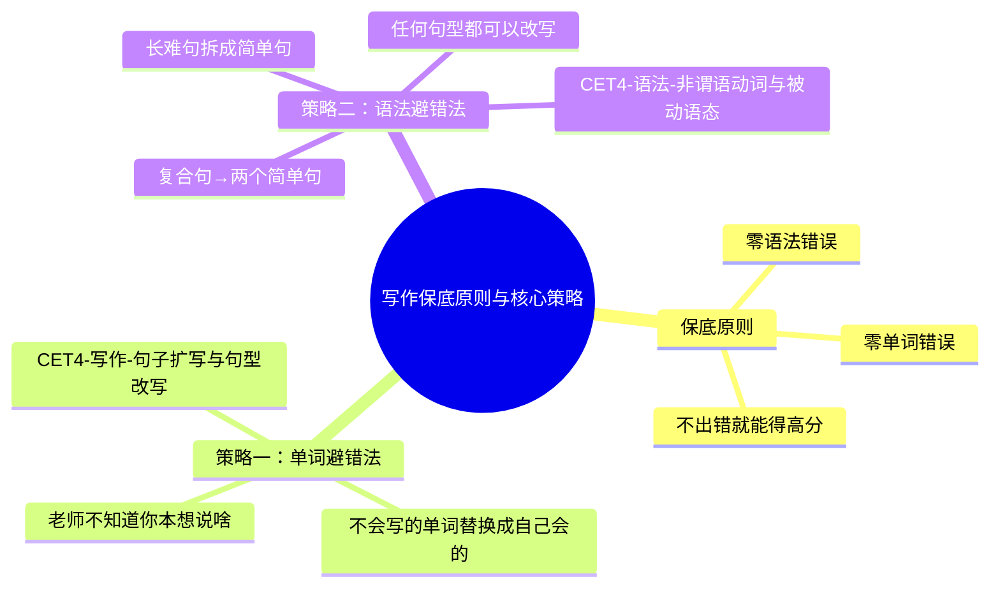

# CET-4：写作保底原则与核心策略

> 📌 重构说明：本笔记将「单词替换避错」和「语法避错」两大保底策略汇总，含所有课堂提及的词汇替换实例与句型避错方法，服务于写作和翻译。

## 🧠 思维导图

---

## 一、保底原则定义

> **保底原则**：一篇作文写完可能不惊天动地，但没有任何单词错误、没有任何语法错误。

==四级写作本质上是"不出错就能得高分"的考试。==

> [!info] 四六级作文的评分本质是按档给分。只要达到"切题 + 通顺 + 基本无错"就能进入13-15分档。阅卷老师不会逐字对照中文原文检查你是否漏译——只看英文本身是否漂亮。

---

## 二、单词避错：全部课堂实例

### 2.1 核心铁律

> ==所有写不来的单词，都写成自己会的词汇。反正老师不知道你想表达什么意思。==

### 2.2 实例对照表

| 你本想说  | 不会写            | 替换为                                                           | 原因                                          |
| ----- | -------------- | ------------------------------------------------------------- | ------------------------------------------- |
| 彪悍的老师 | 彪悍(的)          | beautiful / ambitious / aggressive / honest / friendly / good | 老师不知道这个老师彪不彪悍                               |
| 小花狗   | flower dog ❌   | spotted dog / white dog / black dog / pink dog / a dog        | colorful dog = 五颜六色的狗 ❌；flower dog = 花做的狗 ❌ |
| 遛狗    | slip the dog ❌ | 爷爷抱着狗 / 爷爷给狗讲故事 / 爷爷给狗洗澡 / 爷爷跟狗玩                              | slip the dog = 骑着狗滑行 ❌                      |

> [!warning] ⚠️ flower dog 是所有中国学生都会犯的翻译错误。小花狗 = spotted dog（斑点狗），不可以直译为 flower dog。

### 2.3 翻译中单词不会写的处理

| 策略 | 示例 |
|---|---|
| 近义词替换 | "描述"不会写 → said / thought / considered |
| 解释法 | "京杭大运河"不会写 → a river from Beijing to Hangzhou |
| 省略法 | 三个并列词中一个不会 → 装作没看见，只写两个（阅卷老师不会逐字对照） |

### 2.4 课堂核心词表（写作翻译必会词）

**高频写作词汇**：

| 英文 | 中文 | 用法场景 |
|---|---|---|
| essay | 论说文 | 审题识别：看到 essay 就是论说文 |
| proposal | 建议（书信） | 审题识别：看到 proposal 就是书信 |
| report | 报告 | 审题识别：看到 report 就是报告/新闻稿 |
| news report | 新闻稿 | 审题识别 |
| express delivery service | 快递服务 | 社会话题写作 |
| unprecedentedly rapid development | 史无前例的快速发展 | 引出话题高频短语 |
| limelight | 聚光灯/焦点 | 引出话题：bring into the limelight |
| profound impact | 深远影响 | 观点表达 |
| employment opportunities | 就业机会 | 社会影响类论证 |
| sustainable development | 可持续发展 | 环保类论证 |
| convenient | 方便的 | 万能形容词 |
| broaden one's horizons | 开阔眼界 | 万能短语 |
| as far as I'm concerned | 就我而言 | 个人观点表达 |
| from my perspective | 从我角度看 | 个人观点表达（替代 i think that） |

**高频翻译词汇**：

| 英文 | 中文 | 备注 |
|---|---|---|
| symbolize | 象征 | 翻译必会词，考频极高 |
| prosperous | 繁荣的 | 生意兴隆 → prosperous business |
| era / period | 时代 / 时期 | era不会写用period |
| stable society | 稳定的社会 | 社会治理有序 → stable society |
| pick (tea) | 采摘（茶叶） | 被动语态 |
| all year round / at any time in a year | 一年四季 | 可替换表达 |

---

## 三、语法避错：长难句 → 简单句

### 3.1 核心铁律

> ==所有写不来的长难句都可以用简单句来表达。==

### 3.2 复合句拆分为简单句实例

**主语从句 → 两个简单句**：

| 复合句 | 拆分为 |
|---|---|
| It is obvious that I love you. | I love you. It is obvious. |
| （主系表结构的主语从句） | 第一句：主谓宾 / 第二句：主系表 |

**定语从句 → 两个简单句**：

| 复合句 | 拆分为 |
|---|---|
| The boy who is standing in front of me is handsome. | A boy is standing in front of me. He is handsome. |
| （站在我前面的男生很帅） | 两个简单句即可 |

### 3.3 可替换句型总表（同一个意思不同写法）

以「我绝不嫁给你」为例，展示==同一个意思可以用不同句式表达==：

| 句型 | 例句 | 适用场景 |
|---|---|---|
| 简单句 | I will never marry you. | 基础保底 |
| 定语从句 | You are the man that I will never marry. | 给名词加修饰 |
| 倒装句 | Never will I marry you. | 否定词置于句首 |
| 倒装句（only+状语） | Only in two years will I marry you. | 只要有状语就能倒装 |
| 主语从句 | It is obvious that I will never marry you. | 前面加"显而易见/毋庸置疑" |
| 条件状语从句 | I will not marry you unless the sun rises in the west. | unless引导条件 |
| 虚拟语气 | If you were the last man in the world, I would become a nun. | 对现在情况的虚拟假设 |

> [!warning] ⚠️ 一篇文章中句子结构不能全部雷同。尽量变换句式：有的句子用定语从句，有的用倒装，有的用状语从句，做到"句型多变"。

---

## 四、保底原则的执行清单

> ==写作前默念三遍==

1. **单词**：所有写不来的单词，立即替换成自己会的 → **不会写不写** 🔗 
2. **语法**：所有写不来的长难句，立即拆成简单句 → **不会写就拆**
3. **检查**：写完花3分钟扫读 → 查名词单复数、主谓一致、不可数名词

---

## 🔗 知识网络

### 前置依赖
- 英语四级考试大纲 — CET-4的整体要求和评分标准
- [[CET4-写作翻译-课程总览与考纲解读]] — 写作部分的考纲解读

### 后续应用
- CET4-写作-三大论证方式 — 论证方法的展开（保底策略的具体应用）
- [[CET4-写作-议论文框架]] — 议论文的完整写作框架
- [[CET4-写作-句子扩写与句型改写]] — 句子层面的扩写技巧

### 对比辨析
- 保底策略 vs 高分策略：保底策略保证不跑题、格式正确、语法正确（求稳），高分策略追求词汇替换、复杂句式（求亮）
- 中文思维直译 vs 英文思维写作：中文思维容易写出"中式英语"，英文思维要求先确定主谓宾再添加修饰成分

## 📚 核心词条索引
