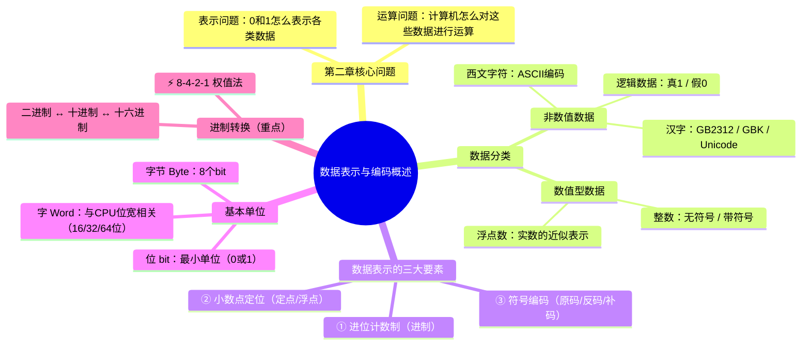

# 数据表示与编码概述

> 📌 重构说明：本笔记是数据表示的「总纲」，回答两个基本问题：**数据在计算机里怎么表示？怎么运算？** 后续  和  分别展开两大类数据的具体编码方法。

---

## 🧠 思维导图



---

## 第一部分：两个核心问题

### 一、计算机里只有 0 和 1

> 老师开篇原话：「计算机里面只有 0 和 1，不管是指令还是数据，都是 0 和 1。」

这引发了数据表示的两个根本问题：

||||问题|内容|对应章节|
||||------|------|----------|
||||**表示问题**|0/1 如何表示整数、小数、字符、汉字、图像？|本笔记 +  + |
||||**运算问题**|计算机怎么对用 0/1 表示的数据进行加减乘除？|08_数据运算与位操作|

### 二、数据表示的抽象层次

> 📌 补充说明：本节内容来自老师后来的补充讲解，展示了数据从「人感知的信息」到「计算机硬件中的 0/1」的完整转换链路。

数据的表示是分层进行的，每一层对应计算机系统的一个抽象级别：

```
问题（现实世界的信息）
  → 算法（复杂数据结构的描述）
    → 程序语言（基本数据类型：int, float, char, 数组, 结构体）
      → 指令系统 ISA（机器能识别的基本形式）
        → 硬件层（寄存器、ALU、存储器）
```

||||层次|内容|例子|
||||------|------|------|
||||用户层|文字、图表、声音、视频|一段录音、一张图片|
||||输入层|输入设备采集 → 数字化|话筒采样声音 → 离散数字信号|
||||高级语言层|复杂数据结构|字符串、链表、二叉树|
||||ISA 层|基本数据类型|int, float, char, bool|
||||硬件层|CPU 中的 0/1 序列|寄存器中的二进制位|

> 老师强调：「连续的声音为什么有的高有的低？都是通过不同的二进制数值去体现的。这个过程就是把物理世界的连续信号变成离散的数字。」

### 三、为什么计算机用 0/1？

> [!warning] 考点
> ⚠️ 简答题高频考点——列举计算机采用二进制编码的原因。

||||物理状态|二进制表示|
||||----------|-----------|
||||低电压|0|
||||高电压|1|
||||无磁性|0|
||||有磁性|1|

> [!info] 补充定义
> **数字化（Digitization）**：将连续的模拟信号（声音、图像）转换为离散的二进制数字信号的过程。计算机内部所有数据——数字、文字、图片、音频——本质上都是一长串 0/1。

---

## 第二部分：数据的分类体系

### 四、两类数据

```
          计算机中的数据
               │
      ┌────────┴────────┐
  数值型数据          非数值数据
      │              ┌───┼───┐
  ┌───┴───┐      逻辑数据 西文字符 汉字/多字节字符
 整数   浮点数
  │
 ┌┴──┐
无符号 带符号
```

||||数据类型|子类|编码方式|在哪个文件详解|
||||----------|------|----------|---------------|
||||**数值型**|无符号整数|二进制本身||
||||**数值型**|带符号整数|原码 / 反码 / 补码||
||||**数值型**|浮点数|IEEE 754 标准|浮点数编码|
||||**非数值**|逻辑数据|1 位表示（1=真, 0=假）||
||||**非数值**|西文字符|ASCII 码||
||||**非数值**|汉字|GB2312 / GBK / Unicode||

---

## 第三部分：数据表示的三大要素

### 四、三要素是什么？

> 老师强调：「在计算机里面，数据表示有三个要素要解决。」

||||要素|解决的问题|选项|
||||------|-----------|------|
||||**① 进位计数制**|用几进制？|二进制 / 十进制 / 十六进制|
||||**② 定点/浮点**|小数点放在哪？|定点数 / 浮点数|
||||**③ 符号编码**|正负号怎么表示？|（原码/反码/补码）|

### 五、要素①：进位计数制

计算机内部永远用**二进制**。但为了人类阅读方便，常用以下进制：

||||进制|基数|数码|用途|
||||------|------|------|------|
||||**二进制 (B)**|2|0, 1|计算机内部|
||||**八进制 (O)**|8|0~7|早期 Unix 权限表示|
||||**十进制 (D)**|10|0~9|人类阅读|
||||**十六进制 (H)**|16|0~9, A~F|内存地址、机器码表示|

> [!warning] 考点
> ⚠️ 十六进制与二进制的快速转换是计算题必考——4 位二进制 = 1 位十六进制。

### 六、要素②：小数点定位——定点与浮点

|||||定点数|浮点数|
||||------|--------|--------|
||||**小数点位置**|固定（隐含在某个位置）|动态变化（由指数决定）|
||||**表示范围**|小|极大（从极小到极大都能表示）|
||||**精度**|均匀|非均匀（靠近0精度高）|
||||**硬件实现**|简单|复杂|
||||**用途**|嵌入式、DSP|科学计算、图形|

> 老师原话：「定点数和浮点数的表示问题，主要解决**小数点**问题。」

### 七、要素③：符号编码——正负号如何表示？

> 老师原话：「在定点数的编码问题里面，我们要解决一个正负号的问题——在计算机里面怎么表示正负？」

这就引出了三种编码方案：
- ** 原码**：符号位 + 数值位（最直观）
- ** 反码**：正数不变，负数按位取反
- ** 补码**：反码加 1（计算机实际使用的方案）

详见  的详细展开。

---

## 第四部分：数据的基本单位

### 八、位、字节、字的递进

||||单位|缩写|大小|类比|
||||------|------|------|------|
||||**位（bit）**|b|1 个二进制位（0 或 1）|一个开关|
||||**字节（Byte）**|B|8 个 bit|一个英文字母|
||||**字（Word）**|—|与 CPU 位宽相关|自然处理单位|
||||**双字**|—|32 位（4 字节）|一个 int|

### 九、字长与 CPU 位宽

||||CPU 位宽|字长|最大寻址空间|
||||----------|------|-------------|
||||8 位（8080）|1 字节|64 KB|
||||16 位（8086）|2 字节|1 MB|
||||32 位（80386）|4 字节|4 GB|
||||64 位（现代）|8 字节|16 EB|

### 十、表示范围速查表

||||数据类型|字节数|无符号范围|带符号范围|
||||----------|--------|-----------|-----------|
||||`char` / `byte`|1|0 ~ 255|-128 ~ 127|
||||`short` / `word`|2|0 ~ 65,535|-32,768 ~ 32,767|
||||`int` / `dword`|4|0 ~ 4,294,967,295|-2,147,483,648 ~ 2,147,483,647|
||||`long long`|8|0 ~ $2^{64}-1$|$-2^{63}$ ~ $2^{63}-1$|

> [!warning] 考点
> ⚠️ 带符号整数的范围不是对称的（如 int：-2147483648 到 +2147483647），因为补码中 0 只有一个表示，而负数比正数多一个。这是频繁考查的细节。

---

## 第五部分：进制转换——必考计算基础

### 十一、二进制 ↔ 十进制

#### 二进制 → 十进制：按权展开

**例题**：$1101.101_2$ 转十进制

$$
\begin{aligned}
1101.101_2 &= 1 \times 2^3 + 1 \times 2^2 + 0 \times 2^1 + 1 \times 2^0 + 1 \times 2^{-1} + 0 \times 2^{-2} + 1 \times 2^{-3} \\
&= 8 + 4 + 0 + 1 + 0.5 + 0 + 0.125 \\
&= 13.625_{10}
\end{aligned}
$$

#### 十进制 → 二进制：除 2 取余（整数部分）+ 乘 2 取整（小数部分）

**例题**：$57.625_{10}$ 转二进制

**整数部分** $57$：
```
57 ÷ 2 = 28 … 余 1  ↑
28 ÷ 2 = 14 … 余 0  ↑
14 ÷ 2 = 7  … 余 0  ↑
7 ÷ 2 = 3  … 余 1  ↑
3 ÷ 2 = 1  … 余 1  ↑
1 ÷ 2 = 0  … 余 1  ↑
```
从下往上读：$57_{10} = 111001_2$

**小数部分** $0.625$：
```
0.625 × 2 = 1.25 → 取 1 ↓
0.25  × 2 = 0.5  → 取 0 ↓
0.5   × 2 = 1.0  → 取 1 ↓ 已到 0 停止
```
从上往下读：$0.625_{10} = 0.101_2$

**结果**：$57.625_{10} = 111001.101_2$

### 十二、二进制 ↔ 十六进制：8-4-2-1 权值法

每 4 位二进制 = 1 位十六进制，这是最重要的转换技巧。

||||二进制（4位）|十六进制|十进制|
||||-------------|---------|--------|
||||0000|0|0|
||||0001|1|1|
||||0010|2|2|
||||0011|3|3|
||||0100|4|4|
||||0101|5|5|
||||0110|6|6|
||||0111|7|7|
||||1000|8|8|
||||1001|9|9|
||||1010|A|10|
||||1011|B|11|
||||1100|C|12|
||||1101|D|13|
||||1110|E|14|
||||1111|F|15|

**例题**：$1011\_1100\_0101_2$ 转十六进制

```
1011  →  B
1100  →  C
0101  →  5
```

结果：$1011\_1100\_0101_2 = \text{BC5}_{16}$

> [!warning] 考点
> ⚠️ 考试中最常见的就是二进制 ↔ 十六进制的快速转换——把二进制从右往左按 4 位一组分组（不足左边补 0），每组对应一个十六进制数。这是必须熟练掌握的基本功。

### 十三、十六进制 ↔ 十进制（辅助方法）

虽然直接按权展开也可以，但更高效的做法是**先转二进制再转十进制**。

**例题**：$\text{3F}_{16}$ 转十进制

```
方法 1（直接按权）：3×16¹ + 15×16⁰ = 48 + 15 = 63
方法 2（先转二进制再转十进制）：3F → 0011 1111 → 2⁵+2⁴+2³+2²+2¹+2⁰ = 32+16+8+4+2+1 = 63
```

### 十四、常见特殊值的快速识别

> [!warning] 考点
> ⚠️ 考试中经常让你一眼看出某个十六进制或二进制数的值，记住以下常用值能大幅提速。

||||二进制|十六进制|十进制|记忆技巧|
||||--------|---------|--------|----------|
||||1111 1111|FF|255|2⁸ - 1|
||||1111 1111 1111 1111|FFFF|65535|2¹⁶ - 1|
||||1111 1111 1111 1111 1111 1111 1111 1111|FFFF FFFF|4,294,967,295|2³² - 1|
||||1000 0000|80|128|2⁷|
||||0111 1111|7F|127|2⁷ - 1|

### 十五、综合转换练习

**例题 1**：十进制 2024 → 二进制 → 十六进制

```
2024 ÷ 2 = 1012 余 0  ↓
1012 ÷ 2 = 506  余 0  ↓
506  ÷ 2 = 253  余 0  ↓
253  ÷ 2 = 126  余 1  ↓
126  ÷ 2 = 63   余 0  ↓
63   ÷ 2 = 31   余 1  ↓
31   ÷ 2 = 15   余 1  ↓
15   ÷ 2 = 7    余 1  ↓
7    ÷ 2 = 3    余 1  ↓
3    ÷ 2 = 1    余 1  ↓
1    ÷ 2 = 0    余 1  ↓
```
从下往上读：$2024_{10} = 111\_1110\_1000_2$
分组：$0111\_1110\_1000_2 = \text{7E8}_{16}$

**例题 2**（带小数的综合题）：$45.375_{10}$ → 二进制 → 十六进制

整数部分（45）：
```
45 ÷ 2 = 22 余 1 ↓
22 ÷ 2 = 11 余 0 ↓
11 ÷ 2 = 5  余 1 ↓
5  ÷ 2 = 2  余 1 ↓
2  ÷ 2 = 1  余 0 ↓
1  ÷ 2 = 0  余 1 ↓
```
整数部分：$45_{10} = 101101_2$

小数部分（0.375）：
```
0.375 × 2 = 0.75 → 取 0 ↓
0.75  × 2 = 1.5  → 取 1 ↓
0.5   × 2 = 1.0  → 取 1 ↓ 停止
```
小数部分：$0.375_{10} = 0.011_2$

结果：$45.375_{10} = 101101.011_2$

转十六进制（整数从小数点向左按 4 位分组，不足补 0；小数从小数点向右按 4 位分组，不足补 0）：

```
0010 1101 . 0110
  2    D  .   6
```

> 📌 易错陷阱：⚠️ 小数部分的十六进制转换是从小数点**向右**分组（不是向左！），不足的位在**右侧**补 0。

结果：$45.375_{10} = \text{2D.6}_{16}$

---

---

## 🔗 知识网络

### 前置依赖
- 计算机硬件组成与总线 — 数据在计算机中的传输
- [[数制与编码]] — 二进制的基本运算

### 后续应用
- 数值数据的编码_原码反码补码 — 数值型数据的具体编码方式
- 非数值数据与字符编码 — 非数值型数据的编码
- 数据存储与单位 — 存储单位与数据组织

### 对比辨析
- 数值数据 vs 非数值数据：数值数据参与算术运算（整数/浮点数），非数值数据用于信息表示（字符/图像/音频）
- 二进制 vs 十进制 vs 十六进制：二进制便于硬件实现（电平高低），十进制符合人类习惯，十六进制是二进制的紧凑表达（1位16进制=4位2进制）

## 📚 核心词条索引
