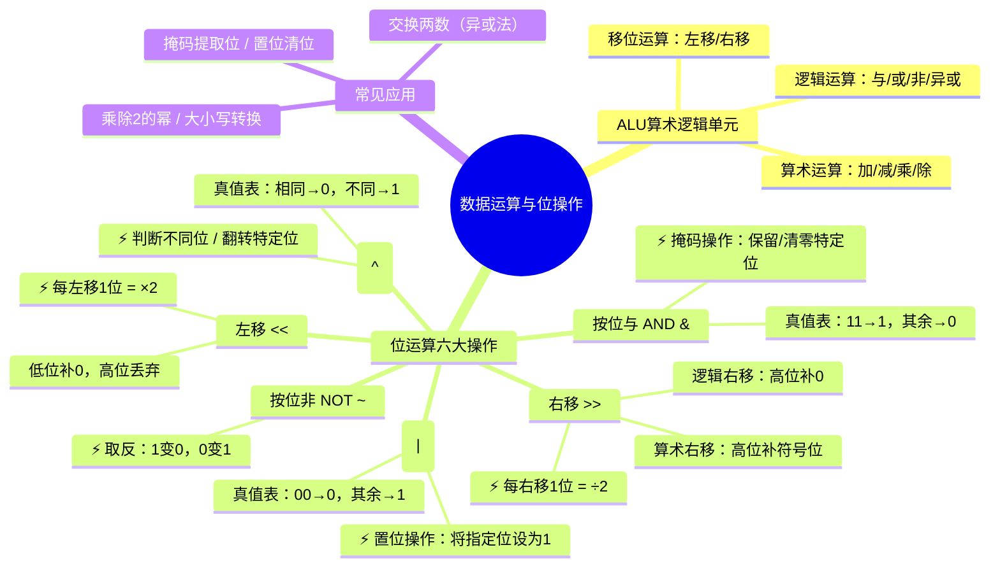

# 数据运算与位操作

> 📌 重构说明：本笔记从 ALU 的功能定位出发，系统展开位运算的六类操作（与/或/非/异或/左移/右移），每种操作配以完整二进制演算过程。前置依赖：、。

---

## 🧠 思维导图



---

## 第一部分：ALU——既能算数也能算逻辑

### 一、ALU 的双重使命

> [!info] 补充定义
> **ALU**是 CPU 的核心执行部件，负责完成两类运算：**算术运算**（加、减、乘、除）和 **逻辑运算**（与、或、非、异或、移位）。

老师课堂上的强调：
> 「ALU 不仅可以进行算术运算，还可以进行逻辑运算——按位进行。」

| | 运算类型 | 具体操作 | 数据视角 |
|------|------|----------|----------|
| | **算术运算** | ADD, SUB, MUL, DIV | 把二进制串当作**数值**来算 |
| | **逻辑运算** | AND, OR, NOT, XOR, SHIFT | 把二进制串当作**位串**来操作 |

---

## 第二部分：六大位运算逐一详解

### 二、按位与（AND, `&`）——掩码的利器

**真值表：**

| | A | B | A & B |
|---|---|---|------|
| | 0 | 0 | 0 |
| | 0 | 1 | 0 |
| | 1 | 0 | 0 |
| | 1 | 1 | 1 |

**核心规则**：只有两个都是 1，结果才是 1。**相当于「必须两个条件同时满足」。**

#### 2.1 实战示例

```
   1011 0011   (179)
 & 1101 0110   (214)
   ─────────
   1001 0010   (146)
```

#### 2.2 掩码（Mask）操作——按位与最重要的应用

> [!warning] 考点
> ⚠️ 使用按位与 + 掩码可以实现「保留/清零特定位」，是位操作中最常用的技巧。

**保留低 4 位：**
```
   1011 0110   原数
 & 0000 1111   掩码
   ─────────
   0000 0110   → 提取了低 4 位（0110）
```

**判断某位是否为 1：**
```c
if (x & (1 << n)) {
    // x 的第 n 位是 1
}
```

**清零特定位**（掩码中对应位为 0 即清零）：
```
   1011 0110   原数
 & 1111 0000   掩码
   ─────────
   1011 0000   → 低 4 位清零，高 4 位保留
```

### 三、按位或（OR, `|`）——置位的工具

**真值表：**

||||A|B|A \|B|
||||---|---|------|
||||0|0|0|
||||0|1|1|
||||1|0|1|
||||1|1|1|

**核心规则**：只要有一个是 1，结果就是 1。**相当于「任意条件满足即成立」。**

**实战示例：**
```
   0011 0000   (48)
 | 0000 1111   (15)
   ─────────
   0011 1111   (63)
```

**置位操作——将特定位设为 1：**

```c
x = x | (1 << n);  // 将 x 的第 n 位置为 1
```

```
   1011 0000   原数
 | 0000 1000   将第 3 位置 1
   ─────────
   1011 1000   → 第 3 位已变为 1
```

### 四、按位非（NOT, `~`）——全部翻转

**真值表：**

||||A|~A|
||||---|----|
||||0|1|
||||1|0|

**核心规则**：唯一的一元运算，0 变 1，1 变 0。**每一位都翻转**。

**实战示例：**
```
~ 1011 0011
  ─────────
  0100 1100
```

**应用**：结合 AND 可以清零某位，结合 OR 可以置位。

### 五、按位异或（XOR, `^`）——相同则 0，不同则 1

**真值表：**

||||A|B|A ^ B|直观理解|
||||---|---|------|----------|
||||0|0|0|相同 → 0|
||||0|1|1|不同 → 1|
||||1|0|1|不同 → 1|
||||1|1|0|相同 → 0|

**核心规则**：「判断不同的位」。两数哪些位不同，哪些位的结果就是 1。

#### 5.1 实战示例

```
   1011 0011
 ^ 1101 0110
   ─────────
   0110 0101   → 不同的位被标记为 1
```

#### 5.2 异或的三大经典应用

**应用一：翻转特定位**
```c
x = x ^ (1 << n);  // 翻转 x 的第 n 位（1变0, 0变1）
```

**应用二：不借助临时变量交换两个数**

```c
a = a ^ b;
b = a ^ b;  // b = (a^b) ^ b = a ^ (b^b) = a ^ 0 = a
a = a ^ b;  // a = (a^b) ^ a = b ^ (a^a) = b ^ 0 = b
// 此时 a 和 b 已成功交换
```

```
演示（a = 5 = 0101, b = 3 = 0011）：
a = a ^ b  →  a = 0101 ^ 0011 = 0110
b = a ^ b  →  b = 0110 ^ 0011 = 0101 = 5  (原 a)
a = a ^ b  →  a = 0110 ^ 0101 = 0011 = 3  (原 b)
```

> [!warning] 考点
> ⚠️ 异或交换理解即可——实际编程不推荐（若 a 和 b 指向同一地址会导致归零）。

**应用三：判断两数是否相等**
```c
if ((a ^ b) == 0) {
    // a 和 b 完全相等
}
```

### 六、移位运算——乘以 2 或除以 2 的最快方式

> [!warning] 考点
> ⚠️ 左移 1 位 = × 2，左移 2 位 = × 4，左移 n 位 = × 2ⁿ

#### 6.1 左移（`<<`）——低位补 0，高位丢弃

```
原数:      0011 0100  (52)
左移 1 位: 0110 1000  (104) = 52 × 2
左移 2 位: 1101 0000  (208) = 52 × 4
```

**计算规则**：$x \ll n = x \times 2^n$

#### 6.2 右移（`>>`）——两种方式

||||类型|高位补什么|适用场景|
||||------|-----------|----------|
||||**逻辑右移**|补 0|无符号数|
||||**算术右移**|补**符号位**的值|带符号数（保持符号不变）|

**逻辑右移示例（无符号数）：**
```
原数:        1100 1000  (200)
逻辑右移 1 位: 0110 0100  (100) = 200 ÷ 2
```

**算术右移示例（带符号数）：**
```
原数:        1100 1000  (-56, 补码)
算术右移 1 位: 1110 0100  (-28) ← 最高位补 1（符号位）
```

#### 6.3 移位与乘除的对照

||||操作|效果|等价于|
||||------|------|--------|
||||`x << 1`|$x \times 2$|乘 2|
||||`x << 2`|$x \times 4$|乘 4|
||||`x << n`|$x \times 2^n$|乘 $2^n$|
||||`x >> 1`|$x \div 2$（向下取整）|除 2|
||||`x >> n`|$x \div 2^n$|除 $2^n$|

---

## 第三部分：综合应用——位运算的实战案例

### 七、大小写字母转换（ASCII 位操作）

> 回顾 ：大写和小写 ASCII 码差 32 = 0x20 = 第 5 位

||||操作|后果|
||||------|------|
||||`ch \|0x20`|大写 → 小写（第 5 位置 1）|
||||`ch & 0xDF`|小写 → 大写（第 5 位清零）|
||||`ch ^ 0x20`|大小写**翻转**|

```
'A' = 01000001  (65)
           ↓ | 0x20 (第5位置1)
'a' = 01100001  (97)
```

### 八、提取字节中的指定位域

**从状态字中提取位 3~5 的值：**
```
状态字:    xxxx ABCx xxxx
步骤 1:    右移 3 位 → xxxx xxxA BC
步骤 2:    & 0x07  → 0000 000A BC  (提取了3位)
```
```c
int bits = (status >> 3) & 0x07;  // 提取位 3~5
```

### 九、判断整数是否为 2 的幂

```c
// 2的幂的二进制形式只有一个1（如 4=0100, 8=1000）
// n & (n-1) 会消除最低位的1
if (n > 0 && (n & (n - 1)) == 0) {
    // n 是 2 的幂
}
```

```
n = 8:    1000
n-1 = 7:  0111
         &────
          0000  → 是 2 的幂 ✓

n = 6:    0110
n-1 = 5:  0101
         &────
          0100  → 不是 2 的幂 ✗
```

---

## 🔗 知识网络

### 前置依赖
- 数值数据的编码_原码反码补码 — 补码的加减法基础
- 数据存储与单位 — 数据存储的组织方式

### 后续应用
- 指令格式与数据传送 — ALU执行算术/逻辑运算
- 程序的编译链接与符号解析 — 程序中的位运算

### 对比辨析
- 算术运算 vs 逻辑运算：算术运算产生进位（加减乘除），逻辑运算按位独立操作（与或非异或）
- 算术左移/右移 vs 逻辑左移/右移：算术左移和逻辑左移相同（低位补0），算术右移保持符号位（高位补符号位），逻辑右移高位补0

## 📚 核心词条索引

| 知识点链接 | 类别 | 关键词 |
|------|------|--------|
