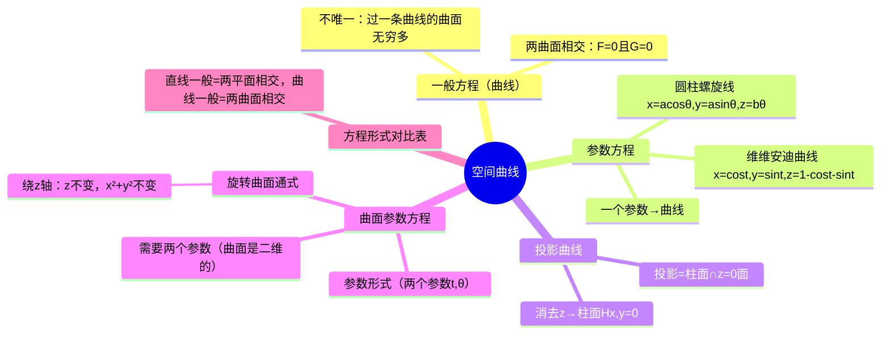

# 高数：空间曲线与参数方程

> 📌 重构说明：本笔记建立空间曲线的三种表示体系。已按「一般方程（曲线）（两曲面相交→不唯一性→球与圆柱相交的维维安迪曲线）→参数方程（圆柱螺旋线的物理推导→维维安迪曲线的参数化→直线 vs 曲线的关键区别：曲线没有统一方向向量）→投影曲线（消 $z$ 得柱面→与 $z=0$ 的交线=投影）→曲面参数方程（需两个参数→绕 $z$ 轴的旋转曲面通式→直线绕 $z$→圆锥面 / 半圆绕 $z$→球面）」的逻辑链重排。完整保留了维维安迪曲线、螺旋线及半圆旋转成球面的全部推导。

## 🧠 思维导图

---

## 一、一般方程：两张曲面的交线

$$\begin{cases} F(x,y,z) = 0 \\ G(x,y,z) = 0 \end{cases}$$

==注：曲线的一般方程（曲线）不唯一==——过一条曲线的曲面有无穷多张。

### 典型例子

| 交线 | $F$ | $G$ |
|------|-----|-----|
| 圆柱面 ∩ 平面 = 椭圆 | $x^2+y^2=1$ | $x+y+z=1$ |
| 球面 ∩ 圆柱面 = 维维安迪曲线 | $z=\sqrt{a^2-x^2-y^2}$ | $(x-\frac{a}{2})^2+y^2=\frac{a^2}{4}$ |

### 与直线一般方程的对比

| 对象 | 一般方程 | 有无统一方向向量？ |
|------|---------|:---:|
| 直线 | 两平面相交 | ==有（$\vec{s}$ 方向恒定）== |
| 曲线 | 两曲面相交 | ==无（切线方向处处变）== |

---

## 二、参数方程：曲线的参数化

$$\begin{cases} x = x(t) \\ y = y(t) \\ z = z(t) \end{cases}$$

### 圆柱螺旋线

动点沿圆柱 $x^2+y^2=a^2$ 螺旋上升：

$$\boxed{\begin{cases} x = a\cos\theta \\ y = a\sin\theta \\ z = b\theta \end{cases}}$$

==螺距 = $2\pi b$==（转一圈上升的高度）。两项运动叠加：旋转（$xOy$ 面投影为圆周）+平动（$z$ 匀速上升）。

### 维维安迪曲线参数化

曲线 $\begin{cases} x^2+y^2=1 \\ x+y+z=1 \end{cases}$

令 $x=\cos t, y=\sin t$ → $z=1-\cos t-\sin t$

---

## 三、空间曲线在坐标面上的投影

**核心操作**：消去一个变量。

消 $z$ 得 $H(x,y)=0$ → ==投影柱面==（母线 ⊥ $xOy$ 面）。

==投影曲线==：$\begin{cases} H(x,y)=0 \\ z=0 \end{cases}$

> [!warning] 考点
> ⚠️ 投影 = 消变量 + 该坐标面方程。消 $z$→投影到 $xOy$ 面就配 $z=0$。这是重积分确定积分区域的关键前奏。

---

## 四、曲面参数方程——需两个参数

$$\begin{cases} x = x(s,t) \\ y = y(s,t) \\ z = z(s,t) \end{cases}$$

==曲面是二维的，所以需要两个参数==（对比：曲线只需一个）。

### 旋转曲面的参数方程通式

母线 $\Gamma: (x=\varphi(t), y=\psi(t), z=\omega(t))$ 绕 $z$ 轴旋转 $\theta$：

$$\boxed{\begin{cases} x = \sqrt{\varphi^2+\psi^2}\,\cos\theta \\ y = \sqrt{\varphi^2+\psi^2}\,\sin\theta \\ z = \omega(t) \end{cases}}$$

### 两个实例

**直线绕 $z$ 轴**：$(x,y,z)=(t,0,2t) \xrightarrow{\text{旋转}} x^2+y^2 = t^2 = z^2/4$ → ==$4x^2+4y^2-z^2=0$（圆锥面）==

**半圆绕 $z$ 轴**：$(x,y,z)=(a\sin t, 0, a\cos t) \xrightarrow{\text{旋转}} x^2+y^2+z^2 = a^2$ → ==球面==

---

## 五、方程形式对比

| 对象 | 一般方程 | 参数方程 |
|------|---------|---------|
| 直线 | 两平面相交 | 1 个参数 |
| ==曲线== | 两曲面相交 | ==1 个参数== |
| ==曲面== | 一个三元方程 | ==2 个参数== |

---

---

## 🔗 知识网络

### 前置依赖
- 参数方程 — 参数化表示的基本概念
- 03_旋转曲面方程推导 — 空间曲面的方程

### 后续应用
- 05_空间曲线的切线与法平面 — 曲线的切向量和切线方程
- 01_二重积分的概念与性质 — 参数曲线围成的区域

### 对比辨析
- 空间曲线的参数式 vs 一般式：参数式 $x=x(t),y=y(t),z=z(t)$ 适合求切线，一般式 $\{F=0,G=0\}$ 适合求投影
- 投影曲线 vs 原曲线：投影曲线消去一个变量，是原曲线在坐标面上的"影子"

## 📚 核心词条索引

| 知识点链接 | 类别 | 关键词 |
|------|------|--------|
| [[参数方程]] | 曲线表示 | $x=x(t), y=y(t), z=z(t)$ |
| [[曲面参数方程]] | 曲面表示 | $x=x(u,v), y=y(u,v), z=z(u,v)$，2个参数 |
| [[维维安迪曲线]] | 经典曲线 | 球面与圆柱面交线 |
| [[旋转曲面]] | 曲面类型 | 平面曲线绕轴旋转生成的曲面 |
| [[一般方程（曲线）]] | 曲线表示 | 两曲面交线$\{F=0, G=0\}$ |
| [[圆柱螺旋线]] | 经典曲线 | $x=a\cos t, y=a\sin t, z=bt$ |
| [[圆锥面]] | 二次曲面 | $x^2/a^2+y^2/b^2-z^2/c^2=0$ |
