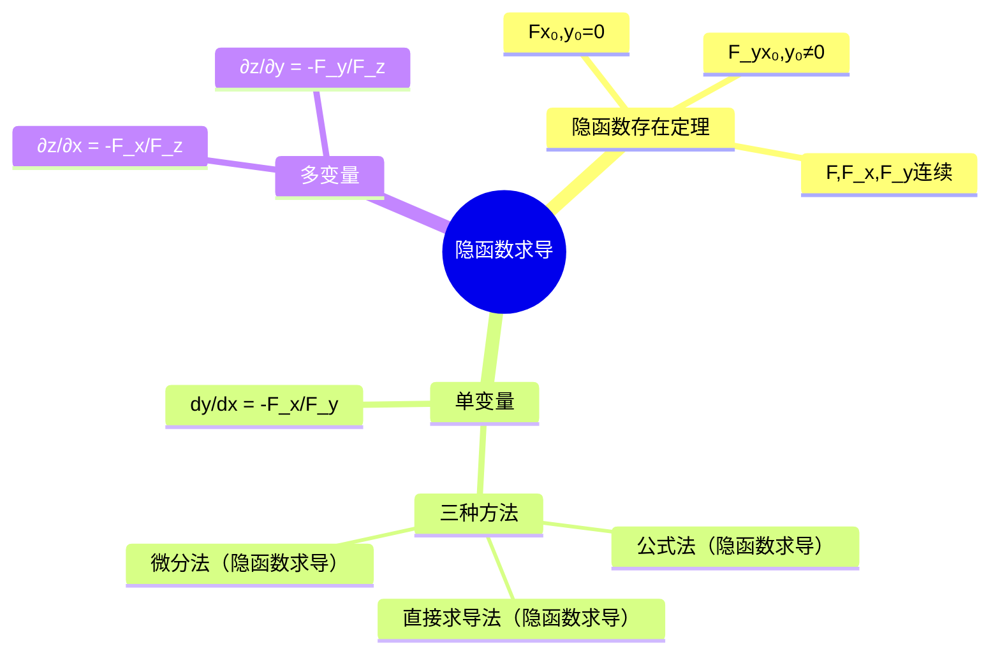

# 高数：隐函数求导

> 📌 重构说明：本笔记是多元函数微分学后半场的发力点——从单变量隐函数求导到多变量隐函数求导，覆盖三种求导方法的完整对比。已按「隐函数存在定理（$F(x,y)=0$ 确定 $y=f(x)$ 的三个充要条件→不必真求解）→三方法对比（公式法（隐函数求导） $\frac{dy}{dx}=-\frac{F_x}{F_y}$→直接求导法（隐函数求导）→微分法（隐函数求导））→多变量隐函数求导（$F(x,y,z)=0$ 确定 $z=f(x,y)$→$\frac{\partial z}{\partial x}=-\frac{F_x}{F_z}$）」的逻辑链重排。完整保留了公式推导（方程两边对 $x$ 求导→链式法则→解方程）和三方法的适用场景对比。

## 🧠 思维导图

---

## 一、隐函数存在定理

$F(x,y)=0$ 能否确定 $y=f(x)$？三个条件：

1. $F(x_0,y_0)=0$（点在方程上）
2. $F, F_x, F_y$ 在邻域内连续
3. ==$F_y(x_0,y_0) \neq 0$==（垂直于 $y$ 轴的切线不存在）

> 📖 推广：$F(x,y,z)=0$ 确定 $z=f(x,y)$ 需要 $F_z\neq 0$。一句话：想「解出」哪个变量，其对 $F$ 的偏导就不能为零。

---

## 二、单变量隐函数求导——三种方法

### 方法一：公式法

$$F(x,y)=0 \text{ 确定 } y=f(x) \quad\Rightarrow\quad \boxed{\frac{dy}{dx} = -\frac{F_x}{F_y}}$$

**推导**：$F(x,f(x))=0$ 两边对 $x$ 求导 → $F_x + F_y\cdot\frac{dy}{dx}=0$ → 解之即得。

### 方法二：直接求导法

直接对 $F(x,y)=0$ 两边求导（把 $y$ 看作 $x$ 的函数）→ 解出 $y'$。适合方程中 $y$ 难以分离的情形。

### 方法三：微分法

两边全微分 $F_x dx + F_y dy = 0$ → $\frac{dy}{dx} = -\frac{F_x}{F_y}$。

| 方法 | 操作 | 优势 |
|------|------|------|
| 公式法（隐函数求导） | 直接代 | 最简单，题量最多 |
| 直接求导法（隐函数求导） | 两边对 $x$ 求导 | 需要求高阶导时方便 |
| 微分法（隐函数求导） | 两边全微分 | 适用于方程组 |

---

## 三、多变量隐函数

$F(x,y,z)=0$ 确定 $z=f(x,y)$：

$$\boxed{\frac{\partial z}{\partial x} = -\frac{F_x}{F_z},\quad \frac{\partial z}{\partial y} = -\frac{F_y}{F_z}}$$

> [!warning] 考点
> ⚠️ 两个 $F$ 的下标容易搞混：分子是不要的那个变量（把谁当常数），分母是要解出的那个变量的偏导。例如解 $z$→分母 $F_z$，分子看求 $\partial z/\partial x$ 还是 $\partial z/\partial y$。

---

---

## 🔗 知识网络

### 前置依赖
- 02_偏导数与全微分 — 偏导数的概念和计算
- 03_多元复合函数求导法则 — 链式求导法则

### 后续应用
- 05_隐函数组求导 — 多变量隐函数组的求导（推广到方程组）
- 06_多元函数的极值与条件极值 — 拉格朗日乘数法

### 对比辨析
- 公式法 $dy/dx=-F_x/F_y$ vs 直接法：公式法直接套用结论（计算偏导数再相除），直接法对方程两边求导再解出 $dy/dx$
- 隐函数存在定理：$F_y \neq 0$ 时隐函数存在——这保证我们可以解出 $y=f(x)$

## 📚 核心词条索引

| 知识点链接            | 类别   | 关键词                     |
| ---------------- | ---- | ----------------------- |
| [[公式法（隐函数求导）]]   | 求导方法 | $dy/dx = -F_x/F_y$，直接代入 |
| [[链式法则]]         | 基础法则 | 复合函数求导法则                |
| [[微分法（隐函数求导）]]   | 求导方法 | 两边全微分，适用于方程组            |
| [[隐函数存在定理]]      | 理论基础 | $F_y \neq 0$时存在$y=f(x)$ |
| [[隐函数求导]]        | 核心概念 | 对隐函数方程$F(x,y)=0$求导      |
| [[直接求导法（隐函数求导）]] | 求导方法 | 方程两边直接对$x$求导            |
