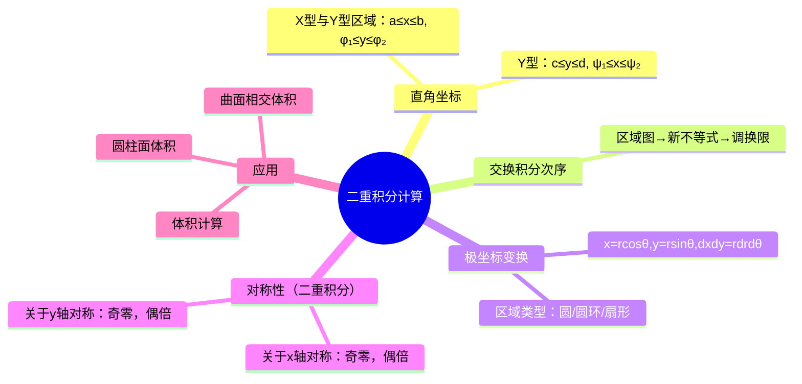

# 高数：二重积分的计算方法

> 📌 重构说明：本笔记是高数下册计算量最大的一章——直角坐标下化为累次积分、极坐标变换及对称性（二重积分）简化。已按「直角坐标系（X型与Y型区域：平行线先 $x$ 穿上下 / Y 型区域：平行线先 $y$ 穿左右→列积分限→从内到外积分）→交换积分次序（区域图→新描不等式→调换两层积分限 / 不可单型时的分块技巧）→极坐标变换（$\iint f(r\cos\theta,r\sin\theta)\,r\,dr\,d\theta$→别忘了 $r$！→区域：圆环/扇形/放射形）→对称性（二重积分）策略（$x$ 轴对称 / $y$ 轴对称 / 原点对称→零积 / 双倍→需看 $f$ 的奇偶性）」的逻辑链重排。合并了「二重积分的计算技巧」「立体几何与积分」「直角圆柱面体积计算」三篇笔记。

## 🧠 思维导图

---

## 一、直角坐标系下的计算

### X 型区域

$$D = \{(x,y) \mid a \le x \le b,\; \varphi_1(x) \le y \le \varphi_2(x)\}$$

$$\iint_D f(x,y)\,dxdy = \int_a^b \left[ \int_{\varphi_1(x)}^{\varphi_2(x)} f(x,y)\,dy \right] dx$$

==口诀：先 $y$ 后 $x$，$y$ 的限写在内层。==

### Y 型区域

$$D = \{(x,y) \mid c \le y \le d,\; \psi_1(y) \le x \le \psi_2(y)\}$$

$$\iint_D f(x,y)\,dxdy = \int_c^d \left[ \int_{\psi_1(y)}^{\psi_2(y)} f(x,y)\,dx \right] dy$$

==口诀：先 $x$ 后 $y$。==

---

## 二、交换积分次序

当固定次序的积分无法计算时（如内层的原函数不能用初等函数表达），==交换积分次序是关键大招==。

**步骤**：
1. 根据原积分限画出区域 $D$
2. 用另一个变量重写 $D$ 的不等式
3. 写出新的累次积分

> [!warning] 考点
> ⚠️ $e^{-y^2}$ 等函数对 $y$ 没有初等原函数 —— 必须先换次序（先 $x$ 后 $y$）才能求解。期末必考。

---

## 三、极坐标变换

$$\begin{cases} x = r\cos\theta \\ y = r\sin\theta \end{cases}$$

$$\boxed{dxdy = r\,dr\,d\theta}$$

==别忘了 $r$！== 这是面积微元的缩放因子。

**适用区域**：
- ==圆 / 圆环==：$D: a \le r \le b$
- ==扇形==：$D: r = R, 0 \le \theta \le \alpha$
- ==边界方程化为 $r$ 的一元表达式容易==（如 $x^2+y^2$ 类被积函数）

---

## 四、对称性策略

| 对称轴 | $f$ 关于另一个变量的奇偶性 | 结果 |
|--------|---------------------------|------|
| ==关于 $x$ 轴对称== | $f(x,-y)=-f(x,y)$（奇） | ==0== |
| 关于 $x$ 轴对称 | $f(x,-y)=f(x,y)$（偶） | ==$2 \times$ 上半积分== |
| 关于 $y$ 轴对称 | $f(-x,y)=-f(x,y)$ | 0 |
| 关于 $y$ 轴对称 | $f(-x,y)=f(x,y)$ | $2 \times$ 右半积分 |

> [!warning] 考点
> 对称性（二重积分） + 奇偶性 = 零，可以直接免算。考试中优先检查是否有对称性，能省时。

---

## 五、交换积分次序——经典陷阱

$$\int_0^1 dx \int_0^{x^2} f(x,y)\,dy$$

此区域需转为 $y$ 型：$y$ 从 $0$ 到 $1$，对每个 $y$，$x$ 的范围是从 $\sqrt{y}$ 到 $1$。

---

---

## 🔗 知识网络

### 前置依赖
- 01_二重积分的概念与性质 — 二重积分的定义和性质
- 02_定积分的概念与牛顿-莱布尼兹公式 — 累次积分的计算

### 后续应用
- 02_格林公式及其应用 — 二重积分与曲线积分的转化
- 01_常数项级数的概念与性质 — 积分判别法

### 对比辨析
- 直角坐标 vs 极坐标：直角坐标适合矩形/三角形区域，极坐标适合圆形/扇形区域——极坐标下 $d\sigma = r dr d\theta$
- X型区域 vs Y型区域：X型是先对 y 后对 x 积分（y 的边界用 x 表示），Y型是先对 x 后对 y 积分——选对次序可大幅简化计算

## 📚 核心词条索引

| 知识点链接 | 类别 | 关键词 |
|------|------|--------|
| [[X型与Y型区域]] | 积分区域 | X型：$y$上下界为$x$函数；Y型：$x$左右界为$y$函数 |
| [[对称性（二重积分）]] | 计算技巧 | 奇函数在对称区域积分为0，偶函数可减半 |
| [[极坐标变换]] | 坐标变换 | $x=r\cos\theta, y=r\sin\theta$，$dxdy=rdrd\theta$ |
| [[交换积分次序]] | 计算技巧 | 先画区域再重新确定上下界 |
