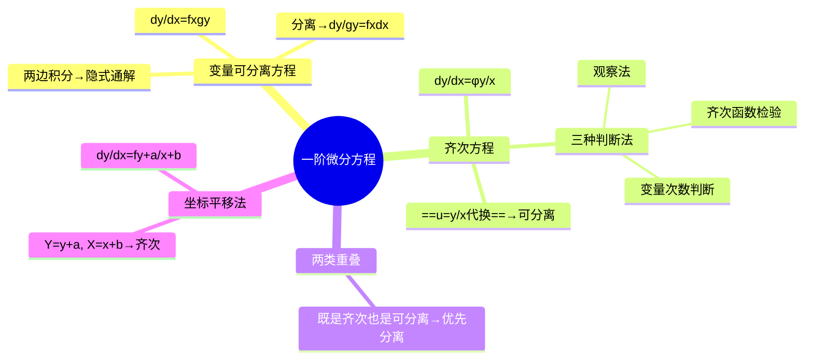

# 高数：一阶微分方程——变量分离与齐次方程

> 📌 重构说明：本笔记覆盖一阶微分方程的两类核心解法。已按「变量可分离方程（定义+解法+步骤）→齐次方程（定义+三种判断法+标准代换 $u=y/x$+完整推导）→两类方程的重叠关系（既是齐次又是可分离→优先用变量分离）→坐标平移法（$Y=y+a, X=x+b$）」的逻辑链重排。完整保留了原笔记的例题（$\frac{dy}{dx}=\frac{x}{y}\ln\frac{y}{x}$ 的推导链）及三种判断方法。

## 🧠 思维导图

---

## 一、变量可分离方程

### 定义

$$\boxed{\frac{dy}{dx} = f(x) \cdot g(y)}$$

核心特征：右边是 $x$ 的纯函数 × $y$ 的纯函数。

### 解法三步

1. **分离变量**：$\dfrac{dy}{g(y)} = f(x)dx$
2. **两边积分**：$\displaystyle\int\frac{dy}{g(y)} = \int f(x)dx$
3. **得隐式通解**：结果通常写隐式形式

---

## 二、齐次方程

### 定义

$$\boxed{\frac{dy}{dx} = \varphi\left(\frac{y}{x}\right)}$$

==核心特征==：右边是关于 $\frac{y}{x}$ 的函数，而非单独的 $x$ 或 $y$。

### 三种判断方法

| 方法 | 操作 | 判据 |
|------|------|------|
| 观察法 | 看方程右边能否写成 $\varphi(y/x)$ | 直接识别 |
| ==齐次函数检验== | $x\to tx$, $y\to ty$ → 看 $f(tx,ty)=f(x,y)$？ | 严格数学判定 |
| 变量次数判断 | 右边各项 $x$ 和 $y$ 的次数之和 | 次数相同 = 齐次 |

### 解法——代换 $u = y/x$

这是==齐次方程的万能钥匙==：

令 $u = \frac{y}{x}$，则 $y = ux$

$$\frac{dy}{dx} = u + x\frac{du}{dx}$$

代入原方程 $\frac{dy}{dx} = \varphi(u)$：

$$u + x\frac{du}{dx} = \varphi(u) \;\Rightarrow\; x\frac{du}{dx} = \varphi(u) - u$$

$$\frac{du}{\varphi(u) - u} = \frac{dx}{x}$$

→ 变量已分离！积分后回代 $u = y/x$。

> [!warning] 考点
> ⚠️ $y=ux$ 求导得 $y'=u+xu'$——这是齐次方程的必写一步，公式必须写对：$y'=u+x\cdot\frac{du}{dx}$。

---

## 三、两类方程的重叠关系

| 方程 | 变量可分离？ | 齐次？ |
|------|:---:|:---:|
| $dy/dx = y/x$ | ✓ | ✓ |
| $dy/dx = x/y$ | ✗ | ✓ |
| $dy/dx = x\cdot y$ | ✓ | ✗ |

> 📌 策略：==若既是齐次方程又是变量可分离方程——优先用变量分离法。== 代换 $u=y/x$ 增加了步骤，变量分离更直接。

---

## 四、坐标平移法

适用形式：$\dfrac{dy}{dx} = f\left(\dfrac{y+a}{x+b}\right)$

**代换**：$Y = y+a$，$X = x+b$ → 转化为齐次方程。

---

## 五、例题完整演示

**方程**：$\dfrac{dy}{dx} = \dfrac{x}{y} \ln\dfrac{y}{x}$

1. 判断：$\frac{1}{y/x}\ln\frac{y}{x} = \frac{1}{u}\ln u$ → 是齐次方程
2. 令 $u = y/x$，$y = ux$，$y' = u + xu'$
3. 代入：$u + x\frac{du}{dx} = \frac{1}{u}\ln u$
4. 分离：$x\frac{du}{dx} = \frac{\ln u}{u} - u = \frac{\ln u - u^2}{u}$
5. $\frac{u\,du}{\ln u - u^2} = \frac{dx}{x}$ → 积分
6. 回代 $u = y/x$

---

---

## 🔗 知识网络

### 前置依赖
- 01_微分方程的概念与分类 — 微分方程的基本概念
- 01_不定积分的概念与性质 — 积分计算（求解微分方程的关键操作）

### 后续应用
- 03_一阶线性微分方程与常数变易法 — 常数变易法（从齐次到非齐次）
- 04_全微分方程判定与求解 — 全微分方程的判定

### 对比辨析
- 变量分离方程 vs 齐次方程：变量分离方程直接 $g(y)dy=f(x)dx$ 两边积分即可，齐次方程需先令 $u=y/x$ 化为变量分离形式
- 齐次方程的本质：$dy/dx = f(y/x)$ 是"比例不变"的微分方程——通过 $u=y/x$ 替换可降阶

## 📚 核心词条索引

| 知识点链接 | 类别 | 关键词 |
|------|------|--------|
| 变量可分离方程 | 方程类型 | $dy/dx=f(x)g(y)$，可分离变量后积分 |
| 齐次方程 | 方程类型 | $dy/dx=f(y/x)$，令$u=y/x$化为可分离 |
| 齐次函数检验 | 判别方法 | $f(\lambda x,\lambda y)=\lambda^k f(x,y)$ |
| 坐标平移法 | 求解技巧 | 将奇点移到原点 |
