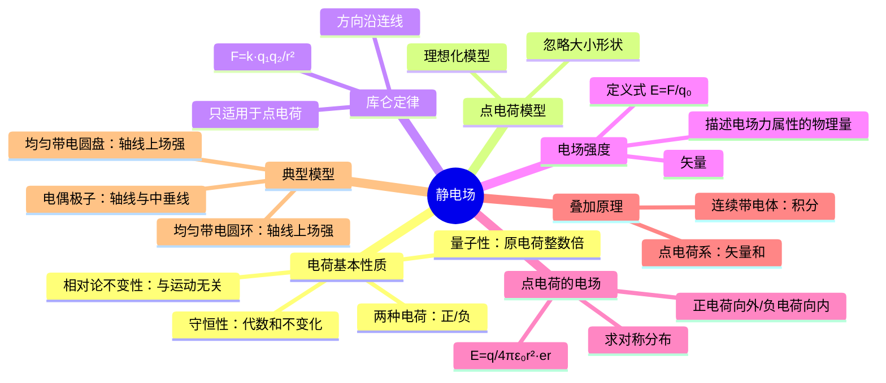

# 大物：静电场与电场强度

> 📌 重构说明：本笔记是电磁学的开篇——从热力学过渡到静电场的概念跃迁。已按「电荷的基本性质→点电荷模型→库仑定律→电场强度的定义→点电荷的电场→电场强度的叠加原理」的逻辑链重排。完整保留了原笔记中库仑定律作为"源头"的定位、电场强度定义的推导、求对称分布的描述及叠加原理的矢量求和过程。

## 🧠 思维导图

---

## 一、静电场概述

### 1.1 什么是静电场

==静电场 = 静止的电荷周围所形成的场。==

电荷运动起来会有别的东西出现（磁场），所以静电场特指电荷静止的情况。

### 1.2 描述静电场的两个基本物理量

1. **电场强度** $\vec{E}$ — 描述电场力的属性
2. **电势** $U$ — 描述电场能的属性

---

## 二、电荷的基本性质

### 2.1 电荷的种类

电荷分为**正电荷**和**负电荷**两种：
- 同种电荷相互排斥，异种电荷相互吸引
- 负氧离子（负电荷）对人体有益——瀑布飞溅时小水滴带负电荷

### 2.2 量子性

$$q = n \cdot e,\quad e = 1.6 \times 10^{-19}\,\mathrm{C},\quad n \in \mathbb{Z}$$

带电体所带的电荷量都是原电荷 $e$ 的整数倍。

> 现代物理学中的夸克模型出现了分数倍电荷，但这属于现代物理范畴。经典物理中仍认为电荷具有量子性。

### 2.3 守恒性

==孤立系统中电荷的代数和保持不变。==即电荷既不能凭空产生，也不能凭空消失。

### 2.4 相对论不变性

$\boxed{\text{电荷量与运动状态无关}}$

运动的电荷和静止的电荷所带电荷量相同——这是电荷的洛伦兹不变性。

---

## 三、点电荷模型与库仑定律

### 3.1 点电荷模型

类似力学中的质点——当带电体的大小、形状及电荷分布可忽略时，抽象为点电荷。这是理想化模型。

### 3.2 库仑定律

$$\boxed{\vec{F} = \frac{1}{4\pi\varepsilon_0} \cdot \frac{q_1 q_2}{r^2} \vec{e}_r}$$

| 符号 | 含义 |
|------|------|
| $\varepsilon_0$ | 真空介电常数（电容率） |
| $\vec{e}_r$ | 沿两点连线方向的单位矢量 |
| $r$ | 两点电荷之间的距离 |

**方向**：同种电荷排斥（$\vec{F}$ 沿 $\vec{e}_r$ 向外），异种电荷吸引（$\vec{F}$ 沿 $\vec{e}_r$ 向内）。

> [!info] 补充定义
> 比例系数通常写为 $k = \frac{1}{4\pi\varepsilon_0} \approx 8.99 \times 10^9 \,\mathrm{N\cdot m^2/C^2}$。将 $k$ 写成 $1/4\pi\varepsilon_0$ 是为了后续高斯定理等公式的对称性。

> [!warning] 考点
> ⚠️ 库仑定律**只适用于点电荷**。对于非点电荷模型（如连续带电体）不能直接使用。库仑定律是静电场的"源头"——所有静电场的内容都基于库仑定律推导。

---

## 四、电场强度

### 4.1 定义

电场是一种特殊物质（虽不可见但具有动量），描述电场力的属性的物理量就是电场强度：

$$\boxed{\vec{E} = \frac{\vec{F}}{q_0}}$$

其中 $q_0$ 是试验电荷（电量足够小，不干扰原电场）。

> 定义式适用于所有带电体——注意与点电荷的电场强度公式区分。

### 4.2 电场强度的性质

| 性质 | 说明 |
|------|------|
| 矢量性 | 既有大小又有方向，求解需同时描述 |
| 力属性 | 描述电场对电荷施力的能力 |
| 叠加性 | 多个电荷产生的电场可矢量叠加 |

### 4.3 点电荷的电场强度

$$\boxed{\vec{E} = \frac{q}{4\pi\varepsilon_0 r^2} \vec{e}_r}$$

**==这个公式必须背下来==**——它是所有电场强度计算的出发点。

> 分布特征：以点电荷为球心、$r$ 为半径的球面上各点电场强度大小相同，方向沿径向（正电荷向外，负电荷向内），称为**球对称分布**。

---

## 五、电场强度的叠加原理

$$\boxed{\vec{E} = \sum_i \vec{E}_i = \sum_i \frac{q_i}{4\pi\varepsilon_0 r_i^2} \vec{e}_{ri}}$$

空间中多个点电荷在某点产生的总电场强度等于各点电荷单独存在时产生的电场强度的**矢量和**。

> 对于连续带电体，求和变为积分：
> $$\vec{E} = \int d\vec{E} = \int \frac{dq}{4\pi\varepsilon_0 r^2} \vec{e}_r$$

---

## 六、典型模型电场强度计算

### 6.1 电偶极子

两个等量异号点电荷 $\pm q$，相距 $l$，组成**电偶极子**。电偶极矩 $\vec{p} = q\vec{l}$。

> [!example] 例题1：电偶极子轴线上的场强
> **题目**：求电偶极子轴线上距中心 $x$ 处的电场强度（$x \gg l$）。
> **关键步骤**：
> ① 正电荷在 $p$ 点产生的场强 $E_+ = \frac{q}{4\pi\varepsilon_0(x - l/2)^2}$（向右）
> ② 负电荷在 $p$ 点产生的场强 $E_- = \frac{q}{4\pi\varepsilon_0(x + l/2)^2}$（向左）
> ③ 合场强 $E = E_+ - E_-$，通分近似 $\frac{1}{(x\pm l/2)^2} \approx \frac{1}{x^2}\left(1\mp\frac{l}{x}\right)$
> ④ $E \approx \frac{q}{4\pi\varepsilon_0 x^2}\left[\left(1+\frac{l}{x}\right)-\left(1-\frac{l}{x}\right)\right] = \frac{2ql}{4\pi\varepsilon_0 x^3} = \frac{1}{2\pi\varepsilon_0}\frac{p}{x^3}$
> **答案**：$\vec{E} = \frac{1}{2\pi\varepsilon_0}\frac{p}{x^3}$，方向沿轴线向右

> [!example] 例题2：电偶极子中垂线上的场强
> **题目**：求电偶极子中垂线上距中心 $r$ 处的电场强度。
> **关键步骤**：
> ① 正负电荷到 $p$ 点距离相等，场强大小相等 $E_+ = E_- = \frac{q}{4\pi\varepsilon_0(r^2 + (l/2)^2)}$
> ② 利用对称性：垂直于轴线方向的分量相互抵消，只剩沿轴线方向的分量
> ③ 合场强 $E = 2E_+\cos\theta = 2 \cdot \frac{q}{4\pi\varepsilon_0(r^2 + l^2/4)} \cdot \frac{l/2}{\sqrt{r^2 + l^2/4}}$
> ④ 当 $r \gg l$：$E \approx \frac{ql}{4\pi\varepsilon_0 r^3} = \frac{1}{4\pi\varepsilon_0}\frac{p}{r^3}$，方向与轴线平行向左
> **答案**：$\vec{E} = -\frac{1}{4\pi\varepsilon_0}\frac{p}{r^3}$（方向与 $\vec{p}$ 相反）

### 6.2 均匀带电细圆环轴线上的场强

> [!example] 例题3：均匀带电圆环轴线上的场强
> **题目**：半径为 $R$、总电量为 $q$ 的均匀带电细圆环，求轴线上距圆心 $x$ 处的电场强度。
> **关键步骤**：
> ① 取电荷元 $dq = \lambda dl$（$\lambda = q/2\pi R$ 为线电荷密度）
> ② $dq$ 产生的 $dE = \frac{dq}{4\pi\varepsilon_0(x^2 + R^2)}$
> ③ 利用对称性：垂直于轴线的分量相互抵消，只有沿轴线分量 $dE_x = dE\cos\theta$
> ④ $\cos\theta = \frac{x}{\sqrt{x^2 + R^2}}$，$E = \int dE_x = \frac{x}{4\pi\varepsilon_0(x^2+R^2)^{3/2}}\int dq$
> **答案**：$E = \frac{qx}{4\pi\varepsilon_0(x^2 + R^2)^{3/2}}$
> **特殊情况**：
> - 圆心 $x=0$：$E=0$
> - 极远 $x\gg R$：$E \approx \frac{q}{4\pi\varepsilon_0 x^2}$（视为点电荷）
> - 极值位置：令 $dE/dx=0$，得 $x = \pm\frac{R}{\sqrt{2}}$

### 6.3 均匀带电圆盘轴线上的场强

> [!example] 例题4：均匀带电圆盘轴线上的场强
> **题目**：半径为 $R$、面电荷密度为 $\sigma$ 的均匀带电圆盘，求轴线上距圆心 $x$ 处的电场强度。
> **关键步骤**：
> ① 将圆盘微分：取半径为 $r$、宽 $dr$ 的圆环，面积 $2\pi r\,dr$，带电量 $dq = \sigma\cdot 2\pi r\,dr$
> ② 该圆环在轴线上产生的场强（利用圆环公式）：$dE = \frac{x\,dq}{4\pi\varepsilon_0(x^2+r^2)^{3/2}} = \frac{\sigma x}{2\varepsilon_0}\frac{r\,dr}{(x^2+r^2)^{3/2}}$
> ③ 积分：$E = \frac{\sigma x}{2\varepsilon_0}\int_0^R \frac{r\,dr}{(x^2+r^2)^{3/2}} = \frac{\sigma}{2\varepsilon_0}\left(1 - \frac{x}{\sqrt{x^2+R^2}}\right)$
> **答案**：$E = \frac{\sigma}{2\varepsilon_0}\left(1 - \frac{x}{\sqrt{x^2+R^2}}\right)$
> **特殊情况**：
> - $x\ll R$（近场）：$E \approx \frac{\sigma}{2\varepsilon_0}$（无限大带电平面）
> - $x\gg R$（远场）：$E \approx \frac{\sigma R^2}{4\varepsilon_0 x^2} = \frac{q}{4\pi\varepsilon_0 x^2}$（视为点电荷，$q=\sigma\pi R^2$）

---

## 🔗 知识网络

### 前置依赖
-  — 从热力学进入电磁学过渡
- 高中物理：电荷、电场、库仑定律

### 后续应用
- 静电场的高斯定理（对称性求场强）
- 电势与电势差（电场强度的积分形式）
- 电场强度与电势的关系（$\vec{E} = -\nabla U$）

### 对比辨析
- 点电荷 vs 质点：点电荷是带电的理想化模型，质点是力学的理想化模型，两者都是忽略尺寸的抽象
- 场强定义式 $\vec{E}=\vec{F}/q_0$ vs 点电荷公式 $\vec{E}=q/4\pi\varepsilon_0 r^2 \vec{e}_r$：前者是**定义式**（通用），后者是**点电荷的特例公式**

---

---

## 🔗 知识网络

### 前置依赖
- 电磁学基本概念 — 电荷的基本性质
- [[库仑定律]] — 点电荷间作用力的计算

### 后续应用
- 静电场中的高斯定理 — 电场通量与高斯定理
- [[静电场中的环路定理与电势]] — 电场力做功与电势能
- [[静电场中的导体]] — 导体在静电场中的平衡

### 对比辨析
- 电场强度 E vs 电场力 F：E 是场的属性（与试探电荷无关），F 是电荷在场中受的力（F=qE）
- 点电荷场强公式 vs 定义式：定义式 E=F/q₀ 普遍适用；点电荷公式 E=kq/r² 仅适用于点电荷

## 📚 核心词条索引

| 知识点链接 | 类别 | 关键词 |
|------|------|--------|
| [[静电场]] | 核心概念 | 静止电荷周围形成的场 |  |
| [[电场强度]] | 核心概念 | 描述电场力属性的物理量，$\vec{E}=\vec{F}/q_0$ |  |
| [[点电荷]] | 理想模型 | 忽略大小形状的带电体 |  |
| [[库仑定律]] | 基本定律 | 两点电荷间作用力，$\vec{F}\propto q_1q_2/r^2$ |  |
| [[原电荷]] | 基本常数 | $e=1.6\times10^{-19}\,\mathrm{C}$ |  |
| [[真空介电常数]] | 基本常数 | $\varepsilon_0$，库仑定律中的比例系数 |  |
| [[电场叠加原理]] | 原理 | 总电场强度 = 各电荷单独产生的电场强度矢量和 |  |
| [[试验电荷]] | 概念 | 电量足够小的检验电荷 $q_0$ |  |
| [[球对称分布]] | 对称性 | 点电荷场强在球面上大小相同，方向径向 |  |
