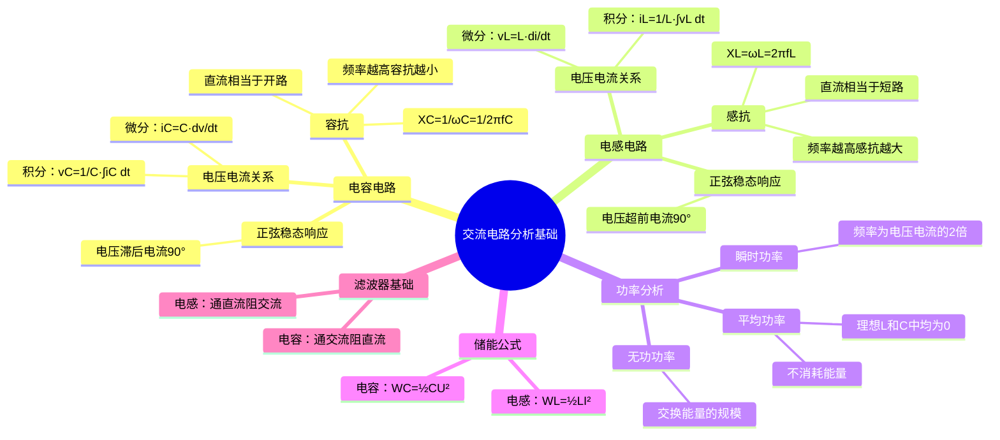

# 电子技术：交流电路分析基础

> 📌 重构说明：本笔记将电容和电感在正弦交流电路中的特性——容抗、感抗、相位关系、功率分析和储能公式——整合为统一框架，强调二者的对偶关系。

## 🧠 思维导图

---

## 一、电容电路

### 1.1 电容VCR

电容的定义式：$Q = C \cdot V$。两边对时间求导得流经电容的电流：

$$\boxed{i_C(t) = C \cdot \frac{dv_C(t)}{dt}}$$

积分形式（由电流反推电压）：

$$\boxed{v_C(t) = \frac{1}{C} \int i_C(t)\,dt}$$

> 📖 直观理解：电容的电流取决于电压的==变化率==而不是电压本身。如果电压恒定不变（直流稳态），$dv/dt = 0$，电容电流为零——这就是"隔直"的数学根源。电压变化越快（高频），电流越大——这就是"通交"。

### 1.2 正弦稳态响应——相位关系推导

设电容电流 $i_C = I_m \sin \omega t$，代入积分形式：

$$v_C = \frac{1}{C} \int I_m \sin \omega t\,dt = -\frac{I_m}{\omega C} \cos \omega t$$

利用三角恒等式 $-\cos\theta = \sin(\theta - \pi/2)$：

$$v_C = \frac{I_m}{\omega C} \sin\left(\omega t - \frac{\pi}{2}\right)$$

**结论**：电容电压==滞后==电流 $90^\circ$（$\pi/2$ 弧度）。

### 1.3 容抗

$$\boxed{X_C = \frac{1}{\omega C} = \frac{1}{2\pi f C}}$$

容抗的复数表示（相量域）：

$$Z_C = -jX_C = \frac{1}{j\omega C}$$

**频率特性**：
| 频率条件 | 容抗 | 物理行为 |
|------|:---:|------|
| $f = 0$（直流） | $X_C \to \infty$ | ==开路（隔直）== |
| $f \to \infty$（高频） | $X_C \to 0$ | ==短路（通交）== |

> [!warning] 考点
> ⚠️ 容抗 $X_C = 1/(\omega C)$，电容电压滞后电流 90°。这两个点经常一起考查。

---

## 二、电感电路

### 2.1 电压-电流关系（VCR）

电感的定义式来自法拉第电磁感应定律：

$$\boxed{v_L(t) = L \cdot \frac{di_L(t)}{dt}}$$

积分形式：

$$\boxed{i_L(t) = \frac{1}{L} \int v_L(t)\,dt}$$

> 📖 直观理解：电感的电压取决于电流的==变化率==。如果电流恒定不变（直流稳态），$di/dt=0$，电感电压为零——这就是"通直"（直流下电感相当于导线）。电流变化越快（高频），感应电压越大——这就是"阻交"。

### 2.2 正弦稳态响应——相位关系推导

设电感电流 $i_L = I_m \sin \omega t$，代入微分形式：

$$v_L = L \cdot \frac{d}{dt}(I_m \sin \omega t) = \omega L I_m \cos \omega t$$

利用 $\cos\theta = \sin(\theta + \pi/2)$：

$$v_L = \omega L I_m \sin\left(\omega t + \frac{\pi}{2}\right)$$

**结论**：电感电压==超前==电流 $90^\circ$（$\pi/2$ 弧度）。

### 2.3 感抗

$$\boxed{X_L = \omega L = 2\pi f L}$$

感抗的复数表示：

$$Z_L = jX_L = j\omega L$$

**频率特性**：
| 频率条件 | 感抗 | 物理行为 |
|------|:---:|------|
| $f = 0$（直流） | $X_L = 0$ | ==短路（通直）== |
| $f \to \infty$（高频） | $X_L \to \infty$ | ==开路（阻交）== |

> [!warning] 考点
> ⚠️ 感抗 $X_L = \omega L$，电感电压超前电流 90°。相位关系与电容恰好相反。

---

## 三、电容与电感的对偶关系总结

这是整个交流电路分析中最核心的对偶框架：

| 维度 | 电容 (C) | 电感 (L) |
|------|------|------|
| VCR（微分） | $i = C\cdot dv/dt$ | $v = L\cdot di/dt$ |
| 相位关系 | ==电压滞后电流 90°== | ==电压超前电流 90°== |
| 电抗 | $X_C = 1/(\omega C)$（容抗） | $X_L = \omega L$（感抗） |
| 直流行为 | ==开路（隔直）== | ==短路（通直）== |
| 高频行为 | 短路（通交） | 开路（阻交） |
| 储能形式 | ==电场能 $W_C = \frac{1}{2}CV^2$== | ==磁场能 $W_L = \frac{1}{2}LI^2$== |
| 不能突变 | ==电压不能突变== | ==电流不能突变== |
| 串联等效电阻 | ESR | DCR |

> 📖 深刻理解：电容和电感在交流电路中的行为恰好"镜像对称"——如果把电压和电流的角色互换，$C$ 和 $L$ 的方程就变成对方。这种对偶性在电路理论中广泛存在（串联↔并联、电压↔电流、电阻↔电导），理解对偶关系可以"学一知二"。

---

## 四、交流功率分析

### 4.1 瞬时功率

$$p(t) = v(t) \cdot i(t)$$

对于正弦稳态下的电容：$p_C(t) = -\frac{U_m I_m}{2} \sin 2\omega t$

特点：瞬时功率以==$2\omega$ 的频率==振荡（功率频率 = 电压/电流频率的 2 倍），正负交替——一半时间从电源吸收能量（存储），一半时间向电源回馈能量（释放）。

### 4.2 平均功率（有功功率）

$$P = \frac{1}{T} \int_0^T p(t)\,dt$$

==理想电容和理想电感的平均功率均为零==。物理意义：储能元件在完整周期内不消耗净能量，只进行能量的存储和释放（电能↔磁场能或电能↔电场能之间的来回转换）。

### 4.3 无功功率

无功功率衡量储能元件与电源之间==交换能量的规模==（而非消耗）：

| 元件 | 无功功率 | 单位 |
|------|------|:---:|
| 电容 | $Q_C = VI = I^2 X_C = V^2/X_C$ | var（乏） |
| 电感 | $Q_L = VI = I^2 X_L = V^2/X_L$ | var（乏） |

> [!warning] 考点
> ⚠️ "理想电容和电感的平均功率为零，只存在无功功率"——这是判断题和简答题的常见考点。注意：实际电容/电感因存在等效串联电阻（ESR/DCR），会消耗一小部分有功功率。

---

## 五、储能公式

### 5.1 电容储能（电场能）

$$\boxed{W_C = \frac{1}{2}CV_C^2}$$

能量存储在极板之间的==电场==中。电容电压不能突变（$v_C$ 突变意味着 $dv/dt \to \infty$，$i_C \to \infty$——物理上不可能）。

### 5.2 电感储能（磁场能）

$$\boxed{W_L = \frac{1}{2}LI_L^2}$$

能量存储在线圈周围的==磁场==中。电感电流不能突变（同理，$di/dt \to \infty$ 导致 $v_L \to \infty$——物理上不可能）。

---

## 六、滤波器基础

利用电容和电感的频率特性可以实现简单的滤波功能：

| 元件 | 串联接入 | 并联接入 | 效果 |
|------|------|------|------|
| 电容 | 通高频、阻低频 | 短路高频到地 | ==低通滤波== |
| 电感 | 通低频、阻高频 | — | 低通滤波 |

实际应用中，直流电源的输出端常并联一个大电容——它对直流开路（不耗电），对交流纹波短路到地（滤除纹波）。

---

---

## 🔗 知识网络

### 前置依赖
- 直流电路分析基础 — 直流电路的分析方法（基尔霍夫定律、戴维南等效）
- [[电容]] — 电容元件的特性
- [[电感]] — 电感元件的特性

### 后续应用
- 三极管放大电路——静态分析 — 放大电路中的耦合电容/旁路电容分析
- 三极管放大电路——动态分析与多级放大 — 交流等效电路分析
- [[滤波器设计]] — RC/RL 电路的频率响应

### 对比辨析
- 容抗 vs 感抗：容抗 X_C=1/ωC 随频率升高而减小，感抗 X_L=ωL 随频率升高而增大——二者频率特性完全相反
- 瞬时值 vs 相量：瞬时值是时间的函数 v(t)=V_m cos(ωt+φ)，相量是复数 V̇=V_m∠φ——相量法将微积分方程转化为代数方程

## 📚 核心词条索引

| 词条 | 类别 | 关键词 |
|------|:---:|------|
| [[容抗]] | 电抗参数 | $X_C=1/(\omega C)$、隔直通交 |  |
| [[感抗]] | 电抗参数 | $X_L=\omega L$、通直阻交 |  |
| [[电容VCR]] | 元件特性 | $i=C\,dv/dt$、电压不能突变 |  |
| [[电感VCR]] | 元件特性 | $v=L\,di/dt$、电流不能突变 |  |
| [[相位关系]] | 稳态分析 | 容性滞后90°、感性超前90° |  |
| [[瞬时功率]] | 功率分析 | 2倍频率振荡 |  |
| [[平均功率]] | 功率分析 | 理想L/C中为零 |  |
| [[无功功率]] | 功率分析 | 交换规模、单位var |  |
| [[电场储能]] | 能量分析 | $W_C=\frac{1}{2}CV^2$ |  |
| [[磁场储能]] | 能量分析 | $W_L=\frac{1}{2}LI^2$ |  |
