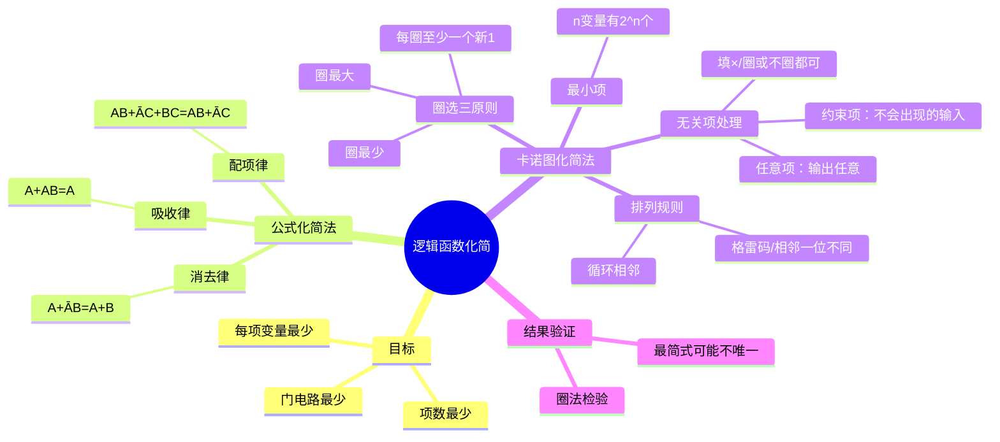

# 电子技术：逻辑函数化简——公式法与卡诺图

> 📌 重构说明：本笔记合并了公式化简法（吸收律/消去律/配项律）和卡诺图化简法两大化简技术，对比其适用场景，并包含无关项处理——构成完整的逻辑化简工具箱。

## 🧠 思维导图

---

## 一、化简的目的与标准

逻辑函数的最终实现形式是数字电路，电路的复杂度直接影响==成本、功耗、延迟和可靠性==。化简的目标是：

1. ==项数最少== → 使用的门电路数量最少
2. ==每项的变量数最少== → 每个门的输入端数最少

一个表达式可能有多种"最简"形式——最简式==不一定唯一==，只要项数和每项变量数达到最小即可。

---

## 二、公式化简法——三个核心定律

### 2.1 吸收律

**公式与证明**：

$$A + AB = A(1 + B) = A \cdot 1 = A$$

$$A(A + B) = A \cdot A + A \cdot B = A + AB = A$$

**直观理解**：如果 $A$ 已经为 1，那么 $AB$ 项是冗余的（因为结果已经是 1）。如果 $A$ 为 0，$AB$ 也为 0——无论哪种情况，$AB$ 都不会改变结果。

### 2.2 消去律

**公式与证明**：

$$A + \overline{A}B = (A + \overline{A})(A + B) = 1 \cdot (A + B) = A + B$$

$$A(\overline{A} + B) = A\overline{A} + AB = 0 + AB = AB$$

**直观理解**：$A + \overline{A}B$ 中，如果 $A=1$ 结果为 1（不需看 B）；如果 $A=0$ 则剩下 $B$。所以整体等价于 $A+B$——互补因子 $\overline{A}$ 被消去。

### 2.3 配项律（也称冗余项定理）

**公式**：

$$AB + \overline{A}C + BC = AB + \overline{A}C$$

**证明**（核心技法——乘以 $(A+\overline{A})=1$）：

$$AB + \overline{A}C + BC = AB + \overline{A}C + (A + \overline{A})BC$$
$$= AB + \overline{A}C + ABC + \overline{A}BC$$
$$= AB(1 + C) + \overline{A}C(1 + B)$$
$$= AB + \overline{A}C$$

**直观理解**：$BC$ 是 $AB$ 和 $\overline{A}C$ 的"共识项"——$B$ 和 $C$ 同时为 1 时，无论 $A$ 取什么值，$AB$ 或 $\overline{A}C$ 中至少有一个已经是 1。所以 $BC$ 是冗余的。

> [!warning] 考点
> ⚠️ 配项律是最容易被忽略的化简技巧。考试中常出现"给了三项的表达式，化简后只剩下两项"——这就是配项律发挥作用的地方。识别要点：两项中各有一个互补变量（$A$ 和 $\overline{A}$），剩下两个变量（$B$ 和 $C$）的乘积（$BC$）就是冗余项。

---

## 三、卡诺图——图形化化简工具

### 3.1 最小项概念

==最小项==：包含所有变量的乘积项，每个变量以原变量或反变量形式出现==恰好一次==。

- n 个变量有 $2^n$ 个最小项
- 编号：将变量取值看作二进制数 → $m_0, m_1, \ldots, m_{2^n-1}$
- 例如 3 变量：$m_5$ = $A\overline{B}C$（A=1, B=0, C=1 → 二进制 101 = 十进制 5）

任何逻辑函数都可以写成若干个最小项之和的形式（即"最小项之和标准型"）。

### 3.2 卡诺图的排列——关键的"格雷码"原理

卡诺图的行和列==不按二进制顺序排列==，而是按==格雷码==（相邻编码只有一位不同）排列：

| 变量数 | 格式 | 排列 |
|:---:|:---:|------|
| 2 | 2×2 | 00, 01, 11, 10 |
| 3 | 2×4 | 行：0,1 / 列：00, 01, 11, 10 |
| 4 | 4×4 | 行：00, 01, 11, 10 / 列：00, 01, 11, 10 |

**循环相邻**：最左列与最右列相邻、最上行与最下行相邻——这与格雷码的循环性质一致。

**为什么这样排列？**
==相邻方格对应的最小项只有一个变量取反——这表明两者可以合并，消去该变量==。例如 $\overline{A}BC$ 和 $ABC$ 相邻，合并后得 $BC$（消去了 $A$）。

### 3.3 卡诺图的填写

从最小项之和表达式填写卡诺图：
1. 找出每个最小项的编号
2. 在对应方格填 1
3. 其余填 0

若表达式不是最小项形式，先展开为最小项之和再填。

### 3.4 圈选三原则

| 原则 | 内容 | 原因 |
|:---:|------|------|
| ==圈最大== | 每个圈尽可能包含更多的 1（$2^n$ 个） | 圈越大消去的变量越多 → 表达式越简 |
| ==圈最少== | 用最少个数的圈覆盖所有 1 | 圈越少项数越少 → 电路越简 |
| ==每个圈至少含一个新 1== | 避免冗余圈 | 冗余圈增多了项数却对覆盖无贡献 |

**圈大小与消去变量的关系**：
| 圈中 1 的个数 | 消去变量数 | 剩余变量数（4变量为例） |
|:---:|:---:|:---:|
| 1 | 0 | 4 |
| 2 | 1 | 3 |
| 4 | 2 | 2 |
| 8 | 3 | 1 |
| 16 | 4 | 0（全为1 → Y=1） |

### 3.5 化简结果的不唯一性

同一个卡诺图可以有不同的圈法，得到不同的"最简式"——只要项数和每项变量数达到最小，它们都是正确的最简式。

> [!warning] 考点
> ⚠️ "化简结果正确"≠"化简结果最简"。常见错误：圈得太小（应该圈4个却圈了两个2个），导致结果虽然不是最简，但却是正确的——改卷时会扣分。必须检查每个圈是不是已经不能再扩大了。

---

## 四、无关项的应用

### 4.1 无关项的定义

| 类型 | 含义 | 标记 |
|:---:|------|:---:|
| ==约束项== | 某些输入组合==不可能出现==（物理限制或逻辑约束） | 卡诺图中填 $\times$ |
| ==任意项== | 某些输入组合下，输出值==无关紧要==（可以是 0 也可以是 1） | 卡诺图中填 $\times$ |

例如：电机控制中，A=正转、B=反转、C=停转——AB 不能同时为 1（不能同时正转和反转），所以所有 AB=11 的最小项都是约束项。

### 4.2 利用无关项化简

$\times$ 项可以根据化简需要==人为选择==为 1 或 0：
- 选 1：扩大圈的范围 → 消去更多变量
- 选 0：不影响化简结果

策略：把能扩大圈的 $\times$ 都当 1 圈进去，不在圈里的 $\times$ 当 0 忽略。

---

## 五、公式法 vs 卡诺图法——选择策略

| 维度 | 公式化简法 | 卡诺图化简法 |
|------|------|------|
| 适用变量数 | 任意 | ≤5（再大图太复杂） |
| 需要记忆 | 各种定律和技巧 | 排列规则和圈选原则 |
| 操作方式 | 代数推导 | 图形圈选 |
| 出错概率 | 中等（漏项） | 低（直观） |
| 教材考查偏好 | 填空/选择 | ==大题首选== |
| 工程实际 | 计算机算法用Quine-McCluskey算法 | 4变量以下手工常用 |

> [!warning] 考点
> ⚠️ 考试大题几乎都要求用卡诺图化简。评分时既看结果是否正确，也看圈法是否合理（圈是否最大、是否有冗余圈）。

---

---

## 🔗 知识网络

### 前置依赖
- 布尔代数与逻辑门电路 — 逻辑运算的基本定律（交换律、结合律、德摩根定律）

### 后续应用
- 组合逻辑电路分析与设计 — 化简后的逻辑函数直接用于电路设计
- 编码器与集成电路实现 — 编码器/译码器的优化设计
- [[数字系统设计]] — 复杂数字电路的逻辑优化

### 对比辨析
- 公式法 vs 卡诺图法：公式法适用于任何变量数（需要熟练记忆公式），卡诺图法直观但仅适用于 ≤ 4 变量（5变量以上可用奎因-麦克拉斯基法）
- 最小项 vs 最大项：最小项是积之和（SOP）形式，最大项是和之积（POS）形式——二者互为对偶

## 📚 核心词条索引

| 词条 | 类别 | 关键词 |
|------|:---:|------|
| [[吸收律]] | 化简公式 | $A+AB=A$ |  |
| [[消去律]] | 化简公式 | $A+\overline{A}B=A+B$ |  |
| [[配项律]] | 化简公式 | $AB+\overline{A}C+BC=AB+\overline{A}C$ |  |
| [[最小项]] | 基础概念 | 每个变量出现一次、$2^n$ 个 |  |
| [[卡诺图]] | 化简工具 | 格雷码排列、循环相邻 |  |
| [[圈选原则]] | 操作方法 | 圈最大、圈最少、每圈新1 |  |
| [[无关项]] | 特殊处理 | $\times$、约束项、任意项 |  |
| [[最简式]] | 结果标准 | 项数最少、每项变量最少 |  |
