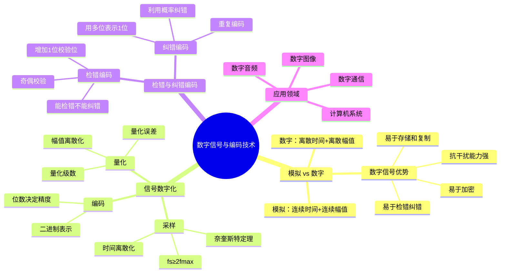

# 电子技术：数字信号与编码技术

> 📌 重构说明：本笔记从模拟信号与数字信号的根本区别出发，系统覆盖信号数字化三步（采样/量化/编码）、检错纠错编码原理和数字系统优势——构成数字电子技术的宏观视角。

## 🧠 思维导图

---

## 一、模拟信号 vs 数字信号

### 1.1 根本区别

| 维度 | 模拟信号 | 数字信号 |
|------|------|------|
| 时间 | ==连续== | ==离散== |
| 幅值 | ==连续== | ==离散==（有限个取值） |
| 物理实现 | 连续变化的电压/电流 | 高/低电平（0 和 1） |
| 抗干扰 | 弱——噪声叠加到信号上 | ==强——只要不超过阈值仍可正确识别== |
| 存储 | 困难——随时间衰减 | 容易——可无限期保存和复制 |

### 1.2 数字信号为什么抗干扰能力强

模拟信号携带信息的物理量是信号波形的==精确形状==——任何噪声都会直接叠加到波形上，永久损伤信息。

数字信号只识别两个电平区间（如：0~0.8V 为逻辑 0，2.0~5.0V 为逻辑 1）。即使信号上叠加了±0.5V 的噪声，只要最终的电压值仍然落在正确的区间内，接收端就能==无损失地恢复原信号==。

> 📖 直观类比：模拟信号像一张褪色的老照片——信息随时间逐渐模糊。数字信号像一页文字——只要纸张不破，内容永不变。"0"和"1"不关心电压是 3.1V 还是 4.2V——重要的是在哪个区间。这就是数字信号"天生抗干扰"的秘密。

---

## 二、信号数字化——三步转换

将现实世界中的模拟信号（声音、图像、温度……）转换为计算机能处理的二进制数据，需要经过三个步骤。

### 2.1 采样——时间离散化

**操作**：按固定的时间间隔 $T_s$ 对连续信号取值，得到一串离散的样本值。

**采样定理**：

$$\boxed{f_s \geq 2 \cdot f_{\max}}$$

采样频率 $f_s$ 必须≥信号最高频率分量 $f_{\max}$ 的==两倍==。否则会产生==混叠==——高频分量错误地"伪装"成低频分量，信息永久丢失。

**典型数值**：
- 电话语音：$f_s = 8\text{kHz}$（语音带宽约 3.4kHz）
- CD 音频：$f_s = 44.1\text{kHz}$（人耳听觉上限约 20kHz）
- 高清音频：$f_s = 96\text{kHz}$ 或 192kHz

### 2.2 量化——幅值离散化

**操作**：将每个样本的连续幅值归到最接近的离散电平（量化级）。

**量化级数与精度的关系**：
| 量化位数 | 量化级数 | 典型应用 |
|:---:|:---:|------|
| 4 bit | 16 级 | 低质量语音 |
| 8 bit | 256 级 | 语音、老式游戏图像 |
| 16 bit | 65536 级 | ==CD 音频标准== |
| 24 bit | 约 1677 万级 | 专业录音 |

**量化误差（量化噪声）**：量化值与真实值之间的偏差。==量化位数越多→量化噪声越小→信号还原越精确==，但数据量也越大。

**图像中的对比**：64×64 像素 = 4096 个像素（极模糊） vs 1920×1080 = 约 207 万像素（清晰）。

### 2.3 编码——二进制化

**操作**：给每个量化级分配一个唯一的二进制编码。

n 位编码可表示 $2^n$ 个量化级。例如 8 位量化 → 256 个电平 → 每个样本用 1 字节表示。

---

## 三、检错与纠错编码

### 3.1 检错编码——奇偶校验

**原理**：在数据后增加 1 位校验位，使得整个码字中 1 的个数为偶数（偶校验）或奇数（奇校验）。

**工作过程**：
- 发送端：数据 0 → 补校验位 → 发送 00；数据 1 → 发送 11（偶校验）
- 接收端：收到 00 或 11 → 正确；收到 01 或 10 → ==检测到错误==（请求重传）

**能力边界**：能检测==奇数个==比特错误。如果发生偶数个比特错误（如两个比特同时翻转），奇偶校验检测不出。

### 3.2 纠错编码——重复编码

**原理**：用多个比特表示一个信息比特，接收端按"==少数服从多数=="原则判断。

**示例**：发送"是" = 111，发送"否" = 000。

| 接收码字 | 判断 | 原理 |
|------|:---:|------|
| 111 | 111（正确） | — |
| 011 / 101 / 110 | → ==111（纠错！）== | 与 111 的差异（1位）< 与 000 的差异（2位） |
| 001 / 010 / 100 | → ==000（纠错！）== | 与 000 的差异（1位）< 与 111 的差异（2位） |

### 3.3 可靠性与冗余的权衡

单比特错误概率为 $p$，两比特独立错误概率为 $p^2$——$p^2 \ll p$。纠错编码利用了这种概率特性（单比特翻转概率远大于多比特同时翻转），通过增加冗余（多位表示一位）换取可靠性。

**权衡**：增加冗余 → 可靠性提高，但传输效率降低。实际系统中用更高效的纠错码（如汉明码、里德-所罗门码）来优化这一权衡。

> [!warning] 考点
> ⚠️ 检错与纠错的核心区别：检错码（如奇偶校验）只能发现错误→请求重传；纠错码（如重复编码）能自动纠正错误→不需重传。判断题常考："奇偶校验能纠正错误吗？"→不能，只能检测。

---

## 四、数字系统的应用全景

### 4.1 数字通信

手机通话、网络传输、视频会议——所有现代通信系统底层都是数字的。关键数字技术包括：信源编码（压缩）、信道编码（纠错）、调制解调、多路复用。

### 4.2 数字音频

CD/DVD/MP3/流媒体——声波（模拟）→ 麦克风 → ADC 采样量化编码 → 数字存储/传输 → DAC 还原 → 扬声器 → 声波（模拟）。

### 4.3 数字图像

数码相机、医学影像、卫星遥感——光信号 → CCD/CMOS 传感器 → 采样（像素）→ 量化（色彩深度）→ 编码（JPEG/PNG/RAW）。

### 4.4 计算机系统

所有信息（文字、数字、图像、声音、程序）在计算机内部归根到底都是 0 和 1 的组合——布尔代数提供了逻辑基础，数字电路提供了物理实现。

---

---

## 🔗 知识网络

### 前置依赖
- 布尔代数与逻辑门电路 — 二进制数的逻辑表示
- [[数制与进制转换]] — 不同进制数的表示和转换

### 后续应用
- 编码器与集成电路实现 — 编码器的设计实现
- [[数据存储与传输]] — 数字信号的存储和传输中的编码
- [[数字通信]] — 信道编码与检错纠错

### 对比辨析
- 模拟信号 vs 数字信号：模拟信号连续时间、连续幅值；数字信号离散时间、离散幅值——数字信号抗干扰能力强但需要量化
- 奇偶校验 vs 重复编码：奇偶校验只能检错不能纠错（1位校验位），重复编码可检错可纠错但冗余度大

## 📚 核心词条索引

| 词条 | 类别 | 关键词 |
|------|:---:|------|
| [[模拟信号]] | 信号类型 | 连续时间、连续幅值 |  |
| [[数字信号]] | 信号类型 | 离散时间、离散幅值、高/低电平 |  |
| [[采样定理]] | 理论基础 | 奈奎斯特、$f_s \geq 2f_{\max}$ |  |
| [[量化]] | 数字化步骤 | 幅值离散化、量化误差 |  |
| [[编码]] | 数字化步骤 | 二进制表示、n位→$2^n$级 |  |
| [[奇偶校验]] | 检错编码 | 1位校验位、检错不纠错 |  |
| [[重复编码]] | 纠错编码 | 少数服从多数、冗余换可靠 |  |
| [[抗干扰能力]] | 数字优势 | 电平区间识别、噪声容限 |  |
