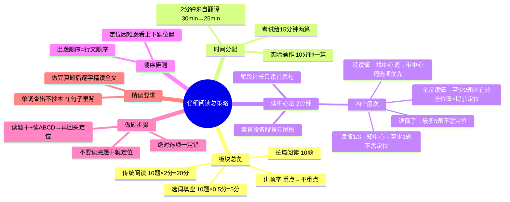

# CET-4：仔细阅读——读中心法与答题策略

> 📌 重构说明：源文件是阅读理解板块的总纲课，老师以极具个人风格的方式讲授了「读中心法」这一核心策略。本笔记打破老师「先讲理论→再带例题→中间插广告」的线性流，按「板块总览→读中心法→顺序原则→题型简化→做题步骤→真题示范→精读要求」的知识树重构。

---

## 🧠 思维导图

---

## 第一部分：板块总览

### 一、阅读三板块

| 板块 | 题数 | 分值 | 优先度 | 老师原话 |
|------|:---:|------|:---:|------|
| 传统阅读（仔细阅读） | 10题 | **2分/题，共20分** | ⭐⭐⭐ | 「最值钱」 |
| 长篇阅读 | 10题 | — | ⭐⭐ | 第二位讲 |
| 选词填空 | 10题 | **0.5分/题，共5分** | ⭐ | 「不值钱，单词不认识也没法做」 |

> 讲顺序 = 从重点到不重点：先仔细阅读 → 再长篇阅读 → 最后选词填空。

### 二、时间分配

| 项目 | 时间 |
|------|:---:|
| 考试委员会给的时间 | 15分钟 / 两篇 |
| 即每篇 | 7-8分钟 |
| 老师给你 | **10分钟 / 一篇** |

> 多出来的 2 分钟从哪来？**从翻译偷的**。翻译给 30 分钟，老师保证 25 分钟让你结束——写作翻译板块的方法课就是为此服务的。

---

## 第二部分：读中心法——2分钟改变一切

### 三、为什么要读中心？

> 大部分同学做阅读的方法：读题干 → 回头关键词定位 → 读找到的句子 → 对应ABCD。从不读中心。
>
> 老师直言：「我知道你怎么做阅读的。」

**读中心后会发生什么？**

> 五道题中，**至少有一道题不需要定位**，靠中心就能选出来。最多五道题全部不需要定位，靠中心直接解题——正确率 **100%**。

所以这 2 分钟的投入：

| 情况 | 产出 |
|------|------|
| 读懂中心 | 至少省掉 1 道题的定位时间 + 提高全部题的正确率 |
| 最理想情况 | 五道题全不用定位，2 分钟换 10 分钟的全对 |
| 最差情况 | 至少 2 道题出在首段/尾段/各段首句→当提前定位了 |

### 四、读中心法四步法

| 步骤 | 操作 | 时间 |
|:---:|------|:---:|
| 1 | 读 **第一段**（全文） | — |
| 2 | 读 **各段首句**（每段只读第一句） | — |
| 3 | 读 **最后一段** | — |
| 4 | 特殊情况：最后一段太短（3-4行）→ 全读完；太长（7-8行）→ 只读首尾句 | — |

**总计：约 2 分钟。**

> 不要逐句翻译！假设自己是一个「成绩一般的四级考生」——有些词不认识是正常的，有些句子读不懂也是正常的。读懂 1/3 就够。

### 五、读中心法的四个层次

| 层次 | 你读懂了什么 | 接下来怎么做 |
|:---:|------|------|
| 🥇 | 读懂了全文中心 | 五道题靠中心直接选——「笑得残废」 |
| 🥈 | 读懂了 1/3 以上 | 至少一道题不需定位 |
| 🥉 | 什么都没懂，但找到了**中心词** | 做题时，选项中带中心词的通常就是正确答案 |
| 🏅 | 中心词都没找到 | 至少 2 道题出在这些位置 → 权当提前定位了 |

> **中心词是什么？** 在首段、各段首句、尾段中反复出现的那个词/概念。
>
> 注意：中心词可能被同义替换——第一段叫「curiosity」，第二段叫「this means of information gathering」，第三段叫「it」。一篇文章只有一个中心，只是换着说法讲。

---

## 第三部分：解题铁律

### 六、顺序原则

> 出题顺序 = 行文顺序。

| 题号 | 原文位置 |
|:---:|------|
| 21题 | 文章前半段 |
| 22题 | 21题之下 |
| 23题 | 22题和24题之间 |
| 24题 | 靠后 |
| 25题 | 文章末尾 |

当一道题的定位很难找时（如「从文章可以看出哪个选项正确」），怎么办？

> 看这道题的**上一题**定位在哪、**下一题**定位在哪——答案就在它们之间。

> 四级至今**从未出现过半次例外**。（六级出现过一次。）

### 七、做题步骤——比你以为的多一步

| 常犯错误 | 正确做法 |
|----------|------|
| 读题干 → **直接**回头定位关键词 | 读题干 → **先把ABCD读完** → 再回头定位 |

> 为什么？很多时候读完 ABCD，你根本不需要定位了——中心已经帮你排除了错误选项。

### 八、选项判断铁则

> **说话太绝对的选项，一定错。**

如：only humans have curiosity（只有人类有好奇心）→ 排除。

不要看到就论证它「有没有可能对」——直接排除。这是四级选项设计的规律。

---

## 第四部分：真题示范——Human Curiosity（2021年12月卷1）

### 九、读中心实操

老师模拟「成绩一般的四级考生」——很多词不认识，但不影响抓中心：

| 位置 | 原文要点 | 读懂的关键 |
|------|------|------|
| 首段 | Human thirst for knowledge is a driving force... But curiosity can also be dangerous, leading to setbacks or even downfalls. | 虽然有不认识的词（thirst, setbacks, downfalls），但 but 转折后的「好奇心也可能是危险的」完全读懂了。 |
| 首段下半 | Given curiosity's complexity, scientists have found it hard to define. | complexity → complex（复杂），所以「好奇心很难定义」 |
| 第二段首句 | ...it's some means of information gathering. | 「好奇心是收集信息的一种方式」 |
| 第三段 | 全段没读懂 | 没关系！ |
| 第四段 | Infants have to learn an incredible amount of information...curiosity is one of the tools... | 「婴儿要学大量信息，好奇心是完成这项工作的工具」→**对上第二段**：好奇心=收集信息的方式 |
| 第五段 | 只有一句话：But curiosity often comes with a cost. | 好奇心要付出代价 → **对上第一段**：好奇心有危险 |
| 尾段 | Testing out a new idea can lead to disaster. For instance... | 「测试新想法可能导致灾难」→ 例子不用看了，一定是证明好奇心有危险 |

**读中心后得出的结论**：

> 好奇心有好的一面（帮我们收集信息、促进发展），也有坏的一面（可能导致灾难）。

### 十、用中心做题（无定位解题示范）

**Q51: What does the author say about curiosity?**

| 选项 | 用中心判断 | 结果 |
|------|------|:---:|
| A. 对非科学家来说太复杂难以理解 | 中心没提「非科学家」 | ❌ |
| B. 它是推动人类社会进步的力量 | **中心说了「好的一面」** | ✅ |
| C. 它是人类种族独一无二的特点 | 「独一无二」「只有人类有」→ 太绝对 | ❌ |
| D. 它是人类失败的主要原因 | 中心说好奇心确实有坏处，但不是「主要原因」 | ❌ |

> 答案 B —— 读懂了中心，这道题根本不需要定位。

---

## 第五部分：必做——真题精读法

### 十一、做完题之后

> 你听老师讲过的每一篇文章 + 你自己练习的每一篇真题，做完之后必须**全文精读**：

| 步骤 | 操作 |
|:---:|------|
| 1 | 从头到尾**逐字逐句**读 |
| 2 | 不认识的单词**查出来**，写在旁边（不要抄到小本上！） |
| 3 | 早晨起来**在这篇文章的句子里**背这些单词 |

**为什么必须精读？**

> 四级就是 **4500 个单词的排列组合**。这次考的 pending down、tricky、setback，下次还考。你在真题文章里背过的单词，才是最可能再遇到的单词。

---

---

## 🔗 知识网络

### 前置依赖
- [[英语四级考试大纲]] — 阅读部分的考纲要求
- [[英语四级词汇]] — 核心词汇积累

### 后续应用
- [[02CET4-阅读-题型分类与主旨题解法]] — 各类题型的专项解法
- [[CET4-阅读-仔细阅读泛读与主旨定位]] — 泛读和主旨定位技巧
- [[CET4-阅读-长篇章阅读解题方法]] — 长篇阅读的自适应方法

### 对比辨析
- 仔细阅读（2篇×10题）vs 长篇阅读（1篇×10题）：仔细阅读每篇约350词、每篇5题，长篇阅读约1000词、10道信息匹配题——仔细阅读重精读推理，长篇阅读重扫读匹配
- 先题后文 vs 先文后题：仔细阅读建议先读题干（但不读选项），带着问题读文章——效率最高

## 📚 核心词条索引
