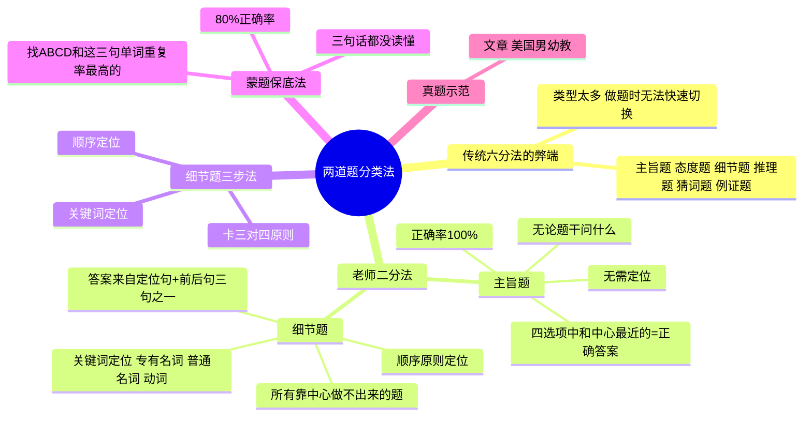

# CET-4：仔细阅读——题型分类与主旨题解法

> 📌 重构说明：源文件的核心独创内容是「两道题分类法」——传统教学中阅读题被分成六种（主旨、态度、细节、推理、猜词、例证），但老师将全部题型压缩为「主旨题 vs 细节题」二分类。合并了另一篇真题示范（美国男幼教）。按「二分类法→主旨题铁律→细节题三步→蒙题保底→真题示范」的知识树重构。

---

## 🧠 思维导图

---

## 第一部分：二分类法——打破传统的简化

### 一、传统六分法的问题

| 传统分类 | 题型 |
|----------|------|
| 主旨题、作者态度题、细节题 | 六种题型，每种有不同解法 |
| 推理题、猜词/猜句题、例证题 | 做题时要先判断类型再调用方法 |

> 老师直言：「哪那么多题嘛！」——六分法让学生面对题目时陷入分类焦虑，反而忽略了最重要的事：**你已经读了中心**。

### 二、二分法的革命

| 题型 | 定义 | 判断标准 |
|------|------|------|
| **主旨题** | 无论题干问什么，四选项中与文章中心靠得最近的=正确答案 | 不需要管题干问的是什么 |
| **细节题** | 所有靠中心做不出来的题 | 排除了主旨题后剩下的 |

> 「不是问『文章中心是什么』才叫主旨题！」
>
> ——很多题看起来像细节题，但只要选项中有某个和中心高度吻合的，它就是隐藏的主旨题。

---

## 第二部分：主旨题——杀招级铁律

### 三、主旨题核心铁律

> **无论题干问什么，四个选项中和文章中心靠得最近的选项一定正确。**

| 法则 | 说明 |
|------|------|
| 不需要读题干 | 读中心就够了 |
| 不需要定位 | 看四个选项谁的核心理念对上了你的中心理解 |
| 正确率 | **100%** —「正确率一千万%，的N次方，绝对正确」 |

### 四、主旨题的隐藏形态

很多题看起来是细节题，实际是主旨题：

| 题干问法 | 看起来像 | 实际是 |
|------|:---:|:---:|
| What does the author say about X? | 细节题 | 如果X=中心词→主旨题 |
| What can we learn from the passage? | 推断题 | 绝大多数情况=主旨题 |
| Which of the following is true? | 细节题 | 看选项，和中心最近的优先 |

> 一旦你读懂了中心，你就不需要思考「这道题是什么类型」——和中心吻合的就是对的，不吻合的就排除。

### 五、前置依赖：你必须先读中心

> 「如果中心没读懂，咱们就不知道谁是主旨题了——那就是全部都是细节题。」

| 状态 | 做题策略 |
|------|------|
| 读懂了中心 | 先扫全五题，识别出主旨题→直接选 |
| 没读懂中心 | 五道题全部按细节题处理→逐题定位 |

---

## 第三部分：细节题——三步定位法

### 六、步骤一：关键词定位

| 关键词类型 | 优先级 | 示例 |
|------|:---:|------|
| 专有名词 | ⭐⭐⭐ | 人名、地名、机构名 |
| 普通名词 | ⭐⭐⭐ | 实义名词 |
| 动词 | ⭐⭐ | 定位宽泛时分大方向 |

> ⚠️ 如果拿 center word（如「curiosity」）来定位——因为整篇文章都是它，你定位不了。此时启用下一步。

### 七、步骤二：顺序定位

> 上一道题定位在第二段，下一道题定位在第四段 → 这道题一定在第三段。

这是「读中心法」笔记中顺序原则的直接应用。

### 八、步骤三：卡三对四——三句话定答案

> 细节题的正确答案一定来自**定位句 + 前一句 + 后一句**这三句话中某一句的同义改写。

| 操作顺序 | 动作 |
|:---:|------|
| 1 | 先看定位句 → 和ABCD比对 |
| 2 | 定位句和选项无重合 → 读定位句的**上一句** |
| 3 | 还是没对上 → 读定位句的**下一句** |
| ✅ | 三句中必有一句的同义改写=正确答案 |

---

## 第四部分：蒙题保底法

### 九、三句话都读不懂怎么办？

> 「四六级还是很简单的，不像考研那么难。」

| 操作 | 说明 |
|------|------|
| 锁定三句话 | 定位句 + 前句 + 后句 |
| 扫ABCD四个选项 | 逐一比对 |
| 找单词重复率 | 哪个选项和这三句话的单词重合最多 |

> 重复率最高的选项，正确率约 **80%**。这是蒙，但这是「有道理的蒙」。

---

## 第五部分：真题示范——美国男幼教

### 十、读中心（2分钟）

> 2021年12月 卷二 第一篇文章

| 位置 | 关键句 | 解读 |
|------|------|------|
| 首段 | Only 3% of early childhood teachers are male in the US. Experts say this may have an impact on young children whose understanding of gender roles and identity are rapidly forming. | 美国幼教只有3%是男性，这对正在形成性别认知的孩子有影响 |
| 首段延续 | Having access to diverse teachers is beneficial...they are more likely to get exposed to different varieties of play and communication. | 接触不同性别的老师有好处 |
| 第二段 | In our society, we have very specific stereotypes for gender roles. | 社会对性别有固化的刻板印象（原因层） |
| 第三段 | Although supported by colleagues and family, many male educators report facing social and cultural resistance. | 虽然家人同事支持，但社会文化在抵制（矛盾层） |
| 第四段 | Researchers made several recommendations to increase male representation in the field. | 研究者提出建议（解决层） |
| 第五段 | Cities and programs should establish support teams...and provide mentorship and professional development advice. | 具体建议①：建支持团队+职业指导 |
| 第六段 | Authors also suggest traditional recruiting methods cannot address the gender gap...recommend giving young men opportunities to work with children through training and volunteer programs. | 具体建议②：传统招聘不行，要让年轻男性通过培训/志愿者接触孩子 |

**中心一句话总结**：

> 美国幼教男性太少（3%），对孩子不好（影响性别认知），原因是社会刻板印象+文化抵制，解决方向是改招聘+建支持+让更多男性接触幼儿教育。

### 十一、用中心做题

**Q: What is the passage mainly about?**

→ 四个选项中，哪个是对「男幼教太少→不好→原因→建议」的最佳概括？直接用中心匹配，不需要定位。

**注意中心词替换**：

| 原文 | 替换说法 |
|------|------|
| early childhood teachers | young learners' educators |
| male teachers | male educators, male representation |
| young children | youngest learners, early childhood |
| impact | influence, affect |

> 中心词一直在换，但你认得出来，因为一篇文章只有一个中心。

---

> 📂 所属分类：

## 🔗 相关知识点

| 知识点 | 类型 | 说明 |
|--------|------|------|
| [[读中心法]] | 核心策略 | 读懂中心是解主旨题的前提 |  |
| [[关键词定位]] | 细节题技巧 | 通过题干关键词快速定位到文章对应位置 |  |
| [[卡三对四原则]] | 细节题技巧 | 定位句+前句+后句三句话对应四个选项 |  |
| [[同义替换]] | 选项特征 | 正确答案常以同义替换形式出现 |  |
