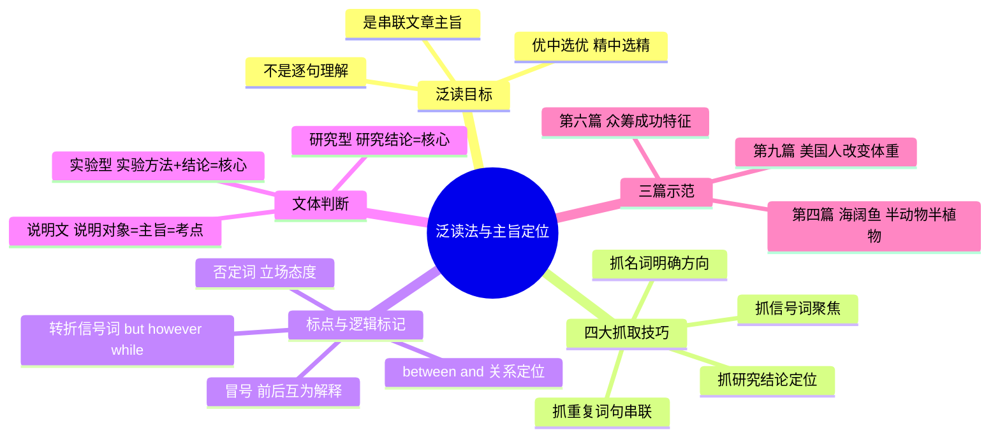

# CET-4：仔细阅读——泛读法与主旨定位三篇示范

> 📌 重构说明：三个源文件各讲一篇真题的泛读示范（美国人改变体重、众筹成功特征、海阔鱼），共享同一套泛读方法论。合并后按「泛读法总纲→平行阅读技巧→文体判断策略→三篇全程示范」的知识树重组。

---

## 🧠 思维导图



---

## 第一部分：泛读法总纲

### 一、什么是泛读？

> 「我们现在目标的重点不是去把文章的每个句子去读明白，也不是把每个词让大家深深地刻在心中，而是要把文章的主旨串起来。」

| 传统做法 | 泛读法 |
|----------|------|
| 逐句翻译 | 优中选优，精中选精 |
| 每个词都关注 | 只抓能串联主旨的句子 |
| 看全段 | 只读首段+各段首句+尾段 |
| 读不懂就卡住 | 读不懂就跳过，不中断串联 |

### 二、泛读操作流程

```
首段（全文精读）
    ↓
各段首句（只读第一句）
    ↓
尾段（全文精读，太长则只读首尾句）
    ↓
在脑中串联：这篇文章在讲什么？
```

---

## 第二部分：四大抓取技巧

### 三、技巧一：抓名词——明确方向

> 「名词会代表着文章的主要方向。」

当你一眼扫到句中的核心名词时，这篇文章的大方向就有了。

| 示例 | 看到的名词 | 推断方向 |
|------|------|------|
| 「Americans spend billions...trying to change their weight through diet, gym, plastic surgery」 | change weight | → 文章讲美国人改变体重 |
| 「When we think of animals and plants...」 | animals, plants | → 文章围绕动植物展开 |
| 「those are a few of the traits of successful science crowdfunding efforts」 | traits, crowdfunding | → 文章讲众筹成功的特征 |

> 关键：看到名词后，问自己「这篇文章要围绕什么展开？」——而不是去记 diet、gym 这些细节词。

### 四、技巧二：抓重复词句——串联逻辑

> 「后文对前文出现的内容重复——这就是文章在绕着同一个主题讲。」

| 位置 | 重复的词/模式 | 含义 |
|------|------|------|
| 第一段：trying to change their weight |
| 第二段：trying to live up to the images | trying to 的重复 | 第二段仍在讲「改变外形」 |
| 第三段：wanting to look perfect | perfect = 完美形象 | 第三段在讲「为什么要追求完美外表」 |

**串联方法**：用箭头（↓）标注段落之间的逻辑关系。

> 第二段画 ↓：这件事带来负面影响
> 第三段画 ？：为什么大家要这么做？
> 第四段画 ○↔○：职场成功 ↔ 身体形象的关系

### 五、技巧三：抓研究结论——锁定重点

> 「如果文章中看到有 research、study、literature、experiment 这类词——这篇文章大概率是在引用研究结论。」

| 信号模式 | 示例 | 处理方式 |
|----------|------|------|
| One recently published study... | 最近发表了一项研究 | **结论本身=考点** |
| As in other research... | 与其他研究一样 | 同属研究结论段落 |
| We found that... | 我们发现... | 结论句，重点关注 |
| Our finding suggests... | 我们的发现表明... | 结论句 |

> 第九篇中 5/6/7/8 段全是研究结论——四段串起来就是：「个人对体重的自我认知与职场成功**没有关系**。」

### 六、技巧四：抓转折与标点——聚焦关键句

| 标记 | 含义 | 操作 |
|------|------|------|
| **but / however** | 转折，后面=重点 | 重点关注转折后的句子 |
| **while**（句首） | 虽然...但是... | 重点是「但是」后面的主句 |
| **冒号（:）** | 前后互为解释 | 冒号前后意思相同，读一半即可 |
| **否定词（no / not）** | 立场、态度 | 否定词后面的内容=作者的核心判断 |
| **between A and B** | 两者之间的关系 | 直接定位：文章在讲A和B的关联 |

---

## 第三部分：文体判断——不同类型不同重心

### 七、三大文体识别

| 文体类型 | 识别特征 | 泛读重心 | 示例文章 |
|----------|------|------|------|
| **说明文** | 开篇介绍一种事物/概念，通常生僻 | 说明对象=主旨=考点 | 海阔鱼（半动物半植物） |
| **研究型** | 开篇抛出一个研究结论 | 研究结论=全文核心 | 美国人改变体重 |
| **实验/调查型** | 为探究X而调查/实验 | 实验目的+结论=核心 | 众筹成功特征 |

---

## 第四部分：三篇泛读全程示范

### 八、第九篇：美国人改变体重（长文泛读）

**文章难度**：篇幅极长（9段），首段和各段首句加起来字数众多。

**泛读过程**：

| 段落 | 读到的内容 | 串联结果 |
|:---:|------|------|
| 第一段 | Americans spend billions...trying to change their weight through diet, gym memberships, plastic surgery | **方向**：美国人改变体重的问题 |
| 第二段 | trying to live up to the images...a dark side: anxiety, depression, unhealthy strategies | ↓ 改变体重的**暗面**：焦虑、抑郁、不健康策略 |
| 第三段 | wanting to look perfect...why... | ？为什么要追求完美外形 |
| 第四段 | While literature on labor market success...no one has explored the other side | ○↔○ **职场成功** 与 **身体形象** 的关联 |
| 第五段 | One recently published study...teenage body shape and adult form | 研究结论①：体型相关 |
| 第六段 | As in other research...women tend to over-perceive their weight | 研究结论②：女性往往高估自己的体重 |
| 第七段 | We found **no** relationship between personal perception of weight and labor market outcomes | 研究结论③：**核心结论——两者没有关系！** |
| 第八段 | Our finding...misperceived weight just not harm workers | 研究结论④：体重错误认知不会伤害员工 |
| 第九段 | changing discrimination laws to include body type...would help | **建议**：修改反歧视法纳入体型 |

**主旨串联**：美国人追求改变体重 → 这件事有暗面（焦虑抑郁）→ 为什么要做？→ 研究和职场的关联 → **最终结论：个人对体重的认知与职场成功之间并无关联** → 建议修改法律。

### 九、第六篇：众筹成功的特征（研究型泛读）

**开头识别**：开篇即抛 study / research。

**泛读过程**：

| 段落 | 读到的内容 | 串联结果 |
|:---:|------|------|
| 第一段 | Thinking small, being engaging, having a sense of humor → traits of successful science crowdfunding efforts. But having a large network and promotional skills may be more crucial. | **核心结论**：众筹成功需要谦虚+互动+幽默感，但更重要的是人脉+推广技能 |
| 第二段 | Crowdfunding is raising money for a project through online appeals. Has taken off in recent years. | 众筹的定义+近年爆发增长 |
| 第三段 | A team examined 371 web pages for crowdfunding projects to separate success from failure. | 研究方法：检查了 371 个众筹网页 |
| 第四+段 | (细节展开) | 方法的细化 |

**主旨**：一项研究分析了 371 个众筹项目，发现成功的关键特征——谦虚、互动、幽默，但**更关键的是人脉网络和推广技能**。

### 十、第四篇：海阔鱼（说明文泛读）

**开头识别**：开篇即介绍一种新奇事物/概念。

**泛读过程**：

| 段落 | 读到的内容 | 串联结果 |
|:---:|------|------|
| 第一段 | Animals and plants divided into two groups: one converts sunlight into energy, the other eats food. But this dividing line comes crashing down with the discovery of a sea slug that's **truly half animal and half plant**. | **说明对象**：海阔鱼——半动物半植物！分界线被打破 |
| 第二段 | The sea slug can manufacture...the green pigment（叶绿素） | 植物特性面：能产生叶绿素 |
| 第三段+ | Its animal half...how it hijacks genes from algae it feeds on... | 动物特性面：它劫持藻类基因 |

**主旨**：一种叫海阔鱼的生物打破了动植物分界线——它既是动物（以藻类为食），又是植物（能产生叶绿素），因为它**劫持了所食藻类的基因**。

---

## 第五部分：泛读后——做题时的应用

### 十一、泛读如何转化为答案

| 你从泛读中拿到了什么 | 做题时怎么用 |
|------|------|
| 文章主旨（一句话概括） | 主旨题直接选，不用重新定位 |
| 各段主题关键词 | 细节题缩小定位范围 |
| 研究结论（结论句） | 细节题/推断题的核心依据 |
| 作者态度（否定词/转折） | 态度题直接选 |

> 泛读不是浪费时间——它是让你从「逐题定位」升级到「一读解五题」的能力跃迁。

---

> 📂 所属分类：

## 🔗 相关知识点

| 知识点 | 类型 | 说明 |
|--------|------|------|
| [[读中心法]] | 核心策略 | 只读首段+各段首句+尾段，串联主旨 |  |
| [[信号词]] | 辅助技巧 | 转折词、标点符号提示重点内容 |  |
| [[同义替换]] | 选项特征 | 中心词可能被替换，需注意识别 |  |
