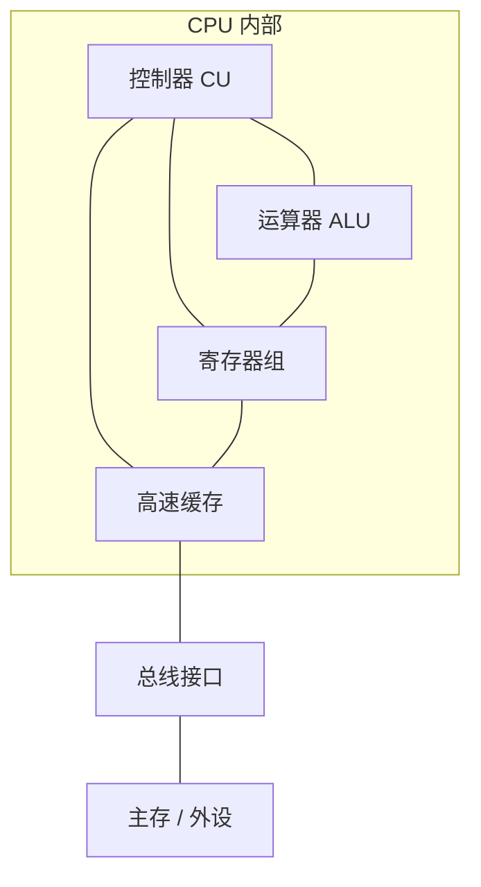
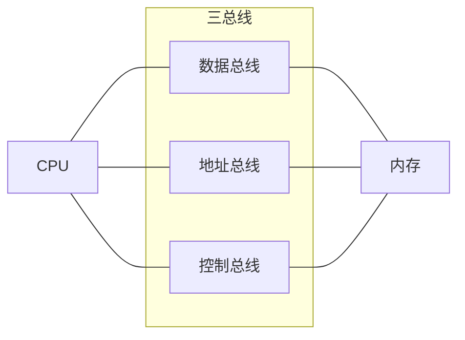

# 计算机硬件组成与总线结构

> 📌 重构说明：本笔记是的进阶深化，聚焦于硬件内部的总线连接机制、CPU微体系结构分化和存储层次，用「系统思维」打通软硬件之间的桥梁。

---

## 🧠 思维导图

```mermaid
mindmap
  root((计算机硬件组成与总线))
    摩尔定律
      18个月翻一倍
      从 Intel 4004 (2250晶体管) 到现代 CPU (数百亿)
    计算机抽象表示
      硬件层：微体系结构 → 功能部件 → 电路 → 器件
      软件层：算法 → 编程语言 → 操作系统
      🟡 ISA = 软硬件之间唯一的「合同」
    CPU内部结构
      运算器 ALU
      控制器 CU
      寄存器组（PC / IR / 通用寄存器）
      高速缓存 Cache
    总线结构
      数据总线（双向）
      地址总线（单向，CPU→外设）
      控制总线（读写/中断/时钟信号）
    存储层次
      L1 Cache（最快/最小）
      L2 / L3 Cache
      主存 DRAM
      外部存储（SSD / HDD）
      ⚡ 金字塔越高 → 越慢 / 越大 / 越便宜
    可执行文件
      定义：计算机可以立即执行的文件
      源代码 ≠ 可执行文件
```

---

## 第一部分：摩尔定律——硬件能力的指数爆发

### 一、晶体管密度的持续翻倍

摩尔定律的核心观察：集成电路上可容纳的晶体管数目，约每隔 **18~24 个月** 就会翻一番。

| 代表芯片 | 年份 | 晶体管数 | 制程 |
|----------|------|----------|------|
| Intel 4004 | 1971 | 2,250 | 10μm |
| Intel 8086 | 1978 | 29,000 | 3μm |
| Intel 80486 | 1989 | 1,200,000 | 1μm |
| Pentium 4 | 2000 | 42,000,000 | 180nm |
| Core i7 (8代) | 2017 | ~2,000,000,000 | 14nm |
| Apple M2 Ultra | 2023 | 134,000,000,000 | 5nm |

> [!info] 补充定义
> **制程（Process Node）**：指芯片上晶体管栅极的最小宽度，用纳米（nm）衡量。制程越小 → 晶体管越密集 → 性能越强、功耗越低。目前已推进至 3nm 量产（如 Apple A17 Pro）。

---

## 第二部分：计算机的抽象表示——从算法到晶体管

### 二、软件层与硬件层的划分

> 老师原话：「一首音乐，它在计算机内部是经过一层层的质量转换的。软件层跟硬件层之间是协同完成的。」

计算机系统由**软件层**与**硬件层**两大阵营构成，中间以  为分界线：

| 层次 | 包含内容 |
|------|----------|
| **软件层** | 算法层 → 编程语言 → 操作系统 |
| ═══════ | ═══ ISA 分界线 ═══ |
| **硬件层** | 微体系结构 → 功能部件 → 电路 → 器件 |

### 三、各硬件层级的含义

| 层级 | 含义 | 例子 |
|------|------|------|
| **微体系结构** | CPU 内部的具体设计 | 流水线深度、分支预测器 |
| **功能部件** | 独立的硬件功能模块 | ALU、寄存器文件、MMU |
| **电路** | 逻辑门的组合 | 与门、或门、触发器等基本电路 |
| **器件** | 物理实体 | 晶体管、电阻、电容 |

---

## 第三部分：CPU 内部结构深入

### 四、CPU 的核心组件



#### 4.1 运算器（ALU）

- 算术逻辑单元
- 执行加法、减法、乘除法、移位、与/或/非等操作
- **只管「算」，不管「指挥」**

#### 4.2 控制器（CU）

- 控制单元，CPU 的「指挥中心」
- 负责：取指令、译码、发出控制信号
- 协调所有部件按正确的时间顺序工作

#### 4.3 寄存器组

| 寄存器 | 全称 | 作用 |
|--------|------|------|
| **PC** | 程序计数器 | 存放下一条指令的地址 |
| **IR** | 指令寄存器 | 存放当前正在执行的指令 |
| **SP** | 栈指针 | 指向栈顶 |
| **通用寄存器** | EAX/EBX/ECX/EDX | 存数据、地址 |
| **PSW/FLAGS** | 状态寄存器 | 存标志位（零标志、进位标志、溢出标志等） |

#### 4.4 高速缓存（Cache）

- 位于 CPU 和主存之间
- 速度极快（几乎与 CPU 同频）
- 容量小（KB ~ MB 级）
- 存放近期可能使用的数据和指令

---

## 第四部分：总线结构——计算机的「血管」

### 五、总线的定义与作用

> 📖 标准定义：总线是计算机各部件之间传输信息的**公共通信通道**，由一组导线组成，所有部件共享这条通信线路。

总线让 CPU、内存、I/O 设备能互相传递信息。类比：公路系统——任何城市（部件）都能通过公路（总线）连接到其他城市。

### 六、三种总线的分工



| 总线类型 | 方向 | 功能 | 宽度决定什么 |
|----------|------|------|-------------|
| **数据总线** | 双向 | 传输数据 | 一次能传多少位数据 |
| **地址总线** | 单向（CPU →） | 传输地址 | 最大寻址空间 |
| **控制总线** | 混合 | 传输控制、时序、中断信号 | 协调各部件工作 |

### 七、地址总线的寻址能力计算（重要例题）

$$ \text{最大寻址空间} = 2^{\text{地址总线宽度}} $$

| 地址总线宽度 | 最大寻址空间 | 计算过程 |
|-------------|-------------|----------|
| 16 位 | 64 KB | $2^{16} = 65,536$ 字节 |
| 20 位 | 1 MB | $2^{20} = 1,048,576$ 字节 |
| 32 位 | 4 GB | $2^{32} = 4,294,967,296$ 字节 ≈ 4 GB |
| 64 位 | 16 EB | $2^{64} \approx 1.8 \times 10^{19}$ 字节 ≈ 16 EB |

> [!warning] 考点
> ⚠️ 计算题高频：给定地址总线宽度，推算最大支持内存。32 位地址总线最多寻址 **4 GB**，这是 32 位操作系统内存上限 4 GB 的根源。

**解题公式：**
1. 地址总线 n 位 → 可产生 $2^n$ 个不同地址
2. 每个地址对应一个存储单元（通常 1 字节）
3. 总容量 = $2^n$ 字节 → 换算为 KB / MB / GB

---

## 第五部分：存储层次——速度与容量的金字塔

### 八、存储层次结构

```
         ←─ 更小、更快、更贵（每字节）

        ┌──────────┐
        │ 寄存器    │  <─ 1 个时钟周期，~数百字节
        │ L1 Cache │  <─ 2-4 个时钟周期，~32KB
        │ L2 Cache │  <─ ~10 个时钟周期，~256KB
        │ L3 Cache │  <─ ~40 个时钟周期，~8MB-32MB
        │ 主存 RAM  │  <─ ~100 个时钟周期，~GB 级
        │ SSD/HDD  │  <─ ~微秒~毫秒，~TB 级
        └──────────┘

         ←─ 更大、更慢、更便宜（每字节）
```

### 九、Cache 的工作原理：局部性原理

Cache 之所以有效，依赖两个程序行为规律：

| 局部性类型 | 含义 | 例子 |
|-----------|------|------|
| **时间局部性** | 刚访问过的数据很可能再次被访问 | 循环中的变量 `sum` 被反复读写 |
| **空间局部性** | 被访问数据附近的数据很可能很快被访问 | 数组遍历 `a[0], a[1], a[2]...` |

> 老师原话提炼：「CPU 读写内存速度远远跟不上 CPU 本身的处理速度。如果每次都去主存取数据，CPU 大部分时间都在等待。所以需要 Cache。」

---

## 第六部分：可执行文件——程序的最终形态

### 十、什么是可执行文件？

> 老师原话：「可执行文件就是——计算机可以立即执行的文件。」

| 文件类型 | 是否可执行 | 原因 |
|----------|-----------|------|
| `.c` 源代码 | ❌ | 人类可读，计算机不认识 |
| `.py` Python 文件 | ❌ | 需要 Python 解释器 |
| `.o` / `.obj` 目标文件 | ❌ | 缺少外部函数链接 |
| `.exe` （Windows） | ✅ | 完整的机器码 + 元数据 |
| ELF （Linux） | ✅ | Executable and Linkable Format |

### 十一、从代码到可执行文件的完整旅程


每一步都在降一层抽象，直到最终成为 CPU 可以直接读取的二进制机器码。

---

---

## 🔗 知识网络

### 前置依赖
- 计算机层次结构与指令集 — 指令集与CPU设计
- 计算机系统概述与硬件组成 — 五大部件的概念

### 后续应用
- 数据表示与编码概述 — 数据在总线上传输的格式
- 指令格式与数据传送 — 指令通过总线传送数据
- [[存储器层次结构]] — 存储系统中的总线

### 对比辨析
- 系统总线 vs 外部总线：系统总线连接CPU/内存/IO控制器（高速），外部总线连接外设（有多种标准：USB/PCIe/SATA）
- 数据总线 vs 地址总线 vs 控制总线：数据总线双向传输（宽度=字长），地址总线单向（宽度决定最大寻址空间），控制总线传控制信号

## 📚 核心词条索引

| 词条 | 所属概念 | 链接 |
|------|----------|------|
| [[摩尔定律]] | 硬件趋势 | 摩尔定律 |  |
| [[运算器 ALU]] | CPU | 运算器 ALU |  |
| [[控制器 CU]] | CPU | 控制器 CU |  |
| [[寄存器组]] | CPU | 寄存器组 |  |
| [[程序计数器 PC]] | CPU | 程序计数器 PC |  |
| [[指令寄存器 IR]] | CPU | 指令寄存器 IR |  |
| [[数据总线]] | 总线 | 数据总线 |  |
| [[地址总线]] | 总线 | 地址总线 |  |
| [[控制总线]] | 总线 | 控制总线 |  |
| [[Cache（高速缓存）]] | 存储 | Cache（高速缓存） |  |
| [[主存 RAM]] | 存储 | 主存 RAM |  |
| [[局部性原理]] | 存储层次 | 局部性原理 |  |
| [[可执行文件]] | 可执行文件 | 可执行文件 |  |
| [[]] | 核心桥梁 | ISA |  |
| [[10_程序的编译链接与符号解析]] | 链接步骤 | 链接器 |  |
