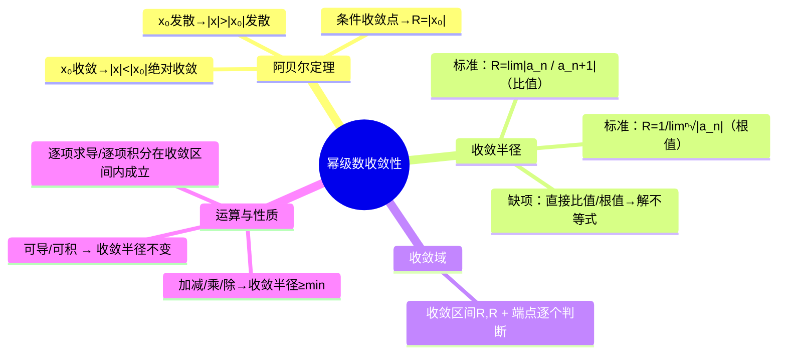

# 高数：幂级数的收敛半径与收敛域

> 📌 重构说明：本笔记是幂级数篇的核心——从阿贝尔定理到收敛半径再到收敛域。已按「阿贝尔定理（第一定理：$x_0$ 收敛→对称区间绝对收敛 / 第二定理：$x_0$ 发散→外侧发散→推论：条件收敛点 = 收敛半径）→标准幂级数收敛半径（比值判别法 $R=\lim|a_n/a_{n+1}|$ / 根值判别法 $R=1/\lim\sqrt[n]{|a_n|}$→带缺项的非标准幂级数→直接比值/根值+解不等式→端点讨论）→幂级数运算（加减/乘法/除法→收敛半径取 $\min$）→和函数性质（连续/可导/可积→逐项求导或积分后收敛半径不变）」的逻辑链重排。合并了「阿贝尔定理与收敛半径」和「函数项级数的基本概念」两篇笔记。

## 🧠 思维导图

---

## 一、阿贝尔定理

### 第一定理

==若幂级数在 $x_0$ 收敛==，则对一切 $|x| < |x_0|$，==绝对收敛==。

### 第二定理

==若幂级数在 $x_0$ 发散==，则对一切 $|x| > |x_0|$，==发散==。

### 推论：条件收敛点 = 收敛半径

==若幂级数在 $x_0$ 处条件收敛，则 $R = |x_0|$==。

其原因：$|x| < |x_0|$ 绝对收敛 + $|x| > |x_0|$ 发散 → $x_0$ 恰好是边界 → 收敛半径 = $|x_0|$。

> 📖 直观类比：收敛区间像一根「能量管道」，阿贝尔定理告诉我们管道直径由趋近无穷大时的主宰项（$|a_n x^n|$）决定——管道内绝对收敛，管道外发散，管壁上需逐个检查。条件收敛就是恰好在管壁上。

---

## 二、收敛半径求法

### 标准幂级数：$\sum a_n x^n$

**比值判别法**：

$$\boxed{R = \lim_{n\to\infty} \left|\frac{a_n}{a_{n+1}}\right|}$$

**根值判别法**：

$$\boxed{R = \frac{1}{\lim_{n\to\infty} \sqrt[n]{|a_n|}}}$$

### 非标准幂级数（有缺项）

如 $\sum n x^{2n}$：$n$ 在但没有 $n$ 在第奇数项。

→ 不能直接套公式。==加绝对值后对一般项 $|u_n(x)|$ 用比值/根值== → 解不等式 → 收敛区间 → 端点单独判断。

---

## 三、收敛域的确定

1. 求收敛半径 $R$ → 收敛区间 $(-R, R)$
2. ==端点逐个代入==：代 $x=R$ 和 $x=-R$ 变成常数项级数 → 用判别法判断
3. 收敛域 = $(-R,R) +$ 收敛的端点

---

## 四、幂级数运算

| 运算 | 收敛半径 |
|------|----------|
| 加减 | $\ge \min\{R_1,R_2\}$ |
| 乘法 | $\ge \min\{R_1,R_2\}$ |
| 除法 | 可能缩小 |

---

## 五、和函数的分析性质

在收敛区间 $(-R,R)$ 内：

1. ==连续==：和函数 $S(x)$ 在 $(-R,R)$ 内连续
2. ==可导==：$S'(x) = \sum n a_n x^{n-1}$，收敛半径不变
3. ==可积==：$\int_0^x S(t)dt = \sum \frac{a_n}{n+1}x^{n+1}$，收敛半径不变

> [!warning] 考点
> 逐项求导或积分后，收敛半径不变。但端点的收敛性可能改变。

---

---

## 🔗 知识网络

### 前置依赖
- 01_常数项级数的概念与性质 — 级数收敛的基本概念
- 02_正项级数的判别法 — 比值/根值判别法求收敛半径

### 后续应用
- 04_幂级数的和函数 — 已知收敛半径后求幂级数的和函数
- 05_泰勒级数与函数展开 — 函数展开成幂级数的理论基础
- 06_函数展开成幂级数的方法 — 幂级数的展开操作

### 对比辨析
- 收敛半径 R 与收敛域：$R$ 由比值/根值法求出，收敛域 = $(-R, R)$ 再判断端点——$x=\pm R$ 需要单独分析
- 阿贝尔定理的核心结论：幂级数在 $|x| < R$ 内绝对收敛，在 $|x| > R$ 内发散——收敛半径 $R$ 将实数轴分成三个区域

## 📚 核心词条索引

| 知识点链接 | 类别 | 关键词 |
|------|------|--------|
| [[阿贝尔定理]] | 核心定理 | $x_0$收敛则$ | x | < | x_0 | $绝对收敛，$x_0$发散则$ | x | > | x_0 | $发散 |  |
| [[比值判别法]] | 判别方法 | $R=\lim | a_n/a_{n+1} | $，求收敛半径 |  |
| [[根值判别法]] | 判别方法 | $R=1/\lim\sqrt[n]{ | a_n | }$，求收敛半径 |  |
| [[幂级数]] | 核心概念 | $\sum a_n x^n$形式的级数 |  |
| [[收敛半径]] | 核心概念 | 收敛区间的半径R，决定收敛范围 |  |
| [[收敛域]] | 核心概念 | 幂级数收敛的x取值范围，包含端点判断 |  |
