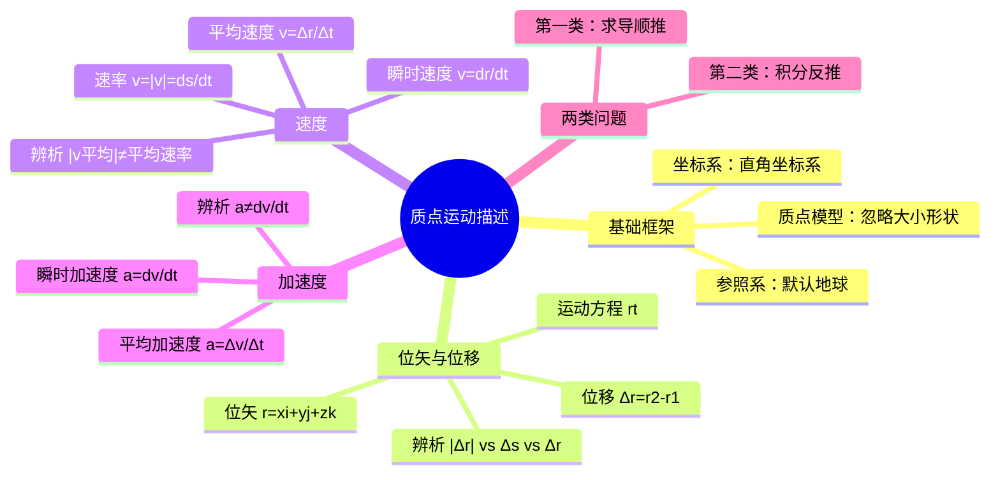

# 大学物理：质点运动描述的物理量

> 📌 重构说明：本笔记是大学物理第一章的开篇，建立质点运动学的基本概念体系。已按「参照系与坐标系 -> 位矢 -> 位移 -> 速度 -> 加速度 -> 两类问题」的知识逻辑重排，并补充了 $|\Delta \vec{r}|$、$\Delta s$、$\Delta r$ 三者的辨析陷阱和微积分思维在运动学中的应用。合并了录音中的课堂例题用于辨析文字符号含义。

## 🧠 思维导图

---

## 一、基础框架

==研究对象必须先简化：== 把物体视为质点模型（无大小、无形状，但有质量的理想模型），然后选定参照系（默认地球），再选取合适的坐标系（本课程以直角坐标系为主）。

> 📖 补充定义：质点是一种理想化模型，当物体的形状和大小对所研究问题的影响可以忽略不计时，即可将物体视为质点。

> [!tip] 哪些情况不能用质点模型？
> 物体自身转动（如陀螺自旋）、形变不可忽略（如弹簧振动）时必须用刚体模型或弹性体模型。

---

## 二、位置矢量（位矢）

从坐标原点向质点位置引的有向线段：

$$\vec{r} = x\vec{i} + y\vec{j} + z\vec{k}$$

大小：$r = |\vec{r}| = \sqrt{x^2 + y^2 + z^2}$

**运动方程**：$\vec{r}(t) = x(t)\vec{i} + y(t)\vec{j} + z(t)\vec{k}$（位矢随时间变化的函数）

---

## 三、位移——第一个易错重灾区

$$\Delta \vec{r} = \vec{r}_2 - \vec{r}_1$$

> [!warning] 考点
> **$|\Delta \vec{r}|$（位移的大小）、$\Delta s$（路程）、$\Delta r$（位矢长度增量）——三者一般不相等**，是填空题/选择题的经典错误选项。

| 量 | 含义 | 性质 |
|------|------|------|
| $|\Delta \vec{r}|$ | 起点到终点的直线距离 | 矢量模 |
| $\Delta s$ | 沿轨迹走过的总里程 | 标量，$\Delta s \ge |\Delta \vec{r}|$ |
| $\Delta r$ | $r_2 - r_1$（位矢长度的差） | 标量差 |

**特殊情况下相等**：单向直线运动 $\to$ $|\Delta \vec{r}| = \Delta s$。取微元极限 $\to$ $|d\vec{r}| = ds \neq dr$。

> [!example] 例题1：文字符号辨析选择题
> **已知条件**：给出以下五个表达式，判断正误：
> 1. $|\Delta \vec{r}| = \Delta r$
> 2. $|\vec{r}| = r$
> 3. $|\Delta \vec{r}| = \Delta s = \Delta r$
> 4. $|\Delta \vec{r}| = \Delta s$
> 5. $|\Delta \vec{r}| = \Delta s = \Delta r$（同3）
> 
> **求解目标**：判断每个式子是否正确
> 
> **关键步骤**：
> 1. 明确各符号含义：$|\Delta \vec{r}|$ 是位移的大小，$\Delta r$ 是位矢长度的增量，$\Delta s$ 是路程
> 2. 位移大小是起点到终点的直线距离；路程是实际轨迹总长；位矢长度增量是 $r_2 - r_1$
> 3. 三者在一般情况下各不相等
> 
> **答案**：只有第 2 式 $|\vec{r}| = r$ 正确（因为 $r$ 本身就定义为 $|\vec{r}|$），其余均错误。

---

## 四、速度

| | 平均速度 | 瞬时速度 |
|------|----------|----------|
| 公式 | $\vec{v} = \Delta \vec{r} / \Delta t$ | $\vec{v} = d\vec{r} / dt$ |
| 方向 | 与 $\Delta \vec{r}$ 同向 | 轨迹切线方向（前进方向） |
| 大小 | $|\vec{v}| \neq$ 平均速率 | $v = |\vec{v}| = ds/dt$ = 速率 |

> [!warning] 考点
> **平均速度的大小 $\neq$ 平均速率（路程/时间）**。只有在单向直线运动中才相等。而**瞬时速度的大小 = 速率**，因为 $|\vec{v}| = |d\vec{r}/dt| = ds/dt$。

---

## 五、加速度——第二个易错重灾区

$$\vec{a} = \frac{d\vec{v}}{dt} = \frac{d^2\vec{r}}{dt^2}$$

在直角坐标系中的分量展开：
$$\vec{a} = \frac{d^2 x}{dt^2} \vec{i} + \frac{d^2 y}{dt^2} \vec{j} + \frac{d^2 z}{dt^2} \vec{k}$$

加速度大小：$a = |\vec{a}| = \sqrt{a_x^2 + a_y^2 + a_z^2}$

> [!warning] 考点
> **$a = |d\vec{v}/dt| \neq dv/dt$**。$dv/dt$ 只是速率的导数——速率的增量不等于速度增量的模。这是整个运动学中最容易混淆的一对表达式，类似之前 $|d\vec{r}| \neq dr$ 的逻辑。

> [!example] 例题2：加速度表达式辨析题
> **已知条件**：判断下列关于加速度的表达式哪个正确：
> A. $\vec{a} = \frac{d\vec{v}}{dt}$
> B. $a = \frac{dv}{dt}$
> C. $\vec{a} = \frac{d\vec{v}}{dt}$
> D. $a = \left|\frac{d\vec{v}}{dt}\right|$
> 
> **求解目标**：选出正确的加速度表达式
> 
> **关键步骤**：
> 1. 加速度是矢量，定义式为 $\vec{a} = d\vec{v}/dt$（A 和 C 相同，都是正确的矢量定义）
> 2. 加速度的大小 $a = |d\vec{v}/dt|$（D 正确）
> 3. $dv/dt$ 只是速率的导数，不等于加速度的大小（B 错误）
> 
> **答案**：D 正确。A 和 C 是矢量定义式也正确但问的是大小表达式，B 错误。

---

## 六、两类基本问题

| 类型 | 已知 | 求 | 方法 |
|------|------|----|------|
| **第一类问题** | 运动方程 $\vec{r}(t)$ | $\vec{v}$、$\vec{a}$ | ==求导（顺推）== |
| **第二类问题** | 加速度 $\vec{a}$ + 初始条件 | $\vec{v}(t)$、$\vec{r}(t)$ | ==积分 + 代初始条件（反推）== |

> [!example] 例题3：第二类问题——变加速直线运动
> **已知条件**：一质点沿 y 轴正方向运动，加速度 $a = -kv$（$k > 0$ 为常数），初始条件：$t=0$ 时 $v = v_0$，$y = 0$。
> 
> **求解目标**：
> 1. 求速度 $v(t)$
> 2. 求运动方程 $y(t)$
> 3. 经过多长时间小球可认为已停止？
> 
> **关键步骤**：
> 1. 由 $a = dv/dt = -kv$，分离变量：$dv/v = -k\,dt$
> 2. 两边积分：$\int_{v_0}^{v} \frac{dv}{v} = -k \int_0^t dt$，得 $\ln(v/v_0) = -kt$
> 3. 解得 $v(t) = v_0 e^{-kt}$
> 4. 由 $v = dy/dt$，得 $dy = v_0 e^{-kt} dt$，积分得 $y(t) = \frac{v_0}{k}(1 - e^{-kt})$
> 5. 当 $t$ 足够大时 $v \to 0$，$y \to v_0/k$
> 
> **答案**：$v(t) = v_0 e^{-kt}$，$y(t) = \frac{v_0}{k}(1 - e^{-kt})$，当 $t \approx 9.2/k$ 秒时速度趋近于 0。

---

## 🔗 知识网络

### 前置依赖
- 参照系 — 运动描述的参考基准
- 坐标系 — 数学表达的工具
- 01_函数的概念与基本要素 — 运动方程的函数基础
- 导数与微分 — 速度、加速度的计算工具

### 后续应用
- 02_质点运动学两类问题与例题 — 本节知识的具体应用练习
- 03_自然坐标系与加速度分解 — 加速度在自然坐标系中的分解
- 04_圆周运动的角量与线量 — 圆周运动中的角量描述
- 06_动量定理与解题步骤 — 动力学与运动学的衔接

### 对比辨析
- $|\Delta \vec{r}|$ vs $\Delta s$ vs $\Delta r$：位移的大小是直线距离，路程是轨迹总长，位矢长度增量是两端点位矢长度的差值——三者一般不相等
- 平均速度的大小 vs 平均速率：前者是位移大小/时间，后者是路程/时间——只有在单向直线运动中才相等
- $|d\vec{v}/dt|$ vs $dv/dt$：前者是加速度的大小（速度增量模/时间），后者是速率的变化率——二者一般不相等

---

## 📚 核心词条索引

| 知识点链接 | 类别 | 关键词 |
|------|------|--------|
| [[质点模型]] | 基础假设 | 忽略大小形状，只保留质量的理想模型 |
| [[参照系]] | 基础概念 | 描述运动的参考基准，默认选地球 |
| [[坐标系]] | 基础概念 | 数学描述工具，本课程以直角坐标系为主 |
| [[位矢]] | 核心概念 | $\vec{r} = x\vec{i} + y\vec{j} + z\vec{k}$，原点指向质点的有向线段 |
| [[运动方程]] | 核心概念 | $\vec{r}(t)$，描述位矢随时间的函数关系 |
| [[位移]] | 核心概念 | $\Delta \vec{r} = \vec{r}_2 - \vec{r}_1$，起点到终点的有向线段 |
| [[路程]] | 辨析概念 | 标量，质点实际运动轨迹的总长度 |
| [[速度]] | 核心概念 | $\vec{v} = d\vec{r}/dt$，方向为轨迹切线方向 |
| [[速率]] | 核心概念 | $v = |\vec{v}| = ds/dt$，速度的大小 |
| [[加速度]] | 核心概念 | $\vec{a} = d\vec{v}/dt = d^2\vec{r}/dt^2$，速度的变化率 |
| [[第一类问题]] | 方法 | 已知 $\vec{r}(t)$ 求导得 $\vec{v}$、$\vec{a}$ |
| [[第二类问题]] | 方法 | 已知 $\vec{a}$ 积分+初始条件得 $\vec{v}$、$\vec{r}$ |
