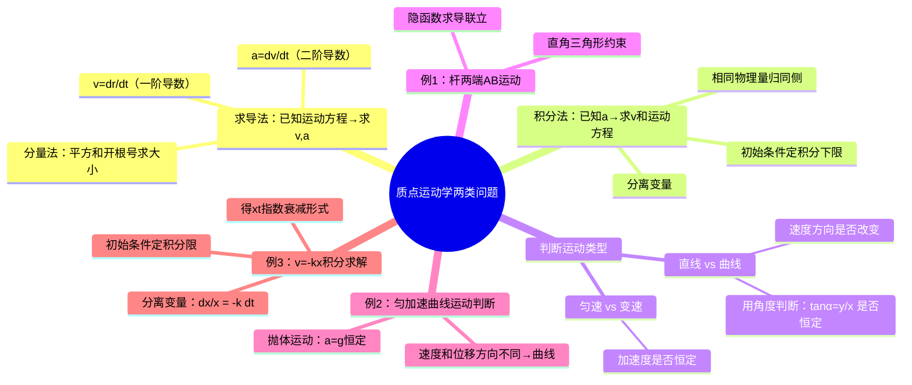

# 大学物理：质点运动学两类问题与经典例题

> 📌 重构说明：本录音前段为大量教务通知（公众号作业、QQ群提醒、点名等），后段为质点运动学的复习讲解与三道精选例题。已严格过滤全部非教学内容，按「两类问题方法论→三道例题精讲」的知识逻辑重组。原始文件自动命名为「老师关于公众号作业的说明」极大误导——实际内容为**质点运动学解题方法课**。

## 🧠 思维导图

---

## 第一部分：质点运动学的方法论

### 一、准备工作三步走（回顾）

> 老师强调：「描述一个质点的运动之前，有三样准备工作一定要先做齐。」

| 步骤 | 内容 | 说明 |
|------|------|------|
| ① 选择参照系 | 确定观察者所在的参考物体 | 运动描述的基准 |
| ② 建立坐标系 | 直角坐标 / 自然坐标 | 量化位置和运动 |
| ③ 建立质点模型 | 忽略物体的形状和大小 | 只关注质心的运动 |

### 二、核心物理量速查（回顾）

| 物理量            | 符号                                        | 定义              | 关键辨析                                      |        |                      |         |     |
| -------------- | ----------------------------------------- | --------------- | ----------------------------------------- | ------ | -------------------- | ------- | --- |
| 位置矢量           | $\vec{r}$                                 | 从坐标原点到质点的有向线段   | 有大小有方向                                    |        |                      |         |     |
| 运动方程       | $\vec{r}(t)$                              | 位矢随时间的变化关系      | —                                         |        |                      |         |     |
| 位移         | $\Delta\vec{r}$                           | 起点指向终点的有向线段     | 与路径无关                                     |        |                      |         |     |
| 位移的大小          | $                                         | \Delta\vec{r}   | $                                         | 位移矢量取模 | ⚠️ ≠ 位矢长度的增量 $\Delta | \vec{r} | $   |
| 路程         | $\Delta s$                                | 实际运动轨迹的长度       | ≥ 位移的大小                                   |        |                      |         |     |
| 速度         | $\vec{v} = d\vec{r}/dt$                   | 位矢的一阶导数         | 方向沿轨迹切线                                   |        |                      |         |     |
| 速度的大小 = 速率 | $v =                                      | \vec{v}         | $                                         | 速度取模   | $v$ 就是速率             |         |     |
| 加速度        | $\vec{a} = d\vec{v}/dt = d^2\vec{r}/dt^2$ | 速度的一阶导数，位矢的二阶导数 | ⚠️ $a \neq dv/dt$（$a$ 是取模，$dv/dt$ 是速率变化率） |        |                      |         |     |

> [!warning] 考点
> ⚠️ 位移的大小 $|\Delta\vec{r}|$、位矢长度的增量 $\Delta|\vec{r}|$、路程 $\Delta s$——三者一般情况下**不相等**。相等条件：(1) 单向直线运动（三者都相等）；(2) 取微分极限时 $|d\vec{r}| = ds$（位移的大小 = 路程）。

> [!warning] 考点
> ⚠️ 加速度的大小 $a = |\vec{a}|$ 是**对整个加速度矢量取模**，不是先取分量求导再取模。$a$ 和 $dv/dt$ 是两个不同的量。

### 三、两类基本问题

> 老师方法论：「拿到一道运动学题目，第一步判断它是直线运动还是曲线运动——如果是直线运动，直接用正负号代替方向，不要写矢量符号。」

| | 第一类问题 | 第二类问题 |
|------|-----------|-----------|
| **已知** | 运动方程 $\vec{r}(t)$ | 加速度 $\vec{a}(t)$ + 初始条件 |
| **求** | 速度 $\vec{v}$、加速度 $\vec{a}$ | 速度 $\vec{v}(t)$、运动方程 $\vec{r}(t)$ |
| **方法** | ==求导==：$\vec{v} = d\vec{r}/dt$，$\vec{a} = d\vec{v}/dt$ | ==积分==：$\vec{v} = \int \vec{a}\,dt$，$\vec{r} = \int \vec{v}\,dt$ |
| **关键** | 分量分别求导后平方和开根号 | 初始条件定积分下限 |

---

## 第二部分：经典例题精讲

### 四、例1：杆两端 AB 的运动（隐函数求导法）

**题目**：长为 $l$ 的细杆，A 端沿 $x$ 轴负方向以恒定速率 $v$ 运动，B 端沿 $y$ 轴运动。求当杆与 $x$ 轴夹角为 $\alpha$ 时 B 端的速度。

**关键分析**：

==不能把整根杆看作一个质点==——A 和 B 的运动速度不同（A 匀速向左，B 变速向下）。分开分析 A 和 B，各看作一个质点。

**Step 1：确定已知条件**

A 沿 $x$ 轴负方向匀速运动：

$$\frac{dx}{dt} = -v \quad \text{（直线运动，直接用正负号，不写矢量符号）}$$

其中 $x$ 是杆的 A 端到原点 O 的距离（即 OA）。

B 沿 $y$ 轴方向运动，待求：

$$v_B = \frac{dy}{dt}$$

其中 $y$ 是杆的 B 端到原点 O 的距离（即 OB）。

**Step 2：找几何约束**

AO = $x$，OB = $y$，AB = $l$（杆长不变），构成直角三角形：

$$\boxed{x^2 + y^2 = l^2}$$

**Step 3：隐函数求导——连接两个未知量**

等式两边同时对时间 $t$ 求一阶导数（$l$ 为常量，导数为 0）：

$$2x\frac{dx}{dt} + 2y\frac{dy}{dt} = 0$$

$$\Rightarrow \quad \frac{dy}{dt} = -\frac{x}{y} \cdot \frac{dx}{dt}$$

**Step 4：代入已知**

$\dfrac{dx}{dt} = -v$，而 $\dfrac{x}{y} = \tan\alpha$（由直角三角形的几何关系）：

$$\frac{dy}{dt} = -\tan\alpha \cdot (-v) = v\tan\alpha$$

**Step 5：代入具体角度**

当 $\alpha = 60°$ 时：$v_B = v\tan 60° = \sqrt{3}v$

> [!warning] 考点
> ⚠️ 此题的核心技巧是「几何约束 + 隐函数求导」。几何约束 $x^2 + y^2 = l^2$ 是连接 A 和 B 两个速度的关键桥梁——等式两边同时求导后，$dx/dt$ 和 $dy/dt$ 就联系起来了。

### 五、例2：判断运动类型（角度分析法）

**题目**：判断质点的运动方程 $\vec{r} = at^2\,\vec{i} + bt^2\,\vec{j}$（$a, b$ 为常量）对应什么运动。

**方法一：角度法判断直线 or 曲线**

> 老师方法论：「设质点位置与 $x$ 轴的夹角为 $\alpha$，如果 $\tan\alpha$ 是常数，说明方向始终不变 → 直线运动。」

$$\tan\alpha = \frac{y}{x} = \frac{bt^2}{at^2} = \frac{b}{a} = \text{常数}$$

==$\tan\alpha$ 是常数 → 质点运动方向始终不变 → **直线运动**。==

**方法二：求导法判断匀速 or 变速**

速度：$\vec{v} = 2at\,\vec{i} + 2bt\,\vec{j}$（随时间变化 → 不是匀速）

加速度：$\vec{a} = 2a\,\vec{i} + 2b\,\vec{j}$（==不随时间变化 → 是匀变速==）

**结论**：==匀变速直线运动==。

**对比：抛体运动为什么是曲线？**

> 抛体运动中，加速度 $\vec{a} = \vec{g}$ 是恒定矢量。但速度方向时刻在改变（水平分量不变，竖直分量因重力而变化），所以速度方向与位移方向**不同** → 是**匀变速曲线运动**。

| 判断项目 | 方法 | 直线运动的判据 | 曲线运动的判据 |
|----------|------|---------------|---------------|
| 方向是否变化 | $\tan\alpha = y/x$ 是否为常数 | 是常数 → 直线 | 非常数 → 曲线 |
| 速度方向不变？ | $\vec{v}$ 的方向是否恒定 | 方向恒定 → 直线 | 方向变化 → 曲线 |

> [!warning] 考点
> ⚠️ 匀加速运动 ≠ 直线运动。抛体运动是匀加速（$a = g$ = 常数）但轨迹是曲线——判断直线/曲线的依据是**速度方向是否改变**。

### 六、例3：已知 $v = -kx$ 求运动方程（积分法）

**题目**：质点沿 $x$ 轴运动，速度与位置的关系为 $v = -kx$（$k > 0$），且 $t = 0$ 时 $x = x_0$。求运动方程 $x(t)$。

> 老师强调：「这题不一样——不给速度与时间的关系，给的是速度与位置的关系。处理方式还是一样的。」

**Step 1：判断为直线运动**

只在 $x$ 方向运动 → 不用写矢量符号，用正负号。

**Step 2：写出基本关系**

$$v = \frac{dx}{dt} = -kx$$

**Step 3：分离变量——相同物理量归同侧**

$$\frac{dx}{x} = -k\,dt$$

> [!warning] 考点
> ⚠️ 分离变量是积分法的核心一步——把所有含 $x$ 的放到左侧，所有含 $t$ 的放到右侧。如果不做这一步，直接积分是积不出来的。

**Step 4：两边积分——初始条件定下限**

$$\int_{x_0}^{x} \frac{dx}{x} = \int_0^t -k\,dt$$

==积分下限由初始条件给出==：$t = 0$ 时 $x = x_0$。

**Step 5：求解**

$$\ln x - \ln x_0 = -kt \quad \Rightarrow \quad \ln\frac{x}{x_0} = -kt$$

$$\boxed{x = x_0 e^{-kt}}$$

> [!info] 物理意义：$x = x_0 e^{-kt}$ 是指数衰减。物理上对应的是**阻尼运动**中位移随时间指数减小。$v = -kx$ 意味着速度与位移成正比且方向相反（$k > 0$ 本身为正，负号保证 $v$ 与 $x$ 反向）——物体越远离原点，回拉速度越大。

---

---

## 🔗 知识网络

### 前置依赖
- 01_质点运动描述的物理量 — 位矢、位移、速度、加速度的基本定义
- 参照系 — 运动描述的参考基准

### 后续应用
- 03_自然坐标系与加速度分解 — 曲线运动中加速度的切向/法向分解
- 05_动力学解题思路与受力分析 — 由受力求运动时的积分法应用
- 11_旋转矢量法与简谐振动描述 — 简谐振动的运动学描述

### 对比辨析
- 第一类问题 vs 第二类问题：前者已知运动方程求 v,a（求导），后者已知 a 求 v,运动方程（积分），互为逆运算
- 角度法 vs 求导法判断运动类型：角度法看 $\tan\alpha$ 是否恒定判断直线/曲线，求导法看 $a$ 是否恒定判断匀/变变速

## 📚 核心词条索引

| 知识点链接 | 类别 | 关键词 |
|------|------|--------|
| [[位矢]] | 核心概念 | 从坐标原点到质点的有向线段$\vec{r}$ |
| [[抛体运动]] | 典型运动 | 匀变速曲线运动，加速度$\vec{a}=\vec{g}$恒定 |
| [[质点模型]] | 理想模型 | 忽略物体形状大小，只关注质心运动 |
| [[运动方程]] | 核心概念 | 位矢随时间的变化关系$\vec{r}(t)$ |
| [[位移]] | 核心概念 | 从起点指向终点的有向线段$\Delta\vec{r}$ |
| [[路程]] | 核心概念 | 实际运动轨迹的长度$\Delta s$ |
| [[速度]] | 核心概念 | 位矢的一阶导数，$\vec{v}=d\vec{r}/dt$ |
| [[速率]] | 核心概念 | 速度的大小，$v=|\vec{v}|$ |
| [[加速度]] | 核心概念 | 速度的一阶导数，$\vec{a}=d\vec{v}/dt$ |
| [[第一类问题]] | 问题类型 | 已知运动方程求速度和加速度，用求导法 |
| [[第二类问题]] | 问题类型 | 已知加速度求速度和运动方程，用积分法 |
