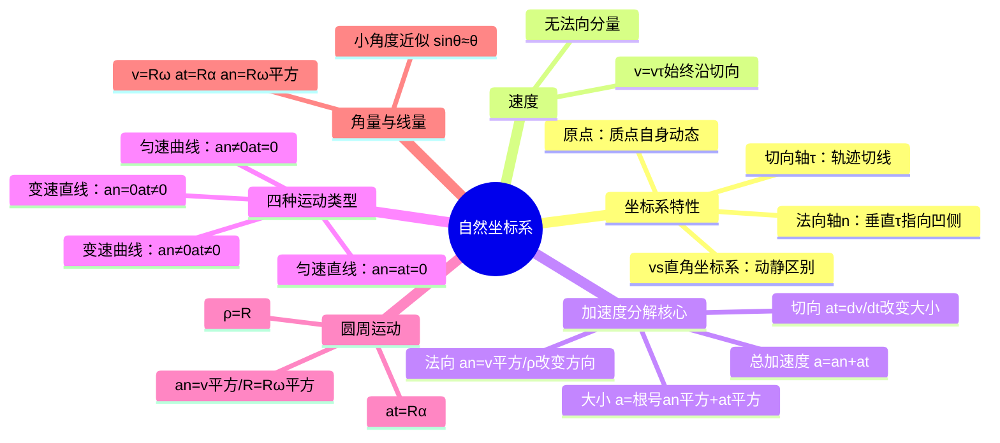

# 大学物理：自然坐标系与加速度分解

> 📌 重构说明：本笔记聚焦于自然坐标系下加速度的切向/法向分解——这是大学物理区别于高中物理的关键升级。已按「自然坐标系建立 -> 速度描述 -> 加速度分解原理 -> 四种运动类型判断 -> 圆周运动特例 -> 角量与线量关系」的逻辑链重排，补充了抛体运动中切向/法向加速度的动态变化分析及典型例题。

## 🧠 思维导图

---

## 一、自然坐标系的建立

==自然坐标系是「跟着质点跑」的坐标系==。原点始终取在质点上，切向轴 $\tau$ 沿轨迹切线指向前进方向，法向轴 $n$ 垂直于切向轴指向运动轨迹的凹侧。

| 自然坐标系 | 直角坐标系 |
|-----------|-----------|
| 原点动态（随质点移动） | 原点固定 |
| 轴向 $\tau, n$（由运动决定） | 轴向 $\vec{i}, \vec{j}, \vec{k}$（固定） |
| 适合曲线运动 | 适合直线运动 |

> 📖 补充定义：自然坐标系是一种跟随质点运动的动态坐标系，其坐标轴方向由质点运动轨迹的切线方向和法线方向确定，特别适合描述曲线运动。

---

## 二、速度在自然坐标系中

$$\vec{v} = \frac{ds}{dt}\vec{\tau} = v\vec{\tau}$$

==速度始终沿切向，不存在法向分量。== 这就是自然坐标系的优雅之处——用一个标量 $v = ds/dt$ 和一个单位矢量 $\vec{\tau}$ 就完整描述了速度。

---

## 三、加速度的切向/法向分解（核心）

$$\boxed{\vec{a} = \vec{a}_n + \vec{a}_t = \frac{v^2}{\rho}\vec{n} + \frac{dv}{dt}\vec{\tau}}$$

| 分量 | 公式 | 方向 | 物理意义 |
|------|------|------|----------|
| ==法向加速度== | $a_n = \dfrac{v^2}{\rho}$ | 指向凹侧（曲率中心） | **只改变速度方向**，不改变大小 |
| ==切向加速度== | $a_t = \dfrac{dv}{dt}$ | 沿切线方向 | **只改变速度大小**，不改变方向 |

总加速度大小：$a = \sqrt{a_n^2 + a_t^2}$

> [!warning] 考点
> **$a_n = v^2/\rho$ 改变方向，$a_t = dv/dt$ 改变大小**——这是切向/法向分解的核心思想。注意 $a_t = dv/dt$ 并不是总加速度的大小，只是总加速度的一个分量。

> [!tip] 推导思路
> 加速度的分解来自 $\Delta\vec{v} = \Delta\vec{v}_1 + \Delta\vec{v}_2$。当 $B$ 点无限趋近 $A$ 点时：
> - $\Delta\vec{v}_1$ 趋于法向（等腰三角形，底边 $= 2v\sin(\Delta\theta/2) \approx v\Delta\theta$）
> - $\Delta\vec{v}_2$ 始终沿切向（大小 $= \Delta v$，速率增量）
> 
> 取极限得：$a_n = \lim_{\Delta t \to 0} \frac{v\Delta\theta}{\Delta t} = v\frac{d\theta}{dt} = v\omega = \frac{v^2}{\rho}$，$a_t = \frac{dv}{dt}$

> [!example] 例题1：自然坐标系下的加速度计算
> **已知条件**：一质点沿曲线运动，速率为 $v = 2t$（m/s），该处曲率半径为 $\rho = 4$ m，$t = 2$ s。
> 
> **求解目标**：求 $t = 2$ s 时质点的法向加速度、切向加速度和总加速度的大小。
> 
> **关键步骤**：
> 1. $t = 2$ s 时，$v = 2 \times 2 = 4$ m/s
> 2. 法向加速度：$a_n = v^2/\rho = 4^2/4 = 4$ m/s²
> 3. 切向加速度：$a_t = dv/dt = 2$ m/s²
> 4. 总加速度：$a = \sqrt{a_n^2 + a_t^2} = \sqrt{4^2 + 2^2} = \sqrt{20} \approx 4.47$ m/s²
> 
> **答案**：$a_n = 4$ m/s²，$a_t = 2$ m/s²，$a \approx 4.47$ m/s²。

---

## 四、四种运动类型判定表

| $a_n$ | $a_t$ | 运动类型 | 典型实例 |
|-------|-------|----------|----------|
| 0 | 0 | ==匀速直线运动== | 光滑平面上的滑块 |
| 0 | $\neq$ 0 | ==变速直线运动== | 匀加速下落的自由落体 |
| $\neq$ 0 | 0 | ==匀速曲线运动== | 匀速圆周运动 |
| $\neq$ 0 | $\neq$ 0 | ==变速曲线运动== | 抛体运动（除最高点外） |

> [!example] 例题2：运动类型判断
> **已知条件**：质点做曲线运动，在某一时刻 $a_n = 3$ m/s²，$a_t = 0$，速率为 $v = 5$ m/s。
> 
> **求解目标**：
> 1. 判断质点当前做何种运动
> 2. 求该处的曲率半径 $\rho$
> 
> **关键步骤**：
> 1. $a_n \neq 0$ 说明方向在变化（曲线运动），$a_t = 0$ 说明速率不变（匀速率）
> 2. 因此是匀速率曲线运动
> 3. 由 $a_n = v^2/\rho$ 得：$\rho = v^2/a_n = 25/3 \approx 8.33$ m
> 
> **答案**：匀速率曲线运动，$\rho \approx 8.33$ m。

---

## 五、圆周运动中的角量与线量

| 角量 | 线量 | 关系式 |
|------|------|--------|
| 角位移 $\theta$ | 弧长 $s$ | $s = R\theta$ |
| 角速度 $\omega = d\theta/dt$ | 线速度 $v$ | ==$v = R\omega$== |
| 角加速度 $\alpha = d\omega/dt$ | 切向加速度 $a_t$ | ==$a_t = R\alpha$== |
| — | 法向加速度 $a_n$ | ==$a_n = R\omega^2 = v^2/R$== |

> [!warning] 考点
> **$v = R\omega$、$a_t = R\alpha$、$a_n = R\omega^2 = v^2/R$** 是刚体转动的基础——这些公式在刚体定轴转动中会不断出现。

**小角度近似公式**：$\theta \to 0$ 时 $\sin\theta \approx \theta$、$\tan\theta \approx \theta$（泰勒展开的一阶近似，在单摆和简谐振动中大量使用）。

> [!example] 例题3：圆周运动的角量与线量计算
> **已知条件**：一质点做半径为 $R = 0.5$ m 的圆周运动，角速度 $\omega = 4t$ rad/s，$t = 2$ s。
> 
> **求解目标**：求 $t = 2$ s 时的 $v$、$a_n$、$a_t$ 和总加速度 $a$。
> 
> **关键步骤**：
> 1. $t = 2$ s 时，$\omega = 4 \times 2 = 8$ rad/s
> 2. 线速度：$v = R\omega = 0.5 \times 8 = 4$ m/s
> 3. 法向加速度：$a_n = R\omega^2 = 0.5 \times 64 = 32$ m/s²
> 4. 角加速度：$\alpha = d\omega/dt = 4$ rad/s²
> 5. 切向加速度：$a_t = R\alpha = 0.5 \times 4 = 2$ m/s²
> 6. 总加速度：$a = \sqrt{a_n^2 + a_t^2} = \sqrt{32^2 + 2^2} \approx 32.06$ m/s²
> 
> **答案**：$v = 4$ m/s，$a_n = 32$ m/s²，$a_t = 2$ m/s²，$a \approx 32.06$ m/s²。

---

## 🔗 知识网络

### 前置依赖
- 01_质点运动描述的物理量 — 位矢、位移、速度、加速度的基本概念
- 02_质点运动学两类问题与例题 — 求导与积分的运动学应用
- 04_圆周运动的角量与线量 — 圆周运动的基础
- 导数与微分 — 切向加速度 $a_t = dv/dt$ 的计算工具

### 后续应用
- 07_刚体模型与定轴转动运动学 — 角量与线量关系在刚体转动中的推广
- 08_刚体定轴转动定律与转动惯量 — 转动惯量计算中用到切向/法向分解
- 11_旋转矢量法与简谐振动描述 — 简谐振动中加速度的周期性变化
- 曲线运动中的曲率半径计算 — 曲率半径 $\rho$ 的计算方法

### 对比辨析
- 自然坐标系 vs 直角坐标系：前者原点随质点运动，适合曲线运动；后者原点固定，适合直线运动
- 法向加速度 $a_n$ vs 切向加速度 $a_t$：$a_n$ 改变方向，$a_t$ 改变大小，二者正交独立
- $a_t = dv/dt$ vs $a = |d\vec{v}/dt|$：前者是加速度的切向分量（标量），后者是总加速度的大小——二者一般不相等

---

## 📚 核心词条索引

| 知识点链接 | 类别 | 关键词 |
|------|------|--------|
| [[自然坐标系]] | 坐标系 | 沿轨迹建立的切向+法向动态坐标系 |
| [[加速度]] | 运动学量 | $\vec{a} = a_n\vec{e}_n + a_t\vec{e}_t$ |
| [[法向加速度]] | 加速度分量 | $a_n = v^2/\rho$，指向曲率中心，改变方向 |
| [[切向加速度]] | 加速度分量 | $a_t = dv/dt$，沿切线方向，改变大小 |
| [[角速度]] | 角量 | $\omega = d\theta/dt$，单位 rad/s |
| [[角加速度]] | 角量 | $\alpha = d\omega/dt$，单位 rad/s² |
| [[曲率半径]] | 几何量 | 曲线在某点的密切圆半径，$\rho = v^2/a_n$ |
| [[小角度近似]] | 数学工具 | $\theta \to 0$ 时 $\sin\theta \approx \theta$ |
