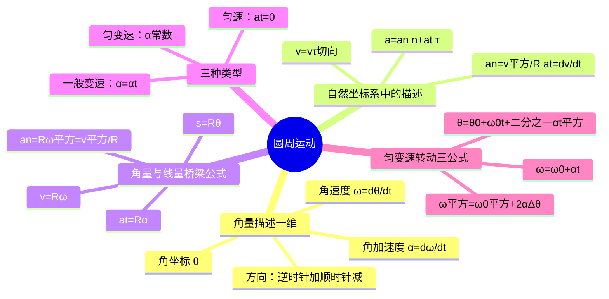

# 大学物理：圆周运动的角量与线量

> 📌 重构说明：本笔记聚焦圆周运动的完整描述体系——用单一角量 $\theta$ 取代 $x,y$ 两个直角坐标，极大地简化了旋转问题。已按「角量体系 -> 自然坐标系复习 -> 角量/线量桥梁公式 -> 三种圆周运动类型 -> 匀变速转动三公式 -> 例题分析」的逻辑链重排，补充了课堂例题中关于曲线运动加速度分量判断、抛体运动动态分析和已知路程求加速度的完整解法。

## 🧠 思维导图

---

## 一、角量描述——用一维坐标描述二维运动

==圆周运动最大的简化：只需要一个角坐标 $\theta$ 就能完全描述质点的位置。==

| 角量 | 定义 | 含义 |
|------|------|------|
| 角坐标 $\theta$ | — | 质点绕圆心转过的角度 |
| 角速度 $\omega$ | $\omega = d\theta/dt$ | 角位置的变化率 |
| 角加速度 $\alpha$ | $\alpha = d\omega/dt = d^2\theta/dt^2$ | 角速度的变化率 |

方向约定：逆时针为正（+），顺时针为负（-）。

> 📖 补充定义：角量描述的核心优势在于将二维平面上的圆周运动降为一维坐标问题，只需一个标量 $\theta$ 即可完全确定质点位置。

---

## 二、自然坐标系中的圆周运动

自然坐标系原点取在质点自身（动态），$R$ 就是固定不变的曲率半径（$\rho \equiv R$）：

| 物理量 | 公式 | 说明 |
|--------|------|------|
| 速度 | $\vec{v} = v\vec{\tau} = \dfrac{ds}{dt}\vec{\tau}$ | 始终沿切向 |
| 切向加速度 $a_t$ | $a_t = \dfrac{dv}{dt}$ | 改变速度大小 |
| 法向加速度 $a_n$ | $a_n = \dfrac{v^2}{R}$ | 改变速度方向 |
| 总加速度 | $a = \sqrt{a_t^2 + a_n^2}$ | 勾股合成 |

---

## 三、角量与线量的联系（核心桥梁）

$$\boxed{s = R\theta}$$

对时间求一次导数 $\to$ $$\boxed{v = R\omega}$$

对时间再求一次导数 $\to$ $$\boxed{a_t = R\alpha}$$

法向加速度用角量：$$\boxed{a_n = R\omega^2 = v^2/R}$$

> [!warning] 考点
> **$v = R\omega$、$a_t = R\alpha$、$a_n = R\omega^2$** — 这三对关系贯串整个刚体转动体系，必须烂熟于心。

---

## 四、三种圆周运动类型

| 类型 | 判别特征 | 运动方程 |
|------|----------|----------|
| **匀速**圆周运动 | $a_t = 0$，$\alpha = 0$ | $\theta = \omega t$ |
| **匀变速**圆周运动 | $\alpha = \text{常数}$ | 见下文三公式 |
| **一般变速**圆周运动 | $\alpha = \alpha(t)$ | 积分求解 |

---

## 五、匀变速转动的三公式

==与匀变速直线运动公式形式完全一致，符号替换：$x \to \theta$、$v \to \omega$、$a \to \alpha$。==

| 直线运动 | 圆周运动 |
|----------|----------|
| $v = v_0 + at$ | $\boxed{\omega = \omega_0 + \alpha t}$ |
| $x = x_0 + v_0t + \frac{1}{2}at^2$ | $\boxed{\theta = \theta_0 + \omega_0t + \frac{1}{2}\alpha t^2}$ |
| $v^2 = v_0^2 + 2a\Delta x$ | $\boxed{\omega^2 = \omega_0^2 + 2\alpha\Delta\theta}$ |

> [!warning] 考点
> 三个匀变速转动公式与匀变速直线运动公式只差一个符号替换——物理形式完全一样，考场中可直接默写。

---

## 六、典型例题

> [!example] 例题1：曲线运动加速度分量判断
> **已知条件**：一物体沿曲线运动。
> 
> **求解目标**：切向加速度和法向加速度中，哪一个一定不能为 0？
> 
> **关键步骤**：
> 1. 法向加速度 $a_n$ 改变速度的方向
> 2. 曲线运动方向不断变化，所以 $a_n$ 一定不为 0
> 3. 切向加速度 $a_t$ 改变速度大小，可为 0（如匀速曲线运动）
> 
> **答案**：法向加速度 $a_n$ 一定不为 0。

> [!example] 例题2：抛体运动中 $a_n$ 和 $a_t$ 的动态变化
> **已知条件**：质点做抛体运动，加速度为恒定的重力加速度 $\vec{g}$。
> 
> **求解目标**：分析上升过程和下降过程中 $a_n$ 和 $a_t$ 的变化。
> 
> **关键步骤**：
> 1. 将 $\vec{g}$ 沿自然坐标系分解：$a_t = g\sin\theta$，$a_n = g\cos\theta$
> 2. 上升过程：$\theta$ 减小 $\to$ $a_t$ 减小（减速逐渐变慢），$a_n$ 增大
> 3. 最高点：$\theta = 0$ $\to$ $a_t = 0$，$a_n = g$
> 4. 下降过程：$\theta$ 增大 $\to$ $a_t$ 增大（加速越来越快），$a_n$ 减小
> 
> **答案**：上升过程 $a_t$ 减小、$a_n$ 增大；最高点 $a_t = 0$、$a_n = g$；下降过程 $a_t$ 增大、$a_n$ 减小。

> [!example] 例题3：已知 $s(t)$ 求各加速度
> **已知条件**：一质点做圆周运动，半径 $R$，路程 $s(t) = t^2 + 2t$（m），$t = 2$ s，$R = 3$ m。
> 
> **求解目标**：求 $t = 2$ s 时的 $v$、$a_t$、$a_n$ 和总加速度 $a$。
> 
> **关键步骤**：
> 1. 速率：$v = ds/dt = 2t + 2$，$t=2$ 时 $v = 6$ m/s
> 2. 切向加速度：$a_t = dv/dt = 2$ m/s²
> 3. 法向加速度：$a_n = v^2/R = 36/3 = 12$ m/s²
> 4. 总加速度：$a = \sqrt{a_t^2 + a_n^2} = \sqrt{4 + 144} = \sqrt{148} \approx 12.17$ m/s²
> 
> **答案**：$v = 6$ m/s，$a_t = 2$ m/s²，$a_n = 12$ m/s²，$a \approx 12.17$ m/s²。

> [!example] 例题4：匀变速率圆周运动
> **已知条件**：质点做匀变速率圆周运动，半径 $R = 2$ m，$a_t = 3$ m/s² 为恒定值，$t = 0$ 时 $\omega_0 = 2$ rad/s。
> 
> **求解目标**：求 $t = 4$ s 时的 $\omega$、$v$、$a_n$。
> 
> **关键步骤**：
> 1. 由 $a_t = R\alpha$ 得 $\alpha = a_t/R = 3/2 = 1.5$ rad/s²
> 2. 匀变速转动公式：$\omega = \omega_0 + \alpha t = 2 + 1.5 \times 4 = 8$ rad/s
> 3. 线速度：$v = R\omega = 2 \times 8 = 16$ m/s
> 4. 法向加速度：$a_n = R\omega^2 = 2 \times 64 = 128$ m/s²
> 
> **答案**：$\omega = 8$ rad/s，$v = 16$ m/s，$a_n = 128$ m/s²。

---

## 🔗 知识网络

### 前置依赖
- 03_自然坐标系与加速度分解 — 切向/法向加速度分解的基本原理
- 01_质点运动描述的物理量 — 位矢、速度、加速度的基本概念
- 匀变速直线运动 — 匀变速转动公式的类比基础

### 后续应用
- 07_刚体模型与定轴转动运动学 — 角量体系扩展到刚体定轴转动
- 08_刚体定轴转动定律与转动惯量 — 转动惯量中的 $a_t = R\alpha$
- 11_旋转矢量法与简谐振动描述 — 简谐振动角频率与圆周运动角速度的对应
- 角动量定理与守恒定律 — 角动量的角量描述

### 对比辨析
- 角量描述 vs 直角坐标描述：圆周运动用角量只需一维坐标，直角坐标需要两维——角量更简洁
- 匀变速转动 vs 匀变速直线运动：公式形式完全一样，只需将 $x \to \theta$、$v \to \omega$、$a \to \alpha$
- $a_t = dv/dt$ vs $a_t = R\alpha$：前者是定义式，适用于任何曲线运动；后者是圆周运动的特例形式

---

## 📚 核心词条索引

| 知识点链接 | 类别 | 关键词 |
|------|------|--------|
| [[角速度]] | 核心概念 | $\omega = d\theta/dt$，单位 rad/s |
| [[角加速度]] | 核心概念 | $\alpha = d\omega/dt$，单位 rad/s² |
| [[匀变速转动]] | 运动类型 | 角加速度恒定的转动，三公式与匀变速直线运动类比 |
| [[切向加速度]] | 核心概念 | $a_t = dv/dt = R\alpha$，改变速度大小 |
| [[法向加速度]] | 核心概念 | $a_n = v^2/R = R\omega^2$，改变速度方向 |
| [[自然坐标系]] | 坐标系 | 原点在质点，切向和法向为基矢量 |
| [[角坐标]] | 核心概念 | $\theta$，描述质点绕圆心转过的角度 |
