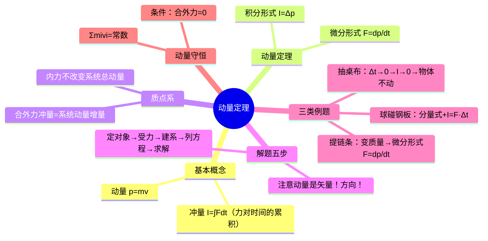

# 大学物理：动量定理与解题步骤

> 📌 重构说明：本笔记聚焦于「力-时间-动量」三者的量化关系。已按「冲量与动量定义→动量定理（微分）（微分+积分形式）→质点系动量定理→解题步骤→三类经典例题→动量守恒条件」的逻辑链重排。补充了$F=ma$与$F=dp/dt$的选用条件辨析，以及变质量问题中微分形式的必要性。

## 🧠 思维导图

---

## 一、冲量与动量

| 物理量 | 定义 | 恒力/常质量 | 变力/变质量 |
|--------|------|------------|------------|
| **冲量 $I$** | 力对时间的累积 | $I = F \cdot \Delta t$ | $I = \int_{t_1}^{t_2} F\,dt$ |
| **动量 $p$** | 质量 × 速度 | $\vec{p} = m\vec{v}$ | — |

> 冲量是矢量，方向 = 力（或平均冲力）的方向。动量也是矢量，方向 = 速度方向。

---

## 二、动量定理的两种形式

| 形式 | 公式 | 适用场景 |
|------|------|----------|
| ==动量定理（微分）== | $\vec{F} = \dfrac{d\vec{p}}{dt}$ | 变力、变质量问题 |
| ==动量定理（积分）== | $\int_{t_1}^{t_2}\vec{F}\,dt = \vec{p}_2 - \vec{p}_1$ | 已知初末状态求冲量 |

> [!warning] 考点
> ⚠️ 当质量随时间变化（如提链条、火箭喷射），只能用微分形式 $F = dp/dt$，不能直接写 $F = ma$。因为 $dp/dt = d(mv)/dt \neq m\cdot dv/dt$！

---

## 三、质点系的动量定理

==内力不改变系统动量。==

$$\int_{t_1}^{t_2} \vec{F}_{\text{外}}\,dt = \Delta\vec{p}_{\text{系统}}$$

**解题技巧**：恰当选择研究对象，将外部复杂力转化为内部力 → 直接从系统的初末动量求解，绕过复杂的内力分析。

> [!warning] 考点
> ⚠️ 「内力不改变系统动量」是动量定理的选择/判断高频考点。碰撞、爆炸问题中，内力远大于外力 → 可近似用动量守恒。

---

## 四、动量定理解题五步

1. 确定研究对象（单个质点或系统）
2. 受力分析（只标外力，内力不算）
3. 建立坐标系（列分量式时必须！）
4. 列动量定理方程（==矢量必须按分量处理==）
5. 求解 + 判断方向

> [!warning] 考点
> ⚠️ 动量是矢量！与坐标轴同向为正、反向为负。列分量式而非直接写大小——这是失分重灾区。

---

## 五、经典例题

### 5.1 小球碰钢板

以碰撞点为原点，设入射角 $\alpha$：

- $x$ 方向：$\bar{F}_x\Delta t = 2mv\sin\alpha$（速度 $x$ 分量反转）
- $y$ 方向：$\bar{F}_y\Delta t = 0$（速度 $y$ 分量不变）

→ 平均冲力只有 $x$ 分量。

### 5.2 提链条（变质量问题）

匀速提起链条，空中部分质量 $m = \lambda y$（$\lambda$ 为单位长度质量）：

$$F - \lambda yg = \frac{dp}{dt} = \lambda v^2 \quad\Rightarrow\quad F = \lambda yg + \lambda v^2$$

注意：$dp/dt$ 中既包含速度变化项也包含质量变化项——这是变质量问题的精髓。

### 5.3 抽桌布实验

| 抽法 | $\Delta t$ | 冲量 $I = \bar{F}\Delta t$ | 物体动量变化 | 结果 |
|------|-----------|--------------------------|-------------|------|
| 迅速 | → 0 | → 0 | ≈ 0 | 物体掉入杯中（不动） |
| 缓慢 | 大 | 大 | 明显 | 物体跟着桌布滑走 |

---

## 六、动量守恒定律

==动量守恒条件：系统合外力 $\vec{F}_{\text{外}} = 0$==（或某个方向的合外力分量为 0 → 该方向动量守恒）。

$$\sum m_i\vec{v}_i = \text{常数}$$

碰撞爆炸敲击问题 → 内力 >> 外力 → 近似守恒。

---

## 🔗 知识网络

### 前置依赖
- 01_质点运动描述的物理量 — 速度、加速度的基本概念
- 05_动力学解题思路与受力分析 — 牛顿定律解题方法、受力分析步骤

### 后续应用
- 09_角动量定理与守恒定律 — 角动量定理是动量定理在转动中的推广
- 碰撞爆炸敲击 — 内力远大于外力时近似动量守恒
- 10_三大守恒律复习与简谐振动入门 — 三大守恒律的综合运用

### 对比辨析
- 动量定理微分形式 $F=dp/dt$ vs 牛顿第二定律 $F=ma$：二者本质等价，但动量定理形式在变质量问题中不可替代
- 动量守恒 vs 机械能守恒：前者要求合外力为零，后者要求非保守力不做功

## 📚 核心词条索引

| 知识点链接 | 类别 | 关键词 |
|------|------|--------|
| [[动量]] | 核心概念 | $\vec{p}=m\vec{v}$，运动量度 |
| [[冲量]] | 核心概念 | $\vec{I}=\int\vec{F}dt$，力对时间的积累 |
| [[动量定理（微分）]] | 核心定理 | $d\vec{p}=\vec{F}dt$ |
| [[动量守恒]] | 守恒律 | 合外力=0时系统动量不变 |
| [[变质量问题]] | 应用类型 | 火箭、链条、雨滴等质量变化问题 |
| [[动量定理（积分）]] | 核心定理 | $\Delta\vec{p}=\vec{I}$ |
| [[内力不改变系统动量]] | 重要结论 | 内力成对出现，冲量相消 |
| [[碰撞爆炸敲击]] | 典型问题 | 内力>>外力，近似动量守恒 |
