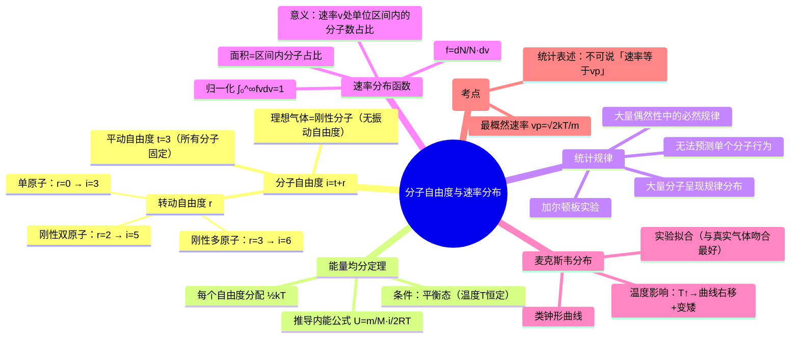

# 大学物理：理想气体自由度与速率分布

> 📌 重构说明：本录音包含两个紧密关联的知识模块：(1) 自由度与能量均分定理——导出理想气体内能公式，(2) 气体分子速率分布函数的统计规律——从加尔顿板实验到麦克斯韦速率分布。已按「分子模型→能量公式→统计思想→分布函数→三个特征速率」的知识逻辑重新编排。

## 🧠 思维导图



---

## 第一部分：分子自由度与能量均分

### 一、什么是自由度？

> [!info] 补充定义
> 自由度（Degrees of Freedom）是确定一个物体空间位置所需的独立坐标数。对于气体分子，自由度 = 平动自由度（描述质心位置）+ 转动自由度（描述分子取向）+ 振动自由度（描述原子间相对振动）。

对理想气体而言，所有分子都是**刚性分子**——原子间的距离固定，==没有振动自由度==。

==所有分子的平动自由度 t = 3==（$x, y, z$ 三个方向）。

| 分子类型 | 平动自由度 t | 转动自由度 r | 总自由度 i = t + r |
|----------|:-----------:|:-----------:|:------------------:|
| 单原子分子（He, Ne, Ar） | 3 | **0** | **3** |
| 刚性双原子分子（O₂, N₂, CO） | 3 | **2** | **5** |
| 刚性多原子分子（CO₂, H₂O, CH₄） | 3 | **3** | **6** |

> [!warning] 考点
> ⚠️ 三类分子的自由度 $i$ 是必考题型（填空/选择）。单原子 $i=3$，刚性双原子 $i=5$，刚性多原子 $i=6$。与第8章热力学紧密相关，必须记牢。

> 为什么双原子只有 2 个转动自由度？——双原子分子可绕垂直于分子轴的两个方向旋转，绕分子轴自身的旋转没有意义（原子太小，转动惯量可忽略）。

### 二、能量均分定理

> 老师强调：「先决条件——必须处于平衡态，也就是温度要保持不变。温度变了，分子运动的剧烈程度就不稳定了。」

==在温度为 $T$ 的平衡态下，分子的平均动能均匀分配给每个自由度，每个自由度分得 $\frac{1}{2}kT$。==

$$
\boxed{\text{每个自由度的平均动能} = \frac{1}{2}kT}
$$

**前提条件**：
- ==处于平衡态==（温度 $T$ 恒定）
- 分子的热运动剧烈程度稳定

> [!warning] 考点
> ⚠️ $\frac{1}{2}kT$ 曾经考过填空题——直接默写这个数值。

**由此推导平均平动动能**：

所有分子的平动自由度都是 3，所以：

$$\overline{\varepsilon}_t = 3 \times \frac{1}{2}kT = \frac{3}{2}kT$$

这就是我们之前学过的「分子平均平动动能」。

**但平均转动动能呢？** 这取决于分子类型：

| 分子类型 | 转动自由度 r | 平均转动动能 |
|----------|:-----------:|-------------|
| 单原子 | 0 | 0 |
| 刚性双原子 | 2 | $kT$ |
| 刚性多原子 | 3 | $\frac{3}{2}kT$ |

### 三、理想气体的内能公式

> 老师核心结论：「有了能量均分定理，就推导出了理想气体的内能公式。这个公式请各位同学无论如何都要背下来。」

对于 $n$ 摩尔理想气体（$n = \dfrac{m}{M}$）：

$$\boxed{U = n \cdot \frac{i}{2}RT = \frac{m}{M} \cdot \frac{i}{2}RT}$$

| 符号 | 含义 | 量级 |
|------|------|------|
| $m$ | 气体质量 | 宏观 |
| $M$ | 摩尔质量 | 宏观 |
| $\frac{m}{M}$ | 摩尔数 $n$ | — |
| $i$ | 分子自由度 | 微观 |
| $R$ | 普适气体常量 | $8.31\,\text{J/(mol·K)}$ |
| $k$ | 玻尔兹曼常量 | $1.38 \times 10^{-23}\,\text{J/K}$ |

> [!warning] 考点
> ⚠️ $R$ 和 $k$ 的区别：$R$ 是**宏量**（每摩尔），$k$ 是**微常量**（每个分子）。$R = N_A \cdot k$。书写时务必区分清楚——写得模棱两可（既像 $r$ 又像 $k$ 又像 $R$）没法判断。

> 📖 内能公式的物理意义：每个分子有 $i$ 个自由度，每摩尔有 $N_A$ 个分子，每自由度 $\frac{1}{2}kT$ → 每摩尔内能 $U_{\text{mol}} = i \cdot N_A \cdot \frac{1}{2}kT = \frac{i}{2}RT$。因此 $n$ 摩尔 = $\frac{m}{M} \cdot \frac{i}{2}RT$。

---

## 第二部分：统计规律与速率分布

### 四、什么是统计规律？

> 老师核心定义：「统计规律就是大量的偶然性中所呈现出来的规律。」

**加尔顿板实验**（Galton Board）：

容器内上半部分布满钉子，下半部分分隔成狭槽。从顶部投入大量小颗粒：
- 每个颗粒落入哪个狭槽 → **偶然的**（无法预测）
- 投入足够多颗粒后 → 呈现**规律分布**（中间最多，两侧递减）

==类比到气体==：气体分子数目极其庞大，分子间不断碰撞（类似颗粒碰钉子），无法预测每个分子的速率。但对大量分子统计后，速率分布呈现规律。

> [!warning] 考点
> ⚠️ 统计规律的核心表述——「无法预测单个分子的速率/行为，但大量分子的统计呈现规律分布」。判断题/简答题常考。

### 五、什么是「分布」？

> 老师以学校学生年龄为例解释：把 15-22 岁划分成几个区间 → 数每个区间的人数 → 算出比例 → 得到年龄分布。

对气体分子速率的分布也类似：

1. 速率范围：$0 \to \infty$
2. 将整个速率区间**微分**成无数微小区间
3. 统计每个区间内的分子数 $dN$
4. 计算该区间分子数占总分子数 $N$ 的比例

**基础数据示例**（空气分子，273K）：

| 速率区间 (m/s) | 分子数占比 |
|---------------|-----------|
| <100 或 >700 | 非常小 |
| **300~400** | **最大** |
| 中间向两侧 | 递减 |

→ 呈现「中间多、两侧少」的规律分布。

### 六、速率分布函数

> 老师强调：「先把温度固定——只有平衡态下，分子运动的激烈程度才稳定，分布才有意义。」

对速率区间 $v \sim v+dv$（$dv$ 是微分后的区间间隔）：

- 区间内分子数：$dN$
- 总分子数：$N$
- 占比：$\dfrac{dN}{N}$

把区间间隔 $dv$ 的影响去掉，定义**速率分布函数**：

$$\boxed{f(v) = \frac{dN}{N \cdot dv}}$$

**物理意义**：==在速率 $v$ 处，单位速率区间内的分子数占总分子数的百分比。==

> 📖 理解：「单位速率区间」相当于令 $dv = 1\,\text{m/s}$。$f(v)$ 就是一个概率密度的概念——$v$ 附近每单位速率范围内分子出现的概率。

> [!warning] 考点
> ⚠️ $f(v) = \dfrac{dN}{N \cdot dv}$ 是整个速率分布理论的核心定义式，必须会默写、会解释。它不是只针对麦克斯韦分布的——是**所有速率分布函数**共用的。

### 七、麦克斯韦速率分布函数

> 老师说明：「很多科学家通过实验拟合出了不同的速率分布函数。麦克斯韦速率分布拟合出来的与真实气体吻合最好，所以我们以它为例。」

麦克斯韦速率分布的**具体形式不作考试要求**。我们只需要知道：

**曲线形状**：==类钟形曲线==（像寺庙里的大钟），$f(v)$ 为纵坐标，$v$ 为横坐标。

**三个关键几何意义的式子**（对所有分布函数通用）：

| 数学表达式 | 几何意义 | 物理意义 |
|-----------|----------|----------|
| $f(v)\,dv = \dfrac{dN}{N}$ | 微小区间的矩形面积 | $v \sim v+dv$ 区间内的分子占比 |
| $\displaystyle \int_{v_1}^{v_2} f(v)\,dv$ | 从 $v_1$ 到 $v_2$ 的曲线下面积 | $v_1 \sim v_2$ 区间内的分子占比 |
| $\displaystyle \int_{0}^{\infty} f(v)\,dv = 1$ | 整个曲线与 $v$ 轴围成的面积 | **归一化条件**——全部速率区间分子占比 = 1 |

> [!warning] 考点
> ⚠️ 归一化条件 $\int_0^\infty f(v)\,dv = 1$ 曾考过填空题——让大家默写这个式子。三个要点：积分上/下限 0 到 $\infty$，被积函数 $f(v)$，结果 = 1。

### 八、温度对分布曲线的影响

> 老师强调：「根据归一化条件，曲线与 $v$ 轴围成的面积永远等于 1——这是理解温度影响的关键。」

温度升高 → 分子热运动更激烈 → 高速分子占比增加 → 曲线向右侧（高速方向）移动 → 但总面积不变 → ==曲线变矮==。

```
       f(v)
        │
        │    ┌─┐  T₁ (低温，高瘦)
        │   ╱   ╲
        │  ╱     ╲
        │ ╱  ┌─┐  ╲  T₂>T₁ (高温，低矮右移)
        │╱ ╱     ╲ ╲
        └──────────────── v
           vp1  vp2
```

> 📖 直观记忆：温度越高 → 曲线越「矮胖」并向右侧移动。原因是高速分子占比增加，但总面积必须保持为 1，所以峰值必须降低。

### 九、最概然速率 $v_p$

> 老师解释：「$f(v)$ 在 $v_p$ 处取极大值。$f(v)$ 的意义是概率密度，所以 $v_p$ 处概率最大 → 最概然速率。」

对麦克斯韦速率分布 $f(v)$ 关于 $v$ 求导 = 0，解得：

$$\boxed{v_p = \sqrt{\frac{2kT}{m}}}$$

（$m$ 为一个分子的质量）

> [!warning] 考点
> ⚠️ 温度越高，$v_p$ 越大（从图中 $v_{p2} > v_{p1}$ 也可看出）。所以温度越高，$v_p$ 在 $v$ 轴上越靠右。

### 十、统计表述的关键规则

> 老师重点纠正：「能不能说『速率等于 $v_p$ 的分子数占总分子数的比例最大』？**不对！绝对不对！**」

==统计力学中永远不能说「速率等于某个值」——只能说「在某个速率区间范围内」。==

| 说法 | 对/错 | 原因 |
|------|--------|------|
| 「速率为 $v_p$ 的分子数占比最大」 | ❌ | 这不是统计的方式 |
| ==「最概然速率 $v_p$ **附近**的分子数占比最大」== | ✅ | 「附近」代表了一个区间范围 |

> 「附近」这两个字，把你说的「等于某个值」变成了一个区间范围——这就是统计的正确表述方式。

---

---

## 🔗 知识网络

### 前置依赖
- 气体动理论基础 — 理想气体状态方程、压强公式、温度公式
- [[能量均分定理]] — 分子平均动能的分配

### 后续应用
- 热力学第一定律与四大过程 — 等容/等压过程中内能变化与自由度的关系
- [[热容]] — 定容摩尔热容 Cᵥₘ = iR/2

### 对比辨析
- 最概然速率 v_p vs 平均速率 $\overline{v}$ vs 方均根速率 $\sqrt{\overline{v^2}}$：三者随温度升高均增大，但增长比例不同；v_p 是最可能出现的速率，方均根速率用于计算平均动能
- 自由度 i 与定容热容 Cᵥₘ：i=3（单原子）→ Cᵥₘ=3R/2；i=5（双原子常温）→ Cᵥₘ=5R/2；i=6（多原子）→ Cᵥₘ=3R

## 📚 核心词条索引

| 知识点链接 | 类别 | 关键词 |
|------|------|--------|
| [[自由度]] | 核心概念 | 确定物体空间位置所需的独立坐标数，$i=t+r$ |
| [[能量均分定理]] | 核心定律 | 平衡态下每个自由度分配$\frac{1}{2}kT$的平均动能 |
| [[内能公式]] | 核心公式 | 理想气体内能$U=\frac{m}{M}\cdot\frac{i}{2}RT$ |
| [[速率分布函数]] | 核心概念 | $f(v)=\frac{dN}{N\cdot dv}$，单位速率区间内分子数占比 |
| [[加尔顿板实验]] | 典型实验 | 大量颗粒落入钉板后呈规律分布，说明统计规律 |
| [[麦克斯韦速率分布]] | 分布规律 | 与真实气体吻合最好的速率分布函数，呈钟形曲线 |
| [[平动自由度]] | 核心概念 | 描述质心位置的自由度，所有分子$t=3$ |
| [[转动自由度]] | 核心概念 | 描述分子取向的自由度，单原子0、双原子2、多原子3 |
| [[刚性分子]] | 分子模型 | 原子间距离固定的分子，无振动自由度 |
| [[统计规律]] | 核心概念 | 大量偶然性中呈现的必然规律 |
| [[归一化条件]] | 核心条件 | $\int_0^\infty f(v)dv=1$，全部分子占比为1 |
| [[最概然速率]] | 特征速率 | $v_p=\sqrt{2kT/m}$，概率密度最大的速率 |
