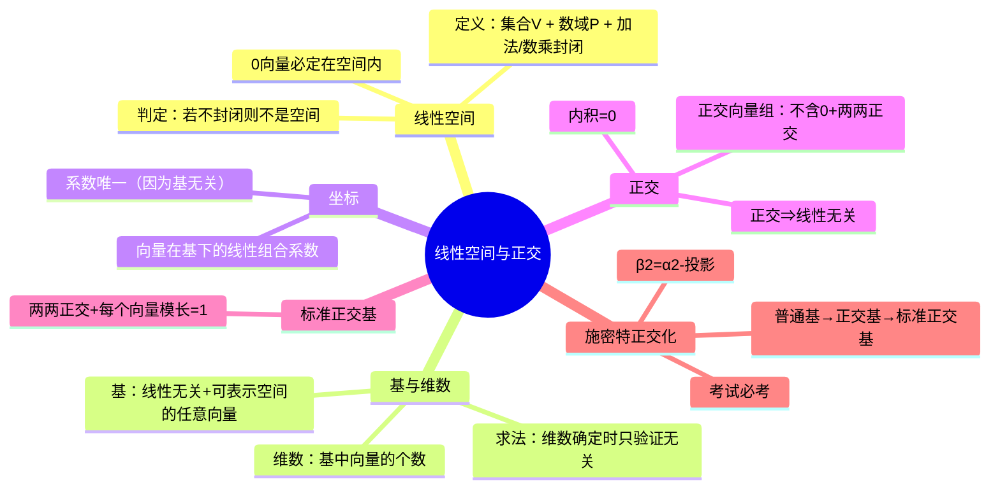

# 线性空间、基底维数与正交化

> 📌 重构说明：本笔记将「线性空间与基维数」和「正交化方法」两个主题按知识树逻辑深度重构。

---

## 🧠 思维导图



---

## 第一部分：线性空间的定义、基与维数

### 一、温故：极大无关组与秩

在进入线性空间之前，老师先回顾了上节课的核心——极大无关组：

| 概念 | 含义 |
|------|------|
| 极大无关组 | 向量组中挑出的「最精简但能代表全部信息」的子集 |
| 条件1 | 该子集线性相关与无关定义（无重复信息） |
| 条件2 | 极大性：任意多一个都线性相关与无关定义（不能再加了） |
| 等价条件2 | 大向量组中任意向量都可被该子集线性表示 |

> 📌 ⚠️ 极大无关组**不唯一**，但秩（极大无关组中向量个数）**唯一**。

### 二、向量组等价的含义

$$ \text{两个向量组等价} \Longleftrightarrow \text{可互相线性表示} $$

| 等价→ | 结论 |
|--------|------|
| 秩 | 相等 |
| 信息量 | 相同 |
| 极大无关组 | 不一定是同一个（各自从自己组中挑） |

---

### 三、引理 1.6.1（课本14页）

> 📖 **课本引理 1.6.1**：设 $\beta_1,\cdots,\beta_s$ 可由 $\alpha_1,\cdots,\alpha_r$ 线性表示，则：

#### 主结论

$$ s > r \quad \Longrightarrow \quad \beta_1, \cdots, \beta_s \text{ 线性相关与无关定义} $$

#### 老师的信息论推导

1. $\beta$ 被 $\alpha$ 线性表示 → $\alpha$ 的信息量 ≥ $\beta$ 的信息量
2. $\alpha$ 只有 r 个 → $\alpha$ 最多含 r 条有效信息
3. 所以，$\beta$ 也最多含 r 条有效信息
4. 现在 $\beta$ 有 s 个向量，s > r
5. → $\beta$ 中一定有重复信息 → 线性相关与无关定义

#### 逆否命题

$$ \beta \text{ 组线性相关与无关定义} \quad \Longrightarrow \quad s \leq r $$

**等价**：若 $\beta$ 无关 → $\beta$ 含 s 条有效信息 → $\alpha$ 的信息条数 ≥ s → r ≥ s。

---

### 四、线性空间的定义

> 📖 **课本定义**：设 V 是一个非空集合，P 是一个数域。在 V 上定义加法和数乘，若 V 对这两种运算封闭性，则称 V 为**数域 P 上的线性空间**。

#### 4.1 数域

||||概念|定义|
||||------|------|
||||数域|对加减乘除**四则运算封闭性**的数的集合|
||||最小数域|**有理数集 Q**（整数集对除法不封闭性，不是数域）|
||||常见数域|有理数域 Q、实数域 R、复数域 C|

#### 4.2 封闭性

> 老师原话："封闭英文叫 **close**。什么叫封闭？你任意从集合里拿两个出来做运算，结果还在集合里。"

||||运算|封闭的要求|
||||------|-----------|
||||加法|$\forall \alpha, \beta \in V, \alpha + \beta \in V$|
||||数乘|$\forall \alpha \in V, \forall k \in P, k\alpha \in V$|

#### 4.3 经典判例（黑板例题）

**问题**：$V = \{(1, x_2, x_3) \mid x_2, x_3 \in \mathbb{R}\}$ 是否构成线性空间？

**解答**（加法不封闭）：

取 $\alpha = (1, 0, 0)$，$\beta = (1, 0, 0)$

$\alpha + \beta = (2, 0, 0)$ → 第一个分量 = 2 ≠ 1 → **不在 V 中**

> 所以 $V$ 对加法不封闭性 → **不是线性空间**。

**变形**：把第一个分量改成 **0**：

$V = \{(0, x_2, x_3)\}$ → **构成线性空间**（可自行验证加法、数乘封闭）

> 📌 ⚠️ 考点：一个线性空间**必须包含零向量**！若零向量不在集合中，立刻判定不是线性空间。这是一条秒杀型的判定方法。

#### 4.4 非平凡线性空间

若线性空间 $V$ 不只含零向量（有非零向量），则：

- 数乘封闭性 → 可用数域 P 中无穷多个数去乘非零向量
- → **有无穷多个向量**

这和向量组（有限个向量）的本质区别：线性空间可以有无穷多向量，我们仍然要找它的「基」

---

### 五、基与维数

#### 5.1 定义

> 📖 **课本定义**：设 $\{\alpha_1, \cdots, \alpha_r\}$ 是线性空间 V 中一组线性相关与无关定义的向量，且 V 中任意向量均可被其线性表示，则称该组为 V 的一个**基**。基中所含向量个数 r 称为 V 的**维数**，记作 $\dim V = r$。

#### 5.2 与极大无关组的对比

|||||极大无关组|基与维数|
||||------|-----------|-----|
||||所处语境|向量组（有限个向量）|线性空间的定义（可以是无穷多个向量）|
||||作用|提取向量组的有效信息|确定空间的"坐标系"|
||||数学含义|完全一致（无关 + 可表示）|

> 🟢 其实极大无关组就是它的上下文中的「基与维数」，基与维数就是线性空间的定义下的「极大无关组」。

#### 5.3 核心例题：求子空间的维数

**问题**：$V = \{(0, x_2, x_3) \mid x_2, x_3 \in \mathbb{R}\}$ 是 $\mathbb{R}^3$ 的子空间，求 $\dim V$。

**解法**：

找基——两条要求：(1) 属于 V，(2) 无关，(3) 能表示 V 中任意向量。

候选：$e_1 = (0, 1, 0)$，$e_2 = (0, 0, 1)$

**验证**：
1. $e_1, e_2 \in V$ ✓（第一个分量都是 0）
2. 线性相关与无关定义 ✓（不成比例）
3. 任意 $(0, x_2, x_3) = x_2 \cdot (0,1,0) + x_3 \cdot (0,0,1)$ ✓

> 所以 $\dim V = 2$。

**关键认知**：
- V 中的元素看起来是三维向量（3 个分量）
- 但 V 作为子空间，只有 **2 维**（相当于 yOz 平面）
- 几何意义：第一个分量被固定为 0，本质是一个平面。

---

### 六、无限维线性空间

> 📖 **定义**：若线性空间 V 中存在任意多个线性相关与无关定义的向量，则称 V 为**无限维线性空间**。

#### 举例：全体多项式函数

$$ V = \{a_0 + a_1 x + a_2 x^2 + \cdots + a_n x^n \mid n \geq 0, a_i \in \mathbb{R}\} $$

- 加法封闭性 ✓（多项式加多项式还是多项式）
- 数乘封闭性 ✓（实数乘多项式还是多项式）
- 构成实数域上的线性空间 ✓

**基底**：$\{1, x, x^2, x^3, \cdots\}$（无穷多个 → 无限维）

> 向量空间不可能无限维（n 维空间的秩最多是 n），只有**函数空间**才能是无限维。

---

### 七、坐标

#### 7.1 定义

> 📖 **定义**：设 $\{\alpha_1,\cdots,\alpha_r\}$ 是 V 的一组基。对任意 $\alpha \in V$，存在**唯一**的一组数 $x_1,\cdots,x_r$，使得 $\alpha = x_1\alpha_1 + \cdots + x_r\alpha_r$，则称 $(x_1,\cdots,x_r)^T$ 为 $\alpha$ 在此基下的**坐标**。

#### 7.2 坐标具有唯一性

**为什么唯一**？因为基是线性相关与无关定义的！

回顾  定理1.4.2 表示与唯一性 的结论 2：表示系数唯一 ⇔ 表示向量组线性相关与无关定义。基的定义保证了无关性。

#### 7.3 求坐标的方法 = 解非齐次线性方程组

**例题**：给定基 $\{\alpha_1, \alpha_2, \alpha_3\}$ 为 $\mathbb{R}^3$ 的一组基，求 $\alpha$ 在此基下的坐标。

步骤：

1. 设 $\alpha = x_1\alpha_1 + x_2\alpha_2 + x_3\alpha_3$
2. 这相当于一个**非齐次线性方程组**（三个方程，常数项为 $\alpha$ 的三个分量）
3. 解出 $x_1, x_2, x_3$ → 即得坐标

> 与线性相关与无关定义判定（齐次方程组只有零解）的区别：这里右端不是零向量，是非齐次方程组。

---

## 第二部分：正交与施密特正交化

### 八、正交

#### 8.1 基本定义

||||条件|含义|
||||------|------|
||||内积 = 0|两向量正交（垂直）|
||||零向量|与任何向量都正交（内积恒为 0）|

#### 8.2 正交向量组

**定义三要素**：
1. 向量组**不含零向量**
2. 组中向量**两两正交**

> 📌 ⚠️ 必须强调「不含零向量」！如果不加这个条件，结论会失败。

---

### 九、关键定理：正交⇒线性无关

> 📖 **定理 1.8**（课本 21 页）：正交向量组必定线性相关与无关定义。

#### 严格证明（按课堂板书推导，不用课本的矩阵证法）

设 $\{\alpha_1, \cdots, \alpha_r\}$ 是正交向量组。

要证它们线性相关与无关定义，设：

$$ k_1\alpha_1 + k_2\alpha_2 + \cdots + k_r\alpha_r = 0 \tag{1} $$

目标：证明 $k_1 = k_2 = \cdots = k_r = 0$。

用 $\alpha_1$ 与等式 (1) 两端做内积：

$$ \langle \alpha_1, \; k_1\alpha_1 + k_2\alpha_2 + \cdots + k_r\alpha_r \rangle = \langle \alpha_1, 0 \rangle = 0 $$

利用内积的**线性性**（拆开加法、提出数乘）：

$$ k_1\langle\alpha_1,\alpha_1\rangle + k_2\langle\alpha_1,\alpha_2\rangle + \cdots + k_r\langle\alpha_1,\alpha_r\rangle = 0 $$

利用**正交条件**：$\langle\alpha_1, \alpha_i\rangle = 0$（当 $i \neq 1$），只剩第一项：

$$ k_1\langle\alpha_1, \alpha_1\rangle = 0 $$

利用**不含零向量**条件：$\langle\alpha_1, \alpha_1\rangle = \|\alpha_1\|^2 \neq 0$

→ $k_1 = 0$

同理，对每个 $\alpha_i$ 做一次内积 → $k_i = 0$。

> 于是 $k_1 = k_2 = \cdots = k_r = 0$ → 线性相关与无关定义。证毕。

> 📌 ⚠️ 注意：本定理的证明用到了两个条件——(1) 两两正交，使交叉项消失；(2) 不含零向量，使 $\langle\alpha_i,\alpha_i\rangle \neq 0$。

#### 逆向不成立！

线性相关与无关定义的向量组不一定正交！随手画两个不垂直的无关向量即可。

---

### 十、命题：与两个正交向量都正交 → 与它们的任意线性组合正交

**题目**：若 $\gamma \perp \alpha$ 且 $\gamma \perp \beta$，则 $\gamma \perp (k_1\alpha + k_2\beta)$。

**证明**：

$$ \langle \gamma, k_1\alpha + k_2\beta \rangle = k_1\langle\gamma,\alpha\rangle + k_2\langle\gamma,\beta\rangle = k_1 \cdot 0 + k_2 \cdot 0 = 0 $$

> 这就是正交+线性性的直接推论。

---

### 十一、标准正交基

#### 11.1 定义

||||标准正交基的两个条件|
||||----------------------|
||||(1) 两两正交（正交向量组）|
||||(2) 每个向量都是**单位向量**（模长 = 1）|

#### 11.2 标准正交基的充要条件

用内积简洁表示（老师黑板公式）：

$$ \langle e_i, e_j \rangle = \begin{cases} 0, & i \neq j \quad(\text{正交}) \\ 1, & i = j \quad(\text{单位}) \end{cases} $$

> 这其实就是直角坐标系（单位正交基）的数学精确描述。

#### 11.3 定理：标准正交基下内积 = 坐标点积

> 📖 **定理**：在标准正交基下，两向量的内积等于其坐标的对应分量乘积之和。

设标准正交基为 $\{e_1,\cdots,e_n\}$，$\alpha = \sum x_i e_i$，$\beta = \sum y_i e_i$，则：

$$ \langle \alpha, \beta \rangle = x_1y_1 + x_2y_2 + \cdots + x_ny_n $$

**证明**：

$$ \begin{aligned}
\langle \alpha, \beta \rangle &= \left\langle \sum_i x_i e_i, \; \sum_j y_j e_j \right\rangle \\
&= \sum_i \sum_j x_i y_j \langle e_i, e_j \rangle \quad(\text{线性性展开})
\end{aligned} $$

当 $i \neq j$ 时，$\langle e_i, e_j \rangle = 0$（正交 → 交叉项消失）
当 $i = j$ 时，$\langle e_i, e_i \rangle = 1$（单位 → 系数保留）

$$ = x_1 y_1 \cdot 1 + x_2 y_2 \cdot 1 + \cdots + x_n y_n \cdot 1 = \sum_{i=1}^n x_i y_i $$

> 📌 ⚠️ 考点：这个结论**必须在标准正交基下才成立**。少一个「标准」或「正交」都不行！

#### 11.4 正交 → 标准的转化（单位化）

已知正交向量组 $\{\alpha_1,\cdots,\alpha_r\}$，化为标准正交基向量组：

$$ \beta_i = \frac{\alpha_i}{\|\alpha_i\|} $$

即每个向量除以自己的模长。

---

### 十二、施密特正交化（Schmidt Orthogonalization）

> 📌 ⚠️ 考试必考

#### 12.1 问题设定

给一组**线性相关与无关定义**的向量（不一定正交），要找到与它**等价**的正交向量组。

→ 核心难点：怎么变出正交来？

#### 12.2 二维情况的直观演示（老师黑板画图）

已知：$\alpha_1 = (1, 0)$，$\alpha_2 = (2, 2)$。

- $\alpha_1$ 在 x 轴上，$\alpha_2$ 在第一象限，它们**不正交**
- 目标：找出两个正交的向量

**做法**：

1. 固定 $\alpha_1$，记为 $\beta_1 = \alpha_1 = (1, 0)$
2. 把 $\alpha_2$ 分解为两个分量：平行于 $\beta_1$ 的 + 垂直于 $\beta_1$ 的
3. 垂直于 $\beta_1$ 的那部分：$\alpha_2 - \text{proj}_{\beta_1}(\alpha_2)$
4. 这部分就是 $\beta_2$！

#### 12.3 投影公式

$\alpha_2$ 在 $\beta_1$ 上的投影：

$$ \text{proj}_{\beta_1}(\alpha_2) = \frac{\langle \alpha_2, \beta_1 \rangle}{\langle \beta_1, \beta_1 \rangle} \cdot \beta_1 $$

**推导**（老师详细展开）：

设投影 = $k \beta_1$，要求 $k$：

1. 投影的模：$\|\alpha_2\| \cdot |\cos\theta|$
2. 由内积定义：$\cos\theta = \frac{\langle\alpha_2,\beta_1\rangle}{\|\alpha_2\| \cdot \|\beta_1\|}$
3. 代入：投影的模 = $\frac{|\langle\alpha_2,\beta_1\rangle|}{\|\beta_1\|}$
4. 所以 $k = \frac{\langle\alpha_2,\beta_1\rangle}{\|\beta_1\|^2} = \frac{\langle\alpha_2,\beta_1\rangle}{\langle\beta_1,\beta_1\rangle}$

> 这里 $\|\beta_1\|^2 = \langle\beta_1,\beta_1\rangle$。

#### 12.4 一般公式（3 个及以上向量的推广）

$$ \begin{aligned}
\beta_1 &= \alpha_1 \\[8pt]
\beta_2 &= \alpha_2 - \frac{\langle\alpha_2, \beta_1\rangle}{\langle\beta_1, \beta_1\rangle} \beta_1 \\[8pt]
\beta_3 &= \alpha_3 - \frac{\langle\alpha_3, \beta_1\rangle}{\langle\beta_1, \beta_1\rangle} \beta_1 - \frac{\langle\alpha_3, \beta_2\rangle}{\langle\beta_2, \beta_2\rangle} \beta_2
\end{aligned} $$

**规律**：
- $\beta_k$ = $\alpha_k$ 减去它在**所有前面已正交化的** $\beta_1, \cdots, \beta_{k-1}$ 上的投影
- 每一项投影公式都是：$\frac{\langle\alpha_k, \beta_i\rangle}{\langle\beta_i, \beta_i\rangle} \beta_i$

#### 12.5 几何直觉（老师强调记忆点）

> "$\beta_2$ = $\alpha_2$ 减掉它在 $\beta_1$ 上的投影 → 剩下的分量必然垂直于 $\beta_1$。"

> "$\beta_3$ = $\alpha_3$ 减掉在 $\beta_1$ 上的投影（→ 垂直 $\beta_1$），再减掉在 $\beta_2$ 上的投影（→ 垂直 $\beta_2$）→ 最终同时垂直于 $\beta_1$ 和 $\beta_2$。"

---

## 十三、完整流程：普通基 → 标准正交基

```
普通基（线性相关与无关定义但不正交）
   ↓ 施密特正交化
正交基（两两正交但不一定是单位向量）
   ↓ 单位化
标准正交基（正交 + 单位）
```

---

---

## 🔗 知识网络

### 前置依赖
- 线性相关与无关判定 — 向量组的线性相关性
- [[向量空间]] — 向量空间的定义和性质

### 后续应用
- 基与维数习题讲解 — 基底和维数的计算训练
- 向量组的秩与极大无关组 — 向量组的秩（维数的推广）
- 矩阵相似与二次型 — 二次型的标准型与基底变换

### 对比辨析
- 线性空间 vs 欧几里得空间：线性空间只定义了加法与数乘（没有距离和角度），欧几里得空间额外定义了内积
- 基 vs 坐标：基是空间的一组线性无关的向量（可以张成整个空间），坐标是向量在基下的系数——同一向量在不同基下的坐标不同

## 📚 核心词条索引

||||词条|位置|
||||------|------|
||||秩|§1|
||||线性相关与无关定义|§1|
||||向量组等价的含义|§2|
||||引理 1.6.1|§3|
||||线性空间的定义|§4|
||||数域|§4.1|
||||封闭性|§4.2|
||||基与维数|§5|
||||无限维线性空间|§6|
||||坐标|§7|
||||正交|§8|
||||正交向量组|§8.2|
||||关键定理：正交⇒线性无关|§9|
||||标准正交基|§11|
||||单位化|§11.4|
||||施密特正交化|§12|
||||投影公式|§12.3|
