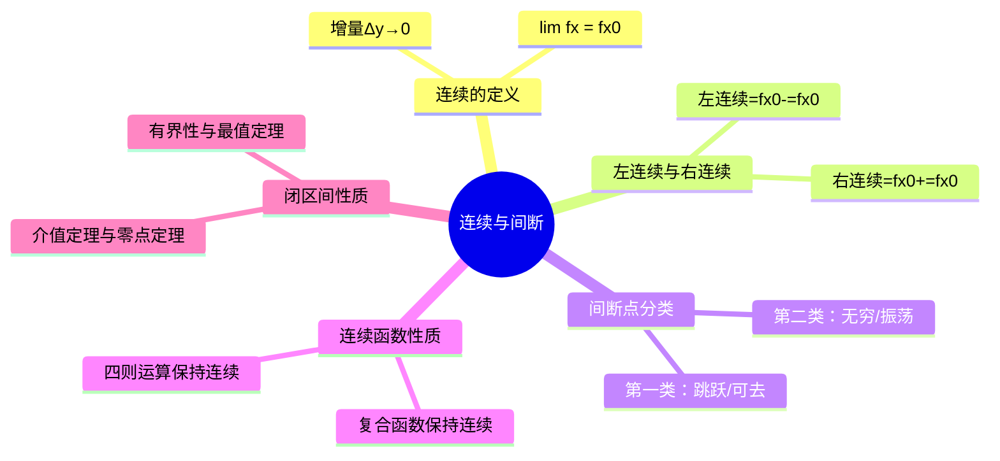

# 高等数学：函数的连续性与间断点

> 📌 重构说明：本笔记按「连续定义（增量→极限→ε-δ）→ 左右连续 → 间断点分类 → 连续函数运算 → 闭区间上连续函数的性质」重构。

## 🧠 思维导图

---

## 一、连续的定义

### 1.1 增量定义

设函数 $y = f(x)$ 在 $x_0$ 的邻域内有定义，令 $\Delta x = x - x_0$，$\Delta y = f(x_0 + \Delta x) - f(x_0)$。若：

$$\boxed{\lim_{\Delta x \to 0} \Delta y = 0}$$

则称 $f(x)$ 在 $x_0$ 处**连续**。

### 1.2 极限定义

$$\boxed{\lim_{x \to x_0} f(x) = f(x_0)}$$

即：极限存在且等于该点的函数值。

> [!warning] 考点
> ⚠️ 连续的三要素：① $f(x_0)$ 有定义 ② $\lim_{x\to x_0} f(x)$ 存在 ③ 极限值等于函数值

---

## 二、间断点分类

### 2.1 间断点定义

若 $f(x)$ 在 $x_0$ 处不满足连续条件，则称 $x_0$ 为 $f(x)$ 的**间断点**。

### 2.2 分类

| 类型 | 名称 | 条件 | 示例 |
|:----:|:----:|:----:|:----:|
| **第一类** | 可去间断点 | 左右极限存在且相等，但不等于 $f(x_0)$（或无定义） | $y = \frac{\sin x}{x}$ 在 $x=0$ |
| **第一类** | 跳跃间断点 | 左右极限存在但不相等 | $y = \text{sgn}(x)$ 在 $x=0$ |
| **第二类** | 无穷间断点 | $\lim_{x\to x_0} f(x) = \infty$ | $y = \frac{1}{x}$ 在 $x=0$ |
| **第二类** | 振荡间断点 | 左右极限振荡不存在 | $y = \sin\frac{1}{x}$ 在 $x=0$ |

> 📖 补充定义：第一类间断点的特征是左右极限均存在；第二类间断点至少有一个极限不存在。

---

## 三、闭区间上连续函数的性质

### 3.1 有界性与最值定理

若 $f(x)$ 在 $[a,b]$ 上连续，则 $f(x)$ 在 $[a,b]$ 上**有界**，且存在最大值和最小值。

> [!info] 补充定义
> 闭区间 + 连续函数，两个条件缺一不可。开区间或不连续的函数可能没有最大值或最小值。

### 3.2 介值定理

若 $f(x)$ 在 $[a,b]$ 上连续，$m \le \mu \le M$（$m, M$ 为最小最大值），则存在 $\xi \in [a,b]$ 使 $f(\xi) = \mu$。

### 3.3 零点定理

若 $f(a) \cdot f(b) < 0$，则存在 $\xi \in (a,b)$ 使 $f(\xi) = 0$。

$$\boxed{f(a)\cdot f(b) < 0 \quad \Longrightarrow \quad \exists \xi \in (a,b),\ f(\xi) = 0}$$

---

## 🔗 知识网络

### 前置依赖
-  — 极限存在是连续的前提
-  — 函数定义域

### 后续应用
- 导数的存在性 — 可导必连续
- 微分中值定理 — 需函数在闭区间连续

### 对比辨析
- 连续 vs 可导：连续不一定可导（如 $y=|x|$ 在 $x=0$），但可导一定连续

---

## 📚 核心词条索引

| 知识点链接 | 类别 | 关键词 |
|------|------|--------|
| [[连续]] | 核心概念 | $\lim f(x) = f(x_0)$ |
| [[左连续]] | 概念 | $\lim_{x\to x_0^-} f(x) = f(x_0)$ |
| [[右连续]] | 概念 | $\lim_{x\to x_0^+} f(x) = f(x_0)$ |
| [[间断点]] | 核心概念 | 不满足连续条件的点 |
| [[第一类间断点]] | 分类 | 左右极限均存在（可去/跳跃） |
| [[第二类间断点]] | 分类 | 至少一侧极限不存在（无穷/振荡） |
| [[零点定理]] | 定理 | $f(a)f(b)<0 \Rightarrow \exists \xi, f(\xi)=0$ |
| [[介值定理]] | 定理 | 连续函数可取到最大最小值之间的任何值 |
