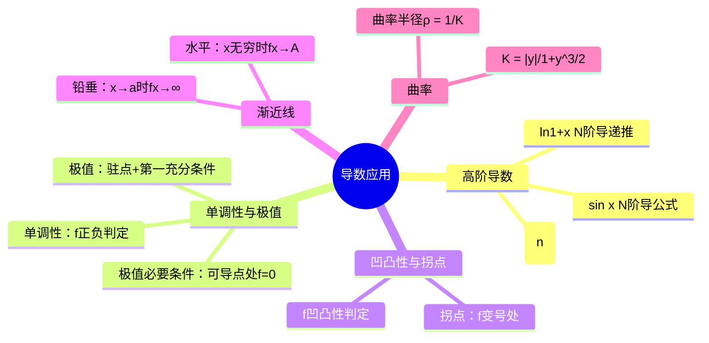

# 高等数学：导数应用——曲率与函数形态

> 📌 重构说明：本笔记按「高阶导数 → 函数单调性与极值 → 凹凸性与拐点 → 渐近线与图形描绘 → 曲率」重构，来源于语音片段中关于导数应用的系统讲解。

## 🧠 思维导图

---

## 一、高阶导数

### 1.1 定义

若 $f'(x)$ 仍可导，则其导数称为 $f(x)$ 的**二阶导数**，记作 $f''(x)$ 或 $\frac{d^2y}{dx^2}$。类似可定义三阶、四阶直到 $n$ 阶导数。四阶及以上记作 $f^{(4)}(x), f^{(5)}(x), \dots, f^{(n)}(x)$，与 $f^n(x)$（$n$ 次方）区分。

> [!warning] 考点
> ⚠️ 记法区分：$y^{(n)}$ 表示 $n$ 阶导数，$y^n$ 表示 $n$ 次方。书写时 $n$ 加小括号表示求导，不加小括号表示乘方。

### 1.2 常用高阶导数公式

| 函数 | $n$ 阶导数 |
|:----:|:----------:|
| $e^x$ | $e^x$ |
| $\sin x$ | $\sin(x + \frac{n\pi}{2})$ |
| $\cos x$ | $\cos(x + \frac{n\pi}{2})$ |
| $\ln(1+x)$ | $(-1)^{n-1}\frac{(n-1)!}{(1+x)^n}$ |

> [!example] 例题1：求高阶导数
> **题目**：$y = ax + b$，求 $y''$。
> **关键步骤**：$y' = a$，$y'' = 0$
> **答案**：$y'' = 0$

> [!example] 例题2：三角函数的高阶导
> **题目**：$S = \sin(\omega t)$，求 $S''$。
> **关键步骤**：
> ① $S' = \omega\cos(\omega t)$
> ② $S'' = -\omega^2\sin(\omega t)$
> **答案**：$S'' = -\omega^2\sin(\omega t)$

---

## 二、函数的单调性

### 2.1 判定定理

设 $f(x)$ 在 $[a,b]$ 连续，在 $(a,b)$ 可导：

| 条件 | 结论 |
|:----:|:----:|
| $f'(x) > 0$ 在 $(a,b)$ 恒成立 | $f(x)$ 在 $[a,b]$ 单调递增 |
| $f'(x) < 0$ 在 $(a,b)$ 恒成立 | $f(x)$ 在 $[a,b]$ 单调递减 |

若 $f'(x) \ge 0$（或 $\le 0$）且仅在有限个点处等于零，单调性结论仍然成立。

> [!example] 例题3：讨论单调性
> **题目**：讨论 $y = x - \sin x$ 在 $[-\pi,\pi]$ 上的单调性。
> **关键步骤**：
> ① $y' = 1 - \cos x \ge 0$
> ② 仅在 $x=0$ 处 $y'=0$，其余点 $y'>0$
> **答案**：在 $[-\pi,\pi]$ 上严格单调递增

> [!example] 例题4：含指数函数的单调性
> **题目**：讨论 $y = e^x - x - 1$ 的单调性。
> **关键步骤**：
> ① $y' = e^x - 1$
> ② $x > 0$ 时 $y' > 0$（单调增），$x < 0$ 时 $y' < 0$（单调减）
> **答案**：在 $(-\infty,0)$ 单调递减，$(0,+\infty)$ 单调递增

---

## 三、函数的极值

### 3.1 极值的定义

> 📖 补充定义：若存在 $x_0$ 的某邻域，使得对任意 $x$ 在该邻域内有 $f(x) \le f(x_0)$（或 $f(x) \ge f(x_0)$），则称 $f(x_0)$ 为**极大值**（或**极小值**）。

**极值是局部概念**：极大值不一定大于极小值，极值点可能在驻点或导数不存在的点处取得。

### 3.2 极值的必要条件（费马引理）

$$\boxed{\text{可导点处取极值} \;\Longrightarrow\; f'(x_0) = 0}$$

但驻点不一定是极值点，如 $y=x^3$ 在 $x=0$ 处 $f'(0)=0$，但不是极值点。

**极值点只可能在两种点中产生**：
1. **驻点**（$f'(x)=0$）
2. **一阶导数不存在的点**

### 3.3 极值的第一充分条件

设 $f(x)$ 在 $x_0$ 处连续，在 $x_0$ 的去心邻域内可导：

| 左侧 $f'(x)$ | 右侧 $f'(x)$ | $x_0$ 处结论 |
|:----------:|:----------:|:----------:|
| $>0$（增） | $<0$（减） | **极大值** |
| $<0$（减） | $>0$（增） | **极小值** |
| 符号不变 | 符号不变 | 不是极值点 |

> [!example] 例题5：求极值
> **题目**：求 $y = x^3 - 3x$ 的极值。
> **关键步骤**：
> ① $y' = 3x^2 - 3 = 3(x-1)(x+1)$，驻点 $x=\pm1$
> ② 左侧 $x<-1$：$y'>0$（增）；$x=-1$ 附近左正右负 $\Rightarrow$ **极大值**
> ③ $x>1$：$y'>0$（增）；$x=1$ 附近左负右正 $\Rightarrow$ **极小值**
> **答案**：$f(-1)=2$ 为极大值，$f(1)=-2$ 为极小值

---

## 四、凹凸性与拐点

### 4.1 凹凸性的定义

**直观理解**：凹函数形状像碗（向上弯曲），凸函数形状像盖（向下弯曲）。

### 4.2 二阶导数判定法

| 条件 | 结论 | 一阶导数变化 |
|:----:|:----:|:----------:|
| $f''(x) > 0$ | 曲线**凹**（向上弯） | $f'(x)$ 单调递增 |
| $f''(x) < 0$ | 曲线**凸**（向下弯） | $f'(x)$ 单调递减 |

**助记**：$f''>0$ → $f'$ 增大 → 切线越来越陡 → 曲线向上弯（凹）。

### 4.3 拐点

曲线凹凸性发生改变的点称为**拐点**。若 $f''(x_0)=0$ 且 $f''(x)$ 在 $x_0$ 左右变号，则 $(x_0, f(x_0))$ 是拐点。

---

## 五、渐近线

### 5.1 水平渐近线

若 $\lim_{x\to\infty} f(x) = A$（或 $x\to+\infty$、$x\to-\infty$），则 $y=A$ 是水平渐近线。

水平渐近线**不唯一**：如 $y=\arctan x$ 有两条水平渐近线 $y=\pm\frac{\pi}{2}$。

### 5.2 铅垂渐近线

若 $\lim_{x\to a} f(x) = \infty$（左右极限有一个为无穷即可），则 $x=a$ 是铅垂渐近线。

**典型情况**：分母为零的点，如 $y=\frac{1}{x}$ 的 $x=0$；$y=\tan x$ 有无数条铅垂渐近线。

---

## 六、曲率

### 6.1 定义

**曲率**描述曲线弯曲程度。弯曲越厉害，曲率越大；越平缓，曲率越小。

### 6.2 曲率公式

$$\boxed{K = \frac{|y''|}{(1 + (y')^2)^{3/2}}}$$

其中 $y'$ 是一阶导数，$y''$ 是二阶导数。

### 6.3 曲率半径

$$\rho = \frac{1}{K}$$

表示与该点弯曲程度相同的圆的半径。

> [!example] 例题6：求曲率
> **题目**：求曲线 $xy = 1$ 在点 $(1,1)$ 处的曲率 $K$。
> **关键步骤**：
> ① $y = \frac{1}{x} \Rightarrow y' = -\frac{1}{x^2}$，$y'' = \frac{2}{x^3}$
> ② $y'(1) = -1$，$y''(1) = 2$
> ③ $K = \frac{|2|}{(1 + (-1)^2)^{3/2}} = \frac{2}{2^{3/2}} = \frac{\sqrt{2}}{2}$
> **答案**：$K = \frac{\sqrt{2}}{2}$

---

## 🔗 知识网络

### 前置依赖
-  — 导数计算是基础
-  — 可导必连续

### 后续应用
- 最优化问题
- 函数图形描绘
- 物理中的加速度（二阶导）

### 对比辨析
- 极值 vs 最值：极值是局部概念，最值是全局概念
- 驻点 vs 极值点：驻点不一定是极值点（如 $y=x^3$），极值点也不一定是驻点（导数不存在处也可取极值）

---

## 📚 核心词条索引

| 知识点链接 | 类别 | 关键词 |
|------|------|--------|
| [[高阶导数]] | 概念 | $f^{(n)}(x)$，二阶及以上导数 |
| [[单调性]] | 性质 | $f'>0$ 递增，$f'<0$ 递减 |
| [[极值]] | 概念 | 局部最大/最小，需用第一充分条件判定 |
| [[驻点]] | 概念 | $f'(x)=0$ 的点 |
| [[凹凸性]] | 性质 | $f''>0$ 凹，$f''<0$ 凸 |
| [[拐点]] | 概念 | 凹凸性改变的点，$f''$ 变号处 |
| [[渐近线]] | 概念 | 水平：$y=A$；铅垂：$x=a$ |
| [[曲率]] | 概念 | $K = |y''|/(1+y'^2)^{3/2}$ |
| [[曲率半径]] | 概念 | $\rho = 1/K$ |
