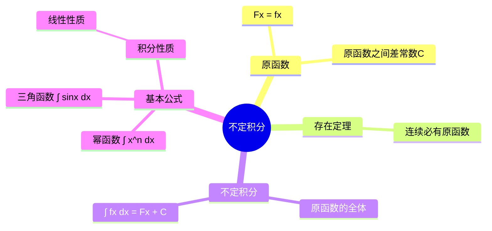

# 高等数学：不定积分的概念与性质

> 📌 重构说明：本笔记按「原函数定义 → 原函数存在定理 → 不定积分定义 → 基本积分公式 → 积分性质」重构，来源于语音片段中关于不定积分基础概念的讲解。

## 🧠 思维导图

---

## 一、原函数的概念

### 1.1 定义

> 📖 补充定义：设 $F(x)$ 在区间 $I$ 上可导，若对 $\forall x \in I$ 有 $F'(x) = f(x)$，则称 $F(x)$ 是 $f(x)$ 在 $I$ 上的一个**原函数**。

求不定积分是求导的**逆过程**：求导是"$f(x)$ → $f'(x)$"，而不定积分是"$f(x)$ → 谁的导数是 $f(x)$"。

### 1.2 原函数之间的关系

若 $F(x)$ 和 $G(x)$ 都是 $f(x)$ 的原函数，则：
$$F'(x) = G'(x) = f(x) \quad\Longrightarrow\quad (F(x)-G(x))' = 0 \quad\Longrightarrow\quad F(x)-G(x) = C$$

**结论**：同一个函数的任意两个原函数之间**相差一个常数**。

> [!warning] 考点
> ⚠️ 原函数不是唯一的，它们之间相差一个常数 $C$。因此在不定积分的结果中必须加上 $C$。

---

## 二、原函数存在定理

若 $f(x)$ 在区间 $I$ 上**连续**，则 $f(x)$ 在 $I$ 上一定存在原函数。

> [!info] 补充说明
> 连续是存在原函数的充分条件，但不是必要条件。不连续的函数也可能存在原函数，但连续一定存在原函数。

---

## 三、不定积分的定义

### 3.1 定义

$f(x)$ 的**不定积分**是 $f(x)$ 的原函数的全体，记作：

$$\boxed{\int f(x)\,dx = F(x) + C}$$

其中：
- $\int$ — 积分号
- $f(x)$ — **被积函数**
- $x$ — **积分变量**
- $dx$ — 积分微元
- $C$ — 积分常数（任意常数）

> [!warning] 考点
> ⚠️ 所有不定积分的题目**最终必须加上 $C$**，否则不得分。

### 3.2 积分与微分的关系

$$\frac{d}{dx}\left[\int f(x)\,dx\right] = f(x)$$
$$\int F'(x)\,dx = F(x) + C$$

---

## 四、基本积分公式

| 类型 | 公式 |
|:----:|:----:|
| 幂函数 | $\int x^n\,dx = \frac{x^{n+1}}{n+1} + C\ (n \neq -1)$ |
| 分式 | $\int \frac{1}{x}\,dx = \ln|x| + C$ |
| 三角函数 | $\int \sin x\,dx = -\cos x + C$ |
| 三角函数 | $\int \cos x\,dx = \sin x + C$ |
| 指数函数 | $\int e^x\,dx = e^x + C$ |

---

## 五、典型例题

> [!example] 例题1：幂函数积分
> **题目**：求 $\int x^2\,dx$。
> **关键步骤**：使用幂函数公式 $\int x^n\,dx = \frac{x^{n+1}}{n+1}$，代入 $n=2$
> **答案**：$\int x^2\,dx = \frac{x^3}{3} + C$

> [!example] 例题2：分式函数积分
> **题目**：求 $\int \frac{1}{x}\,dx$。
> **关键步骤**：使用分式公式 $\int \frac{1}{x}\,dx = \ln|x| + C$，注意带绝对值
> **答案**：$\int \frac{1}{x}\,dx = \ln|x| + C$

---

## 六、不定积分的性质

### 6.1 线性性质

$$\boxed{\int [f(x) \pm g(x)]\,dx = \int f(x)\,dx \pm \int g(x)\,dx}$$
$$\boxed{\int kf(x)\,dx = k\int f(x)\,dx}$$

加减可以拆开分别积分，常数因子可以提出来。

---

## 🔗 知识网络

### 前置依赖
-  — 积分是微分的逆运算
- 导数基本公式表

### 后续应用
-  — 复杂积分的换元技巧
-  — 乘积形式的积分
- 定积分、微分方程

---

## 📚 核心词条索引

| 知识点链接 | 类别 | 关键词 |
|------|------|--------|
| [[原函数]] | 核心概念 | $F'(x) = f(x)$，求导的逆过程 |
| [[不定积分]] | 核心概念 | 原函数的全体 $\int f(x)dx = F(x)+C$ |
| [[积分常数 C]] | 概念 | 代表任意常数，必须加在结果末尾 |
| [[被积函数]] | 概念 | 积分号内的 $f(x)$ |
| [[积分变量]] | 概念 | 对哪个变量求积分 |
| [[原函数存在定理]] | 定理 | 连续 ⇒ 存在原函数 |
