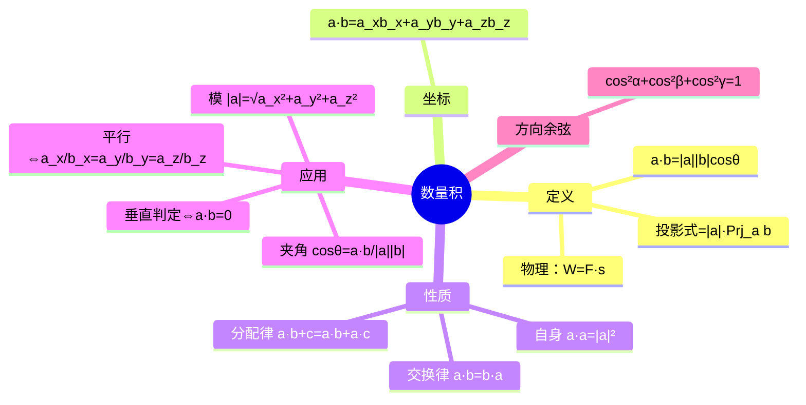

# 高等数学：向量的数量积

> 📌 重构说明：本笔记是空间解析几何的工具篇——数量积 是一切「夹角」「投影」「垂直判定」的基石。已按「定义（模×模×cosθ + 投影式）→坐标表示（分量乘积之和）→四条性质（交换律/分配律/数乘/自身→模方）→四大应用（求模/求夹角/判垂直/判平行）→方向余弦（$\cos^2\alpha+\cos^2\beta+\cos^2\gamma=1$）」的逻辑链重排。完整保留了方向余弦的平方和恒为 1 这一关键性质。

## 🧠 思维导图

---

## 一、数量积的定义

==数量积 的结果是一个数（标量），不是向量。==

$$\vec{a} \cdot \vec{b} = |\vec{a}|\,|\vec{b}|\,\cos\theta$$

**三种等价定义**：

| 视角 | 公式 |
|------|------|
| 夹角式 | $|\vec{a}||\vec{b}|\cos\theta$ |
| 投影式 | $|\vec{a}|\cdot\text{Prj}_{\vec{a}}\vec{b}$ |
| 物理原型 | 功 $W = \vec{F}\cdot\vec{s}$ |

---

## 二、坐标表示

$$\vec{a} \cdot \vec{b} = a_x b_x + a_y b_y + a_z b_z$$

==分量乘积之和==——这是计算 数量积 最快的方式。

---

## 三、四条基本性质

| 性质 | 公式 |
|------|------|
| 交换律 | $\vec{a}\cdot\vec{b} = \vec{b}\cdot\vec{a}$ |
| 分配律 | $\vec{a}\cdot(\vec{b}+\vec{c}) = \vec{a}\cdot\vec{b} + \vec{a}\cdot\vec{c}$ |
| 数乘结合 | $(\lambda\vec{a})\cdot\vec{b} = \lambda(\vec{a}\cdot\vec{b})$ |
| 自身 | $\vec{a}\cdot\vec{a} = |\vec{a}|^2$ |

> 📖 应用：$|\vec{a}| = \sqrt{\vec{a}\cdot\vec{a}}$ 是最简洁的求模方法。

---

## 四、四大应用

**1. 求模**：$|\vec{a}| = \sqrt{a_x^2 + a_y^2 + a_z^2}$

**2. 求夹角**：$\cos\theta = \dfrac{\vec{a}\cdot\vec{b}}{|\vec{a}||\vec{b}|}$

**3. 垂直判定**：$\vec{a} \perp \vec{b} \;\Leftrightarrow\; \vec{a}\cdot\vec{b}=0$

**4. 判平行**：$\dfrac{a_x}{b_x} = \dfrac{a_y}{b_y} = \dfrac{a_z}{b_z}$

> [!warning] 考点
> ⚠️ 垂直 ⇔ 数量积 为零——这是后续判断直线与平面位置关系的最基础依据。

---

## 五、方向角与方向余弦

$\alpha,\beta,\gamma$ = 向量与 $x,y,z$ 轴正向的夹角。

$$\cos\alpha = \frac{a_x}{|\vec{a}|},\quad \cos\beta = \frac{a_y}{|\vec{a}|},\quad \cos\gamma = \frac{a_z}{|\vec{a}|}$$

**关键性质**：

$$\boxed{\cos^2\alpha + \cos^2\beta + \cos^2\gamma = 1}$$

方向余弦 的平方和恒为 1——这是空间方向角的内在约束。

---

---

## 🔗 知识网络

### 前置依赖
- 向量 — 向量的基本概念和线性运算
- [[空间直角坐标系]] — 向量的坐标表示

### 后续应用
- 02_空间平面与直线方程 — 向量法求平面和直线的方程
- 05_空间曲线的切线与法平面 — 切向量和法向量的计算
- [[曲面积分]] — 向量点积在曲面积分中的应用

### 对比辨析
- 数量积（点积）vs 向量积（叉积）：点积结果 = 标量（衡量投影），叉积结果 = 向量（求法向量或面积）
- 点积的坐标公式 $\vec{a}\cdot\vec{b}=a_xb_x+a_yb_y+a_zb_z$ 本质上是分量乘积的和

## 📚 核心词条索引

| 知识点链接 | 类别 | 关键词 |
|------|------|--------|
| [[数量积]] | 核心概念 | $\vec{a}\cdot\vec{b}=|\vec{a}||\vec{b}|\cos\theta$，结果为标量 |
| [[垂直判定]] | 应用 | $\vec{a}\cdot\vec{b}=0 \Leftrightarrow \vec{a}\perp\vec{b}$ |
| [[方向余弦]] | 概念 | $\cos^2\alpha+\cos^2\beta+\cos^2\gamma=1$ |
