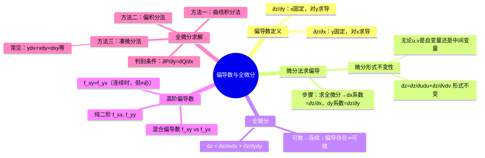

# 高等数学：偏导数与全微分

> 📌 重构说明：本笔记打通多元函数微分的核心关节。已按「偏导数定义（$\partial z/\partial x$ = $y$ 固定时对 $x$ 求导）→全微分（$dz$ = 偏导 × 各自增量，四个字：分别贡献之和）→微分形式不变性（$u,v$ 中间变量也可套同公式）→混合偏导数（纯二阶 $f_{xx}$ vs 混合偏导 $f_{xy}$ + 求导次序不可交换的混杂警告）→全微分求解的三种方法（曲线积分法 / 偏积分法 / 凑微分法）→判别原函数存在的充要条件（$\partial P/\partial y = \partial Q/\partial x$）→常见凑微分公式速查（$ydx+xdy=d(xy)$ 等）」的逻辑链重排。合并了「微分法求偏导数讲解」和「二元函数全微分求解方法」两篇笔记。

## 🧠 思维导图

---

## 一、偏导数定义

$\frac{\partial z}{\partial x}$：把 $y$ 看作常数，对 $x$ 求导。
$\frac{\partial z}{\partial y}$：把 $x$ 看作常数，对 $y$ 求导。

偏导数 = 沿坐标轴方向的变化率。

---

## 二、微分法求偏导数

### 一阶微分形式不变性

==无论 $u,v$ 是自变量还是中间变量==，全微分的==形式不变==：

$$\boxed{dz = \frac{\partial z}{\partial u}du + \frac{\partial z}{\partial v}dv}$$

### 操作步骤

1. 直接求 $z$ 的全微分 $dz$
2. 整理为 $dz = (\cdots)dx + (\cdots)dy$
3. ==$dx$ 系数 = $\partial z/\partial x$，$dy$ 系数 = $\partial z/\partial y$==

> 📖 优势：链式法则需要画变量依赖图，微分法直接算 $dz$ 一步到位。多变量复合时微分法通常更快。

---

## 三、全微分

$$\boxed{dz = \frac{\partial z}{\partial x}dx + \frac{\partial z}{\partial y}dy}$$

几何意义：==切平面的方程==。全微分 $dz$ 沿曲面切平面走一小步，实际函数值 $\Delta z$ 沿曲面表面走——前者是后者的近似。

**可微性判定**：偏导数连续 → 可微 → 连续 / 偏导数存在。两个「→」都不能反过来。

---

## 四、高阶偏导数

| 记号 | 含义 |
|------|------|
| $f_{xx} = \frac{\partial^2 f}{\partial x^2}$ | 对 $x$ 求两次 |
| $f_{yy}$ | 对 $y$ 求两次 |
| $f_{xy} = \frac{\partial^2 f}{\partial x\partial y}$ | ==先 $x$ 后 $y$== |
| $f_{yx}$ | 先 $y$ 后 $x$ |

==$f_{xy}$ 连续时，$f_{xy} = f_{yx}$==——求二阶混合偏导数时验证可交换性是关键步骤。

> [!warning] 考点
> ⚠️ 混合偏导数相等的前提是混合偏导数连续——不能默认为任何 $f(x,y)$ 都成立。

---

## 五、全微分求解——三种方法

判别原函数 $u(x,y)$ 存在使 $du = Pdx + Qdy$：

$$\boxed{\frac{\partial P}{\partial y} = \frac{\partial Q}{\partial x}}$$

### 方法一：曲线积分法

$$u(x,y) = \int_{(x_0,y_0)}^{(x,y)} Pdx + Qdy$$

折线 $OB$：水平+垂直或水平+垂直路径，分别积分后求和。

### 方法二：偏积分法

由 $\partial u/\partial x = P$ → $u = \int P\,dx + \varphi(y)$ → 求 $\varphi(y)$。

### 方法三：凑微分法

| 原形式 | 全微分 |
|--------|--------|
| $ydx + xdy$ | $d(xy)$ |
| $\frac{ydx - xdy}{y^2}$ | $d(\frac{x}{y})$ |
| $\frac{xdx + ydy}{\sqrt{x^2+y^2}}$ | $d(\sqrt{x^2+y^2})$ |

---

---

## 🔗 知识网络

### 前置依赖
- 01_多元函数的概念与极限 — 多元函数的基本概念
- 01_求导法则与基本公式 — 一元函数的导数

### 后续应用
- 03_多元复合函数求导法则 — 链式求导法则
- 04_隐函数求导 — 隐函数定理的偏导数
- 01_二重积分的概念与性质 — 偏导数的积分

### 对比辨析
- 偏导数 $\partial f/\partial x$ vs 全微分 $dz$：偏导数是沿 x 方向的变化率，全微分是所有方向变化量的线性近似 $dz=f_x dx+f_y dy$
- 可微 vs 可偏导：可微 $\Rightarrow$ 可偏导，但反过来不一定成立——可微要求偏导数连续

## 📚 核心词条索引

| 知识点链接 | 类别 | 关键词 |
|------|------|--------|
| [[变量依赖图]] | 辅助工具 | 复合函数变量关系的树形图 |
| [[凑微分法]] | 求解技巧 | 将表达式凑成全微分形式 |
| [[混合偏导数]] | 高阶概念 | $f_{xy}$或$f_{yx}$，连续时可交换 |
| [[偏导数]] | 核心概念 | 固定其他变量对某一变量求导 |
| [[全微分]] | 核心概念 | $dz = \frac{\partial z}{\partial x}dx + \frac{\partial z}{\partial y}dy$ |
| [[微分形式不变性]] | 重要性质 | 无论中间变量还是自变量，微分形式相同 |
