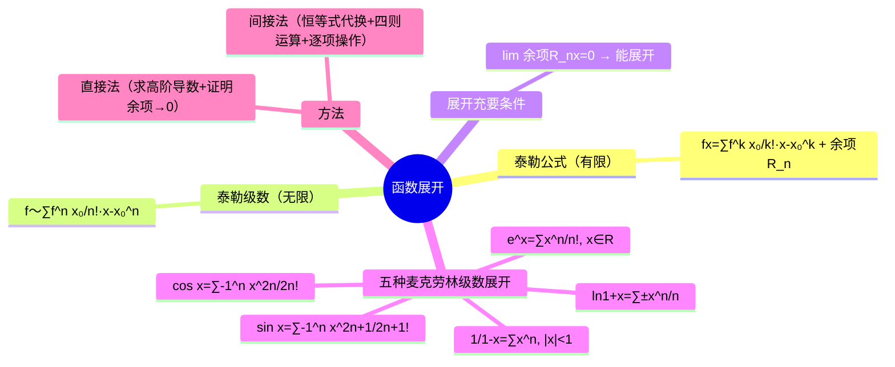

# 高等数学：泰勒级数与函数展开

> 📌 重构说明：本笔记是级数篇的巅峰——从泰勒公式的有限项+余项到泰勒级数的无限项，再到五种核心麦克劳林级数展开的快速背诵表。已按「泰勒公式回顾（有限项 + 余项 = $f(x)$ 恒等式）→泰勒级数（无穷项，系数 $a_n=f^{(n)}(x_0)/n!$）→展开的充要条件（余项 $R_n\to0$→泰勒级数收敛到 $f(x)$）→麦克劳林级数（$x_0=0$ 的特例→五种常见展开速查表：$e^x$、$\sin x$、$\cos x$、$\frac{1}{1-x}$、$\ln(1+x)$）→直接法 vs 间接法的对比」的逻辑链重排。

## 🧠 思维导图

---

## 一、从泰勒公式到泰勒级数

### 泰勒公式（有限项）

$$f(x) = \sum_{k=0}^{n}\frac{f^{(k)}(x_0)}{k!}(x-x_0)^k + \boxed{R_n(x)}$$

- $n$ 有限 → $n+2$ 项（前 $n+1$ 项 + 余项）
- ==余项 $R_n$ 中是实际的等式==（$f(x)$ = 多项式 + 尾巴）

### 泰勒级数（无穷项）

$$f(x) \sim \sum_{n=0}^{\infty} \frac{f^{(n)}(x_0)}{n!}(x-x_0)^n$$

系数：$a_n = f^{(n)}(x_0)/n!$

==未必收敛到 $f(x)$==——两个问题：① 收敛吗？② 和函数是 $f(x)$ 吗？

---

## 二、展开的充要条件

$$\boxed{f(x) \text{ 能展开为泰勒级数} \;\Leftrightarrow\; \lim_{n\to\infty} R_n(x) = 0}$$

两个问题都满足 → $f(x)$ = 泰勒级数的和函数。

---

## 三、五种麦克劳林展开

（$x_0=0$ 的泰勒级数）

| 函数 | 展开式 | 收敛域 |
|------|--------|--------|
| ==$e^x$== | $\displaystyle\sum_{n=0}^{\infty}\frac{x^n}{n!}$ | $(-\infty,+\infty)$ |
| ==$\sin x$== | $\displaystyle\sum_{n=0}^{\infty}(-1)^n\frac{x^{2n+1}}{(2n+1)!}$ | $(-\infty,+\infty)$ |
| ==$\cos x$== | $\displaystyle\sum_{n=0}^{\infty}(-1)^n\frac{x^{2n}}{(2n)!}$ | $(-\infty,+\infty)$ |
| ==$\frac{1}{1-x}$== | $\displaystyle\sum_{n=0}^{\infty}x^n$ | $|x|<1$ |
| ==$\ln(1+x)$== | $\displaystyle\sum_{n=1}^{\infty}(-1)^{n-1}\frac{x^n}{n}$ | $-1<x\le 1$ |

> [!warning] 考点
> ⚠️ 这五个展开式是求一切幂级数的基础——几乎每道展开题都是从这五个出发做变量代换、求导/积分、四则运算。必须倒背如流。

---

## 四、展开方法

| 方法 | 操作 | 难度 |
|------|------|:---:|
| ==直接法== | 求各阶导数 + 证明 $R_n\to0$ | 高 |
| ==间接法== | 利用已知展开 + 代换/求导/积分/四则 | ==低（实用首选）== |

间接法详见 。

---

---

## 🔗 知识网络

### 前置依赖
- 03_幂级数的收敛半径与收敛域 — 幂级数的收敛性
- 04_幂级数的和函数 — 和函数的求法
- 01_导数应用——曲率与函数形态 — 高阶导数的概念

### 后续应用
- 06_函数展开成幂级数的方法 — 间接展开法的具体技巧
- 01_微分方程的概念与分类 — 幂级数解法

### 对比辨析
- 泰勒级数 vs 麦克劳林级数：泰勒级数在任意 $x_0$ 处展开，麦克劳林级数是泰勒级数在 $x_0=0$ 处的特例
- 泰勒展开 vs 函数近似：泰勒级数是对函数的"精确表示"（余项 $\to 0$），泰勒多项式是对函数的"近似表示"（截断余项）

## 📚 核心词条索引

| 知识点链接 | 类别 | 关键词 |
|------|------|--------|
| [[间接法]] | 展开方法 | 利用已知展开式+代换/求导/积分/四则运算，实用首选 |  |
| [[麦克劳林级数]] | 核心概念 | $x_0=0$处的泰勒级数展开 |  |
| [[幂级数]] | 核心概念 | $\sum a_n x^n$形式的级数 |  |
| [[收敛域]] | 核心概念 | 幂级数收敛的$x$取值范围 |  |
| [[泰勒公式]] | 核心公式 | $f(x)=\sum_{k=0}^n\frac{f^{(k)}(x_0)}{k!}(x-x_0)^k+R_n(x)$ |  |
| [[泰勒级数]] | 核心概念 | $f(x)\sim\sum_{n=0}^\infty\frac{f^{(n)}(x_0)}{n!}(x-x_0)^n$ |  |
| [[余项]] | 核心概念 | 泰勒公式中的尾巴$R_n(x)$，决定展开是否收敛到$f(x)$ |  |
| [[直接法]] | 展开方法 | 求各阶导数+证明余项趋于0 |  |
