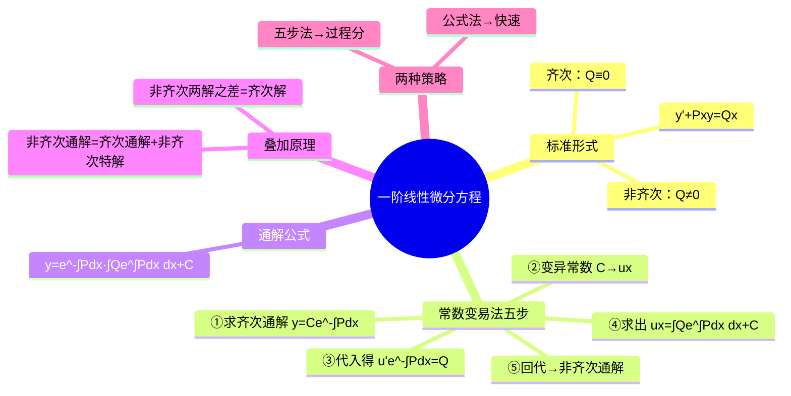

# 高等数学：一阶线性微分方程与常数变易法

> 📌 重构说明：本笔记是微分方程篇收官——一阶线性非齐次方程的求解。已按「方程标准形式 $y'+P(x)y=Q(x)$→常数变易法五步（求齐次通解→$C\to u(x)$→代入求 $u$→回代得非齐次通解）→通解公式→叠加原理（非齐次通解=齐次通解+非齐次特解）→线性解的性质（$y_1-y_2$ 为齐次解→必考点）」重排。完整保留了五步法推导、公式拆解记忆法及方法对比表。

## 🧠 思维导图

---

## 一、标准形式与五步法

### 方程形式

$$\boxed{y' + P(x)y = Q(x)}$$

| $Q(x)= 0$ | $Q(x)\neq 0$ |
|-----------|-------------|
| 齐次方程 | 非齐次方程 |

### 常数变易法——五步推导

**第一步**：求对应==齐次方程== $y'+Py=0$ 的通解（变量可分离）：

$$y = Ce^{-\int P\,dx}$$

**第二步**：==变异常数==——令 $C \to u(x)$：

$$y = u(x) \cdot e^{-\int P\,dx}$$

> 📖 本质：齐次解的结构 $C \times$ 某个函数，常数变易就是把常数 $C$ 「升级」为函数 $u(x)$，从而让解能匹配非齐次项 $Q(x)$。这是处理非齐次问题的核心思想。

**第三步**：代入非齐次方程，得到关于 $u$ 的方程：

$$u' \cdot e^{-\int P\,dx} = Q(x)$$

**第四步**：求出 $u(x)$：

$$u(x) = \int Q(x)\, e^{\int P\,dx} dx + C$$

**第五步**：回代得到==非齐次通解==：

$$\boxed{y = e^{-\int P\,dx}\left[\int Q\,e^{\int P\,dx} dx + C\right]}$$

> [!warning] 考点
> ⚠️ 五步法每一步都必须能默写——考试会扣过程分。

---

## 二、通解公式——拆解记忆

$$y = e^{-\int P\,dx} \times \left[ \int Q\,e^{\int P\,dx} dx + C \right]$$

| 部分 | 来源 | 含义 |
|------|------|------|
| $e^{-\int P\,dx}$ | 齐次方程的解（去掉 $C$） | 解的骨架 |
| $\int Q\,e^{\int P\,dx} dx$ | 求 $u(x)$ 得到的积分 | $Q$ 的「加权积分」 |

==注意：两部分中的指数符号相反==（前 $-P$，后 $+P$）——这是最容易搞混的地方。

---

## 三、解的叠加原理

$$\boxed{\text{非齐次通解} = \text{对应齐次通解} + \text{非齐次的一个特解}}$$

$$y = y_h + y^*$$

**证明三要点**：①代入满足 $y'+Py=Q$；②含任意常数（$y_h$ 中含 $C$）；③常数个数 = 阶数 = 1。

---

## 四、线性方程解的重要性质

| 运算 | 结果 |
|------|------|
| ==$y_1 - y_2$==（两非齐次解之差） | ==齐次方程的解== |
| $y_1 + y_2$（两非齐次解之和） | $y'+Py = 2Q$ 的解 |
| $k \cdot y_1$（非齐次解乘常数） | $y'+Py = kQ$ 的解 |
| $y_3 \pm y_4$（两齐次解之和差） | 齐次方程的解 |

> [!warning] 考点
> ⚠️ **非齐次两解之差为齐次解**——这是解的结构类选择题的核心推论，题干经常反过来出：给两个非齐次解和一个齐次解，求方程。

---

## 五、方法对比

| 方法          | 优点           | 缺点         |
| ----------- | ------------ | ---------- |
| 常数变易法五步 | 过程分有保障，不用背公式 | 步骤多        |
| 公式法         | 直接代          | 积分可能复杂，需记忆 |

---

---

## 🔗 知识网络

### 前置依赖
- 01_微分方程的概念与分类 — 微分方程的基本概念
- 02_一阶微分方程——变量分离与齐次方程 — 齐次方程的解法

### 后续应用
- 04_全微分方程判定与求解 — 全微分方程的特解寻找
- [[高阶线性微分方程]] — 从一阶到高阶的推广

### 对比辨析
- 齐次线性方程 $y'+P(x)y=0$ vs 非齐次线性方程 $y'+P(x)y=Q(x)$：齐次解 = $Ce^{-\int Pdx}$，非齐次解 = 齐次通解 + 非齐次特解——常数变易法将 $C$ 变为 $u(x)$
- 常数变易法的本质：假设齐次解的形式不变，但将常数"变易"为函数——代入原方程解出 $u(x)$

## 📚 核心词条索引

| 知识点链接 | 类别 | 关键词 |
|------|------|--------|
| [[常数变易法]] | 求解方法 | 将齐次通解中的常数C变为函数u(x)来求解非齐次方程 |  |
| [[叠加原理]] | 核心性质 | 非齐次通解=齐次通解+非齐次特解 |  |
| [[非齐次通解]] | 解的结构 | $y=e^{-\int Pdx}[\int Qe^{\int Pdx}dx+C]$ |  |
| [[齐次方程]] | 方程类型 | $y'+P(x)y=0$，可用分离变量法求解 |  |
| [[齐次通解]] | 解的结构 | $y=Ce^{-\int Pdx}$ |  |
| [[微分方程]] | 核心概念 | 含有未知函数及其导数的方程 |  |
