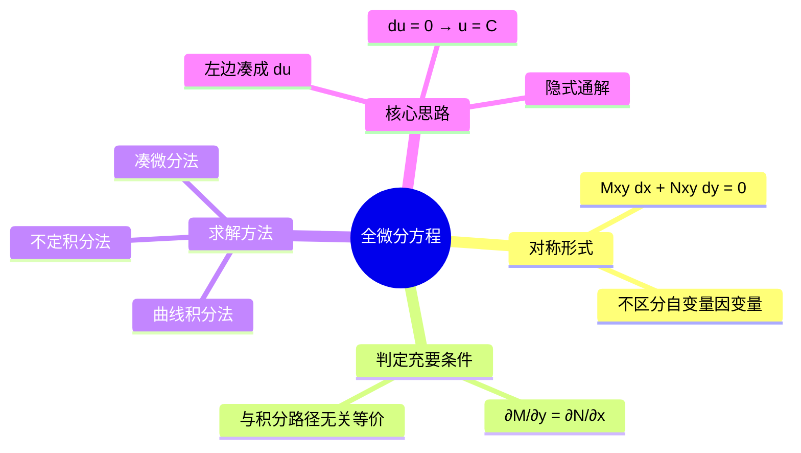

# 高等数学：全微分方程判定与求解

> 📌 重构说明：本笔记按「一阶方程回顾 → 对称形式 → 全微分方程定义 → 判定充要条件 → 三种求解方法 → 例题实战」的知识逻辑重排。

## 🧠 思维导图

---

## 一、一阶微分方程的对称形式

### 1.1 从显式到对称形式

前几节介绍的四类一阶方程（变量分离、齐次、一阶线性、伯努利），均从方程中解出 $\frac{dy}{dx}$：

$$\frac{dy}{dx} = f(x,y)$$

将 $dy$ 乘到右边并移项，可改写为：

$$\boxed{M(x,y)\,dx + N(x,y)\,dy = 0}$$

这种形式称为**对称形式**——不再区分 $x$ 和 $y$ 哪个是自变量、哪个是因变量，两者地位平等。

---

## 二、全微分方程的定义

### 2.1 定义

若对称形式方程

$$M(x,y)\,dx + N(x,y)\,dy = 0$$

的左边恰好是某个二元函数 $u(x,y)$ 的**全微分**，即

$$du = \frac{\partial u}{\partial x}dx + \frac{\partial u}{\partial y}dy = M\,dx + N\,dy$$

则称该方程为**全微分方程**（又称**恰当方程**）。

### 2.2 核心思路

若方程是全微分方程，则原方程变为：

$$du = 0 \quad \Longrightarrow \quad u(x,y) = C$$

其中 $C$ 为任意常数。$u(x,y) = C$ 即为方程的**隐式通解**。

> 📖 补充定义：全微分的逆运算——若 $M\,dx + N\,dy$ 是某个函数 $u$ 的全微分，则求 $u$ 的过程称为**全微分求积**，与曲线积分与路径无关问题等价。

---

## 三、判定充要条件

### 3.1 定理

方程 $M(x,y)\,dx + N(x,y)\,dy = 0$ 为全微分方程的**充要条件**是：

$$\boxed{\frac{\partial M}{\partial y} = \frac{\partial N}{\partial x}}$$

> [!warning] 考点
> ⚠️ 这个条件和"曲线积分与路径无关"的判定条件完全一致。两者本质上是同一个数学问题的不同表述：
> - 曲线积分视角：$M\,dx + N\,dy$ 是某函数全微分 ⇔ 积分与路径无关
> - 微分方程视角：方程左边可凑成全微分 ⇔ $\partial M/\partial y = \partial N/\partial x$

### 3.2 判定步骤

1. 将方程写成对称形式 $M\,dx + N\,dy = 0$
2. 计算 $\frac{\partial M}{\partial y}$ 和 $\frac{\partial N}{\partial x}$
3. 若相等 ⇒ 全微分方程；若不相等 ⇒ 不是全微分方程

---

## 四、三种求解方法

### 4.1 方法一：凑微分法（最推荐）

直接通过微分运算的逆运算，将 $M\,dx + N\,dy$ 凑成 $du$。

**常用微分公式**：
- $d(x^n) = nx^{n-1}dx$
- $d(xy) = y\,dx + x\,dy$
- $d(x^2 + y^2) = 2x\,dx + 2y\,dy$
- $d\left(\frac{y}{x}\right) = \frac{x\,dy - y\,dx}{x^2}$

> [!tip] 技巧
> 将 $M\,dx + N\,dy$ 拆开后逐项重组合并，利用 $d(uv) = u\,dv + v\,du$ 将成对项合并。

### 4.2 方法二：曲线积分法

选取定点 $(x_0, y_0)$ 到动点 $(x, y)$ 的折线段（平行于坐标轴），计算：

$$u(x,y) = \int_{x_0}^{x} M(t, y_0)\,dt + \int_{y_0}^{y} N(x, t)\,dt$$

或先垂直后水平的顺序。

> 📖 补充定义：曲线积分法的依据是——当积分与路径无关时，可以选择最简单的路径（平行于坐标轴的折线）来计算原函数 $u(x,y)$。

### 4.3 方法三：不定积分法

1. 由 $\frac{\partial u}{\partial x} = M$ 对 $x$ 积分：$u = \int M\,dx + \varphi(y)$
2. 代入 $\frac{\partial u}{\partial y} = N$ 解出 $\varphi(y)$

---

## 五、例题

> [!example] 例题1：判定是否为全微分方程并求解
> **题目**：判断方程 $(5x^4 + 3xy^2 - y^3)\,dx + (3x^2y - 3xy^2 + y^2)\,dy = 0$ 是否为全微分方程，并求其通解。
> 
> **关键步骤**：
> ① 计算 $M_y = 6xy - 3y^2$，$N_x = 6xy - 3y^2$，两者相等 ⇒ 全微分方程
> ② 使用凑微分法：
> - $5x^4dx = d(x^5)$
> - $y^2dy = d(\frac{1}{3}y^3)$
> - $3xy^2dx - 3xy^2dy = 3x y^2 dx - 3x y^2 dy$ → 可组合为...
> - $3xy^2dx - 3xy^2dy + y^3dx$ 组合后得 $d(x^5) + d(\frac{1}{3}y^3) - d(xy^3) + \frac{3}{4}d(x^2y^2)$
> ③ $d\left(x^5 + \frac{1}{3}y^3 - xy^3 + \frac{3}{4}x^2y^2\right) = 0$
> 
> **答案**：$x^5 + \frac{1}{3}y^3 - xy^3 + \frac{3}{4}x^2y^2 = C$

> [!example] 例题2：曲线积分法求解
> **题目**：求方程 $\frac{1}{x}dx + \left(-\frac{1}{x}\right)dy = 0$ 的通解，取定点 $(1,1)$。
> 
> **关键步骤**：
> ① 判定：$M_y = 0$，$N_x = \frac{1}{x^2}$，不全相等 ⇒ 需进一步确认...
> ② 取折线路径：先水平从 $(1,1)$ 到 $(x,1)$，再垂直从 $(x,1)$ 到 $(x,y)$
> ③ 水平段：$y=1$，$dy=0$ ⇒ $\int_1^x \frac{1}{t}dt = \ln x$
> ④ 垂直段：$x$ 不变，$dx=0$ ⇒ $\int_1^y \left(-\frac{1}{x}\right)dt = -\frac{y-1}{x}$
> 
> **答案**：$\ln x - \frac{y-1}{x} = C$

---

## 🔗 知识网络

### 前置依赖
-  — 一阶线性方程的标准形式与求解
-  — 全微分的定义与计算
-  — 曲线积分与路径无关条件

### 后续应用
-  — 向量微分算子
- 格林公式的逆用（将曲线积分转化为二重积分）

### 对比辨析
- 全微分方程 vs 一阶线性方程：全微分方程依靠 $\partial M/\partial y = \partial N/\partial x$ 判定，一阶线性方程依靠标准形式 $y' + P(x)y = Q(x)$ 识别
- 凑微分法 vs 变量分离法：凑微分要求识别微分组合模式，变量分离要求分离 $x$ 和 $y$

---

## 📚 核心词条索引

| 知识点链接 | 类别 | 关键词 |
|------|------|--------|
| [[全微分方程]] | 核心概念 | $Mdx+Ndy=0$ 且左边是某函数的全微分 |  |
| [[恰当方程]] | 核心概念 | 全微分方程的别称 |  |
| [[对称形式]] | 方程形式 | $Mdx+Ndy=0$，不区分自变量因变量 |  |
| [[全微分]] | 前置概念 | $du = u_x dx + u_y dy$ |  |
| [[凑微分法]] | 求解方法 | 利用微分公式逆运算重组方程左边 |  |
| [[曲线积分法]] | 求解方法 | 沿折线段积分求原函数 $u(x,y)$ |  |
| [[不定积分法]] | 求解方法 | 先对 $x$ 积分再代回求 $\varphi(y)$ |  |
| [[隐式通解]] | 解的类型 | $u(x,y)=C$ 形式的通解 |  |
