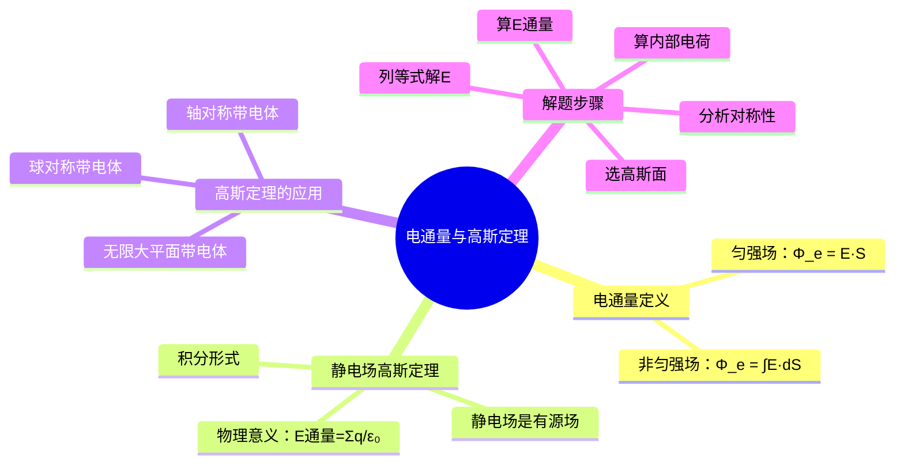

# 大物：电通量与高斯定理

> 📌 重构说明：本笔记将「电通量→静电场高斯定理→对称性应用」按知识递进逻辑重排。前半部分从电通量定义入手（匀强场→非匀强场，闭合面→非闭合面），后半部分推导高斯定理并给出常见对称性带电体的场强计算流程。

## 🧠 思维导图

---

## 一、电通量的概念

### 1.1 定义

**电通量（电场强度通量）**：通过电场中某一曲面的电场线数。

**匀强电场中**（平面垂直于场强方向）：
$$\Phi_e = E \cdot S$$

**匀强电场中**（平面法线与场强方向夹角为 $\theta$）：
$$\Phi_e = E \cdot S \cdot \cos\theta = \vec{E} \cdot \vec{S}$$

**非匀强电场中**（任意曲面）：
$$\boxed{\Phi_e = \int_S \vec{E} \cdot d\vec{S}}$$

其中 $d\vec{S}$ 的方向为曲面的**外法线方向**。

### 1.2 闭合曲面的电通量

对于闭合曲面，电通量表示为：
$$\Phi_e = \oint_S \vec{E} \cdot d\vec{S}$$

> [!warning] 考点
> ⚠️ 闭合曲面的 $d\vec{S}$ 方向规定为**外法线方向**：
> - 电场线穿出曲面：$\vec{E} \cdot d\vec{S} > 0$，电通量为正
> - 电场线穿入曲面：$\vec{E} \cdot d\vec{S} < 0$，电通量为负
> - 总电通量 = 穿出 - 穿入

---

## 二、静电场的高斯定理

### 2.1 定理陈述

> [!info] 静电场高斯定理
> 在真空中的静电场内，通过任意闭合曲面（高斯面）的电通量，等于该闭合曲面所包围的所有电荷的代数和除以 $\varepsilon_0$：
> $$\boxed{\Phi_e = \oint_S \vec{E} \cdot d\vec{S} = \frac{1}{\varepsilon_0} \sum_{S_{\text{内}}} q_i}$$

其微分形式为：
$$\nabla \cdot \vec{E} = \frac{\rho}{\varepsilon_0}$$

其中 $\rho$ 为电荷体密度。

### 2.2 物理意义

- **静电场是有源场**：电荷是静电场的源
- 正电荷发出电场线（源），负电荷吸收电场线（汇）
- $\varepsilon_0 = 8.85 \times 10^{-12} \, \text{C}^2/\text{N} \cdot \text{m}^2$（真空介电常数）

> [!warning] 考点
> ⚠️ 高斯定理中的 $\vec{E}$ 是**高斯面上每一点的总场强**，由高斯面**内外所有电荷**共同产生。而右端的 $\sum q_i$ 仅对高斯面**内部**的电荷求和。高斯面外的电荷对电通量无贡献。

### 2.3 常见对称性带电体的高斯定理应用

#### 球对称分布

| 带电体 | 高斯面 | 内部电荷 | 场强结果 |
|-------|-------|---------|---------|
| 点电荷 $q$ | 球面 $S$ | $q$ | $E = \frac{q}{4\pi\varepsilon_0 r^2}$ |
| 均匀带电球壳（半径 $R$，总电荷 $q$） | 球面（$r > R$） | $q$ | $E = \frac{q}{4\pi\varepsilon_0 r^2}$ |
| 均匀带电球壳（半径 $R$，总电荷 $q$） | 球面（$r < R$） | $0$ | $E = 0$ |
| 均匀带电球体（半径 $R$，体密度 $\rho$） | 球面（$r > R$） | $\rho \cdot \frac{4}{3}\pi R^3$ | $E = \frac{q}{4\pi\varepsilon_0 r^2}$ |
| 均匀带电球体（半径 $R$，体密度 $\rho$） | 球面（$r < R$） | $\rho \cdot \frac{4}{3}\pi r^3$ | $E = \frac{\rho r}{3\varepsilon_0}$ |

#### 轴对称分布

| 带电体 | 高斯面 | 场强结果 |
|-------|-------|---------|
| 无限长均匀带电直线（线密度 $\lambda$） | 同轴圆柱面 | $E = \frac{\lambda}{2\pi\varepsilon_0 r}$ |
| 无限长均匀带电圆柱面（半径 $R$，面密度 $\sigma$） | 同轴圆柱面（$r > R$） | $E = \frac{\lambda}{2\pi\varepsilon_0 r}$ |
| 无限长均匀带电圆柱面（半径 $R$，面密度 $\sigma$） | 同轴圆柱面（$r < R$） | $E = 0$ |

#### 平面对称分布

| 带电体 | 高斯面 | 场强结果 |
|-------|-------|---------|
| 无限大均匀带电平面（面密度 $\sigma$） | 柱形高斯面 | $E = \frac{\sigma}{2\varepsilon_0}$ |
| 两平行无限大带电平面（$\pm\sigma$） | 柱形高斯面 | 板间 $E = \frac{\sigma}{\varepsilon_0}$，板外 $E = 0$ |

### 2.4 典型例题

> [!example] 例题1：均匀带电球壳的场强分布
> **已知条件**：半径为 $R$ 的均匀带电球壳，总电荷为 $q > 0$
> **求解目标**：求空间各点的电场强度分布
> **关键步骤**：
> 1. 分析对称性：球对称，$\vec{E}$ 沿径向，大小只与 $r$ 有关
> 2. 取高斯面：以球心为中心，$r$ 为半径的球面
> 3. 计算电通量：$\Phi_e = \oint E dS = E \cdot 4\pi r^2$
> 4. 计算内部电荷：
>    - $r > R$：$\sum q = q$，得 $E \cdot 4\pi r^2 = \frac{q}{\varepsilon_0}$，$E = \frac{q}{4\pi\varepsilon_0 r^2}$
>    - $r < R$：$\sum q = 0$，得 $E \cdot 4\pi r^2 = 0$，$E = 0$
> **答案**：$\vec{E} = \begin{cases} \frac{q}{4\pi\varepsilon_0 r^2} \hat{r}, & r > R \\ 0, & r < R \end{cases}$

> [!example] 例题2：无限大均匀带电平面的场强
> **已知条件**：无限大平面均匀带电，面电荷密度为 $\sigma$
> **求解目标**：求空间各点的电场强度
> **关键步骤**：
> 1. 分析对称性：平面对称，$\vec{E}$ 垂直于平面，大小只与到平面的距离有关
> 2. 取高斯面：穿过平面的柱形高斯面，两底面与平面平行且等距
> 3. 计算电通量：侧面通量为0，两底面通量均为 $E \cdot \Delta S$
> 4. $\Phi_e = 2E \cdot \Delta S = \frac{\sigma \Delta S}{\varepsilon_0}$
> 5. 解得 $E = \frac{\sigma}{2\varepsilon_0}$
> **答案**：$E = \frac{\sigma}{2\varepsilon_0}$，方向垂直于平面向外（$\sigma > 0$）

> [!warning] 考点
> ⚠️ 高斯定理求场强的关键在于**对称性分析**。只有球对称、轴对称、平面对称三种情况可以用高斯定理直接求出场强。对于非对称情况，高斯定理仍然成立，但不能直接用于求场强。

---

## 三、高斯定理与库仑定律的关系

高斯定理可由库仑定律 + 叠加原理推导出来，它是库仑定律的积分形式表述。

| 对比项 | 库仑定律 | 高斯定理 |
|-------|---------|---------|
| 表述方式 | 力的作用规律 | 通量规律 |
| 适用范围 | 静电场（库仑平方反比律） | 静电场（更一般） |
| 数学形式 | $F = \frac{1}{4\pi\varepsilon_0}\frac{q_1 q_2}{r^2}$ | $\oint \vec{E} \cdot d\vec{S} = \frac{\sum q}{\varepsilon_0}$ |
| 对称性需求 | 任何电荷分布 | 仅对称分布可直接求E |

---

## 🔗 知识网络

### 前置依赖
- [[电场强度]] — 电场的基本描述物理量
- [[库仑定律]] — 点电荷间作用力的基本规律
- [[电场叠加原理]] — 多个电荷产生的总电场
- [[点电荷]] — 静电学的基本模型

### 后续延伸
- [[环路定理]] — 静电场的另一基本定理（有势无旋）
- [[电势]] — 标量描述静电场
- [[电势叠加原理]] — 电势的计算方法
- [[电容]] — 电容器储存电荷能力的量度

### 对比辨析
- 高斯定理 vs 库仑定律：前者是后者的积分形式，二者等价
- 电通量（标量积分）vs 电场强度（矢量场）

---

## 📚 核心词条索引

| 知识点链接 | 类别 | 关键词 |
|------|------|--------|
| [[电通量]] | 核心概念 | 通过某曲面的电场线总数 |
| [[高斯定理]] | 核心定理 | 闭合曲面电通量=内部电荷/ε₀ |
| [[高斯面]] | 关键方法 | 利用对称性选取的闭合曲面 |
| [[静电场是有源场]] | 物理本质 | 电荷是静电场的源 |
| [[对称性分析]] | 解题方法 | 判断对称类型以选取高斯面 |