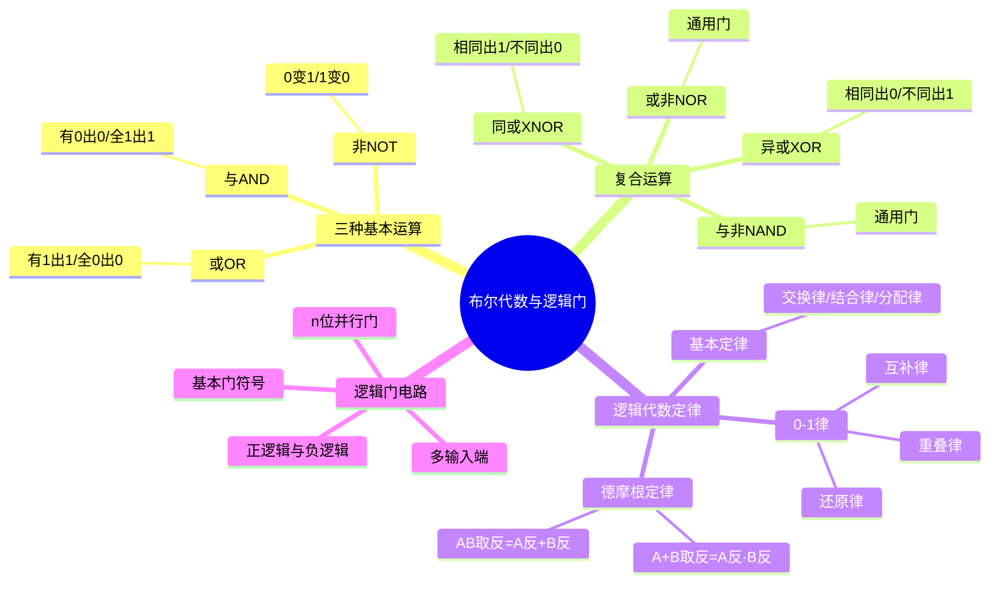

# 电子技术：布尔代数与逻辑门电路

> 📌 重构说明：本笔记从布尔代数的数学基础出发，系统覆盖三种基本逻辑运算、复合逻辑运算、基本逻辑门电路和逻辑代数的核心定律，是数字电路的理论根基。

## 🧠 思维导图

---

## 一、布尔代数基础

### 1.1 起源与意义

布尔代数由英国数学家乔治·布尔（George Boole）于1850年代创立，是一套处理 =={0, 1} 二值逻辑==的数学体系。100年后被香农发现恰好可以描述开关电路的行为——由此开启了数字电路和计算机的时代。

核心思想：复杂的逻辑推理和算术运算，都可以分解为对 0 和 1 的三种基本操作（与、或、非）的组合。

### 1.2 逻辑约定

| 逻辑值 | 布尔代数 | 电路实现 | 日常含义 |
|:---:|:---:|:---:|------|
| 1 | True（真） | 高电平（如+5V） | 是/开/有效 |
| 0 | False（假） | 低电平（如 0V） | 否/关/无效 |

实际 CMOS 电路中，"高电平"和"低电平"是一个电压范围而非精确值——这就是数字电路抗干扰能力强的物理根源。

---

## 二、三种基本逻辑运算

### 2.1 与运算（AND）

**运算符**：$A \cdot B$ 或 $AB$（连写）

| A | B | $Y = A \cdot B$ |
|---|---|:---:|
| 0 | 0 | 0 |
| 0 | 1 | 0 |
| 1 | 0 | 0 |
| 1 | 1 | ==1== |

==记忆口诀：有 0 出 0，全 1 出 1。==

**日常语义**：两个条件==同时==满足，结果才为真。例如："打开门"的条件是"钥匙在"AND"锁没坏"。

### 2.2 或运算（OR）

**运算符**：$A + B$

| A | B | $Y = A + B$ |
|---|---|:---:|
| 0 | 0 | 0 |
| 0 | 1 | ==1== |
| 1 | 0 | ==1== |
| 1 | 1 | ==1== |

==记忆口诀：有 1 出 1，全 0 出 0。==

**日常语义**：两个条件中==任意一个==满足，结果就为真。

### 2.3 非运算（NOT）

**运算符**：$\overline{A}$ 或 $A'$

| A | $Y = \overline{A}$ |
|---|:---:|
| 0 | ==1== |
| 1 | ==0== |

==记忆口诀：0 变 1，1 变 0。==

非运算是==单目运算==（只有一个操作数），而从与/或运算可以组合出任何逻辑函数——这就是与非门和或非门成为"通用门"的数学基础。

---

## 三、复合逻辑运算与通用门

### 3.1 与非运算（NAND）

$$Y = \overline{A \cdot B}$$

| A | B | $Y = \overline{AB}$ |
|---|---|:---:|
| 0 | 0 | ==1== |
| 0 | 1 | ==1== |
| 1 | 0 | ==1== |
| 1 | 1 | 0 |

**通用门性质**：==只用与非门就能实现所有逻辑功能==（可以搭出与/或/非门）。

### 3.2 或非运算（NOR）

$$Y = \overline{A + B}$$

| A | B | $Y = \overline{A+B}$ |
|---|---|:---:|
| 0 | 0 | ==1== |
| 0 | 1 | 0 |
| 1 | 0 | 0 |
| 1 | 1 | 0 |

同样是==通用门==——只用或非门也能实现所有逻辑功能。

### 3.3 异或运算（XOR）

$$Y = A \oplus B = \overline{A}B + A\overline{B}$$

| A | B | $Y = A \oplus B$ |
|---|---|:---:|
| 0 | 0 | 0 |
| 0 | 1 | ==1== |
| 1 | 0 | ==1== |
| 1 | 1 | 0 |

==记忆口诀：相同出 0，不同出 1。==

**核心应用**：①二进制加法中的"本位和" ②奇偶校验（异或门级联可检测奇数个1）③数据比较（两数相等时异或结果为全0）。

### 3.4 同或运算（XNOR）

$$Y = A \odot B = \overline{A \oplus B} = AB + \overline{A}\,\overline{B}$$

| A | B | $Y = A \odot B$ |
|---|---|:---:|
| 0 | 0 | ==1== |
| 0 | 1 | 0 |
| 1 | 0 | 0 |
| 1 | 1 | ==1== |

==记忆口诀：相同出 1，不同出 0。== 同或即异或取反，用于相等性检测。

> [!warning] 考点
> ⚠️ XOR 和 XNOR 的真值表和逻辑含义经常被混淆。记忆锚点：XOR = "不平等检测"（不同→1），XNOR = "平等检测"（相同→1）。

---

## 四、逻辑代数核心定律

### 4.1 与普通代数一致的定律

| 定律 | 与形式 | 或形式 |
|------|------|------|
| 交换律 | $AB = BA$ | $A+B = B+A$ |
| 结合律 | $(AB)C = A(BC)$ | $(A+B)+C = A+(B+C)$ |
| 分配律 | $A(B+C) = AB + AC$ | $A + BC = (A+B)(A+C)$ |

### 4.2 布尔代数特有的定律

| 定律 | 与形式 | 或形式 |
|------|------|------|
| 0-1律 | $A \cdot 0 = 0$ / $A \cdot 1 = A$ | $A + 0 = A$ / $A + 1 = 1$ |
| 互补律 | $A \cdot \overline{A} = 0$ | $A + \overline{A} = 1$ |
| 重叠律 | $A \cdot A = A$ | $A + A = A$ |
| 还原律 | $\overline{\overline{A}} = A$ | — |

==重叠律 $A+A=A$ 在普通代数中不成立==（普通代数中 $A+A=2A$），这是布尔代数与数值代数的本质区别——布尔代数关心的是逻辑真值，而非数值大小。

### 4.3 德摩根定律（De Morgan's Law）

$$\boxed{\overline{A \cdot B} = \overline{A} + \overline{B}}$$

$$\boxed{\overline{A + B} = \overline{A} \cdot \overline{B}}$$

**口诀**：打破括号——与变或，或变与，每个变量取反。

**应用**：①将一个NAND门转换为三个NOT+OR（或反之）②将一个NOR门转换为三个NOT+AND ③逻辑表达式化简中将长横线分段

> [!warning] 考点
> ⚠️ 德摩根定律是最容易被用错的定理。典型错误：把 $\overline{AB}$ 写成 $\overline{A}\cdot\overline{B}$（正确应为 $\overline{A}+\overline{B}$）。记住：破横线必须同时变运算符号。

---

## 五、逻辑门电路

### 5.1 基本门电路符号与功能

| 门名称 | 符号特征 | 表达式 | 核心口诀 |
|------|------|------|------|
| 与门 (AND) | 平头 | $Y = AB$ | 有0出0 |
| 或门 (OR) | 尖头 | $Y = A+B$ | 有1出1 |
| 非门 (NOT) | 三角+小圈 | $Y = \overline{A}$ | 取反 |
| 与非门 (NAND) | 与门+小圈 | $Y = \overline{AB}$ | 有0出1 |
| 或非门 (NOR) | 或门+小圈 | $Y = \overline{A+B}$ | 有1出0 |
| 异或门 (XOR) | =1标记 | $Y = A\oplus B$ | 不同出1 |

**符号识别规律**：输出端的小圆圈 = 取反操作。与非门 = 与门+反相器，或非门 = 或门+反相器。

### 5.2 多输入门与多位并行门

- **多输入端**：与门和或门可以有 3 个、4 个甚至更多的输入端——规则不变（与：全1才1 / 或：有1就1）
- **n位并行门**：计算机中数据是 8/16/32 位的，需要 n 个相同门电路同时按位运算。电路图中用==输入/输出端标有斜线+位数==来表示。

---

---

## 🔗 知识网络

### 前置依赖
- 数制与编码 — 二进制数的基本运算

### 后续应用
- 逻辑函数化简——公式法与卡诺图 — 逻辑函数的化简方法
- 组合逻辑电路分析与设计 — 用逻辑门实现组合逻辑电路
- 编码器与集成电路实现 — 编码器/译码器的实现

### 对比辨析
- 布尔代数 vs 普通代数：布尔代数中 A+A=A（重叠律），普通代数中 A+A=2A——布尔代数关心逻辑真值而非数值大小
- 与非门 vs 或非门作为通用门：任何逻辑函数都可以只用与非门或只用或非门实现，这是数字集成电路设计的基础

## 📚 核心词条索引

| 词条 | 类别 | 关键词 |
|------|:---:|------|
| [[布尔代数]] | 数学基础 | 0/1、逻辑运算 |  |
| [[与运算]] | 基本运算 | AND、有0出0 |  |
| [[或运算]] | 基本运算 | OR、有1出1 |  |
| [[非运算]] | 基本运算 | NOT、取反 |  |
| [[与非门]] | 复合门 | NAND、通用门 |  |
| [[或非门]] | 复合门 | NOR、通用门 |  |
| [[异或门]] | 复合门 | XOR、不同出1、加法本位 |  |
| [[同或门]] | 复合门 | XNOR、相同出1、相等检测 |  |
| [[德摩根定律]] | 核心定律 | 破横线、变运算符 |  |
| [[互补律]] | 基本定律 | $A\overline{A}=0$、$A+\overline{A}=1$ |  |
| [[重叠律]] | 基本定律 | $AA=A$、$A+A=A$ |  |
