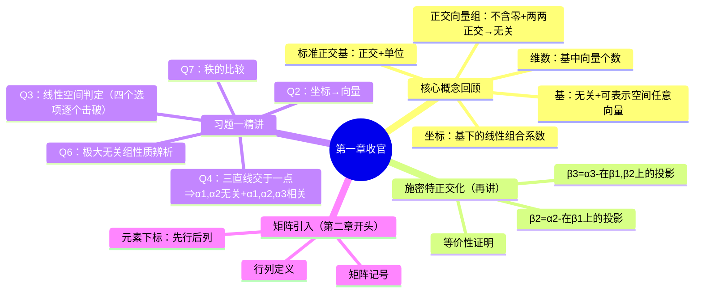

# 线性空间基与维数概念讲解

> 📌 重构说明：本笔记涵盖「线性代数第一章习题精讲」和「矩阵引入」，按考点逻辑深度重构。

---

## 🧠 思维导图



---

## 第一部分：核心概念快速回顾

### 一、基与维数的两条要求

| 条件 | 含义 |
|------|------|
| (1) | 基向量来自该空间且**线性相关与无关定义** |
| (2) | 空间中任何向量均可被基**线性表示** |

→ 满足即构成一组基，基的个数 = 基与维数。

### 二、坐标

阿尔法在基 $\{\alpha_1,\cdots,\alpha_r\}$ 下的坐标 = 将阿尔法写成基的线性组合时的**系数组成的向量**。

$$ \alpha = x_1\alpha_1 + \cdots + x_r\alpha_r \;\Longrightarrow\; \text{坐标} = (x_1,\cdots,x_r)^T $$

### 三、正交向量组三要素

1. **不含零向量**（切记！漏了就错）
2. 任意两向量内积 = 0（两两正交）
3. → 必然线性相关与无关定义

### 四、标准正交基

| 条件 | 含义 |
|------|------|
| 正交 | 两两内积 = 0 |
| 标准 | 每个向量模 = 1（单位向量） |

---

## 第二部分：施密特正交化（完整复习 + 等价性证明）

### 五、施密特正交化公式回顾

$$ \begin{aligned}
\beta_1 &= \alpha_1 \\[6pt]
\beta_2 &= \alpha_2 - \frac{\langle \alpha_2, \beta_1 \rangle}{\langle \beta_1, \beta_1 \rangle} \beta_1 \\[8pt]
\beta_3 &= \alpha_3 - \frac{\langle \alpha_3, \beta_1 \rangle}{\langle \beta_1, \beta_1 \rangle} \beta_1 - \frac{\langle \alpha_3, \beta_2 \rangle}{\langle \beta_2, \beta_2 \rangle} \beta_2
\end{aligned} $$

**一般地**：
$$ \beta_k = \alpha_k - \sum_{i=1}^{k-1} \frac{\langle \alpha_k, \beta_i \rangle}{\langle \beta_i, \beta_i \rangle} \beta_i $$

### 六、等价性证明（课堂完整推导）

需要证明两点：
1. $\{\beta_1,\cdots,\beta_r\}$ 两两正交
2. $\{\beta_1,\cdots,\beta_r\}$ 与 $\{\alpha_1,\cdots,\alpha_r\}$ 等价（可互相线性表示）

#### 6.1 正交性证明

**证 $\beta_1 \perp \beta_2$**：

$$ \begin{aligned}
\langle \beta_1, \beta_2 \rangle &= \left\langle \beta_1, \; \alpha_2 - \frac{\langle \alpha_2, \beta_1 \rangle}{\langle \beta_1, \beta_1 \rangle} \beta_1 \right\rangle \\
&= \langle \beta_1, \alpha_2 \rangle - \frac{\langle \alpha_2, \beta_1 \rangle}{\langle \beta_1, \beta_1 \rangle} \langle \beta_1, \beta_1 \rangle \\
&= \langle \beta_1, \alpha_2 \rangle - \langle \alpha_2, \beta_1 \rangle = 0
\end{aligned} $$

**证 $\beta_1 \perp \beta_3$**：

$$ \begin{aligned}
\langle \beta_1, \beta_3 \rangle &= \langle \beta_1, \alpha_3 \rangle - \frac{\langle \alpha_3, \beta_1 \rangle}{\langle \beta_1, \beta_1 \rangle} \langle \beta_1, \beta_1 \rangle - \frac{\langle \alpha_3, \beta_2 \rangle}{\langle \beta_2, \beta_2 \rangle} \langle \beta_1, \beta_2 \rangle \\
&= \langle \beta_1, \alpha_3 \rangle - \langle \alpha_3, \beta_1 \rangle - 0 = 0
\end{aligned} $$

（因为前面已证 $\beta_1 \perp \beta_2$，所以 $\langle \beta_1, \beta_2 \rangle = 0$）

**证 $\beta_2 \perp \beta_3$**：

$$ \begin{aligned}
\langle \beta_2, \beta_3 \rangle &= \langle \beta_2, \alpha_3 \rangle - \frac{\langle \alpha_3, \beta_1 \rangle}{\langle \beta_1, \beta_1 \rangle} \langle \beta_2, \beta_1 \rangle - \frac{\langle \alpha_3, \beta_2 \rangle}{\langle \beta_2, \beta_2 \rangle} \langle \beta_2, \beta_2 \rangle \\
&= \langle \beta_2, \alpha_3 \rangle - 0 - \langle \alpha_3, \beta_2 \rangle = 0
\end{aligned} $$

以此类推，所有 $\beta$ 两两正交。$\square$

#### 6.2 等价性证明

**$\beta$ 能被 $\alpha$ 表示**：
- $\beta_1 = \alpha_1$ ✓
- $\beta_2 = \alpha_2 - (\text{含}\beta_1\text{的项})$，而 $\beta_1 = \alpha_1$，所以 $\beta_2$ 可由 $\alpha_1, \alpha_2$ 表示 ✓
- $\beta_3$ 由 $\alpha_3, \beta_1, \beta_2$ 表示，而 $\beta_1, \beta_2$ 又由 $\alpha_1, \alpha_2$ 表示，所以 $\beta_3$ 也可由 $\alpha$ 组表示 ✓

**$\alpha$ 能被 $\beta$ 表示**：
- $\alpha_1 = \beta_1$ ✓
- $\alpha_2 = \beta_2 + \frac{\langle \alpha_2, \beta_1 \rangle}{\langle \beta_1, \beta_1 \rangle} \beta_1$（移项即得）✓
- 类似可得所有 $\alpha_i$ 都可由 $\beta$ 表示 ✓

> 因此两个向量组等价。$\square$

### 七、化为标准正交基的完整流程

```
普通向量组（线性相关与无关定义）
   ↓ 施密特正交化
正交向量组
   ↓ 单位化（每个除以自己的模）
标准正交基
```

> 📌 ⚠️ 考试必考：先正交化、再单位化。**顺序不能颠倒**——先单位化意味着你还没正交化就改了每个向量的长度和方向。

---

## 第三部分：习题一精细化讲解

### 八、选择题第2题

**题目**：向量 $\beta$ 在基 $\{\alpha_1, \alpha_2, \alpha_3\}$ 下的坐标为 $(-1, 0, 1)^T$，求 $\beta$。

**解法**：坐标就是线性组合系数！

$$ \beta = (-1) \cdot \alpha_1 + 0 \cdot \alpha_2 + 1 \cdot \alpha_3 = -\alpha_1 + \alpha_3 $$

---

### 九、选择题第3题（高频考点，逐个选项击破）

**A 选项**：「任何线性空间中一定含有零向量」

> ✅ **正确**。线性空间对加法和数乘封闭，取数域中 0 乘任意向量 = 零向量，所以零向量一定在空间中。老师说这道题在课堂上强调了不下 5 次。

**B 选项**：「所有分量等于 1 的 n 维向量集合构成 $\mathbb{R}^n$ 的子空间」

> ❌ **错误**。这个集合只有**一个**向量 $(1,1,\cdots,1)$。它不包含零向量 → 不是线性空间。

**C 选项**：「次数为 n 的全体多项式对于多项式的加法构成线性空间」

> ❌ **错误**。反例：$x^n$ 和 $-x^n$ 相加 = $0$，但 0 不是 n 次多项式 → 对加法不封闭。
> 另外，零向量（$0$ 多项式）根本不在这个集合中。

> 📌 ⚠️ 考点：「次数等于 n」不构成空间，但「次数 ≤ n」构成空间，维数是 $n+1$，基为 $\{1, x, x^2, \cdots, x^n\}$。

**D 选项**：「由 r 个向量生成的子空间，维数一定是 r」

> ❌ **错误**。这里陷阱在于：如果 r 个向量线性相关，生成的子空间维数就会小于 r。
> 例如：平面上画 10 个向量，它们都在二维平面内，无论有多少向量，生成的子空间最多二维。

> 📌 ⚠️ r 个向量生成的子空间维数 ≤ r，等于 r 当且仅当这 r 个向量线性无关。

---

### 十、选择题第4题（重点大题：三直线交于一点）

**题目**：设三条直线
$$ \begin{cases} a_1 x + b_1 y + c_1 = 0 \\ a_2 x + b_2 y + c_2 = 0 \\ a_3 x + b_3 y + c_3 = 0 \end{cases} $$
交于一点，求充要条件。

**第一步：转化为向量语言**

三个方程等价于：

$$ x \begin{pmatrix} a_1 \\ a_2 \\ a_3 \end{pmatrix} + y \begin{pmatrix} b_1 \\ b_2 \\ b_3 \end{pmatrix} + \begin{pmatrix} c_1 \\ c_2 \\ c_3 \end{pmatrix} = \begin{pmatrix} 0 \\ 0 \\ 0 \end{pmatrix} $$

即 $x\alpha_1 + y\alpha_2 + \alpha_3 = 0$，其中 $\alpha_1 = (a_1,a_2,a_3)^T$，$\alpha_2 = (b_1,b_2,b_3)^T$，$\alpha_3 = (c_1,c_2,c_3)^T$。

**第二步：分析条件**

三条直线**交于一点**意味着：
- $x, y$ **存在**（有交点）
- $x, y$ **唯一**（不是交于一条线，而是交于一个点）

由 $x\alpha_1 + y\alpha_2 + \alpha_3 = 0$：
- $\alpha_3 = -x\alpha_1 - y\alpha_2$ → $\alpha_3$ 可由 $\alpha_1, \alpha_2$ 线性表示
- 所以 $\alpha_1, \alpha_2, \alpha_3$ 线性相关（存在不全为零的组合系数：$x, y, 1$）
- 但 $\alpha_3$ 由 $\alpha_1, \alpha_2$ 的表示必须**唯一**（交于唯一一点）
- 表示唯一 ⇔ $\alpha_1, \alpha_2$ 线性无关（复习定理 1.4.2！）

**答案**：

> $\alpha_1, \alpha_2, \alpha_3$ **线性相关**（有交点）+ $\alpha_1, \alpha_2$ **无关**（交点唯一）

> 📌 ⚠️ 本题直接综合了两个核心定理：线性相关的表示定理 + 表示系数唯一的条件。是第一章经典综合题。

---

### 十一、选择题第6题

**题目**：$\{\alpha_1,\cdots,\alpha_r\}$ 是某向量组的极大无关组，判断以下哪项不正确。

逐一分析：

| 选项 | 判断 | 理由 |
|------|------|------|
| A: $\alpha_k$ 可由极大无关组表示 | ✅ 正确 | 极大无关组可表示向量组中任意向量 |
| B: $\alpha_k$ 可由**其余向量**表示 | ❌ 不对 | 课本推不出这事（除非 $\alpha_k$ 被极大无关组中其他向量表示，但极大无关组内部无关） |
| C: $\alpha_1$ 可由极大无关组表示 | ✅ 正确 | 同 A |
| D: $\alpha_n$ 可由除自身外的向量表示 | ⚠️ 要小心 | "$\alpha_n$ 可以由向量组中剩下的进行表示"——这是定义的直接推论，任何一个向量可由向量组自身表示（$1 \cdot \alpha_n$） |

> 所以不正确的是 **B**。

---

### 十二、选择题第7题（秩的比较）

**题目**：向量组I的秩为 $r_1$，向量组II的秩为 $r_2$，且 I 可由 II 线性表示，则：

**分析**：I 可以被 II 表示 ⇒ II 的信息量 ≥ I 的信息量 ⇒ II 的秩 ≥ I 的秩。

> $r_1 \leq r_2$

> 📌 ⚠️ 注意「≤」不是「＜」！有可能相等。

---

### 十三、填空题第4题

**题目**：为使集合构成线性空间，a 等于多少？

**秒杀思路**：线性空间必含零向量。把零向量分量代入条件 → a = 0。

---

## 第四部分：矩阵引入（第二章开篇）

### 十四、矩阵的定义

把若干数排列成**行与列**的表格：

$$ A = \begin{pmatrix} a_{11} & a_{12} & \cdots & a_{1n} \\ a_{21} & a_{22} & \cdots & a_{2n} \\ \vdots & \vdots & \ddots & \vdots \\ a_{m1} & a_{m2} & \cdots & a_{mn} \end{pmatrix} $$

- m 行 × n 列 → 称为 **m × n 矩阵**（读作 m 乘 n）
- 元素 $a_{ij}$：**第一个下标 = 行号，第二个下标 = 列号**
- 大写字母（A, B, C）表示矩阵，小写字母（$a_{ij}$）表示元素

### 十五、向量 vs 矩阵

| | 向量 | 矩阵 |
|------|------|------|
| 维度结构 | 一个维度（分量编号） | 两个维度（行 × 列） |
| 记号 | $\alpha, \beta$ 等希腊字母 | A, B, C 等大写字母 |
| 元素下标 | $a_1, a_2, \cdots, a_n$ | $a_{ij}$：行号 i + 列号 j |
| 类比 | 一列/一行数据 | Excel 表格 |

---

---

## 🔗 知识网络

### 前置依赖
- [[基与维数]] — 基底和维数的定义
- [[线性相关与无关定义]] — 线性无关性的判定方法
- [[向量组的秩]] — 秩与维数的关系

### 后续应用
- [[极大无关组]] — 求极大无关组与秩
- [[相似矩阵]] — 正交变换下的标准型
- [[正交对角化]] — 特征向量构成对角化基底

### 对比辨析
- dim V = 基的向量个数：维数衡量空间的自由度——直线是一维、平面是二维、空间是三维
- 生成集 vs 基：生成集中可能包含冗余的向量（线性相关），基是"最精简"的生成集

## 📚 核心词条索引

| 知识点链接 | 类别 | 关键词 |
|------|------|--------|
| [[基与维数]] | 核心概念 | 无关+可表示⇒基，个数⇒维数 |
| [[坐标]] | 核心概念 | 基下的线性组合系数 |
| [[正交向量组]] | 核心概念 | 不含零向量+两两正交 |
| [[标准正交基]] | 核心概念 | 正交+单位向量 |
| [[施密特正交化]] | 计算方法 | 普通基→正交基 |
| [[投影公式]] | 核心公式 | proj=⟨α,β⟩/⟨β,β⟩·β |
| [[线性空间的定义]] | 核心概念 | 对加法数乘封闭 |
| [[矩阵]] | 核心概念 | 行×列的数表 |
