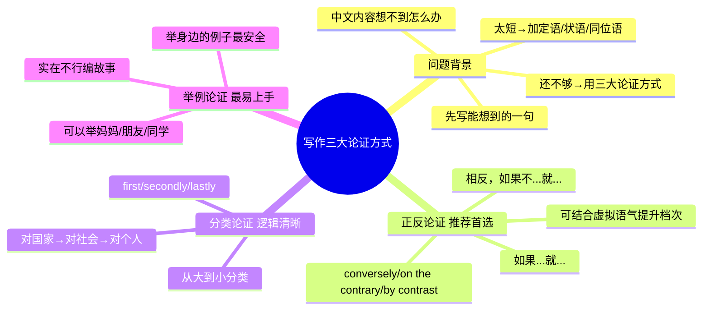

# CET-4：写作三大论证方式

> 📌 重构说明：当写作连中文都写不来时，三大论证方式帮你把第二段写得收不住尾。本笔记汇总了正反论证、分类论证、举例论证的完整模板、例句和选择策略。

## 🧠 思维导图



---

## 一、为什么需要论证方式？

### 问题的本质

> 你写作最大问题不是英文写不来——你连中文都写不来。

比如题目「为建设绿色校园做贡献」，你除了"保护环境"四个字，还能写出什么？第二段要求写6-7行英文，但你连10个汉字的中文构思都没有。

### 解决策略

1. **先把你会的那一句写出来**
2. **用定语/状语/同位语拉长** 🔗 
3. **再用一种论证方式补足剩余内容**（40-60词一键生成）

> ==正确的工作量：自己写一个原因分析 + 一个论证方式 = 第二段就够了。==

---

## 二、正反论证（Positive-Negative Argument）

### 核心模板

> **如果（做某事），就会（好结果）。相反，如果不（做某事），就会（坏结果）。**

| 段落 | 模板 | 逻辑 |
|---|---|---|
| 正面 | If + 主语 + do..., 主语 + will/can + (好结果1). (好结果2). | 如果做了→有什么好处 |
| 转折 | Conversely, / By contrast, / On the contrary, | 逻辑转折 |
| 反面 | If + 主语 + do not..., 主语 + will/may + (坏结果1). (坏结果2). | 如果不做→有什么坏处 |

> [!warning] ⚠️ 转折词不能用 however 这种太土的词。必须用 conversely、on the contrary 或 by contrast。

### 标准范例：为什么要阅读世界名著？

**正面**：
> If college students **devote more time to reading literary classics**, they will **cultivate a broader horizon**, which **broadens their worldviews**, which in turn **enables them to make greater progress in their personal and professional development**.

**反面**：
> **Conversely**, those who never engage with these classic tests may **suffer from cultural illiteracy**. Without historical and cultural insights gained from such masterpieces, they may find themselves **at a significant disadvantage in cross-cultural communication**.

### 范例：大学图书馆应该对外开放吗？

**正面**：
> If university libraries are open to the public, citizens can **use resources more effectively and build a strong learning atmosphere**. Besides, allowing residents access to books can help **expand knowledge and encourage lifelong learning**.

**反面**：
> **However (as an insertion)**, if access is limited, resources may be **underused**, which could **increase educational inequality**, especially affecting those **without other access to academic materials**.

### 范例：大学生为什么要发展社交能力？

**正面**：
> If college students can develop effective social skills, they will **express their ideas clearly** and **cooperate effectively in teams**.

**反面**：
> （课堂未展开，自行按模板补全）

### 升级：将其中一句写成虚拟语气

> ==推荐将正面或反面中任意一句升级为虚拟语气，提升档次。==

```
If young people devoted more time to reading literary classics,
they would cultivate a broader horizon.
（对现在的虚拟：用过去式/devoted → would do）
```

---

## 三、分类论证（Classification Argument）

### 核心模板

> **从大到小分类**：对国家/社会的影响 → 对社区/机构的影响 → 对个人的影响

| 顺序 | 层次 | 逻辑词 | 示例 |
|---|---|---|---|
| 第一层 | 大（国家/社会） | First and foremost / To begin with | 对国家产生什么影响 |
| 第二层 | 中（社区/学校/企业） | Secondly / Moreover / Furthermore | 对社会/社区产生什么影响 |
| 第三层 | 小（个人） | Lastly / Finally | 对个人产生什么影响 |

> [!warning] ⚠️ 分类不一定非是"国家→社会→个人"，可以是"企业→个人"或"学校→学生"。核心是逻辑上从大到小排列。

### 标准范例：快递业对人们生活的影响

| 层次 | 影响对象 | 具体内容 |
|---|---|---|
| 个人 | 消费者 | 受科技驱动，点击鼠标就能跟踪从订购到收货的全程服务，根本改变了消费习惯 |
| 社区 | 就业 | 快递业创造了大量就业机会，分销店如雨后春笋，提供方便购物渠道和增收方式 |
| 社会 | 环境 | 快递包装材料的升级和回收反映了行业对可持续发展的重视 |

**英语表达**：
> **First**, driven by scientific and technological innovation, consumers can now **enjoy the full tracking service from ordering to receiving goods** just by clicking the mouse, which has **fundamentally changed people's consumption habits**.
>
> **Secondly**, the development of express delivery has also **created a large number of employment opportunities** for the community, whose outlets **have sprung up like mushrooms**, providing local residents with **convenient shopping channels and ways to increase income**.
>
> **Lastly**, the **upgrading and recycling of express packaging materials** also reflects the industry's **emphasis on sustainable development**.

---

## 四、举例论证（Example-Based Argument）

### 核心模板

> **虽然身边有很多例子，但关于某某的最典型例子是某某某...**

| 句式 | 模板 |
|---|---|
| 引入 | Although there are many examples around us, the most typical one concerning ... is ... |
| 举例 | My mother / My friend / My teacher ... |
| 结果 | Now, ... has become ... / As a result, ... |

> [!warning] ⚠️ 举例论证就是"瞎编一个故事"。但编故事要注意：(1) 人物用身边人最安全（妈妈、老师、朋友）；(2) 故事要正面积极；(3) 单词用你会的，别编着编着自己不会写了。

### 标准范例：快递对生活的影响（用妈妈举例）

> Although there are many examples around us, the most typical one concerning my mother is the most convincing. My mother used to **go shopping in faraway places** because **our home is located in a remote area**. The **commuting time** wasted a lot of her time. Now, through the **online express delivery service**, my mother can **buy all the daily necessities she needs at any time**, such as **vegetables, clothes, and daily supplies**. Now her life has become very convenient. She often shops online, which **saves her a lot of shopping time** and **makes life more convenient**.

### 范例：如何了解传统文化（用老师举例）

> First, we should read more books about Chinese history. **For example, I have a teacher named Liu Xiaoyan. She is very fond of reading books on Chinese history.** She often **recites some ancient Chinese poems and lyrics in front of us**. These poems and lyrics were **very popular in the Tang and Song dynasties**. Now she often reads poems to us, and we all **admire her very much**.
> （这一段举例将近40词）

---

## 五、三种方式的选择策略

> ==考试时只选一种，选定就不再变。== 先听完课，再确定自己最适合哪种。

| 论证方式 | 优势 | 劣势 | 适合人群 |
|---|---|---|---|
| ==正反论证==（推荐首选） | 逻辑最强，容易写出深度；可结合虚拟语气 | 需要一定逻辑能力 | 有一定英语基础、想要高分的同学 |
| 分类论证 | 条理清晰，不易跑题；有固定框架 | 需要一定中文水平想好三个层次 | 逻辑思维好、能很快想好分类的同学 |
| 举例论证 | 最容易上手；编故事自由度高；单词最简单 | 有时候编着编着就编跑了 | 基础较弱、需要保底的同学 |

> [!warning] ⚠️ 无论选哪种，都要先用逻辑关系词（first, secondly, conversely, for example 等）把层次分清楚。条理清晰本身就是评分标准中的"文字通顺连贯"。

---

## 六、论证方式高频句型和短语总结

### 正反论证关键短语

| 英文 | 中文 | 用法 |
|---|---|---|
| conversely | 相反地 | 转折词（推荐） |
| on the contrary | 相反 | 转折词（推荐） |
| by contrast | 相比之下 | 转折词（推荐） |
| be devoted to | 致力于 | If...devote more time to... |
| cultivate a broader horizon | 培养更广阔的视野 | = broaden one's horizons |
| suffer from cultural illiteracy | 遭受文化文盲 | 反面论证万能短语 |
| find oneself at a significant disadvantage | 发现自己处于明显劣势 | 反面结果表达 |
| cross-cultural communication | 跨文化交流 | 高频话题词 |
| educational inequality | 教育不平等 | 社会话题词 |
| lifelong learning | 终身学习 | 正面结果表达 |

### 分类论证关键短语

| 英文 | 中文 | 用法 |
|---|---|---|
| employment opportunities | 就业机会 | 社会影响 |
| spring up like mushrooms | 如雨后春笋 | 描述快速发展 |
| convenient shopping channels | 方便的购物渠道 | 个人影响 |
| sustainable development | 可持续发展 | 社会/环境层面 |
| fundamentally changed | 根本上改变了 | 描述深远影响 |
| profound impact on | 深远影响 | 万能总结 |

### 举例论证关键短语

| 英文 | 中文 | 用法 |
|---|---|---|
| the most typical one is | 最典型的例子是 | 引入例子 |
| used to do | 过去常常 | 举例中的对比 |
| commute / commuting time | 通勤 / 通勤时间 | 举例细节 |
| daily necessities | 日常用品 | 举例中的物品 |
| admire sb. very much | 非常钦佩某人 | 举例中的评价 |

---

---

## 🔗 知识网络

### 前置依赖
- [[CET4-写作-保底原则与核心策略]] — 写作的基本框架和策略
- [[CET4-写作-议论文框架]] — 议论文的整体结构

### 后续应用
- [[CET4-写作-句子扩写与句型改写]] — 论证中的句型变化
- [[CET4-写作-书信与应用文]] — 应用文中的论证方法

### 对比辨析
- 举例论证 vs 因果论证 vs 对比论证：举例论证用具体事例支持论点（最常用），因果论证解释原因和结果（逻辑性强），对比论证突出差异（对比鲜明）
- 举例的三个层次：个人事例 → 社会现象 → 数据引用——从具体到抽象

## 📚 核心词条索引
