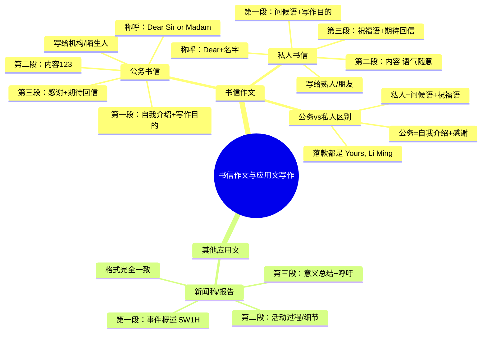

# CET-4：书信作文与应用文写作框架

> 📌 重构说明：本笔记将公务书信、私人书信、新闻稿/报告三类应用文的完整框架、称呼格式、段落模板和常用句型汇总，覆盖约36%的考试题型。

## 🧠 思维导图



---

## 一、书信作文总论

### 核心分类

> ==书信只分两种：写给熟人的，和写给不熟的人的。== 不讲什么感谢信、推荐信、邀请信——那些只是名义上的分类，本质框架都一样。

| 类型 | 对象 | 称呼 | 语气 |
|---|---|---|---|
| 公务书信 | 机构/校长/编辑/陌生人 | Dear Sir or Madam | 正式 |
| 私人书信 | 朋友/熟人 | Dear + 文中名字 | 亲切随意 |

### 称呼规则

| 情况 | 称呼写法 | 注意 |
|---|---|---|
| 题目给出了名字（如 Professor Smith） | **Dear Professor Smith,** | 照抄题目 |
| 题目没给名字（如"给图书馆写一封信"） | **Dear Sir or Madam,** | 注意大小写 |
| 给朋友（私人书信） | **Dear 朋友名,** | 亲切随意 |

---

## 二、公务书信框架（写给机构/陌生人）

### 第一段：自我介绍 + 写作目的

> ==永远两句话：第1句自我介绍，第2句写作目的。==

| 句序 | 功能 | 模板 | 示例 |
|---|---|---|---|
| 第1句 | 自我介绍 | I am a + 年级 + student from + 专业/学校, ... | I am a **junior student from Physical Education Department of this university**. |
| 第2句 | 写作目的 | The aim of my letter is to... / I am writing to... | The aim of my letter is to **provide some suggestions to improve your services**. |

**自我介绍常用句型**：
- I am a freshman/sophomore/junior/senior from...
- I am a student majoring in...

**写作目的常用句型**：
- The aim of my letter is to + 动词原形...
- I am writing to + 动词原形...
- This letter is intended to + 动词原形...

### 第二段：直接提建议/内容

> ==不要加总起句！不要写"There are three suggestions"——直接开始列123。==

**范例**（给图书馆提建议）：

| 序号 | 逻辑词 | 内容 | 例句 |
|---|---|---|---|
| 1 | First, | 增加英语书 | **First, it is obvious that more English books should be added.** Because English plays a crucial role in people's communication. If a person is good at English, he can better improve himself in his career and life. |
| 2 | Secondly, | 改进管理员态度 | **Secondly, the attitude of some librarians, especially Mr. Wang, needs to be improved.** His current attitude discourages students from using the library. It would be beneficial for him to adopt a more welcoming manner. |
| 3 | Lastly, | 提前开门时间 | **Lastly, it would be highly advantageous if the library could open at seven o'clock.** Many students arrive very early and currently have to wait for an extended period. |

**提建议常用句型**：
- It is obvious that... should be...
- It would be beneficial/advantageous if... could...
- I suggest that... (should) do...
- It is highly recommended that...

### 第三段：表示感谢 + 期待回信

| 句序 | 功能 | 模板 |
|---|---|---|
| 第1句 | 感谢 | **Thank you for your time and consideration.** |
| 第2句 | 期待回信 | **I am looking forward to your reply at your earliest convenience.** |

**表示感谢备用句（三选一，背一句即可）**：
1. Thank you for your time and consideration.
2. I sincerely appreciate your time and attention.
3. Thank you for taking the time to read my letter.

**期待回信备用句**：
1. I am looking forward to your reply at your earliest convenience.
2. I eagerly await your response.
3. I genuinely look forward to hearing from you soon.

### 落款

> ==永远写 Yours, Li Ming==（四级写作落款永远不变）

```
                           Yours,
                           Li Ming
```

> [!warning] ⚠️ 落款永远是 Li Ming，不能写成你的真名、不能写成刘晓燕、不能写成东方不败！也没有日期！

---

## 三、私人书信框架（写给熟人/朋友）

### 第一段：问候语 + 写作目的（不做自我介绍！）

> ==既然是熟人，就别做自我介绍。换成问候语。==

| 句序 | 功能 | 模板 | 示例 |
|---|---|---|---|
| 第1句 | 问候语 | How are you doing recently? / I hope this letter finds you well. | **How are you doing recently?** I am so glad to know that... |
| 第2句 | 写作目的 | I am writing to... / Speaking of... | Speaking of where to go, I believe **Chongqing is the best choice**. |

### 第二段：内容（推荐重庆的三个理由示例）

| 序号 | 逻辑词 | 内容 | 例句 |
|---|---|---|---|
| 1 | First, | 发展中的大城市，需要英语老师 | **It is a big and developing city** that has a growing need for English teachers. So finding a job here **shouldn't be too difficult**. |
| 2 | However/Moreover, | 火锅和美景 | **However, there is more to life than work.** Here in Chongqing, you will find **a city built on mountains**, providing fantastic scenery especially at night. **In addition, so well-known is the hot pot** for its rich flavor that it attracts millions of tourists every year. Meanwhile, **the people are warm and welcoming**. |
| 3 | Lastly, | 生活成本低 | **Lastly, living here is both affordable and exciting.** Never will you feel bored in this vibrant city. |

> [!warning] ⚠️ 私人书信可以用更生动、更随意的表达，甚至可以用记叙文的感觉来写。倒装句（so well-known is the hot pot.../Never will you feel bored...）在这里非常适合展示句型功力。

### 第三段：祝福语 + 期待回信（不写感谢！）

| 功能 | 模板 |
|---|---|
| 期待回信 | I am sincerely looking forward to hearing your views on Chongqing. |
| 祝福语 | I hope to see you here soon. |

### 落款：与公务书信相同

```
                           Yours,
                           Li Ming
```

---

## 四、公务 vs 私人书信对比表

> ==一张表看清区别==

| 项目 | 公务书信 | 私人书信 |
|---|---|---|
| 称呼 | Dear Sir or Madam, / Dear + 头衔+名字, | Dear + 名字, |
| 第一段第1句 | 自我介绍 | 问候语 |
| 第一段第2句 | 写作目的 | 写作目的 |
| 第二段 | 直接列123（语气正式） | 直接列123（语气随意，可加感叹、倒装等） |
| 第三段第1句 | 表示感谢 | 祝福语 |
| 第三段第2句 | 期待回信 | 期待回信 |
| 落款 | Yours, Li Ming | Yours, Li Ming |

---

## 五、新闻稿 / 报告写作框架

> ==新闻稿（news report）和报告（report）是同一个东西，格式完全一样。==

### 第一段：事件概述（5W1H）

> ==交代时间、地点、人物、事件==

| 信息点 | 内容 |
|---|---|
| When | On Sunday, June 18th |
| Who | the Student Union |
| What | organized a meaningful volunteer activity |
| Where | in the community |
| Why/How | to help the elderly |

**范例**：
> On Sunday, June 18th, the Student Union **successfully organized a meaningful volunteer activity** to help the elderly in the Xinhua community.

### 第二段：活动过程/细节

| 要点 | 示例 |
|---|---|
| 做了什么 | Students helped the elderly **clean their houses, buy groceries, and chat with them**. |
| 现场气氛 | The elderly were **deeply moved** and expressed their **sincere gratitude**. |
| 学生的感受 | Students felt that they had **learned a lot from this experience**. |

**常用表达**：
- organize a volunteer activity
- help the elderly / the disabled / children in need
- clean the houses / do the laundry / buy groceries
- be deeply moved / express sincere gratitude
- learn a lot from this experience

### 第三段：意义总结 + 呼吁

| 句序 | 功能 | 示例 |
|---|---|---|
| 第1句 | 总结意义 | This activity **not only brought warmth to the elderly but also enriched students' campus life**. |
| 第2句 | 呼吁 | Such activities **should be encouraged** so that more students can **participate in volunteer work**. |

---

## 六、应用文高频短语和句型汇总

### 书信常用表达

| 英文 | 中文 | 场景 |
|---|---|---|
| Dear Sir or Madam, | 亲爱的先生或女士 | 公文称呼 |
| I am a junior student from... | 我是来自...的大三学生 | 自我介绍 |
| The aim of my letter is to... | 这封信的目的是... | 写作目的 |
| I am writing to provide some suggestions on... | 我写信是为了就...提出建议 | 写作目的 |
| It is obvious that... | 显而易见... | 提建议 |
| It would be beneficial if... | 如果...将是有益的 | 提建议 |
| Thank you for your time and consideration. | 感谢您的宝贵时间和考虑 | 表示感谢 |
| I am looking forward to your reply at your earliest convenience. | 期待您在方便时回复 | 期待回信 |
| I am sincerely looking forward to... | 我真诚期待... | 期待回信 |

### 新闻稿常用表达

| 英文 | 中文 | 场景 |
|---|---|---|
| successfully organized a volunteer activity | 成功组织了一次志愿者活动 | 事件概述 |
| to help the elderly in the community | 帮助社区老人 | 活动目的 |
| not only... but also... | 不仅...而且... | 意义总结 |
| Such activities should be encouraged. | 此类活动应被鼓励。 | 呼吁 |

---

---

## 🔗 知识网络

### 前置依赖
- CET4-写作-保底原则与核心策略 — 写作的基本框架
- [[CET4-写作-书信作文模板与写法]] — 书信的模板结构

### 后续应用
- 英语四级作文 — 各类作文的综合备考
- [[CET4-写作-议论文框架]] — 议论文与应用文的区别

### 对比辨析
- 书信作文 vs 议论文：书信作文有固定格式（称呼/正文/落款），议论文是段落式论述——书信作文考查格式规范，议论文考查逻辑论证
- 建议信 vs 投诉信 vs 邀请信：建议信提出改进方案（委婉语气），投诉信表达不满（礼貌但坚定），邀请信表达邀请（热情而清晰）

## 📚 核心词条索引|
